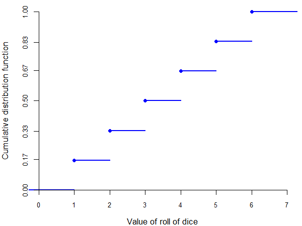
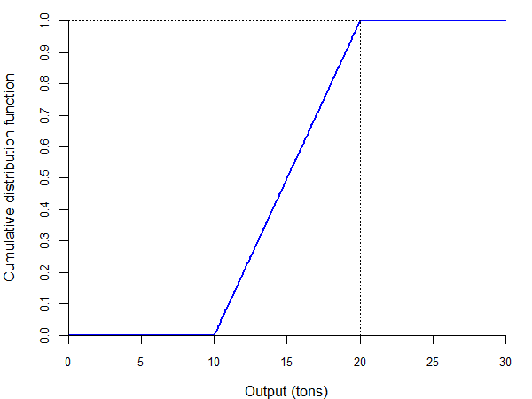
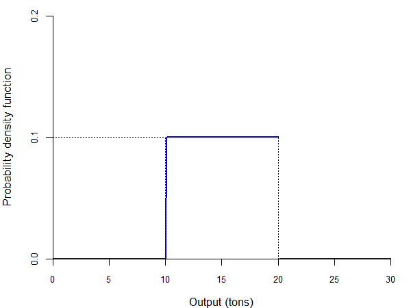
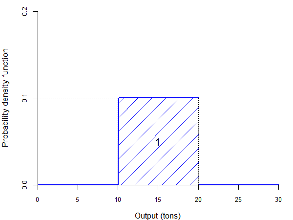
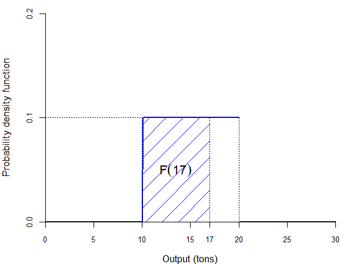

---
output:
  xaringan::moon_reader:
    seal: false
    includes:
      after_body: insert-logo.html
    self_contained: false
    lib_dir: libs
    nature:
      highlightStyle: github
      highlightLines: true
      countIncrementalSlides: false
      ratio: '16:9'
editor_options:
  chunk_output_type: console
---
class: center, inverse, middle

```{r xaringan-panelset, echo=FALSE}
xaringanExtra::use_panelset()
```

```{r xaringan-tile-view, echo=FALSE}
xaringanExtra::use_tile_view()
```

```{r xaringanExtra, echo = FALSE}
xaringanExtra::use_progress_bar(color = "#808080", location = "top")
```

```{css echo=FALSE}
.pull-left {
  float: left;
  width: 44%;
}
.pull-right {
  float: right;
  width: 44%;
}
.pull-right ~ p {
  clear: both;
}


.pull-left-wide {
  float: left;
  width: 66%;
}
.pull-right-wide {
  float: right;
  width: 66%;
}
.pull-right-wide ~ p {
  clear: both;
}

.pull-left-narrow {
  float: left;
  width: 30%;
}
.pull-right-narrow {
  float: right;
  width: 30%;
}

.tiny123 {
  font-size: 0.40em;
}

.small123 {
  font-size: 0.80em;
}

.large123 {
  font-size: 2em;
}

.red {
  color: red
}

.orange {
  color: orange
}

.green {
  color: green
}
```


# Statistics
## Random variables
### (Chapter 4)

### Christian Vedel,<br>Department of Economics<br>University of Southern Denmark

### Email: [christian-vs@sam.sdu.dk](mailto:christian-vs@sam.sdu.dk)

### Updated `r Sys.Date()`


---
# Today's lecture

.pull-left-wide[

- Random variables: definition and types
- Discrete random variables:
  - probability and cumulative distribution functions
  - joint, marginal, and conditional probabilities
  - Bayes' theorem and independence
- Continuous random variables:
  - cumulative distribution and density functions
  - relationships between two continuous random variables
- Practice tasks throughout

]


---
class: inverse, middle, center
# Definition of a random variable

---
# Random variable

--

> A **random variable** is a *function* that assigns a numerical value to any outcome of an experiment.

--

- Examples:
  - in the experiment of tossing a coin, we could have:
$$X(\text{"heads"}) = 0, \quad X(\text{"tails"}) = 1$$
  - in the experiment of rolling a dice, we could have:
$$X(1) = 1, \; X(2) = 2, \; X(3) = 3, \; X(4) = 4, \; X(5) = 5, \; X(6) = 6$$

---
# Random variable

--

- As a general rule, we use letters at the end of the alphabet:
  - uppercase to denote random variables (e.g., $X$, $Y$)
  - lowercase for the specific values a random variable can take (e.g., $x$, $y$)

--

- Note that we can choose the values assigned to the various outcomes, but sometimes certain values may be more suited to the problem at hand

--

- For example, suppose that the experiment is "choose a person at random, ask her age"
  - outcomes: values of "age of the person" (say, 43 years)
  - random variable: assign a number to the outcome "age of person = 43 years"
  - "natural" value: 43

---
# Types of random variables

--

- There are two types of random variables based on the number of values they can take:

--

  - **discrete random variables** can take a *countable* (finite or infinite) number of values
    - examples: toss of a coin, roll of a dice, pick an integer
    - if an experiment has a finite number of outcomes, then the corresponding random variable is *usually* discrete

--

  - **continuous random variables** take an *uncountable* number of values
    - examples: exact quantity of rainfall over a year, exact profit corresponding to a share (profit divided by number of shares)
    - note that the same experiment can produce a discrete or a continuous random variable, depending on how "accurately" the outcome is measured


---
# .red[Practice: Random variables and types]

.pull-left-wide[

1. Define a random variable $X$ for the experiment “draw one card from a standard deck”.
2. Is your $X$ discrete or continuous? Explain in one sentence.
3. Give one alternative coding of the same experiment and explain why it is still a valid random variable.

]


---
class: inverse, middle, center
# Discrete random variables

---
# Probability function

--

- One advantage of using random variables is that now we work with numbers instead of abstract events

--

- So, we can use mathematical concepts built for numbers, such as functions

--

> The **probability function** $f(\cdot)$ of a discrete random variable $X$ is defined as:
> $$f(x) = P(X = x)$$

--

- When working with several random variables, say $X$ and $Y$, it is sometimes useful to distinguish their probability functions by indexing them: $f_X(x)$ and $f_Y(y)$

---
# Probability function

--

- Examples:
  - in the experiment of tossing a coin, we would have:
$$f(0) = P(X = 0) = P(\text{"heads"}) = \frac{1}{2}$$
$$f(1) = P(X = 1) = P(\text{"tails"}) = \frac{1}{2}$$

--

> **Properties of the probability function:**
>
> (i) $0 \leq f(x) \leq 1$ for all $x$
>
> (ii) $\displaystyle\sum_{i=1}^N f(x_i) = f(x_1) + f(x_2) + \ldots + f(x_N) = 1$, where $x_1, x_2, \ldots, x_N$ are the possible values of $X$

---
# Cumulative distribution function

--

> The **cumulative distribution function** $F(\cdot)$ of a discrete random variable $X$ is defined as:
> $$F(x) = P(X \leq x) = \sum_{x_i \leq x} f(x_i)$$

--

- Note that, by construction, the cumulative distribution is an *increasing* function

--

- Example:
  - in the experiment of rolling a dice, we would have:
$$f(4) = P(X = 4) = P(\text{"dice shows 4"}) = \frac{1}{6}$$
$$F(4) = P(X \leq 4) = P(\text{"dice shows at most 4"})$$
$$= P(X = 1) + P(X = 2) + P(X = 3) + P(X = 4) = \frac{4}{6}$$

---
# Cumulative distribution function

.center[

]

---
# Cumulative distribution function

--

- The cumulative distribution function also allows us to calculate the probability that $X$ will take on a value in a given range:

--

$$P(a < X \leq b) = F(b) - F(a)$$

--

and:

$$P(a \leq X \leq b) = F(b) - F(a) + f(a)$$

---
# .red[Practice: Discrete probability and CDF]

.pull-left-wide[

Suppose $X$ is the outcome of a fair six-sided die.

1. Compute $f(3)$.
2. Compute $F(4)$.
3. Compute $P(2 < X \leq 5)$ using the CDF.
4. Compute $P(2 \leq X \leq 5)$ and explain the difference from question 3.

]

---
# Probability functions and relative frequencies

--

- Suppose the frequency of a particular outcome $z$ in the population is given by the function $g(z)$ (e.g., in an urn including 3 red balls and 5 blue balls, red balls have a relative frequency of "3 in 8" and blue balls of "5 in 8")

--

- Let $Z$ be a random variable whose values indicate the outcome in this population (i.e., the color of the ball)

--

- If all elements in the population have an equal chance of being selected, then the probability function of $Z$ is:
$$f(z) = g(z)$$

--

- In our example, if $Z = 1$ indicates "red ball" and $Z = 2$ indicates "blue ball," then:
$$f(1) = \frac{3}{8} \qquad f(2) = \frac{5}{8}$$


---
class: inverse, middle, center
# Relationships between discrete random variables

---
# Relationships between random variables

--

- Sometimes, we are interested in studying the relationship between two types of events

--

- For example, suppose that a bank wants to assess the risk of bankruptcy of a company asking for a loan

--

- The bank knows that this will depend on the state of the economy: booming or in recession

--

- Hence, the bank would like to know how risky the loan is as a function of:
  - how likely the company is to go bankrupt
  - how likely the economy is to be in recession

---
# Joint probability

--

> The **joint probability function** $f(\cdot, \cdot)$ for two discrete random variables $X$ and $Y$ is defined as:
> $$f(x, y) = P(X = x \text{ and } Y = y)$$

--

- Example:

| | $X = 0$ (bankrupt) | $X = 1$ (not bankrupt) |
|---|:---:|:---:|
| $Y = 0$ (recession) | 0.2 | 0.2 |
| $Y = 1$ (boom) | 0.1 | 0.5 |

---
# Joint probability

--

> **Properties of the joint probability function:**
>
> 1. $0 \leq f(x, y) \leq 1$ for all $x, y$
>
> 2. $\displaystyle \sum_{i=1}^{N_x} \sum_{j=1}^{N_y} f(x_i, y_j) = f(x_1, y_1) + f(x_1, y_2) + \ldots + f(x_{N_x}, y_{N_y}) = 1$
>
> where $x_1, x_2, \ldots, x_{N_x}$ are all the possible values of $X$, and $y_1, y_2, \ldots, y_{N_y}$ are all the possible values of $Y$

--

- In our example, what we need (for the second property) is:
$$0.2 + 0.2 + 0.1 + 0.5 = 1$$

---
# Marginal probability

--

> The **marginal probability function** $f_X(\cdot)$ of a discrete random variable $X$ is defined as:
> $$f_X(x) = \sum_{j=1}^{N_y} f(x, y_j) = f(x, y_1) + f(x, y_2) + \ldots + f(x, y_{N_y})$$

---
# Marginal probability

--

- In other words, the marginal probability function of $X$ is the column sum of probabilities (and the marginal probability function of $Y$ is the row sum):

| | $X = 0$ (bankrupt) | $X = 1$ (not bankrupt) | $f_Y(\cdot)$ |
|---|:---:|:---:|:---:|
| $Y = 0$ (recession) | 0.2 | 0.2 | 0.4 |
| $Y = 1$ (boom) | 0.1 | 0.5 | 0.6 |
| $f_X(\cdot)$ | 0.3 | 0.7 | |

---
# Conditional probability

--

- Recall the definition of the conditional probability:
$$P(A | B) = \frac{P(A \cap B)}{P(B)}$$

--

- Now suppose that the event $A$ is represented by $X = x$ and the event $B$ by $Y = y$

--

- We can then write the conditional probability as:
$$P(X = x | Y = y) = \frac{P(X = x \text{ and } Y = y)}{P(Y = y)}$$

--

- But note that, by definition:
  - the numerator is the joint probability function $f(x, y)$
  - the denominator is the marginal probability function $f_Y(y)$

---
# Conditional probability

--

> The **conditional probability function** $f_{X|Y}(\cdot, \cdot)$ of a discrete random variable $X$ given that $Y = y$ is defined as:
> $$f_{X|Y}(x | y) = \frac{f(x, y)}{f_Y(y)}$$
> if $f_Y(y) > 0$

--

- Example:
  - what is the probability of bankruptcy ( $X = 0$ ) given that we know we are in a boom ( $Y = 1$ )?
$$f_{X|Y}(0 | 1) = \frac{f(0, 1)}{f_Y(1)} = \frac{0.1}{0.6} = 0.167 = 16.7\%$$

---
# Bayes' theorem

--

- In practice, sometimes we know the conditional probability of $X$ given $Y$, but we are interested in the conditional probability of $Y$ given $X$

--

- For example, you may know from a car dealer friend of yours what is the probability of a "lemon" (bad car) having a low price, but you would want to know what is the probability that a cheap car is a lemon

--

- We can use the definition of the conditional probability to write:
$$f_{Y|X}(y | x) = \frac{f(x, y)}{f_X(x)}$$

--

- From here it is easy to prove the following theorem

---
# Bayes' theorem

--

> **Bayes' theorem:**
>
> 1. $f_{X|Y}(x | y) = f_{Y|X}(y | x) \cdot \displaystyle\frac{f_X(x)}{f_Y(y)}$
>
> 2. $f_{X|Y}(x | y) = f_{Y|X}(y | x) \cdot \displaystyle\frac{f_X(x)}{\displaystyle\sum_{i=1}^{N_x} \left\{ f_{Y|X}(y | x_i) \cdot f_X(x_i)\right\}}$

---
# Bayes' theorem: Example

--

- Let $X$ be the random variable indicating whether the car is a lemon ( $X = 1$ ) or not ( $X = 0$ )

--

- Let $Y$ be the random variable indicating whether the price is low ( $Y = 1$ ) or not ( $Y = 0$ )

--

- From your car dealer friend, you know that there is a 75% probability of a low price if the car is a lemon and a 20% probability of a low price if the car is not a lemon

--

- This gives you the conditional probability function of $Y$ given $X$:
$$f_{Y|X}(1 | 1) = 0.75, \quad f_{Y|X}(0 | 1) = 0.25$$
$$f_{Y|X}(1 | 0) = 0.20, \quad f_{Y|X}(0 | 0) = 0.80$$

--

- From technical reports, you also know that 25% of the cars on the market are lemons, which gives you the marginal probability function of $X$:
$$f_X(1) = 0.25 \quad f_X(0) = 0.75$$

---
# Bayes' theorem: Example

--

- From here you only need to apply Bayes' theorem to find the conditional probability of a lemon given that the price is low:

$$f_{X|Y}(1 | 1) = f_{Y|X}(1 | 1) \cdot \frac{f_X(1)}{\displaystyle\sum_{i=1}^{N_x} \left\{ f_{Y|X}(1 | x_i) \cdot f_X(x_i)\right\}}$$

--

$$= f_{Y|X}(1 | 1) \cdot \frac{f_X(1)}{f_{Y|X}(1 | 0) \cdot f_X(0) + f_{Y|X}(1 | 1) \cdot f_X(1)}$$

--

$$= 0.75 \cdot \frac{0.25}{0.20 \cdot 0.75 + 0.75 \cdot 0.25} = 0.556$$

--

- Therefore, there is a 55.6% chance that a car is a lemon if it has a low price

---
# Independence

--

- Recall the definition of independence between two events $A$ and $B$:
$$P(A \cap B) = P(A) \cdot P(B)$$

--

- Now suppose that the event $A$ is represented by $X = x$ and the event $B$ by $Y = y$

--

- We can then write the independence condition as:
$$P(X = x \text{ and } Y = y) = P(X = x) \cdot P(Y = y)$$

--

- But note that, by definition:
  - the left hand side is the joint probability function $f(x, y)$
  - the right hand side is the product of marginal probability functions $f_X(x)$ and $f_Y(y)$

---
# Independence

--

> Two discrete random variables $X$ and $Y$ are **independent** if and only if:
> $$f(x, y) = f_X(x) \cdot f_Y(y)$$
> for all $x$ and $y$. This implies that:
>
> 1. $f_{X|Y}(x | y) = f_X(x)$ for all values $y$ such that $f_Y(y) > 0$
>
> 2. $f_{Y|X}(y | x) = f_Y(y)$ for all values $x$ such that $f_X(x) > 0$

--

- Examples: tossing a coin twice, rolling a dice twice


---
# .red[Practice: Joint, marginal, conditional]

.pull-left-wide[

Using the table below,

| | $X = 0$ | $X = 1$ |
|---|:---:|:---:|
| $Y = 0$ | 0.25 | 0.15 |
| $Y = 1$ | 0.35 | 0.25 |

1. Compute $f_X(1)$ and $f_Y(0)$.
2. Compute $f_{X|Y}(1|0)$.
3. Check whether $X$ and $Y$ are independent.

]


---
class: inverse, middle, center
# Continuous random variables

---
# Continuous random variables

--

- Imagine that your company wants to predict its output next year

--

- It knows that it will produce between 10 and 20 tons of concrete, but it can be *any* number between 10 and 20 (with equal probability)

--

- What is the probability that it will produce *exactly* 15 tons? Basically zero
  - if it produces 14.999999 or 15.000001, this is not exactly 15
  - it would be extremely hard to get to exactly 15 tons

--

- Using the same argument, the probability of producing *exactly* any particular quantity is zero $\Rightarrow$ the concept of probability function does not make sense

--

- Since continuous random variables have an uncountable number of values, we cannot use the exact same concepts as in the case of discrete random variables

--

- However, we only need to make minor changes to them in order to generalize them to this type of variables

---
# Cumulative distribution function

--

> The **cumulative distribution function** $F(\cdot)$ of a continuous random variable $X$ is defined as:
> $$F(x) = P(X \leq x)$$

--

- This is the same definition as in the case of a discrete random variable

--

- However, note that in this case it does not make a difference if the inequality is strict or not:
$$P(X \leq x) = P(X < x \text{ or } X = x) = P(X < x) + P(X = x) = P(X < x)$$
because $P(X = x) = 0$

---
# Cumulative distribution function

.center[

]

---
# Probability density function

--

> The **probability density function** $f(\cdot)$ of a continuous random variable $X$ is defined as:
> $$f(x) = \frac{dF(x)}{dx}$$

--

- This definition has several implications:

--

  - the area under the probability density function is always equal to one:
$$\int_{-\infty}^\infty f(x) \, dx = 1$$

--

  - the cumulative distribution function is the integral of the probability density function:
$$F(x) = \int_{-\infty}^x f(z) \, dz$$

---
# Example

--

- In our example, the likelihood of any value between 10 and 20 is the same

--

- In other words, the value of the density function is the same for all values of $X$:
$$f(x) = c$$

--

- We can then use the properties of the probability density function to calculate the exact value of $c$:
$$\int_{-\infty}^\infty f(x) \, dx = \int_{10}^{20} c \, dx = (20 - 10) c = 1 \; \Rightarrow \; c = 0.1$$

--

- We can now calculate the cumulative distribution function:
$$F(x) = \int_{-\infty}^x f(z) \, dz = \int_{10}^x 0.1 \, dz = 0.1 (x - 10)$$
for all $z$ such that $10 \leq z \leq 20$

---
# Example

--

- Now we can write explicitly the probability density function:
$$f(x) = \begin{cases} 0, & \text{if } x < 10 \\ 0.1, & \text{if } 10 \leq x \leq 20 \\ 0, & \text{if } x > 20 \end{cases}$$

--

- The cumulative distribution function is:
$$F(x) = \begin{cases} 0, & \text{if } x < 10 \\ 0.1(x - 10), & \text{if } 10 \leq x \leq 20 \\ 1, & \text{if } x > 20 \end{cases}$$

---
# Probability density function

.center[

]

---
# Probability density and cumulative distribution functions

.center[

]

---
# Probability density and cumulative distribution functions

.center[

]


---
# .red[Practice: Continuous random variables]

.pull-left-wide[

Assume $X \sim U[10,20]$.

1. Write the density $f(x)$.
2. Compute $P(12 \leq X \leq 16)$.
3. Compute $F(18)$.
4. Explain why $P(X=15)=0$ even though 15 is in the support.

]


---
class: inverse, middle, center
# Relationships between continuous random variables

---
# Joint probability density

--

- We can use the same notions defined in the case of discrete random variables, but replacing the probability function with the probability density function and summations with integrals

--

> The **joint probability density function** $f(\cdot, \cdot)$ for two continuous random variables $X$ and $Y$ is written as $f(x, y)$.

--

- Since this is a probability density function, the area under it must "sum up" to one:
$$\int_{-\infty}^\infty \int_{-\infty}^\infty f(x, y) \, dx \, dy = 1$$

---
# Marginal probability density

--

> The **marginal probability density function** $f_X(\cdot)$ of a continuous random variable $X$ is defined as:
> $$f_X(x) = \int_{-\infty}^\infty f(x, y) \, dy$$

--

- Since this is a probability density function, the area under it must "sum up" to one:
$$\int_{-\infty}^\infty f_X(x) \, dx = 1$$

---
# Conditional probability density

--

> The **conditional probability density function** $f_{X|Y}(x|y)$ of a continuous random variable $X$ given that $Y = y$ is defined as:
> $$f_{X|Y}(x | y) = \frac{f(x, y)}{f_Y(y)} \text{ if } f_Y(y) > 0.$$

--

- Again, the area under this function must "sum up" to one because it is a probability density function:
$$\int_{-\infty}^\infty f_{X|Y}(x | y) \, dx = 1$$
for all $y$ such that $f_Y(y) > 0$

---
# Bayes' theorem

--

- Bayes' theorem applies to the continuous case in a similar way to the discrete case

--

> **Bayes' theorem:**
>
> 1. $f_{X|Y}(x | y) = f_{Y|X}(y | x) \cdot \displaystyle\frac{f_X(x)}{f_Y(y)}$
>
> 2. $f_{X|Y}(x | y) = f_{Y|X}(y | x) \cdot \displaystyle\frac{f_X(x)}{\displaystyle\int_{-\infty}^{\infty} f_{Y|X}(y | z) f_X(z) \, dz}$

---
# Independence

--

- Finally, the concept of independence is similar in the continuous case to the discrete case

--

> Two continuous random variables $X$ and $Y$ are **independent** if and only if:
> $$f(x, y) = f_X(x) \cdot f_Y(y)$$
> for all $x$ and $y$. This implies that:
>
> 1. $f_{X|Y}(x | y) = f_X(x)$ for all values $y$ such that $f_Y(y) > 0$
>
> 2. $f_{Y|X}(y | x) = f_Y(y)$ for all values $x$ such that $f_X(x) > 0$


---
# .red[Practice: Continuous relationships]

.pull-left-wide[

Let
$$f(x,y)=2, \quad 0<y<x<1,$$
and $f(x,y)=0$ otherwise.

1. Find $f_X(x)$.
2. Find $f_{Y|X}(y|x)$ for $0<y<x<1$.
3. Are $X$ and $Y$ independent? Justify.

]

