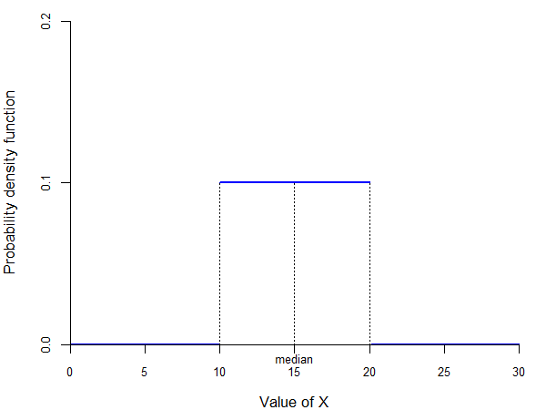
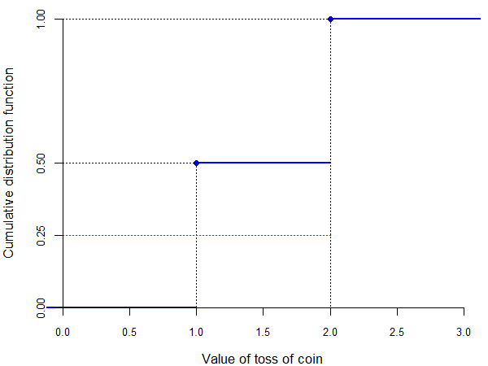
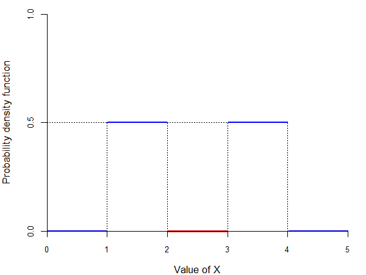
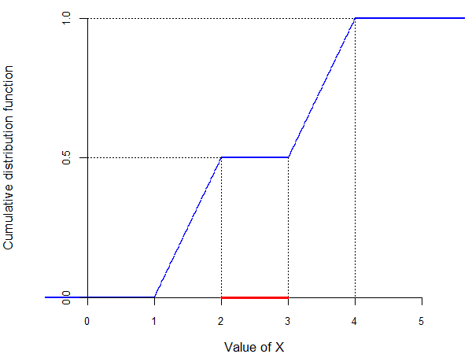
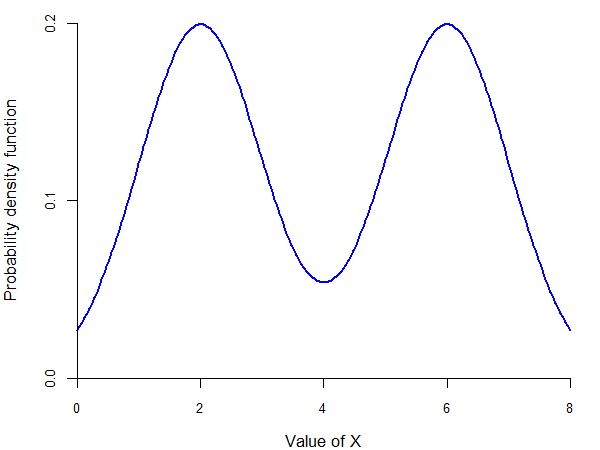

---
output:
  xaringan::moon_reader:
    seal: false
    includes:
      after_body: insert-logo.html
    self_contained: false
    lib_dir: libs
    nature:
      highlightStyle: github
      highlightLines: true
      countIncrementalSlides: false
      ratio: '16:9'
editor_options:
  chunk_output_type: console
---
class: center, inverse, middle

```{r xaringan-panelset, echo=FALSE}
xaringanExtra::use_panelset()
```

```{r xaringan-tile-view, echo=FALSE}
xaringanExtra::use_tile_view()
```

```{r xaringanExtra, echo = FALSE}
xaringanExtra::use_progress_bar(color = "#808080", location = "top")
```

```{css echo=FALSE}
.pull-left {
  float: left;
  width: 44%;
}
.pull-right {
  float: right;
  width: 44%;
}
.pull-right ~ p {
  clear: both;
}


.pull-left-wide {
  float: left;
  width: 66%;
}
.pull-right-wide {
  float: right;
  width: 66%;
}
.pull-right-wide ~ p {
  clear: both;
}

.pull-left-narrow {
  float: left;
  width: 30%;
}
.pull-right-narrow {
  float: right;
  width: 30%;
}

.tiny123 {
  font-size: 0.40em;
}

.small123 {
  font-size: 0.80em;
}

.large123 {
  font-size: 2em;
}

.red {
  color: red
}

.orange {
  color: orange
}

.green {
  color: green
}
```


# Statistics
## Descriptive measures
### (Chapter 5)

### Seetha Menon,<br>Department of Economics<br>University of Southern Denmark

### Email: [smr@sam.sdu.dk](mailto:smr@sam.sdu.dk)

### Updated `r Sys.Date()`


---
class: inverse, middle, center
# Descriptive measures and random variables

---
# Role of descriptive measures

--

- Suppose you want to study the income (or the height) of people living in Denmark

--

- The population of Denmark is about 5.5 million $\Rightarrow$ you would need to look over 5.5 million numbers

--

- It is difficult to process all that information, and even if you somehow do, which numbers are relevant?

--

- We need to have a way of *summarizing* the information contained in all these 5.5 million numbers $\Rightarrow$ descriptive measures

---
# Descriptive measures

--

- There are two types of descriptive measures:
  - **moments** = descriptive measures based on averages (e.g., average income, average height)
  - **quantiles** = descriptive measures based on subdivisions of the distribution (e.g., richest 10% of people, shortest 25% of people)

--

- Recall that random variables assign values to outcomes of experiments, so they represent an underlying population

--

- For example, let $X$ be the random variable representing the height of a person chosen at random from the population of Danes (in cm)

--

- The probability that $X = 180$ is based on the relative frequency of people measuring 180cm in the population of Danes

--

- Hence, when we apply these descriptive measures to random variables, we are actually obtaining information on the underlying population

---
# Distribution

--

- **Distribution** = the list of probabilities associated with the values that a random variable can take (if discrete) or the probability density function (if continuous)

--

- The distribution of the random variable is a representation of the distribution of the underlying population

--

- Therefore, we call the distribution of the random variable the **population distribution**

--

- Similarly, we call the descriptive measures for the random variable the **population measures**

--

- This is in contrast with averages and other descriptive measures calculated in a sample, which are **sample measures**


---
class: inverse, middle, center
# Moments

---
# Expected value of discrete random variables

--

> The **expected value (mean value)** of a discrete random variable $X$ with probability function $f(x)$ is given by:
> $$E(X) = \sum_{i=1}^N x_i f(x_i) = x_1 f(x_1) + x_2 f(x_2) + \ldots + x_N f(x_N) = \mu$$
> where $x_1, x_2, \ldots, x_N$ are all the different values that $X$ can take.

--

- The expected value is also called "mean" and denoted by $\mu$ (*mu*)

--

- For example, the expected value of a dice roll is:
$$E(X) = 1 \cdot \frac{1}{6} + 2 \cdot \frac{1}{6} + \ldots + 6 \cdot \frac{1}{6} = 3.5$$

---
# Expected value of discrete random variables

--

- Note that 3.5 is *not* one of the possible values of $X$ $\Rightarrow$ how do we interpret this expected value?

--

- Imagine that you play a game where you win one krone for each dot on the face of the dice (so, if you roll a 4, you win 4 kroner)

--

- The expected value of 3.5 tells you that, if you play this game 10 times, you should expect to win about 35 kroner (3.5 times 10)

--

- In this case, the expected value is the "average win per play"

--

- Intuitively, the expected value is the average of all the values obtained if you were to repeat the experiment generating $X$ an infinite number of times

--

- Another interpretation of the average value is the "center of mass"

---
# Expected value of continuous random variables

--

- Recall that we defined concepts related to continuous random variables in ways similar to discrete random variables, by making two changes:
  - replace the probability function with the probability density function
  - replace summations with integrals

--

> The **expected value (mean value)** of a continuous random variable $X$ with probability density function $f(x)$ is given by:
> $$E(X) = \int_{-\infty}^\infty x f(x) \, dx = \mu$$

---
# Properties of the expected value

--

- The expected value has some very useful properties

--

- Let $h(\cdot)$ be a function, $a$ and $b$ be **constants** (i.e., real numbers), and $X$ a random variable (continuous or discrete). Then:

--

1. The expected value of $h(X)$ is given by:
$$E[h(X)] = \sum_{i=1}^N h(x_i) f(x_i) = h(x_1) f(x_1) + h(x_2) f(x_2) + \ldots + h(x_N) f(x_N)$$

--

2. $E(a) = a$

--

3. $E(aX) = a E(X)$

--

4. $E(a + X) = a + E(X)$

--

5. $E(a + b X) = a + b E(X)$

--

- Important: note that, in general, $E[h(X)] \not= h[E(X)]$

---
# Expected value of discrete random variables

--

- Consider the following two games related to the toss of a coin:
  - you win 1 krone if "heads," you lose 1 krone if "tails"
  - you win 10 kroner if "heads," you lose 10 kroner if "tails"

--

- Let $X$ be the random variable representing the first game and $Y$ the random variable representing the second game

--

- The possible values of $X$ are $-1$ and $1$, each with probability 50%

--

- The possible values of $Y$ are $-10$ and $10$, each with probability 50%

--

- Their expected values are:
$$E(X) = 1 \cdot \frac{1}{2} + (-1) \cdot \frac{1}{2} = 0$$
$$E(Y) = 10 \cdot \frac{1}{2} + (-10) \cdot \frac{1}{2} = 0$$

--

- But are they similarly "risky"?

---
# Variance

--

> The **variance** of a random variable $X$ is usually denoted by $\sigma^2$ (*sigma*) and is defined as:
> $$Var(X) = E \left( \left[ X - E(X) \right]^2 \right) = \sigma^2$$
>
> If $X$ is a discrete random variable with probability function $f(x)$, then:
> $$Var(X) = \sum_{i=1}^N (x_i - \mu)^2 f(x_i)$$
>
> If $X$ is a continuous random variable with probability density function $f(x)$, then:
> $$Var(X) = \int_{-\infty}^\infty (x - \mu)^2 f(x) \, dx$$

---
# Variance

--

- Intuitively, the variance is a measure of how "spread out" is the distribution of a random variable

--

- In our example, we have:
$$Var(X) = (1 - 0)^2 \cdot \frac{1}{2} + (-1 - 0)^2 \cdot \frac{1}{2} = 1$$
$$Var(Y) = (10 - 0)^2 \cdot \frac{1}{2} + (-10 - 0)^2 \cdot \frac{1}{2} = 100$$

--

- So we see that $Y$ is more "spread out" than $X$

---
# Standard deviation

--

- One problem with the variance is that the unit of measurement is not the same as that of the random variable

--

- In our example, $X$ is measured in kroner, but $Var(X)$ is measured in kroner squared

--

- It would be useful to have a measure of the spread expressed in the same units of measurement as the random variable

--

> The **standard deviation** of a random variable $X$ is defined as:
> $$\sigma(X) = \sqrt{Var(X)} = \sqrt{\sigma^2}$$

---
# Properties of the variance and of the standard deviation

--

- The variance and standard deviation have the following properties:

.pull-left[
**Variance:**
1. $Var(a) = 0$
2. $Var(aX) = a^2 Var(X)$
3. $Var(a + X) = Var(X)$
4. $Var(a + b X) = b^2 Var(X)$
]

.pull-right[
**Standard deviation:**
- $\Rightarrow$ $\sigma(a) = 0$
- $\Rightarrow$ $\sigma(aX) = |a| \sigma(X)$
- $\Rightarrow$ $\sigma(a + X) = \sigma(X)$
- $\Rightarrow$ $\sigma(a + b X) = |b| \sigma(X)$
]

---
# Higher order moments

--

- Note that the variance is defined as the expected value of the square of the "demeaned" version of $X$

--

- We can similarly define the expected value of the $k$-th power of $X$ or of the "demeaned" version of $X$

--

> The **$k$-th moment** of a random variable $X$ is defined as:
> $$m_k(X) = E(X^k)$$
>
> The **$k$-th central moment** of $X$ is defined as:
> $$m_k^*(X) = E\left( [X - E(X)]^k \right)$$

---
# Higher order moments

--

- Note that:
  - the expected value is the first moment of $X$: $E(X) = m_1(X)$
  - the variance is the second central moment of $X$: $Var(X) = m_2^*(X)$

--

- Some other useful moments are:
  - $m_3^*(X)$ describes how skewed is the distribution of $X$ ($m_3^*(X) = 0$ indicates a symmetric distribution)
  - $m_4^*(X)$ shows how likely are the extreme values of $X$

---
# Higher order moments

--

- There are (many) distributions where some (or many) of these moments do not exist

--

- Example (the St. Petersburg paradox):
  - The initial stake begins at 2 dollars and is doubled every time heads appears
  - in other words, you win 2 kroner if you get "heads" in the first toss, 4 kroner if you get "heads" in the second toss, etc.
  - let $X$ be the random variable representing your winnings

--

  - your expected winnings are:
$$E(X) = 2 \cdot \frac{1}{2} + 4 \cdot \frac{1}{4} + 8 \cdot \frac{1}{8} + \ldots = 1 + 1 + 1 + \ldots = \infty$$

--

  - this random variable does not have a first moment!


---
class: inverse, middle, center
# Quantiles

---
# Quantiles

--

- Quantiles represent another way of summarizing the distribution of $X$

--

- The distribution of income tends to be highly asymmetric

--

- As a result, the mean is not particularly informative

--

- A measure more common in the study of skewed distributions such as the income distribution is the median

--

- Intuitively, the **median** is the value of $X$ that splits the distribution in half

---
# Median

.center[

]

---
# Quantiles

--

- In general, we can define a quantile for any split of the distribution of $X$

--

- The intuition is that the 25-th quantile splits the distribution into 25% to the left, 75% to the right

--

- However, the distribution of discrete random variables may not allow such a "nice" split (e.g., we cannot exactly split the distribution of the toss of a coin this way)

--

- Hence, we need to define the quantile in a more convoluted way

---
# Quantiles

--

> The **p-quantile** of a random variable $X$ with cumulative distribution function $F(x)$ is the value $q_p$ such that:
> - $P(X < q_p) \leq p$
> - $P(X > q_p) \leq 1 - p$
>
> If $X$ is a continuous random variable, this simplifies to:
> $$F(q_p) = p$$

--

- For a continuous random variable, the $p$-quantile is the value that splits the distribution into $p$ to the left and $1 - p$ to the right

--

- For a discrete random variable, the $p$-quantile is the value where the cumulative distribution function "jumps" from a value lower than $p$ to one higher than $p$

---
# Quantiles for discrete random variables

.center[

]

---
# Multiple quantiles

--

- Unlike moments, quantiles *always* exist

--

- However, they do not have to be unique

--

- For example, it can happen that the random variable $X$ has a distribution with more than one median

--

- In this case, the convention is to use the midpoint of the interval as the median

---
# Multiple quantiles

.center[

]

---
# Multiple quantiles

.center[

]

---
# Special names for quantiles

--

- Some particular quantiles have special names:
  - $q_{0.5}$ is called the **median**
  - $q_{0.25}$ and $q_{0.75}$ are called **quartiles**
  - $q_{0.1}, q_{0.2}, \ldots, q_{0.9}$ are called **deciles**
  - $q_{0.01}, q_{0.02}, \ldots, q_{0.99}$ are called **percentiles**


---
class: inverse, middle, center
# Choice of descriptive measures

---
# Choice of descriptive measures

--

- Imagine that you want to study the distribution of income in the Danish population

--

- Let $X$ be the income of a randomly chosen individual $\Rightarrow$ the probability function of $X$ should represent the distribution of income in Denmark

--

- What can we tell from the fact that the *expected value* of $X$ is high?
  - the *average* person has a high income
  - but this does not mean that *everyone* has a high income: we could have two groups of people, one really rich and one really poor

--

- What can we tell if the *median* value of $X$ is high?
  - the person in the middle of the distribution of income has a high income
  - but this again does not mean that *everyone* has a high income: we could still have two groups of people, one really rich and one really poor, with a single person in the middle

---
# Choice of descriptive measures

.center[

]

---
# Choice of descriptive measures

--

- What the expected value and the median have in common is that they both describe the *central tendency* of the distribution

--

- They give the best description of the "typical" observation (expected value) or of the "middle" of the distribution (median)

--

- If the distribution is symmetric, then the median and the expected value are equal

--

- However, the median is generally more *robust* to measurement errors (e.g., if there are small errors in how incomes are inputted)

---
# Mode

--

- Another commonly used descriptive measure is the mode

--

> The **mode (modal value)** of a random variable $X$ is the value $x_m$ where the probability (density) function attains its maximum. That is:
> $$f(x_m) \geq f(x)$$
> for all possible values of $x$.

--

- Like the quantiles, the mode always exists but does not have to be unique

--

- A distribution is *unimodal* if it has only one mode, or *bimodal* if it has two

--

- We can identify the mode(s) as the "peak(s)" of the probability (density) function


---
class: inverse, middle, center
# Descriptive measures for the relationship between random variables

---
# Descriptive measures for the relationship between random variables

--

- We sometimes need to know how two random variables are related

--

- For example, suppose you invest in two different stocks on the stock market

--

- The future price of each stock is a random variable

--

- You would want to know if the prices of the two stocks are likely to move together because this exposes you to more risk:
  - if both prices go up, you gain more
  - but if both prices fall, then you lose more

--

- "Don't put all your eggs in one basket:" you may want to invest in stocks whose prices are likely to move in opposite directions

---
# Expected value of a sum of random variables

--

- Let us start again with simple descriptive measures of the joint distribution

--

- We previously defined the joint probability (density) function of two random variables $X$ and $Y$ as $f(x, y)$

--

- Now suppose that you buy $a$ shares of the stock $X$ and $b$ shares of the stock $Y$

--

- What should you expect as the value of your portfolio?

--

- It should be the expected value of this combination of $X$ and $Y$:
$$E(aX + bY)$$

---
# Expected value of a sum of random variables

--

> The **expected value of a sum of random variables** $X$ and $Y$ is:
> $$E(aX + bY) = aE(X) + bE(Y)$$

--

- This formula holds true whether $X$ and $Y$ are discrete or continuous

--

- It also does not depend on whether $X$ and $Y$ move together or not

---
# Covariance between two random variables

--

> The **covariance** between two random variables $X$ and $Y$ is defined as:
> $$Cov(X, Y) = E\left( [X - E(X)] [Y - E(Y)] \right) = E \left[ (X - \mu_X)(Y - \mu_Y) \right]$$
> $$= E(XY) - \mu_X \mu_Y$$

---
# Covariance between two random variables

--

- If $X$ and $Y$ are both discrete, this becomes:
$$Cov(X, Y) = \sum_{i=1}^{N_x} \sum_{j=1}^{N_y} [(x_i - \mu_X) (y_j - \mu_Y) f(x_i, y_j)]$$
$$= \sum_{i=1}^{N_x} \sum_{j=1}^{N_y} [x_i y_j f(x_i, y_j)] - \mu_X \mu_Y$$

--

- If $X$ and $Y$ are both continuous, this becomes:
$$Cov(X, Y) = \int_{-\infty}^\infty \int_{-\infty}^\infty (x - \mu_X) (y - \mu_Y) f(x, y) \, dy \, dx$$
$$= \int_{-\infty}^\infty \int_{-\infty}^\infty x y f(x, y) \, dy \, dx - \mu_X \mu_Y$$

---
# Properties of the covariance

--

- The covariance tells us how the two variables move together:
  - $Cov(X, Y) > 0$ means that when $X$ is above its mean, then it is likely that $Y$ is also above its mean
  - $Cov(X, Y) < 0$ means that when $X$ is below its mean, then it is likely that $Y$ is above its mean

--

- The covariance between $X$ and $Y$ has a few useful properties:
  1. $Cov(X, Y) = Cov(Y, X)$
  2. $Cov(aX, bY) = a b \, Cov(X, Y)$
  3. $Cov(a + X, b + Y) = Cov(X, Y)$
  4. $Cov(X + Z, Y) = Cov(X, Y) + Cov(Z, Y)$

---
# Variance of a sum of random variables

--

> The **variance of a sum of random variables** $X$ and $Y$ is:
> $$Var(aX + bY) = Var(aX) + Var(bY) + 2 Cov(aX, bY)$$
> $$= a^2 Var(X) + b^2 Var(Y) + 2 a b \, Cov(X, Y)$$

--

- If we think of the variance of your earnings as the risk, now you can see why buying two stocks whose prices move in opposite directions helps with the risk

--

- If $Cov(X, Y) < 0$, then:
$$Var(aX + bY) < Var(aX) + Var(bY)$$

--

- If the prices of the two stocks move in the same direction, then $Cov(X, Y) > 0$ and:
$$Var(aX + bY) > Var(aX) + Var(bY)$$

---
# Correlation coefficient between two random variables

--

- The covariance has two major disadvantages:
  - its unit of measurement is the product of the units of measurement of $X$ and $Y$ (in our example, kroner squared)
  - the value of the covariance is not very informative and is sensitive to changes in the units of measurement of $X$ and $Y$

--

> The **correlation coefficient** between two random variables $X$ and $Y$ is defined as:
> $$\rho(X, Y) = \frac{Cov(X, Y)}{\sqrt{Var(X) \cdot Var(Y)}} = \frac{Cov(X, Y)}{\sigma(X) \cdot \sigma(Y)}$$

---
# Correlation coefficient between two random variables

--

- The correlation coefficient is always between $-1$ and 1

--

- The sign and the value indicate the direction and the strength of the relationship between $X$ and $Y$:
  - $\rho(X, Y) = -1$ means *perfect negative correlation*: every time $X$ is above its mean, $Y$ is below its mean
  - $-1 < \rho(X, Y) < 0$ indicates *negative correlation*: when $X$ is above its mean, $Y$ is generally below its mean
  - $\rho(X, Y) = 0$ means *no correlation*: when $X$ is above its mean, $Y$ is above its mean and below its mean with equal chance
  - $0 < \rho(X, Y) < 1$ indicates *positive correlation*: when $X$ is above its mean, $Y$ is generally above its mean
  - $\rho(X, Y) = 1$ means *perfect positive correlation*: every time $X$ is above its mean, $Y$ is also above its mean

--

- Important: if $X$ and $Y$ are independent, then $Cov(X, Y) = \rho(X, Y) = 0$, but the reverse is **not** true!

