---
output:
  xaringan::moon_reader:
    seal: false
    includes:
      after_body: insert-logo.html
    self_contained: false
    lib_dir: libs
    nature:
      highlightStyle: github
      highlightLines: true
      countIncrementalSlides: false
      ratio: '16:9'
editor_options:
  chunk_output_type: console
---
class: center, inverse, middle

```{r xaringan-panelset, echo=FALSE}
xaringanExtra::use_panelset()
```

```{r xaringan-tile-view, echo=FALSE}
xaringanExtra::use_tile_view()
```

```{r xaringanExtra, echo = FALSE}
xaringanExtra::use_progress_bar(color = "#808080", location = "top")
```

```{css echo=FALSE}
.pull-left {
  float: left;
  width: 44%;
}
.pull-right {
  float: right;
  width: 44%;
}
.pull-right ~ p {
  clear: both;
}


.pull-left-wide {
  float: left;
  width: 66%;
}
.pull-right-wide {
  float: right;
  width: 66%;
}
.pull-right-wide ~ p {
  clear: both;
}

.pull-left-narrow {
  float: left;
  width: 30%;
}
.pull-right-narrow {
  float: right;
  width: 30%;
}

.tiny123 {
  font-size: 0.40em;
}

.small123 {
  font-size: 0.80em;
}

.large123 {
  font-size: 2em;
}

.red {
  color: red
}

.orange {
  color: orange
}

.green {
  color: green
}
```


# Statistics
## Descriptive measures
### (Chapter 5)

### Christian Vedel,<br>Department of Economics<br>University of Southern Denmark

### Email: [christian-vs@sam.sdu.dk](mailto:christian-vs@sam.sdu.dk)

### Updated `r Sys.Date()`


---
class: middle
# This lecture
.pull-left-wide[
**Descriptive measures summarize the key features of a random variable's distribution.**

- **Moments:** Expected value, variance, standard deviation, and higher moments
- **Quantiles:** Median, quartiles, percentiles
- **Choosing measures:** When to use the mean vs. median vs. mode
- **Relationships:** Covariance and correlation between random variables
]

.pull-right-narrow[

]

---
class: inverse, middle, center
# Descriptive measures and random variables

---
# The nice problem: too much data

--

.pull-left-wide[
- Sometimes as researchers we face a surprisingly nice problem: **we have too much data**

.center[
### Two routes
]
.pull-left[
  - Pick a few observations and learn everything about them
  - Shoe size
  - Pet's name
  - *everything*
  - But only for a few
]

.pull-right[
  - Compute summaries of the data
  - Average shoe size
  - Most common pet's name
  - But for all
]

]

--

.pull-right-narrow[
- As economists, we are often in the business of **drawing inference about hypotheses from summaries**
- This is hard — because summarizing means **losing information**
- The art is choosing summaries that lose as little *relevant* information as possible
]

--

.pull-left-wide[
*The rest of your statistics journey is somehow dedicated to fancy summaries of data.*
]

---
# Copenhagen tax records, 1863–1904

.pull-left[
- We are digitizing **individual-level tax records** from Copenhagen covering 1863–1904

- Currently **1,291,023 observations** — every taxable resident: name, income, address, occupation

- This data basically does not exist in the same quality anywhere else going this far back

- Enables research on income inequality, social mobility, long-run development, etc.

- .small123[*Ongoing research - this is a peak into the the machinery of research in progress*]
]

.pull-right[
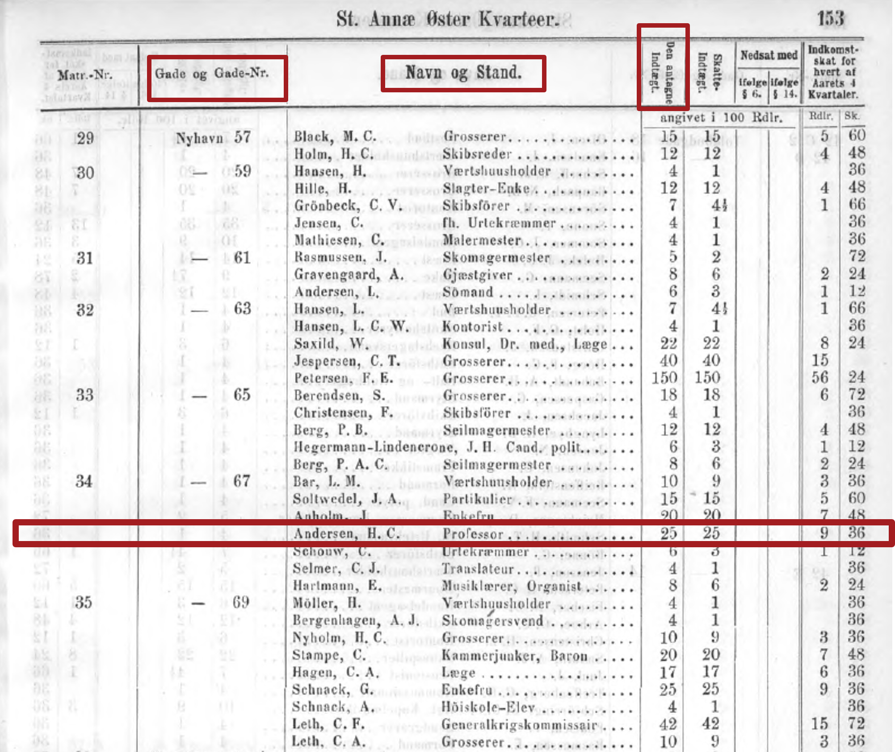  
.small123[*Original tax ledger, Copenhagen 1863*]
]

---
# C.E. Frijs (1817–1896)

.pull-left-wide[
- Part of the landed nobility — Prime Minister (1865–1870)

- **Income: 500,000 kr/year (1869–1872)**
  - Equivalent to roughly 50 million kr today
  - Highest recorded income in Copenhagen at the time

- Occupation in the books: *Konseilspræsident* (1869), *Lensgreve* (1871)

- Residence: Toldbodvej 26
]

.pull-right-narrow[
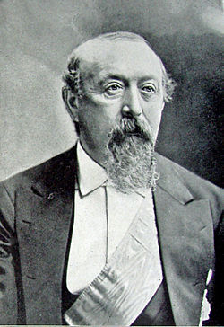  
.small123[*Source: Wikipedia*]
]

---
# H.C. Andersen (1805–1875)

.pull-left-wide[
- Renowned Danish fairy-tale author

- **Income: 3,600 kr (1865) → 4,000 kr (1869–1874)**
  - Placed him in the **top 20%** of income earners in Copenhagen

- Occupation in the books: *Professor* (1865), *Etatsraad* (1869)

- Residence: Nyhavn 67 (1865) → Lille Kongensgade 1 (1869) → Høibroplads 21 (1870)
]

.pull-right-narrow[
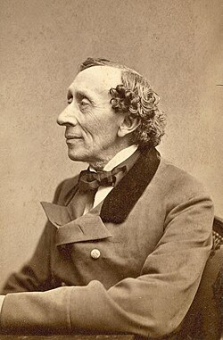  
.small123[*Source: Wikipedia*]
]

---
# C.F. Tietgen (1829–1901)

.pull-left-wide[
- Prominent banker and industrialist — born into modest circumstances in Odense

- Moved to Copenhagen in 1855 (after 5 years in Manchester)

- Director of *Privatbanken* (1857); played a central role in founding:
  - Kjøbenhavns Sporvei-Selskab (1866)
  - Det Store Nordiske Telegraf-Selskab (1869)
  - Burmeister & Wain (1871), Tuborgs Bryggerier (1873)

- His life-cycle earnings are on the next slide →
]

.pull-right-narrow[
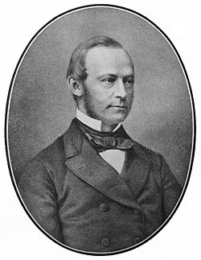  
.small123[*Source: Wikipedia*]
]

---
# C.F. Tietgen — life-cycle earnings

.pull-left-wide[
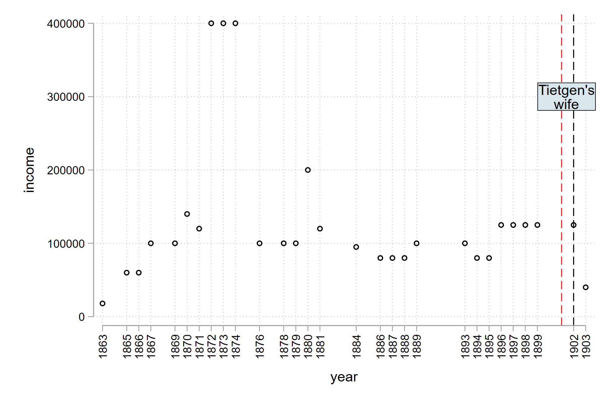
]


---
# What can we say about this distribution?


.pull-left[
- We are looking at a **subsection of 136,506 observations** from the records

- It's kernel density estimate of the probability density function of income in Copenhagen in 1866, 1876, 1886, and 1896 (you'll learn more about those later)

- Basically, you are looking at the *distribution* of income in Copenhagen at four points in time

- **How do we summarize what we see?** $\Rightarrow$ this is exactly what descriptive measures are for
]

.pull-right[
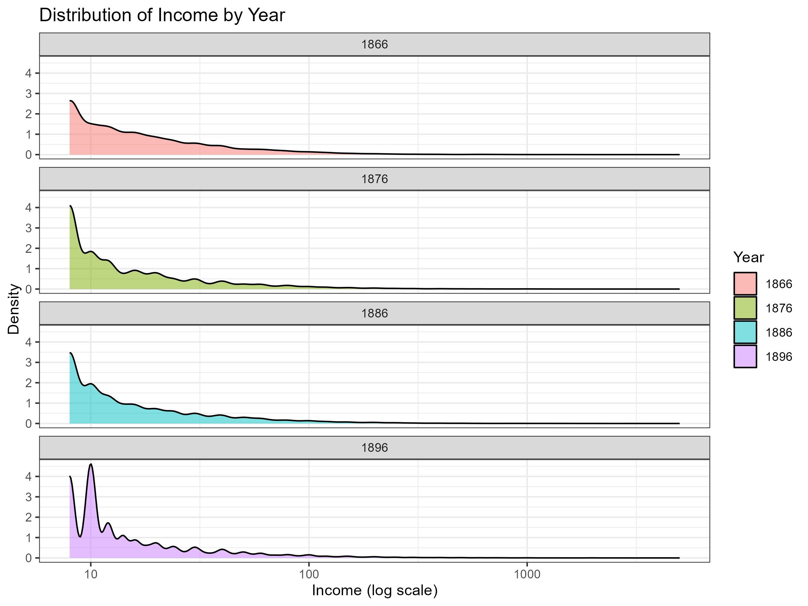
]

--

.pull-left-wide[

- You already know these: mean, median, standard deviation, quantiles, etc.

- **Now it's time to relearn them**
]


---
# Summary statistics tell us something

.pull-left-wide[
| Year | n | Mean | SD | Median | Max |
|------|----:|-----:|---:|-------:|----:|
| 1866 | 17,793 | 26 | 59 | 12 | 3,000 |
| 1876 | 29,063 | 25 | 77 | 12 | 5,000 |
| 1886 | 38,606 | 25 | 61 | 12 | 3,000 |
| 1896 | 50,105 | 25 | 64 | 10 | 2,500 |

.small123[*Incomes in historical units. SD = standard deviation.*

- The **mean is more than twice the median** — the distribution is strongly right-skewed (a few very rich pull the mean up)

- The **standard deviation is larger than the mean** — enormous spread around the average

- The **median is remarkably stable** — (speculation) as Denmark industrialized, more people got rich, but a similar amount entered the labour force, echoing the "Engel's pause" hypothesis of stagnant living standards for the working class during early industrialization
]
]

---
# Ongoing research: what else can we learn?

.pull-left[
**Income inequality over time**

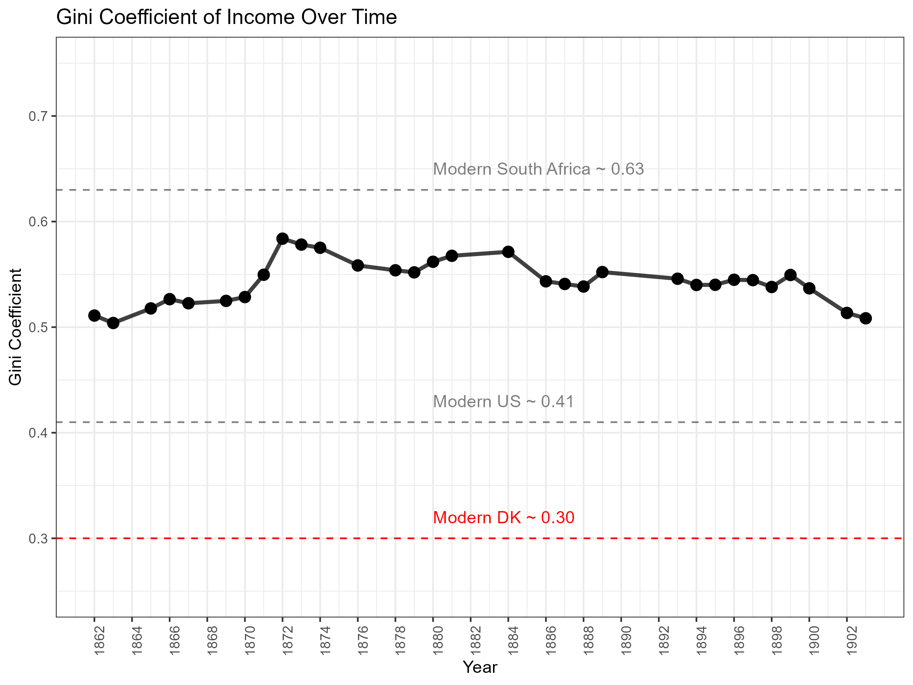
.small123[*Gini coefficient in Copenhagen, 1863–1904*]
]

.pull-right[
**Which occupations earned what?** 
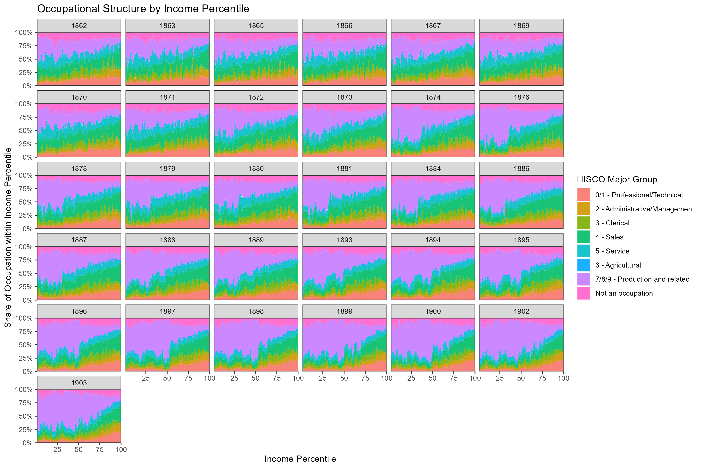
.small123[*Which occupations in which part of the income distribution?**]
]

.footnote[
.small123[
$^*$*The occupational classification is based on the HISCO system. HISCO coded using *OccCANINE* (Dahl, Johansen, Vedel, 2024)*
]  

]

---
# Descriptive measures

.pull-left-wide[
Two types:

- **Moments** — based on weighted averages (mean income, average height)

- **Quantiles** — based on splitting the distribution (richest 10%, median earner)
]

---
# Moments: an example

.pull-left-wide[
- **Mean income in 1866 Copenhagen = 26 kr**

$$E(X) = \int_{-\infty}^\infty x \cdot f(x) \, dx$$

- But **median = 12 kr** — Frijs's 500,000 kr pulls the mean far above what most people earned
]

.pull-right-narrow[

]

---
# Quantiles: an example

.pull-left-wide[
- **Median income = 12 kr** splits the distribution in half: 50% earn less, 50% earn more

- Other examples: $q_{0.9}$ = income threshold for the top 10%; $q_{0.25}$ = bottom quarter cutoff

- **Key advantage**: quantiles are robust — Frijs's 500,000 kr does not move the median
]

---
# Descriptive measures and random variables

.pull-left-wide[
- Let $X$ = income of a randomly chosen Copenhagener in 1866

- $f(12)$ = probability density at 12 kr, reflecting how common that income level is in the population

- Applying descriptive measures to $X$ gives us information about the **underlying population**
]

---
# .red[Raise your hand 1: Moments or quantiles?]

```{r ryh-moments-or-quantiles-timer, echo=FALSE}
library(countdown)
countdown(0, 20, top=TRUE)
```

.pull-left-wide[
**Q1.** "The average (mean) income in Denmark is 450,000 DKK per year." This is:

- **A)** A moment — it is based on a weighted average of values
- **B)** A quantile — it describes who earns above/below a threshold
- **C)** Neither — it is just a descriptive number, not a formal measure
]

--

.pull-left-wide[
**Q2.** "The bottom 25% of Danish earners earn less than 280,000 DKK per year." This is:

- **A)** A moment — it uses averages over the whole distribution
- **B)** A quantile — it identifies a split point of the distribution
- **C)** A variance — it describes the spread of the income distribution
]

```{r ryh-moments-or-quantiles, eval=FALSE, include=FALSE}
# ANSWERS
#
# Q1: Answer A — the mean is the first moment E(X), computed as a weighted average
#   B: Quantiles identify split points (who earns above/below), not averages
#   C: It is a specific type of descriptive measure (a moment), not "just a number"
#
# Q2: Answer B — "bottom 25%" is the 25th percentile (q_0.25), a quantile:
#     the value that splits the distribution so 25% lies below it
#   A: Moments use weighted averages of X^k, not cut-points
#   C: Variance measures spread around the mean; it does not identify cut-points
```

---
# Distribution

.pull-left-wide[
> **Distribution** = the list of probabilities associated with the values that a random variable can take (if discrete) or the probability density function (if continuous)

- The distribution of the random variable is a representation of the distribution of the underlying population

- Therefore, we call the distribution of the random variable the **population distribution**

- Similarly, we call the descriptive measures for the random variable the **population measures**

- This is in contrast with averages and other descriptive measures calculated in a sample, which are **sample measures**
]

---
# Distribution — example

.pull-left-wide[
- Let $X$ = income of a randomly chosen Copenhagener in 1866

- The **population distribution** of $X$ is the full probability density function over all possible incomes — the smooth curve you would get if you knew every single person's income

- In practice we never observe the full population — we observe a **sample** of $n = 17{,}793$ people

- From this sample we compute **sample measures**: e.g., sample mean $\bar{x} = 26$ kr, sample median $= 12$ kr

- These are estimates of the unknown **population measures** $E(X)$ and $q_{0.5}$

- The kernel density plot is our best approximation of the population distribution from the sample
]

.pull-right-narrow[

.small123[*Estimated population distribution of income, 1866*]
]

---
# .red[Practice 1: Descriptive measures and distributions]

.pull-left-wide[
**Q1.** Classify each statement as a *moment*, a *quantile*, or neither:
- "The average exam score is 62 out of 100"
- "Half of students score below 58"
- "The most common score is 70"

**Q2.** A researcher models the wage $W$ of a randomly chosen Danish worker as a continuous random variable. Is the distribution of $W$ a population or a sample distribution?

**Q3.** A handful of workers earn over 500,000 DKK/month while most earn 30,000–50,000 DKK. Would you expect $E(W)$ or the median of $W$ to be higher? Why?
]

```{r practice-intro, eval=FALSE, include=FALSE}
# Solutions:
#
# Q1:
#   "Average exam score = 62"  -> moment (first moment: E(X))
#   "Half of students score below 58" -> quantile (q_0.5, the median)
#   "Most common score is 70" -> neither moment nor quantile; it is the MODE
#
# Q2: W as a random variable represents the underlying population => population distribution.
#     The observed wages of 2,000 actual workers would form the sample distribution.
#
# Q3: E(W) > median. The extreme high earners pull the mean upward,
#     while the median only reflects the middle worker and is unaffected by extremes.
```

---
class: inverse, middle, center
# Moments

---
# Expected value of discrete random variables

.pull-left-wide[
> The **expected value (mean value)** of a discrete random variable $X$ with probability function $f(x)$ is given by:
> $$E(X) = \sum_{i=1}^N x_i f(x_i) = x_1 f(x_1) + x_2 f(x_2) + \ldots + x_N f(x_N) = \mu$$
> where $x_1, x_2, \ldots, x_N$ are all the different values that $X$ can take.

- The expected value is also called "mean" and denoted by $\mu$ (*mu*)

- For example, the expected value of a dice roll is:
$$E(X) = 1 \cdot \frac{1}{6} + 2 \cdot \frac{1}{6} + \ldots + 6 \cdot \frac{1}{6} = 3.5$$
]

---
# Expected value of discrete random variables

.pull-left-wide[
- Note that 3.5 is *not* one of the possible values of $X$ $\Rightarrow$ how do we interpret this expected value?
]

--

.pull-left-wide[

- Imagine that you play a game where you win one krone for each dot on the face of the dice (so, if you roll a 4, you win 4 kroner)

- The expected value of 3.5 tells you that, if you play this game 10 times, you should expect to win about 35 kroner (3.5 times 10)

- In this case, the expected value is the "average win per play"
]

--

.pull-left-wide[
- Intuitively, the expected value is the average of all the values obtained if you were to repeat the experiment generating $X$ an infinite number of times

- Another interpretation of the average value is the "center of mass"
]

---
# Properties of the expected value

.pull-left-wide[
- Let $h(\cdot)$ be a function, $a$ and $b$ be **constants** (i.e., real numbers), and $X$ a random variable (continuous or discrete). Then:

1. The expected value of $h(X)$ is given by:
$$E[h(X)] = \sum_{i=1}^N h(x_i) f(x_i) = h(x_1) f(x_1) + h(x_2) f(x_2) + \ldots + h(x_N) f(x_N)$$

2. $E(a) = a$

3. $E(aX) = a E(X)$

4. $E(a + X) = a + E(X)$

5. $E(a + b X) = a + b E(X)$

- Important: note that, in general, $E[h(X)] \not= h[E(X)]$
]

---
# .red[Practice 2: Expected value]

.pull-left-wide[
A fair 4-sided die shows values 1, 2, 3, 4 with equal probability $\frac{1}{4}$.

**Q1.** Calculate $E(X)$.

**Q2.** You win $X^2$ kroner per roll. Calculate your expected winnings $E(X^2)$.

**Q3.** Is $E(X^2) = [E(X)]^2$? What does this tell you about applying functions to expected values?
]

```{r practice-ev, eval=FALSE, include=FALSE}
# Solutions:
#
# Q1: E(X) = 1*(1/4) + 2*(1/4) + 3*(1/4) + 4*(1/4) = (1+2+3+4)/4 = 10/4 = 2.5
#
# Q2: E(X^2) = 1^2*(1/4) + 2^2*(1/4) + 3^2*(1/4) + 4^2*(1/4) = (1+4+9+16)/4 = 30/4 = 7.5
#
# Q3: [E(X)]^2 = 2.5^2 = 6.25 != 7.5 = E(X^2)
#     So E[h(X)] != h[E(X)] in general.
#     This is exactly why Var(X) = E[X^2] - [E(X)]^2 > 0 whenever X is not constant.
```

---
# .red[Raise your hand 2: Interpreting the expected value]

```{r ryh-ev-timer, echo=FALSE}
library(countdown)
countdown(0, 20, top=TRUE)
```

.pull-left-wide[
**Q1.** A fair die is rolled once. $E(X) = 3.5$. What does this mean?

- **A)** 3.5 is the most likely outcome of a single roll
- **B)** 3.5 is the long-run average if you roll very many times
- **C)** 3.5 is always between the minimum (1) and maximum (6), so it is a "middle" value
]

--

.pull-left-wide[
**Q2.** $E(X) = 5$ and $E(Y) = 3$. What is $E(2X - Y + 4)$?

- **A)** $2 \cdot 5 - 3 + 4 = 11$
- **B)** $2 \cdot 5 - 3 = 7$
- **C)** Cannot be determined without knowing if $X$ and $Y$ are independent
]

```{r ryh-ev, eval=FALSE, include=FALSE}
# ANSWERS
#
# Q1: Answer B — E(X) is the long-run average (law of large numbers);
#     3.5 is never a possible outcome of a single die roll
#   A: 3.5 is not even a possible value; the mode is the "most likely" single outcome
#   C: Technically true that 3.5 is between 1 and 6, but this is not what E(X) means;
#      the median also has this property, so it doesn't uniquely describe E(X)
#
# Q2: Answer A — by linearity: E(2X - Y + 4) = 2*E(X) - E(Y) + 4 = 10 - 3 + 4 = 11
#   B: Forgot to add the constant 4; E(a + X) = a + E(X)
#   C: Linearity of expectation holds regardless of whether X and Y are independent
```

---
# Expected value of continuous random variables

.pull-left-wide[
- Recall that we defined concepts related to continuous random variables in ways similar to discrete random variables, by making two changes:
  - replace the probability function with the probability density function
  - replace summations with integrals

> The **expected value (mean value)** of a continuous random variable $X$ with probability density function $f(x)$ is given by:
> $$E(X) = \int_{-\infty}^\infty x f(x) \, dx = \mu$$
]

---
# A challenge: Expected value of discrete random variables

.pull-left-wide[
- Consider the following two games related to the toss of a coin:
  - you win 1 krone if "heads," you lose 1 krone if "tails"
  - you win 10 kroner if "heads," you lose 10 kroner if "tails"

- Let $X$ be the random variable representing the first game and $Y$ the random variable representing the second game

- The possible values of $X$ are $-1$ and $1$, each with probability 50%

- The possible values of $Y$ are $-10$ and $10$, each with probability 50%

- Their expected values are:
$$E(X) = 1 \cdot \frac{1}{2} + (-1) \cdot \frac{1}{2} = 0$$
$$E(Y) = 10 \cdot \frac{1}{2} + (-10) \cdot \frac{1}{2} = 0$$

- But are they similarly "risky"? Can we get a better measure?
]

---
# Variance

.pull-left-wide[
> The **variance** of a random variable $X$ is usually denoted by $\sigma^2$ (*sigma squared*) and is defined as:
> $$Var(X) = E \left( \left[ X - E(X) \right]^2 \right) = \sigma^2$$
>
> If $X$ is a discrete random variable with probability function $f(x)$, then:
> $$Var(X) = \sum_{i=1}^N (x_i - \mu)^2 f(x_i)$$
>
> If $X$ is a continuous random variable with probability density function $f(x)$, then:
> $$Var(X) = \int_{-\infty}^\infty (x - \mu)^2 f(x) \, dx$$
]

---
# Variance

.pull-left-wide[
- Intuitively, the variance is a measure of how "spread out" is the distribution of a random variable

- In our example, we have:
$$Var(X) = (1 - 0)^2 \cdot \frac{1}{2} + (-1 - 0)^2 \cdot \frac{1}{2} = 1$$
$$Var(Y) = (10 - 0)^2 \cdot \frac{1}{2} + (-10 - 0)^2 \cdot \frac{1}{2} = 100$$

- So we see that $Y$ is more "spread out" than $X$
]

---
# .red[Practice 3: Variance]

.pull-left-wide[
Using the same two coin-flip games: $X$ wins ±1 and $Y$ wins ±10, each with probability ½.

**Q1.** Confirm that $E(X) = E(Y) = 0$. Does the expected value distinguish these two games?

**Q2.** Calculate $Var(X)$ and $Var(Y)$. Which game is riskier?

**Q3.** A third game: $Z = 5X$. Without recalculating from scratch, what is $Var(Z)$?
]

```{r practice-variance, eval=FALSE, include=FALSE}
# Solutions:
#
# Q1: E(X) = 1*(1/2) + (-1)*(1/2) = 0. Same for Y.
#     The expected value does NOT distinguish the two games — both have E = 0.
#     This is precisely why we need the variance.
#
# Q2: Var(X) = (1-0)^2*(1/2) + (-1-0)^2*(1/2) = 0.5 + 0.5 = 1
#     Var(Y) = (10-0)^2*(1/2) + (-10-0)^2*(1/2) = 50 + 50 = 100
#     Y is 100x riskier: same expected payoff but 100x higher variance.
#
# Q3: Var(Z) = Var(5X) = 5^2 * Var(X) = 25 * 1 = 25
#     (using the property Var(aX) = a^2 * Var(X))
```

---
# Standard deviation

.pull-left-wide[
- One problem with the variance is that the unit of measurement is not the same as that of the random variable

- In our example, $X$ is measured in kroner, but $Var(X)$ is measured in kroner squared

- It would be useful to have a measure of the spread expressed in the same units of measurement as the random variable

> The **standard deviation** of a random variable $X$ is defined as:
> $$\sigma(X) = \sqrt{Var(X)} = \sqrt{\sigma^2}$$
]

---
# Properties of the variance and of the standard deviation

--

- The variance and standard deviation have the following properties:

.pull-left[
**Variance:**
1. $Var(a) = 0$
2. $Var(aX) = a^2 Var(X)$
3. $Var(a + X) = Var(X)$
4. $Var(a + b X) = b^2 Var(X)$
]

.pull-right[
**Standard deviation:**
- $\Rightarrow$ $\sigma(a) = 0$
- $\Rightarrow$ $\sigma(aX) = |a| \sigma(X)$
- $\Rightarrow$ $\sigma(a + X) = \sigma(X)$
- $\Rightarrow$ $\sigma(a + b X) = |b| \sigma(X)$
]

---
# Higher order moments

.pull-left-wide[
- Note that the variance is defined as the expected value of the square of the "demeaned" version of $X$

- We can similarly define the expected value of the $k$-th power of $X$ or of the "demeaned" version of $X$

> The **k-th moment** of a random variable $X$ is defined as:
> $$m_k(X) = E(X^k)$$
>
> The **k-th central moment** of $X$ is defined as:
> $$m_k^*(X) = E\left( [X - E(X)]^k \right)$$
]

---
# Higher order moments

.pull-left-wide[
- Note that:
  - the expected value is the first moment of $X$: 
  $$E(X) = m_1(X)$$
  - the variance is the second central moment of $X$: 
  $$Var(X) = m_2^*(X)$$

- Some other useful moments are:
  - $m_3^*(X)$ describes how skewed is the distribution of $X$
  - $m_4^*(X)$ shows how likely are the extreme values of $X$
]

---
class: middle

# Higher order moments
> Sometimes a moment does not exist. This can lead to trouble. 

---
# Higher order moments — the St. Petersburg paradox

.pull-left-wide[
**The St. Petersburg game:**

- A fair coin is tossed until the first heads appears
- If the first heads comes on toss $N$, the payoff is $X = 2^N$ kr.
- Since the coin is fair,

$$f(N=n)=2^{-n}, \qquad n=1,2,\ldots$$
]

--

.pull-left-wide[
**The paradox:**

- The initial stake is 2 kr., doubled every time heads appears
- Your expected winnings are:

$$
\begin{align}
E(X) &= 2 \cdot \tfrac{1}{2} + 4 \cdot \tfrac{1}{4} + 8 \cdot \tfrac{1}{8} + \ldots \\
     &= 1 + 1 + 1 + \ldots \\
     &= \infty
\end{align}
$$

- You should be willing to pay any finite amount to play this game. Right?
]

--

.pull-right-narrow[

]

---
# Higher order moments — resolution

.pull-left-wide[
**What the paradox reveals:**

- Expected value theory says you should pay *any* finite price to play — but nobody would pay, say, 1,000,000 kr.
- The $\infty$ is driven entirely by vanishingly rare, astronomically large payoffs
- With probability $\frac{1}{2}$ you win just 2 kr.; with probability $\frac{3}{4}$ you win at most 4 kr.
- The "average" is completely disconnected from what typically happens

**The resolution:**

- More about this in your *Strategy and Markets* course.
]

---
# .red[Practice 4: Expected value and variance]

.pull-left-wide[
A random variable $X$ represents the number of heads in two fair coin tosses. It takes values $0, 1, 2$ with probabilities $\frac{1}{4}, \frac{1}{2}, \frac{1}{4}$.

**Q1.** Calculate $E(X)$.

**Q2.** Calculate $Var(X)$.

**Q3.** Let $Y = 3X + 2$. What are $E(Y)$ and $Var(Y)$?
]

```{r practice-moments, eval=FALSE, include=FALSE}
# Solutions:
#
# Q1: E(X) = 0*(1/4) + 1*(1/2) + 2*(1/4) = 0 + 0.5 + 0.5 = 1
#
# Q2: Var(X) = (0-1)^2*(1/4) + (1-1)^2*(1/2) + (2-1)^2*(1/4)
#           = 1*(1/4) + 0 + 1*(1/4) = 0.25 + 0 + 0.25 = 0.5
#
# Q3: E(Y) = 3*E(X) + 2 = 3*1 + 2 = 5
#     Var(Y) = 3^2 * Var(X) = 9 * 0.5 = 4.5
```

---
# .red[Raise your hand 3: Expected value and variance]

```{r ryh-moments-timer, echo=FALSE}
library(countdown)
countdown(0, 20, top=TRUE)
```

.pull-left-wide[
**Q1.** In general, is $E[X^2] = [E(X)]^2$?

- **A)** Yes, always — the expectation operator is linear
- **B)** No, not in general — $E[X^2] \geq [E(X)]^2$ by Jensen's inequality
- **C)** Yes, if $X$ is symmetric around zero
]

--

.pull-left-wide[
**Q2.** $Var(X) = 4$. You define $Y = -2X + 5$. What is $Var(Y)$?

- **A)** $Var(Y) = -16$ — the negative sign flips the variance
- **B)** $Var(Y) = 16$ — variance uses $(-2)^2 = 4$
- **C)** $Var(Y) = 9$ — adding 5 increases the variance
]

```{r ryh-moments, eval=FALSE, include=FALSE}
# ANSWERS
#
# Q1: Answer B — E[X^2] >= [E(X)]^2 always (equality only if X is constant).
#     This is why Var(X) = E[X^2] - [E(X)]^2 >= 0.
#   A: Linearity applies to E[aX + b], not to E[f(X)] in general
#   C: Even symmetric X around 0 has E[X^2] = Var(X) != [E(X)]^2 = 0 (unless X = 0 a.s.)
#
# Q2: Answer B — Var(aX + b) = a^2 * Var(X), so (-2)^2 * 4 = 4 * 4 = 16
#   A: Variance is always non-negative; the sign of the scalar does not matter
#   C: Adding a constant b does not change variance; only the scaling a matters
```

---
class: inverse, middle, center
# Quantiles

---
# Quantiles

.pull-left-wide[
- Quantiles represent another way of summarizing the distribution of $X$

- The distribution of income tends to be highly asymmetric

- As a result, the mean is not particularly informative

- A measure more common in the study of skewed distributions such as the income distribution is the median

- Intuitively, the **median** is the value of $X$ that splits the distribution in half
]

---
# Median

.center[
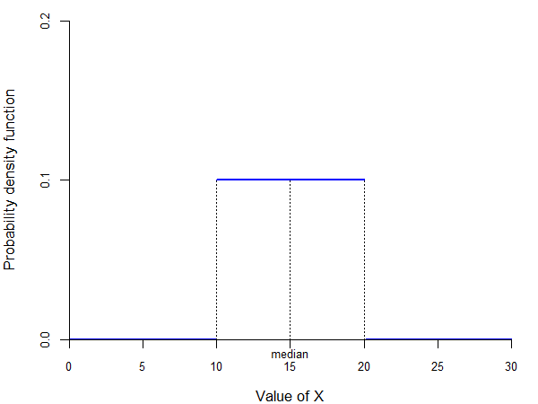
]

---
# Quantiles

.pull-left-wide[
- In general, we can define a quantile for any split of the distribution of $X$

- The intuition is that the 25-th quantile splits the distribution into 25% to the left, 75% to the right

- However, the distribution of discrete random variables may not allow such a "nice" split (e.g., we cannot exactly split the distribution of the toss of a coin this way)

- Hence, we need to define the quantile in a more convoluted way
]

---
# Quantiles

.pull-left-wide[
> The **p-quantile** of a random variable $X$ with cumulative distribution function $F(x)$ is the value $q_p$ such that:
> - $P(X < q_p) \leq p$
> - $P(X > q_p) \leq 1 - p$
>
> If $X$ is a continuous random variable, this simplifies to:
> $$F(q_p) = p$$

- For a continuous random variable, the $p$-quantile is the value that splits the distribution into $p$ to the left and $1 - p$ to the right

- For a discrete random variable, the $p$-quantile is the value where the cumulative distribution function "jumps" from a value lower than $p$ to one higher than $p$
]

---
# Quantiles for discrete random variables

.center[
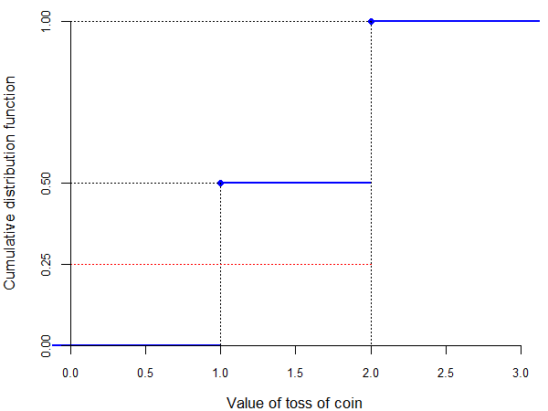
]

---
# Multiple quantiles

.pull-left-wide[
- Unlike moments, quantiles *always* exist

- However, they do not have to be unique

- For example, it can happen that the random variable $X$ has a distribution with more than one median

- In this case, the convention is to use the midpoint of the interval as the median
]

---
# Multiple quantiles

.center[
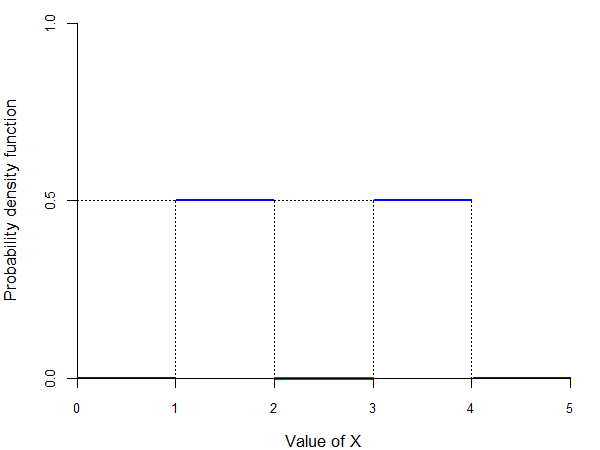
]

---
# Multiple quantiles

.center[
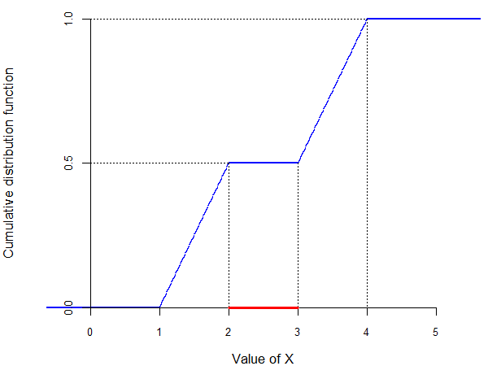
]

---
# Special names for quantiles

.pull-left-wide[
- Some particular quantiles have special names:
  - $q_{0.5}$ is called the **median**
  - $q_{0.25}$ and $q_{0.75}$ are called **quartiles**
  - $q_{0.1}, q_{0.2}, \ldots, q_{0.9}$ are called **deciles**
  - $q_{0.01}, q_{0.02}, \ldots, q_{0.99}$ are called **percentiles**
]

---
# .red[Practice 5: Quantiles]

.pull-left-wide[
A discrete random variable $X$ takes values $1, 2, 3, 4, 5$ with equal probability $\frac{1}{5}$.

**Q1.** What is the median of $X$?

**Q2.** What is $q_{0.8}$ (the 80th percentile) of $X$?

**Q3.** A second variable $Y$ takes the same values but with probabilities $0.1, 0.1, 0.6, 0.1, 0.1$. What is the median of $Y$? Do moments or quantiles better distinguish $X$ from $Y$?
]

```{r practice-quantiles, eval=FALSE, include=FALSE}
# Solutions:
#
# Q1: F(2) = 2/5 = 0.4 < 0.5, F(3) = 3/5 = 0.6 > 0.5 => median = 3
#
# Q2: F(3) = 3/5 = 0.6 < 0.8, F(4) = 4/5 = 0.8 >= 0.8 => q_0.8 = 4
#
# Q3: F_Y(2) = 0.2, F_Y(3) = 0.8 => median(Y) = 3 (same as X)
#     E(X) = 3 = E(Y) and median(X) = median(Y) = 3 -- indistinguishable by mean or median!
#     However, Var(X) = 2 (uniform spread) > Var(Y) (peaked at 3).
#     So the variance (a moment) better distinguishes X from Y here.
#     Key insight: different types of measures capture different features.
```

---
# .red[Raise your hand 4: Mean vs. median]

```{r ryh-quantiles-timer, echo=FALSE}
library(countdown)
countdown(0, 20, top=TRUE)
```

.pull-left-wide[
**Q1.** Income in a country is heavily right-skewed (a few very high earners). Which measure best describes the "typical" income?

- **A)** The mean — it is a moment and uses all the data
- **B)** The median — it is a quantile and is robust to extreme values
- **C)** The variance — it captures how unequal incomes are
]

--

.pull-left-wide[
**Q2.** A distribution has median 50 and mean 80. What can you conclude?

- **A)** The distribution is left-skewed (long left tail pulls mean below median)
- **B)** The distribution is right-skewed (long right tail pulls mean above median)
- **C)** There must be measurement errors in the data
]

```{r ryh-quantiles, eval=FALSE, include=FALSE}
# ANSWERS
#
# Q1: Answer B — the median is a quantile and is robust to extreme values;
#     this is why official statistics typically report median household income
#   A: Using all data is not always good; extreme earners distort the mean (a moment)
#   C: Variance describes spread, not central tendency — it's not a location measure
#
# Q2: Answer B — when mean > median, the distribution has a long right tail
#     (extreme high values pull the mean above the median)
#   A: Left-skewed => long left tail => mean < median (opposite direction)
#   C: Skewness is a distributional feature (captured by the 3rd moment), not data error
```

---
class: inverse, middle, center
# Choice of descriptive measures

---
# Choice of descriptive measures

.pull-left-wide[
- Imagine that you want to study the distribution of income in the Danish population

- Let $X$ be the income of a randomly chosen individual $\Rightarrow$ the probability function of $X$ should represent the distribution of income in Denmark

- What can we tell from the fact that the *expected value* of $X$ is high?
  - the *average* person has a high income
  - but this does not mean that *everyone* has a high income: we could have two groups of people, one really rich and one really poor

- What can we tell if the *median* value of $X$ is high?
  - the person in the middle of the distribution of income has a high income
  - but this again does not mean that *everyone* has a high income: we could still have two groups of people, one really rich and one really poor, with a single person in the middle
]

---
# Choice of descriptive measures

.center[
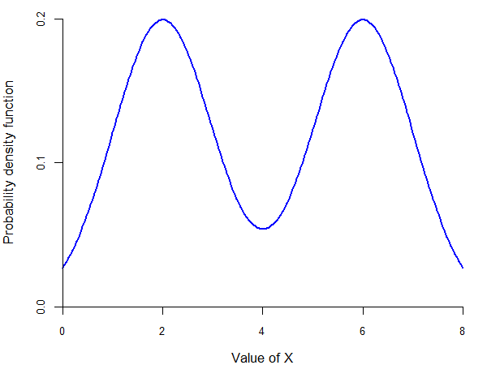
]

---
# Choice of descriptive measures

.pull-left-wide[
- What the expected value and the median have in common is that they both describe the *central tendency* of the distribution

- They give the best description of the "typical" observation (expected value) or of the "middle" of the distribution (median)

- If the distribution is symmetric, then the median and the expected value are equal

- However, the median is generally more *robust* to measurement errors (e.g., if there are small errors in how incomes are inputted)
]

---
# Mode

.pull-left-wide[
- Another commonly used descriptive measure is the mode

> The **mode (modal value)** of a random variable $X$ is the value $x_m$ where the probability (density) function attains its maximum. That is:
> $$f(x_m) \geq f(x)$$
> for all possible values of $x$.

- Like the quantiles, the mode always exists but does not have to be unique

- A distribution is *unimodal* if it has only one mode, or *bimodal* if it has two

- We can identify the mode(s) as the "peak(s)" of the probability (density) function
]

---
# .red[Practice 6: Choosing descriptive measures]

.pull-left-wide[
For each scenario, state which descriptive measure(s) you would use and why.

**Scenario A:** You want to report the "typical" apartment price in Copenhagen, where a few luxury properties sell for 50M+ DKK.

**Scenario B:** You analyse exam scores (0–100) and want to summarize both the average performance and the risk of scoring below 40.

**Scenario C:** You study the most frequently occurring party affiliation in a large survey.
]

```{r practice-choice, eval=FALSE, include=FALSE}
# Solutions:
#
# Scenario A: Median (a quantile) — robust to extreme luxury prices.
#             The mean (a moment) would be distorted upward by extreme sales.
#
# Scenario B: Mean (first moment) for average performance.
#             The 40th percentile (q_0.4, a quantile) to assess the risk of failing.
#             Standard deviation (square root of second central moment) for spread.
#
# Scenario C: Mode — "most common" category is the natural question for nominal data.
#             Mean and median are not meaningful for categorical party affiliation.
```

---
# .red[Raise your hand 5: Choosing descriptive measures]

```{r ryh-choice-timer, echo=FALSE}
library(countdown)
countdown(0, 20, top=TRUE)
```

.pull-left-wide[
**Q1.** For a strictly symmetric distribution, which must be true?

- **A)** Mean = Median = Mode always
- **B)** Mean = Median, but mode may differ
- **C)** All three are equal only if the distribution is normal
]

--

.pull-left-wide[
**Q2.** A distribution is bimodal. This means:

- **A)** The mean and median are both equal to one of the two modes
- **B)** The probability (density) function has two local maxima
- **C)** The variance is exactly twice as large as for a unimodal distribution
]

```{r ryh-choice, eval=FALSE, include=FALSE}
# ANSWERS
#
# Q1: Answer B — symmetry implies mean = median, but the mode(s) may be elsewhere.
#     Example: a symmetric bimodal distribution has mean = median at the centre,
#     but two modes at the peaks (one on each side).
#   A: Symmetric unimodal distributions often have mean = median = mode, but not always
#   C: The normal is just one special case; symmetry alone guarantees mean = median
#
# Q2: Answer B — "bimodal" means two local maxima (peaks) of f(x)
#   A: The mean/median may not coincide with either mode in a bimodal distribution
#   C: Bimodality has no fixed relationship to the magnitude of the variance
```

---
class: inverse, middle, center
# Descriptive measures for the relationship between random variables

---
# Descriptive measures for the relationship between random variables

.pull-left-wide[
- We sometimes need to know how two random variables are related

- For example, suppose you invest in two different stocks on the stock market

- The future price of each stock is a random variable

- You would want to know if the prices of the two stocks are likely to move together because this exposes you to more risk:
  - if both prices go up, you gain more
  - but if both prices fall, then you lose more

- "Don't put all your eggs in one basket:" you may want to invest in stocks whose prices are likely to move in opposite directions
]

---
# Expected value of a sum of random variables

.pull-left-wide[
- Let us start again with simple descriptive measures of the joint distribution

- We previously defined the joint probability (density) function of two random variables $X$ and $Y$ as $f(x, y)$

- Now suppose that you buy $a$ shares of the stock $X$ and $b$ shares of the stock $Y$

- What should you expect as the value of your portfolio?

- It should be the expected value of this combination of $X$ and $Y$:
$$E(aX + bY)$$
]

---
# Expected value of a sum of random variables

.pull-left-wide[
> The **expected value of a sum of random variables** $X$ and $Y$ is:
> $$E(aX + bY) = aE(X) + bE(Y)$$

- This formula holds true whether $X$ and $Y$ are discrete or continuous

- It also does not depend on whether $X$ and $Y$ move together or not
]

---
# Covariance between two random variables

.pull-left-wide[
> The **covariance** between two random variables $X$ and $Y$ is defined as:
> $$Cov(X, Y) = E\left( [X - E(X)] [Y - E(Y)] \right) = E \left[ (X - \mu_X)(Y - \mu_Y) \right]$$
> $$= E(XY) - \mu_X \mu_Y$$
]

---
# Covariance between two random variables

.pull-left-wide[
- If $X$ and $Y$ are both discrete, this becomes:
$$Cov(X, Y) = \sum_{i=1}^{N_x} \sum_{j=1}^{N_y} [(x_i - \mu_X) (y_j - \mu_Y) f(x_i, y_j)]$$
$$= \sum_{i=1}^{N_x} \sum_{j=1}^{N_y} [x_i y_j f(x_i, y_j)] - \mu_X \mu_Y$$

- If $X$ and $Y$ are both continuous, this becomes:
$$Cov(X, Y) = \int_{-\infty}^\infty \int_{-\infty}^\infty (x - \mu_X) (y - \mu_Y) f(x, y) \, dy \, dx$$
$$= \int_{-\infty}^\infty \int_{-\infty}^\infty x y f(x, y) \, dy \, dx - \mu_X \mu_Y$$
]

---
# Properties of the covariance

.pull-left-wide[
- The covariance tells us how the two variables move together:
  - $Cov(X, Y) > 0$ means that when $X$ is above its mean, then it is likely that $Y$ is also above its mean
  - $Cov(X, Y) < 0$ means that when $X$ is below its mean, then it is likely that $Y$ is above its mean

- The covariance between $X$ and $Y$ has a few useful properties:
  1. $Cov(X, Y) = Cov(Y, X)$
  2. $Cov(aX, bY) = a b \, Cov(X, Y)$
  3. $Cov(a + X, b + Y) = Cov(X, Y)$
  4. $Cov(X + Z, Y) = Cov(X, Y) + Cov(Z, Y)$
]

---
# Variance of a sum of random variables

.pull-left-wide[
> The **variance of a sum of random variables** $X$ and $Y$ is:
> $$Var(aX + bY) = Var(aX) + Var(bY) + 2 Cov(aX, bY)$$
> $$= a^2 Var(X) + b^2 Var(Y) + 2 a b \, Cov(X, Y)$$

- If we think of the variance of your earnings as the risk, now you can see why buying two stocks whose prices move in opposite directions helps with the risk

- If $Cov(X, Y) < 0$, then:
$$Var(aX + bY) < Var(aX) + Var(bY)$$

- If the prices of the two stocks move in the same direction, then $Cov(X, Y) > 0$ and:
$$Var(aX + bY) > Var(aX) + Var(bY)$$
]

---
# Correlation coefficient between two random variables

.pull-left-wide[
- The covariance has two major disadvantages:
  - its unit of measurement is the product of the units of measurement of $X$ and $Y$ (in our example, kroner squared)
  - the value of the covariance is not very informative and is sensitive to changes in the units of measurement of $X$ and $Y$

> The **correlation coefficient** between two random variables $X$ and $Y$ is defined as:
> $$\rho(X, Y) = \frac{Cov(X, Y)}{\sqrt{Var(X) \cdot Var(Y)}} = \frac{Cov(X, Y)}{\sigma(X) \cdot \sigma(Y)}$$
]

---
# Correlation coefficient between two random variables

.pull-left-wide[
- The correlation coefficient is always between $-1$ and 1

- The sign and the value indicate the direction and the strength of the relationship between $X$ and $Y$:
  - $\rho(X, Y) = -1$ means *perfect negative correlation*: every time $X$ is above its mean, $Y$ is below its mean
  - $-1 < \rho(X, Y) < 0$ indicates *negative correlation*: when $X$ is above its mean, $Y$ is generally below its mean
  - $\rho(X, Y) = 0$ means *no correlation*: when $X$ is above its mean, $Y$ is above its mean and below its mean with equal chance
  - $0 < \rho(X, Y) < 1$ indicates *positive correlation*: when $X$ is above its mean, $Y$ is generally above its mean
  - $\rho(X, Y) = 1$ means *perfect positive correlation*: every time $X$ is above its mean, $Y$ is also above its mean

- Important: if $X$ and $Y$ are independent, then $Cov(X, Y) = \rho(X, Y) = 0$, but the reverse is **not** true!
]

---
# .red[Practice 7: Covariance and correlation]

.pull-left-wide[
Two discrete random variables $X$ and $Y$ have the following joint distribution:

| | $Y = 0$ | $Y = 1$ |
|---|:---:|:---:|
| $X = 0$ | 0.3 | 0.2 |
| $X = 1$ | 0.2 | 0.3 |

**Q1.** Calculate $E(X)$, $E(Y)$, $Var(X)$, $Var(Y)$.

**Q2.** Calculate $Cov(X, Y)$.

**Q3.** Calculate $\rho(X, Y)$ and interpret the sign.
]

```{r practice-relationships, eval=FALSE, include=FALSE}
# Solutions:
#
# Marginal distributions: P(X=0) = 0.5, P(X=1) = 0.5; P(Y=0) = 0.5, P(Y=1) = 0.5
#
# Q1:
# E(X) = 0*0.5 + 1*0.5 = 0.5;  E(Y) = 0.5 (symmetric)
# Var(X) = (0-0.5)^2*0.5 + (1-0.5)^2*0.5 = 0.25;  Var(Y) = 0.25
#
# Q2:
# E(XY) = 0*0*0.3 + 0*1*0.2 + 1*0*0.2 + 1*1*0.3 = 0.3
# Cov(X,Y) = E(XY) - E(X)*E(Y) = 0.3 - 0.5*0.5 = 0.05
#
# Q3:
# rho(X,Y) = 0.05 / (sqrt(0.25)*sqrt(0.25)) = 0.05 / 0.25 = 0.2
# Positive: when X is high (= 1), Y tends to be high (= 1) too.
```

---
# .red[Raise your hand 6: Correlation and independence]

```{r ryh-relationships-timer, echo=FALSE}
library(countdown)
countdown(0, 20, top=TRUE)
```

.pull-left-wide[
**Q1.** $X$ and $Y$ are independent. What is $\rho(X, Y)$?

- **A)** $\rho(X, Y) = 0$ always — independence implies no linear association
- **B)** $\rho(X, Y)$ can be anything — independence and correlation are unrelated
- **C)** $\rho(X, Y) = 1$ — independent variables move together by definition
]

--

.pull-left-wide[
**Q2.** You find $\rho(X, Y) = 0$. Can you conclude that $X$ and $Y$ are independent?

- **A)** Yes — zero correlation means no relationship at all
- **B)** No — zero correlation only rules out *linear* dependence
- **C)** Yes, if $X$ and $Y$ are jointly normally distributed
]

```{r ryh-relationships, eval=FALSE, include=FALSE}
# ANSWERS
#
# Q1: Answer A — independence implies Cov(X,Y) = 0 and therefore rho = 0
#   B: Independence DOES imply zero correlation; the two are related
#   C: Complete confusion — independent variables have NO systematic co-movement
#
# Q2: Answer B — rho = 0 only rules out *linear* dependence;
#     non-linear dependence is still possible (classic example: Y = X^2 with E(X) = 0)
#   A: Classic misconception — "uncorrelated implies independent" is FALSE in general
#   C: For *jointly* normal variables, uncorrelated does imply independent —
#      this is a special property of the multivariate normal, NOT a general rule
```

---
# Before next time
.pull-left[
- Read the assigned reading
- Next time: Commonly used distributions $\rightarrow$ Chapter 6
]

.pull-right[

]
