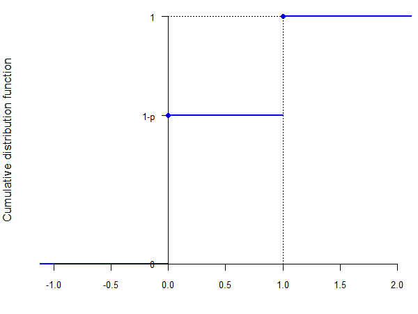
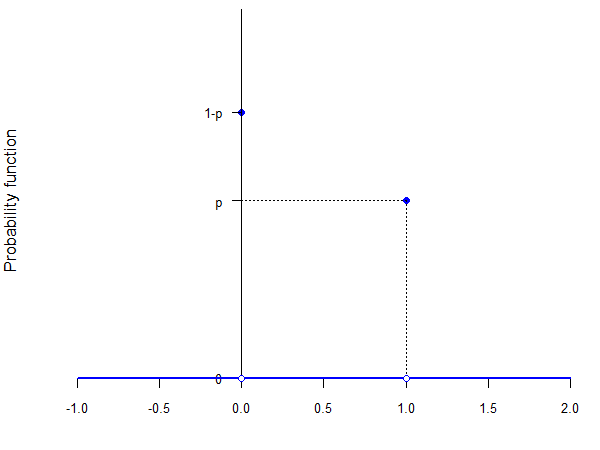
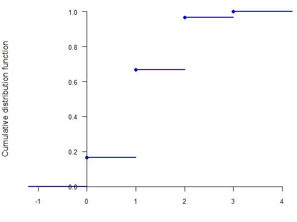
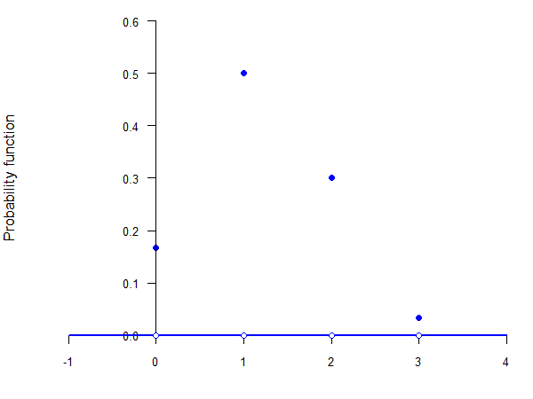
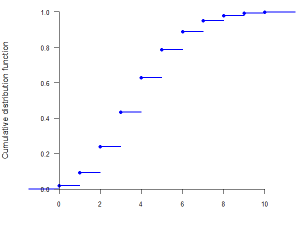
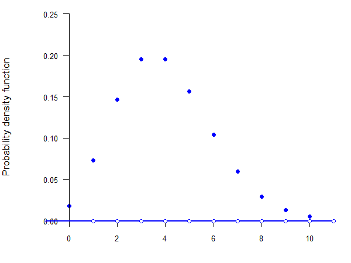
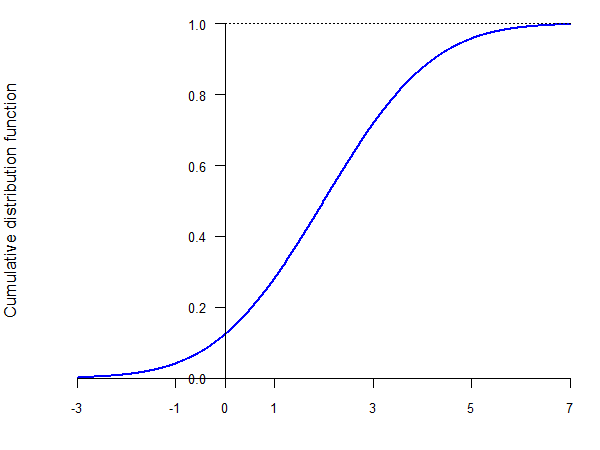
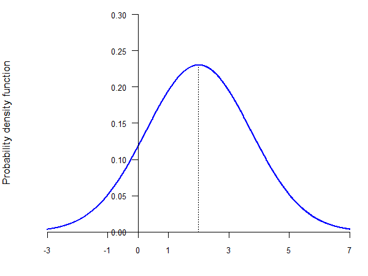
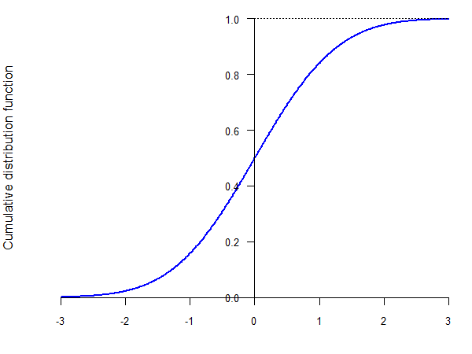
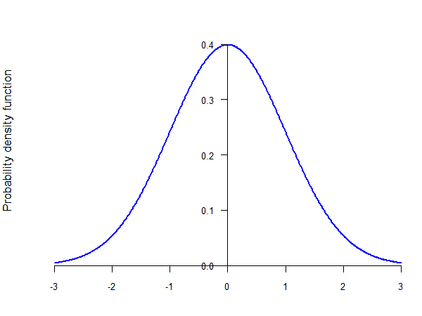

---
output:
  xaringan::moon_reader:
    seal: false
    includes:
      after_body: insert-logo.html
    self_contained: false
    lib_dir: libs
    nature:
      highlightStyle: github
      highlightLines: true
      countIncrementalSlides: false
      ratio: '16:9'
editor_options:
  chunk_output_type: console
---
class: center, inverse, middle

```{r xaringan-panelset, echo=FALSE}
xaringanExtra::use_panelset()
```

```{r xaringan-tile-view, echo=FALSE}
xaringanExtra::use_tile_view()
```

```{r xaringanExtra, echo = FALSE}
xaringanExtra::use_progress_bar(color = "#808080", location = "top")
```

```{css echo=FALSE}
.pull-left {
  float: left;
  width: 44%;
}
.pull-right {
  float: right;
  width: 44%;
}
.pull-right ~ p {
  clear: both;
}


.pull-left-wide {
  float: left;
  width: 66%;
}
.pull-right-wide {
  float: right;
  width: 66%;
}
.pull-right-wide ~ p {
  clear: both;
}

.pull-left-narrow {
  float: left;
  width: 30%;
}
.pull-right-narrow {
  float: right;
  width: 30%;
}

.tiny123 {
  font-size: 0.40em;
}

.small123 {
  font-size: 0.80em;
}

.large123 {
  font-size: 2em;
}

.red {
  color: red
}

.orange {
  color: orange
}

.green {
  color: green
}
```


# Statistics
## Commonly used distributions
### (Chapter 6)

### Seetha Menon,<br>Department of Economics<br>University of Southern Denmark

### Email: [smr@sam.sdu.dk](mailto:smr@sam.sdu.dk)

### Updated `r Sys.Date()`


---
class: inverse, middle, center
# The Bernoulli distribution

---
# The Bernoulli distribution

--

> A **Bernoulli population** is a population that contains only two types of elements: *successes* and *failures*.

--

- Examples:
  - the population described by the experiment "tossing a coin" (the types are "heads" and "tails")
  - the population resulting from the experiment "ask a person if they voted in the last election" (the types are "yes" and "no")

--

- Since there are only two possible outcomes, let $p$ be the probability of a success and $(1 - p)$ the probability of a failure

--

- This type of distribution is called a **Bernoulli distribution**

---
# The Bernoulli distribution

--

- Let $X$ be a random variable that describes this type of experiment, that is, whether the result of the experiment is a success or a failure

--

- Then we say that $X$ follows a Bernoulli distribution with parameter $p$ and we write:
$$X \sim Bernoulli(p) \text{ or } X \sim Ber(p)$$

--

- By construction, $X$ is a discrete random variable that can only take two values

--

- Usually, $X = 1$ represents a success (e.g., "heads", or "yes") and $X = 0$ represents a failure (e.g., "tails", or "no")

--

- The probability function of $X$ is:
$$f(0) = 1- p$$
$$f(1) = p$$

---
# The Bernoulli distribution

.center[

]

---
# The Bernoulli cumulative distribution function

.center[

]

---
# The Bernoulli probability function

.center[

]

---
# The Bernoulli distribution

--

- It can be easily shown that:
$$E(X) = 1 \cdot p + 0 \cdot (1- p) = p$$

--

$$E(X^2) = 1^2 \cdot p + 0^2 \cdot (1- p) = p$$

--

$$Var(X) = E(X^2) - [E(X)]^2 = p - p^2 = p (1 - p)$$


---
class: inverse, middle, center
# The binomial distribution

---
# The binomial distribution

--

- Consider now the following experiment: you toss a coin 5 times and you want to know the number of times "heads" showed

--

- The result of each coin toss is a Bernoulli variable, but what is the result of the experiment?

--

- The **binomial distribution** arises when you randomly draw a given number of times from a Bernoulli population, independently, and you want to count the number of successes

--

- The binomial distribution is characterized by two parameters:
  - the probability of success in each draw, $p$
  - the number of draws, $n$

---
# The binomial distribution

--

- Let $Y$ be the random variable that shows the number of successes in this experiment

--

- We then say that $Y$ follows a binomial distribution with parameters $n$ and $p$ and we write:
$$Y \sim Bin(n, p)$$

--

- By construction, $Y$ is a discrete random variable that can take $(n + 1)$ values: $0, 1, \ldots, n$

---
# The binomial distribution

--

- Let $X_i$ be the random variable representing the $i$-th draw

--

- Then each $X_i$ is a random variable following a Bernoulli distribution with parameter $p$

--

- Moreover, it is easy to see that:
$$Y = X_1 + X_2 + \ldots + X_n = \sum_{i=1}^n X_i$$

--

- Therefore, a binomial-distributed random variable is just a sum of independent Bernoulli-distributed random variables

---
# The binomial distribution

--

- We still need to find the probability function, i.e., $f(0), f(1), \ldots, f(n)$

--

- The first and last are easy:
  - the probability of zero successes is the probability of failure in every draw:
$$f(0) = P(X_1 = 0, X_2 = 0, \ldots, X_n = 0) = (1-p)^n$$

--

  - the probability of $n$ successes is the probability of success in every draw:
$$f(n) = P(X_1 = 1, X_2 = 1, \ldots, X_n = 1) = p^n$$

---
# The binomial distribution

--

- But what is the probability of two successes?

--

- Suppose the two successes occur in the first and the second draw:
$$P(X_1 = 1, X_2 = 1, X_3 = 0, \ldots, X_n = 0) = p^2 (1 - p)^{n - 2}$$

--

- But this is only *one way* of getting two successes --- they can occur in *any two* draws!

--

- Therefore, we need to figure out all the possible ways of obtaining two successes given that we are trying $n$ times

---
# The binomial coefficient

--

- Fortunately, there is a formula that gives us the number of combinations that result in two successes in $n$ tries

--

> The **binomial coefficient** gives the number of possible combinations of $k$ successes drawn from among $n$ elements:
> $${n \choose k} = \frac{n!}{k! (n-k)!}$$
> where $n! = 1 \cdot 2 \cdot \ldots \cdot n$.

--

- Therefore, the number of combinations of draws that result in two successes is:
$${n \choose 2} = \frac{n!}{2! (n-2)!} = \frac{n!}{2 \cdot (n-2)!}$$

--

- If $n=5$, this is equal to 10!

---
# The binomial distribution

--

- Therefore, the probability of obtaining two successes is the product of the number of scenarios that give two successes times the probability of one such scenario (which is the same for all):
$$f(2) = {n \choose 2} \cdot p^2 \cdot (1 - p)^{n - 2}$$

--

- In general, the probability function of $Y$ is given by:
$$f(k) = {n \choose k} \cdot p^k \cdot (1 - p)^{n - k}$$

---
# The binomial distribution

--

- Given that a binomial-distributed random variable is the sum of $n$ independent Bernoulli-distributed random variables, it can be easily shown that:
$$E(Y) = E \left( \sum_{i = 1}^n X_i \right) = n p$$

--

$$Var(Y) = Var \left( \sum_{i = 1}^n X_i \right) = n p (1 - p)$$

---
# The binomial distribution example

--

- Consider the experiment of tossing a coin 5 times. What is the probability that you get 3 heads?

--

$$Y \sim Bin(n, p) \implies Y \sim Bin(5, 0.5)$$

--

$$f(k) = {n \choose k} \cdot p^k \cdot (1 - p)^{n - k}$$

--

$$\implies f(3) = {5 \choose 3} \cdot 0.5^3 \cdot (1 - 0.5)^{5 - 3} = 0.3125$$

---
# The binomial distribution example

--

- What is the mean of $Y$?
$$E(Y) = np \implies 5 \cdot 0.5 = 2.5$$

--

- What is the variance of $Y$?
$$Var(Y) = np(1 - p) \implies 5 \cdot 0.5 \cdot (1 - 0.5) = 1.25$$


---
class: inverse, middle, center
# The hypergeometric distribution

---
# Sampling with or without replacement

--

- In the experiment generating the binomial distribution, each draw was independent

--

- Suppose you have an urn with blue balls (success) and red balls (failure), and each draw consists of extracting a ball from the urn

--

- In order for the draws to be independent, you need to put the extracted ball back (replace it) into the urn

--

- This is called *draw (sampling) with replacement* and it ensures that the probability of drawing a blue ball is the same in each draw

--

- Therefore, sampling with replacement yields a Binomial distribution

--

- But what happens if we don't replace the ball? The probability of extracting a blue ball changes between each subsequent draw, so the draws are *not* independent

---
# The hypergeometric distribution

--

- If we draw without replacement, the result is the **hypergeometric distribution**

--

- The hypergeometric distribution depends on 3 parameters:
  - the number of draws, $n$
  - the number of successes in the population, $M$
  - the number of elements in the population, $N$ ($N \geq n$)

--

- In our example:
  - $n$ is the number of times we extract a ball from the urn
  - $M$ is the number of blue balls
  - $N$ is the total number of balls in the urn

--

- Let $Y$ be the random variable representing the number of successes in this experiment

--

- Then, we say that $Y$ follows a hypergeometric distribution with parameters $n$, $M$, and $N$, and we write:
$$Y \sim Hyp(n, M, N)$$

---
# The hypergeometric distribution

--

- We can intuitively derive the probability function of the hypergeometric distribution as follows

--

- Suppose we have an urn with 10 balls ($N = 10$), of which 4 are blue ($M = 4$), and we extract 3 balls ($n = 3$)

--

- Let $A$ be the total number of combinations of balls that we can extract (i.e., all possible combinations of 3 balls out of the 10 balls in the urn)

--

- If we want to calculate the probability of extracting 2 blue balls, then what we need is:
  - to extract 2 out of the 4 blue balls
  - to extract one out of the 6 red balls

--

- Let $B$ be the total number of combinations of 2 balls that we can get of the 4 blue balls

--

- Let $C$ be the total number of combinations of one red ball that we can get out of the 6 red balls

---
# The hypergeometric distribution

--

- The total number of combinations of 2 blue balls and one red ball will be $B \cdot C$

--

- What is the probability of getting any one of these combinations? It is the ratio of $B \cdot C$ to the total number of draws, $A$

--

- Therefore, we only need to calculate $A$, $B$ and $C$, which we can do using the binomial coefficient:
$$A = {10 \choose 3} \qquad B = {4 \choose 2} \qquad C = {6 \choose 1}$$

--

- This gives us the probability of selecting two blue balls:
$$P(Y = 2) = \frac{{4 \choose 2} \cdot {6 \choose 1}}{{10 \choose 3}} = 0.3$$

---
# The hypergeometric cumulative distribution function ($n = 3$, $M = 4$, $N = 10$)

.center[

]

---
# The hypergeometric probability function ($n = 3$, $M = 4$, $N = 10$)

.center[

]

---
# The hypergeometric distribution

--

- In general, if $Y$ follows a hypergeometric distribution with parameters $n$, $M$ and $N$, its probability function is given by:
$$f(k) = \frac{{M \choose k} \cdot {N - M \choose n - k}}{{N \choose n}}$$

--

- We can also show (although not quite that easily) that the expected value and variance of $Y$ are:
$$E(Y) = \frac{nM}{N}$$

--

$$Var(Y) = n \cdot \frac{M}{N} \cdot \frac{N - M}{N} \cdot \frac{N - n}{N - 1}$$


---
class: inverse, middle, center
# The Poisson distribution

---
# The Poisson distribution

--

- The binomial distribution describes sampling with replacement: how many successes you can observe if you have $n$ independent draws

--

- The hypergeometric distribution describes sampling without replacement: how many successes you can observe if you have $n$ draws without replacing the element drawn

--

- In both cases, the question is "how many successes in $n$ draws," irrespective of how long it takes to make the $n$ draws

--

- Alternatively, we could ask: "how many successes can we observe in a unit of time," irrespective of the number of draws needed

---
# The Poisson distribution

--

- For example, we could ask: "How many times did you go to the family doctor this year?"

--

- Let $Y$ be the random variable describing this experiment (so $Y$ is the number of times the person went to the doctor that year)

--

- We could divide the year into months, and ask for each month: "Did you go to the doctor this month?"

--

- This would be a Bernoulli-distributed random variable since it can only take 2 values ("yes" or "no")

--

- If the person went to the doctor at most once per month, $Y$ is the sum of 12 Bernoulli-distributed random variables

--

- If the probability that the individual goes to the doctor each month is independent from the other months, then $Y$ is a binomially-distributed random variable

---
# The Poisson distribution

--

- But it is possible that the person went to the doctor more than once per month, in which case $Y$ would not be equal to the number of times the individual went to the doctor

--

- We could make the time interval even shorter: week, day, hour, etc. $\Rightarrow$ $Y$ is the sum of 52, 365, or 8,760 Bernoulli-distributed random variables

--

- Still, there is a chance that the person went to the doctor more than once per week/day/hour

--

- Therefore, we want to make the time interval as small as possible ($\Delta t \rightarrow 0$) $\Rightarrow$ $Y$ is the sum of an infinity of Bernoulli-distributed random variables

--

- Which means that we cannot use the binomial distribution

---
# The Poisson distribution

--

- This distribution is called the **Poisson distribution**, and it gives the number of successes when we *continuously* draw (i.e., without interruption) from a Bernoulli population in a given period of time

--

- In order to obtain a Poisson distribution, the following three conditions need to be fulfilled:
  - the number of successes in each time interval must be independent from each other
  - the probability of observing a certain number of successes in any two time intervals of the same length has to be the same
  - the probability of more than one success in a really short time interval is zero

---
# The Poisson distribution

--

- Let $Y$ be the random variable representing the number of successes in this experiment, and let $\lambda$ (*lambda*) be the expected value of $Y$

--

- Then, we say that $Y$ follows a Poisson distribution with parameter $\lambda$ and we write:
$$Y \sim Poisson(\lambda)$$

--

- The probability function of $Y$ is given by:
$$f(k) = \frac{\lambda^k e^{-\lambda}}{k!}$$

--

- Note that $Y$ can take an infinity of values, because we can have an infinity of successes

--

- However, this is a *countable* infinite, meaning that $Y$ is again a discrete random variable

---
# The Poisson cumulative distribution function ($\lambda = 4$)

.center[

]

---
# The Poisson probability function ($\lambda = 4$)

.center[

]

---
# The Poisson distribution

--

- It can be shown that the expected value and the variance of the Poisson distribution are both equal to $\lambda$:
$$E(Y) = \lambda$$

--

$$Var(Y) = \lambda$$

--

- This is not a particularly attractive feature of the distribution: if the expected number of events is high, then the variance is also high (which may not necessarily be the case in reality)

--

- There are distributions that generalize the Poisson distribution so that $E(Y) \not= Var(Y)$


---
class: inverse, middle, center
# The normal distribution

---
# The normal distribution

--

- All the distributions until now were described by discrete random variables (hence, they were *discrete distributions*), whether finite or infinite

--

- Oftentimes we need to model a population that can take an uncountably infinite number of values

--

- One of the most popular *continuous distributions* (i.e., a distribution described by a continuous random variable) is the **normal distribution**

--

- It is called "normal" because it captures the "natural" distribution of many natural occurrences (e.g., the maximum temperature in a given day of the year, return on a stock, etc.)

--

- It is most known for the "bell curve"

--

- It is a very useful distribution because many of the measures we will see later on follow a normal distribution

---
# The normal distribution

--

- The normal distribution is defined over the entire set of real numbers $\mathbb{R}$

--

- The **normal distribution** depends on two parameters:
  - its expected value, or mean, $\mu$
  - its variance, $\sigma^2$

--

- A continuous random variable $Y$ is normally distributed, i.e.:
$$Y \sim \mathcal{N}(\mu, \sigma^2)$$
if it has the following probability density function:
$$f(y) = \frac{1}{\sigma \sqrt{2 \pi}} e^{-\frac{(y - \mu)^2}{2 \sigma^2}}$$

--

- Unfortunately, there is no analytic form for the cumulative distribution function $F(y)$

---
# Normal cumulative distribution function ($\mu = 2$, $\sigma^2 = 3$)

.center[

]

---
# The normal probability density function ($\mu = 2$, $\sigma^2 = 3$)

.center[

]

---
# The standard normal distribution

--

- Fortunately, we can calculate cumulative probabilities based on only one particular normal distribution

--

- The **standard normal distribution** is a normal distribution with mean 0 and variance 1: $\mathcal{N}(0, 1)$

--

- The standard normal distribution is so important that its cumulative distribution function and probability density functions have their own notation, $\Phi(\cdot)$ and $\phi(\cdot)$ (*phi*):
$$F(y) = P(Y \leq y) = \Phi(y)$$

--

$$f(y) = \phi(y) = \frac{1}{\sqrt{2 \pi}} e^{-\frac{y^2}{2}}$$

--

- The values of the cumulative distribution function of the standard normal distribution (calculated via computer simulations) are tabulated at the end of most statistics books

---
# The standard normal cumulative distribution function

.center[

]

---
# The standard normal probability density function

.center[

]

---
# Standardization of a random variable

--

> Let $Y$ be a random variable with expected value $E(Y) = \mu$ and variance $Var(Y) = \sigma^2$. The random variable is **standardized** by calculating:
> $$Z = \frac{Y - \mu}{\sigma}$$
> In the particular case when $Y \sim \mathcal{N}(\mu, \sigma^2)$, then $Z \sim \mathcal{N}(0, 1)$ is a standard normal random variable

---
# Properties of the normal distribution

--

- Let $Y \sim \mathcal{N}(\mu, \sigma^2)$. Then:

--

  - $P(Y \leq a) = F(a) = \Phi \left( \dfrac{a - \mu}{\sigma} \right)$

--

  - $P(Y \geq a) = 1 - F(a) = 1 - \Phi \left( \dfrac{a - \mu}{\sigma} \right)$

--

  - $P(b \leq Y \leq a) = F(a) - F(b) = \Phi \left( \dfrac{a - \mu}{\sigma} \right) - \Phi \left( \dfrac{b - \mu}{\sigma} \right)$

--

- In addition, note that the probability density function of a standard normal random variable is symmetric around zero

--

- This implies that:
$$\Phi(-a) = 1 - \Phi(a)$$

---
# The standard normal probability density function

.center[

]


---
class: inverse, middle, center
# The multinomial distribution

---
# The multinomial distribution

--

- The binomial distribution described the following experiment: we draw $n$ times from a population where we can have only two outcomes, and we count the number of "successes"

--

- Sometimes, the population can have more than two outcomes

--

- For example, suppose we ask people if they will vote in the next election

--

- They could answer "yes", "no" or "not sure"

--

- If we are interested in the number of answers for all categories, then we cannot use the binomial distribution anymore

---
# The multinomial distribution

--

- What we can do, however, is "split" the problem into smaller problems

--

- We can analyze each type of outcome separately:
  - let $X$ be a random variable that indicates whether the individual answered "yes" or not (so we bunch "no" and "not sure" together)
  - then $X$ follows a Bernoulli distribution
  - let $Y_1$ be the random variable that counts the number of "yes" answers

--

- We can define in a similar way $Y_2$ and $Y_3$ as two random variables representing the number of "no" answers and of "not sure" answers, respectively

---
# The multinomial distribution

--

- If we were interested only in $Y_1$, or only in $Y_2$, or only in $Y_3$, then we could use the binomial distribution for each of them separately

--

- If, however, we are interested in $Y_1$, $Y_2$ and $Y_3$ at the same time, then we need a *joint* distribution

--

- The joint distribution of $(Y_1, Y_2, Y_3)$ is called a **multinomial distribution**

--

- The multinomial distribution is a generalization of the binomial distribution to situations when we have more than two outcomes

---
# The multinomial distribution

--

- In order to calculate the probability function of $(Y_1, Y_2, Y_3)$, we apply a similar strategy to before

--

- Suppose we ask 6 people and that:
  - $p_1 =$ probability of getting a "yes" answer
  - $p_2 =$ probability of getting a "no" answer
  - $p_3 = 1 - p_1 - p_2 =$ the probability of a "not sure" answer

--

- What is the probability of observing three "yes" answers, two "no" answers and one "not sure"?

--

- If the first three people answer "yes," the next two people answer "no," and the last person answers "not sure," we have:
$$p_1 \cdot p_1 \cdot p_1 \cdot p_2 \cdot p_2 \cdot p_3 = p_1^3 \cdot p_2^2 \cdot p_3$$

--

- But this is just one of the potential combinations of answers that give us three "yes," two "no" and one "not sure"

---
# The multinomial distribution

--

- What is the total number of combinations of answers that give us three "yes," two "no" and one "not sure"?

--

- It is the product of:
  - the total number of combinations that give us 3 "yes" answers out of 6 total answers: ${6 \choose 3}$
  - the total number of combinations that give us 2 "no" answers out of the remaining $6 - 3 = 3$ answers: ${3 \choose 2}$
  - the total number of combinations that give us one "not sure" answer out of the remaining $3 - 2 = 1$ answers: ${1 \choose 1}$

---
# The multinomial distribution

--

- The total number of combinations of answers that give us three "yes," two "no" and one "not sure" is then:
$${6 \choose 3} \cdot {3 \choose 2} \cdot {1 \choose 1} = \frac{6!}{3! \cdot 2! \cdot 1!} = 60$$

--

- Thus, the probability of three "yes," two "no" and one "not sure" is:
$$P(Y_1 = 3, Y_2 = 2, Y_3 = 1) = 60 \cdot p_1^3 \cdot p_2^2 \cdot p_3$$

---
# The multinomial distribution

--

- We can generalize this to the following experiment:
  - $m$ possible outcomes
  - probability of outcome 1 is $p_1$, of outcome 2 is $p_2$, ..., of outcome $m$ is $p_m$
  - $n$ independent draws (with replacement)
  - $Y_1$ is the number of times outcome 1 is drawn, $Y_2$ is the number of times outcome 2 is drawn, ..., $Y_m$ is the number of times outcome $m$ is drawn

--

- Then we say that $(Y_1, Y_2, \ldots, Y_m)$ follows a multinomial distribution with parameters $n$, $p_1$, $p_2$, ..., $p_m$, and we write:
$$(Y_1, Y_2, \ldots, Y_m) \sim M(n, p_1, p_2, \ldots, p_m)$$

---
# The multinomial distribution

--

- In order to calculate the probability function, we need to calculate the probability of observing $k_1$ of the first outcome, $k_2$ of the second, ..., $k_m$ of the $m$-th outcome, where:
$$k_1 + k_2 + \ldots + k_m = n$$

--

- The probability of *one* combination that gives us $k_1$ of the first outcome, $k_2$ of the second, ..., $k_m$ of the $m$-th outcome is:
$$p_1^{k_1} \cdot p_2^{k_2} \cdot \ldots \cdot p_m^{k_m}$$

--

- The total number of combinations that give us $k_1$ of the first outcome, $k_2$ of the second, ..., $k_m$ of the $m$-th outcome is given by the **multinomial coefficient**:
$${n \choose {k_1, k_2, \ldots, k_m}} = \frac{n!}{k_1! \cdot k_2! \cdot \ldots \cdot k_m!}$$

---
# The multinomial distribution

--

- Therefore, the probability of observing $k_1$ of the first outcome, $k_2$ of the second, ..., $k_m$ of the $m$-th outcome is:
$$f(k_1, k_2, \ldots, k_m) = {n \choose {k_1, k_2, \ldots, k_m}} \cdot p_1^{k_1} \cdot p_2^{k_2} \cdot \ldots \cdot p_m^{k_m}$$

--

- Since this is a joint distribution, we can calculate the mean and expected value for each individual random variable:
  - $E(Y_i) = n p_i$
  - $Var(Y_i) = n p_i (1 - p_i)$

--

- This should not be entirely surprising, since each $Y_i$ is a binomial random variable with parameters $n$ and $p_i$

