---
output:
  xaringan::moon_reader:
    seal: false
    includes:
      after_body: insert-logo.html
    self_contained: false
    lib_dir: libs
    nature:
      highlightStyle: github
      highlightLines: true
      countIncrementalSlides: false
      ratio: '16:9'
editor_options:
  chunk_output_type: console
---
class: center, inverse, middle

```{r xaringan-panelset, echo=FALSE}
xaringanExtra::use_panelset()
```

```{r xaringan-tile-view, echo=FALSE}
xaringanExtra::use_tile_view()
```

```{r xaringanExtra, echo = FALSE}
xaringanExtra::use_progress_bar(color = "#808080", location = "top")
```

```{css echo=FALSE}
.pull-left {
  float: left;
  width: 44%;
}
.pull-right {
  float: right;
  width: 44%;
}
.pull-right ~ p {
  clear: both;
}


.pull-left-wide {
  float: left;
  width: 66%;
}
.pull-right-wide {
  float: right;
  width: 66%;
}
.pull-right-wide ~ p {
  clear: both;
}

.pull-left-narrow {
  float: left;
  width: 30%;
}
.pull-right-narrow {
  float: right;
  width: 30%;
}

.tiny123 {
  font-size: 0.40em;
}

.small123 {
  font-size: 0.80em;
}

.large123 {
  font-size: 2em;
}

.red {
  color: red
}

.orange {
  color: orange
}

.green {
  color: green
}
```


# Statistics
## Commonly used distributions
### (Chapter 6)

### Christian Vedel,<br>Department of Economics<br>University of Southern Denmark

### Email: [christian-vs@sam.sdu.dk](mailto:christian-vs@sam.sdu.dk)

### Updated `r Sys.Date()`


---
class: middle
# Today's lecture

.pull-left-wide[
**Commonly used distributions — from theory to practice**

- **Bernoulli & Binomial:** binary outcomes and counting successes
- **Hypergeometric:** sampling without replacement
- **Poisson:** counting events over time
- **Normal:** the continuous bell curve and standardisation
- **Multinomial:** generalising to more than two outcomes
]

.pull-right-narrow[

]

---
class: inverse, middle, center
# The Bernoulli distribution

---
# The Bernoulli distribution — origins

.pull-left-wide[
- **Jacob Bernoulli** (1654–1705) developed this while studying games of chance — how to model the outcome of a single bet

- His posthumous *Ars Conjectandi* (1713) is one of the founding texts of probability theory

- The Bernoulli family produced **eight mathematicians** across three generations; nephew Daniel gave us Bernoulli's principle in fluid dynamics

- Today, every **binary economic decision** — buy or not, default or not, employed or not — is modelled as a Bernoulli trial
]

.pull-right-narrow[

.small123[*Source: Wikimedia commons*]
]

.footnote[
.small123[*Sources: [Wikipedia — Bernoulli distribution](https://en.wikipedia.org/wiki/Bernoulli_distribution); [Wikipedia - Bernoulli trial](https://en.wikipedia.org/wiki/Bernoulli_trial); [Wikipedia — Jacob Bernoulli](https://en.wikipedia.org/wiki/Jacob_Bernoulli)*]
]


---
# The Bernoulli distribution

.pull-left-wide[
> A **Bernoulli population** is a population that contains only two types of elements: *successes* and *failures*.
]

--

.pull-left-wide[
- Examples:
  - the population described by the experiment "tossing a coin" (the types are "heads" and "tails")
  - the population resulting from the experiment "ask a person if they voted in the last election" (the types are "yes" and "no")
]

--

.pull-left-wide[
- Since there are only two possible outcomes, let $p$ be the probability of a success and $(1 - p)$ the probability of a failure

- This type of distribution is called a **Bernoulli distribution**
]

---
# The Bernoulli distribution

.pull-left-wide[
- Let $X$ be a random variable that describes this type of experiment, that is, whether the result of the experiment is a success or a failure

- Then we say that $X$ follows a Bernoulli distribution with parameter $p$ and we write:
$$X \sim Bernoulli(p) \text{ or } X \sim Ber(p)$$
]

--

.pull-left-wide[
- By construction, $X$ is a discrete random variable that can only take two values

- Usually, $X = 1$ represents a success (e.g., "heads", or "yes") and $X = 0$ represents a failure (e.g., "tails", or "no")
]

--

.pull-left-wide[
- The probability function of $X$ is:
$$f(0) = 1- p$$
$$f(1) = p$$
]


---
# The Bernoulli cumulative distribution function

.center[
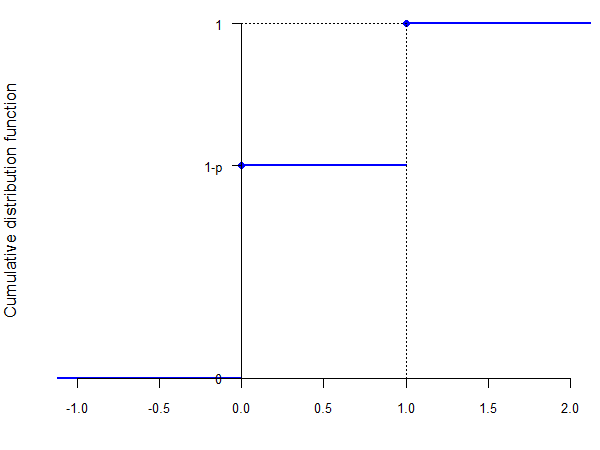
]

---
# The Bernoulli probability function

.center[
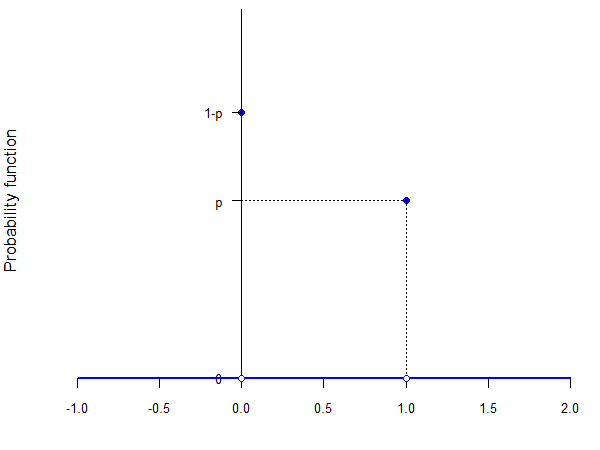
]

---
# The Bernoulli distribution

.pull-left-wide[
- It can be easily shown that:
$$E(X) = 1 \cdot p + 0 \cdot (1- p) = p$$
]

--

.pull-left-wide[
$$E(X^2) = 1^2 \cdot p + 0^2 \cdot (1- p) = p$$
]

--

.pull-left-wide[
$$Var(X) = E(X^2) - [E(X)]^2 = p - p^2 = p (1 - p)$$
]

--

.pull-left-wide[
.small123[*Note: In practice $p$ is unknown, so $Var(X) = p(1-p)$ must be estimated — this raises the question of how to construct a confidence interval for $p$ itself. The **Clopper–Pearson interval** is one exact solution to this problem. We will return to confidence intervals later in the course.*]
]

---
# .red[Practice 1: Bernoulli distribution]

.pull-left-wide[
Let $X \sim Bernoulli(0.3)$. Calculate $E(X)$, $Var(X)$, and $f(0)$ and $f(1)$.
]

```{r practice-1, eval=FALSE, include=FALSE}
# ANSWER:
# E(X) = p = 0.3
# Var(X) = p(1-p) = 0.3 * 0.7 = 0.21
# f(0) = 1 - p = 0.7
# f(1) = p = 0.3
```

---
class: inverse, middle, center
# The binomial distribution

---
# The binomial distribution — origins

.pull-left-wide[
- The binomial distribution was studied to count **wins in repeated gambles** — how many heads in $n$ coin tosses? (Once again by Bernoulli)

- Abraham de Moivre, in *The Doctrine of Chances* (1718), laid the foundations for working with the binomial; by 1733 he noticed that as $n$ grows, the binomial "looks like a bell" — the first glimpse of the **Central Limit Theorem**, more than a century before it was proved

- Today in economics: **credit risk** (how many of $n$ loans default?), **quality control sampling** (how many defective items in a batch?), **election polling** (how many of $n$ respondents support a candidate?)
]

.pull-right-narrow[

.small123[*Source: Wikimedia commons*]
]

.footnote[
.small123[*Sources: [Wikipedia — Binomial distribution](https://en.wikipedia.org/wiki/Binomial_distribution); [Wikipedia — Abraham de Moivre](https://en.wikipedia.org/wiki/Abraham_de_Moivre)*]
]

---
# The binomial distribution

.pull-left-wide[
- Consider now the following experiment: you toss a coin 5 times and you want to know the number of times "heads" showed

- The result of each coin toss is a Bernoulli variable, but what is the result of the experiment?
]

--

.pull-left-wide[
- The **binomial distribution** arises when you randomly draw a given number of times from a Bernoulli population, independently, and you want to count the number of successes
]

--

.pull-left-wide[
- The binomial distribution is characterized by two parameters:
  - the probability of success in each draw, $p$
  - the number of draws, $n$
]

---
# The binomial distribution

.pull-left-wide[
- Let $Y$ be the random variable that shows the number of successes in this experiment

> We say that $Y$ follows a **binomial distribution** with parameters $n$ and $p$:
> $$Y \sim Bin(n, p)$$
]

--

.pull-left-wide[
- By construction, $Y$ is a discrete random variable that can take $(n + 1)$ values: $0, 1, \ldots, n$
]

---
# The binomial distribution

.pull-left-wide[
- Let $X_i$ be the random variable representing the $i$-th draw

- Then each $X_i$ is a random variable following a Bernoulli distribution with parameter $p$
]

--

.pull-left-wide[
- Moreover, it is easy to see that:
$$Y = X_1 + X_2 + \ldots + X_n = \sum_{i=1}^n X_i$$

- Therefore, a binomial-distributed random variable is just a sum of independent Bernoulli-distributed random variables
]

---
# The binomial distribution

.pull-left-wide[
- We still need to find the probability function, i.e., $f(0), f(1), \ldots, f(n)$
]

--

.pull-left-wide[
- The probability of zero successes is the probability of failure in every draw:
$$f(0) = P(X_1 = 0, X_2 = 0, \ldots, X_n = 0) = (1-p)^n$$
]

--

.pull-left-wide[
- The probability of $n$ successes is the probability of success in every draw:
$$f(n) = P(X_1 = 1, X_2 = 1, \ldots, X_n = 1) = p^n$$
]

---
# The binomial distribution

.pull-left-wide[
- But what is the probability of two successes?

- Suppose the two successes occur in the first and the second draw:
$$P(X_1 = 1, X_2 = 1, X_3 = 0, \ldots, X_n = 0) = p^2 (1 - p)^{n - 2}$$

- But this is only *one way* of getting two successes --- they can occur in *any two* draws!
]

--

.pull-left-wide[
- Therefore, we need to figure out all the possible ways of obtaining two successes given that we are trying $n$ times
]

---
# The binomial coefficient

.pull-left-wide[
- Fortunately, there is a formula that gives us the number of combinations that result in two successes in $n$ tries

> The **binomial coefficient** gives the number of possible combinations of $k$ successes drawn from among $n$ elements:
> $${n \choose k} = \frac{n!}{k! (n-k)!}$$
> where $n! = 1 \cdot 2 \cdot \ldots \cdot n$.
]

--

.pull-left-wide[
- Therefore, the number of combinations of draws that result in two successes is:
$${n \choose 2} = \frac{n!}{2! (n-2)!} = \frac{n!}{2 \cdot (n-2)!}$$
]

--

.pull-left-wide[
- If $n=5$, this is equal to 10!
]

---
# The binomial distribution

.pull-left-wide[
- Therefore, the probability of obtaining two successes is the product of the number of scenarios that give two successes times the probability of one such scenario (which is the same for all):
$$f(2) = {n \choose 2} \cdot p^2 \cdot (1 - p)^{n - 2}$$
]

--

.pull-left-wide[
- In general, the probability function of $Y$ is given by:
$$f(k) = {n \choose k} \cdot p^k \cdot (1 - p)^{n - k}$$
]

---
# The binomial distribution

.pull-left-wide[
- Given that a binomial-distributed random variable is the sum of $n$ independent Bernoulli-distributed random variables, it can be easily shown that:
]

--

.pull-left-wide[
$$E(Y) = E \left( \sum_{i = 1}^n X_i \right) = n p$$
]

--

.pull-left-wide[
$$Var(Y) = Var \left( \sum_{i = 1}^n X_i \right) = n p (1 - p)$$
]

---
# The binomial distribution example

.pull-left-wide[
- Consider the experiment of tossing a coin 5 times. What is the probability that you get 3 heads?

$$Y \sim Bin(n, p) \implies Y \sim Bin(5, 0.5)$$
]

--

.pull-left-wide[
$$f(k) = {n \choose k} \cdot p^k \cdot (1 - p)^{n - k}$$
]

--

.pull-left-wide[
$$\implies f(3) = {5 \choose 3} \cdot 0.5^3 \cdot (1 - 0.5)^{5 - 3} = 0.3125$$
]

---
# The binomial distribution example

.pull-left-wide[
- What is the mean of $Y$?
$$E(Y) = np \implies 5 \cdot 0.5 = 2.5$$
]

--

.pull-left-wide[
- What is the variance of $Y$?
$$Var(Y) = np(1 - p) \implies 5 \cdot 0.5 \cdot (1 - 0.5) = 1.25$$
]


---
# .red[Practice 2: Binomial distribution]

.pull-left-wide[
You roll a fair die 10 times. Let $Y$ be the number of sixes.

(a) Write the distribution of $Y$.

(b) Calculate $f(2)$.

(c) Find $E(Y)$ and $Var(Y)$.
]

```{r practice-2, eval=FALSE, include=FALSE}
# ANSWER:
# (a) Y ~ Bin(10, 1/6)
# (b) f(2) = C(10,2) * (1/6)^2 * (5/6)^8 ≈ 0.291
# (c) E(Y) = 10 * (1/6) ≈ 1.67
#     Var(Y) = 10 * (1/6) * (5/6) ≈ 1.39
```

---
# .red[Raise your hand 1: Bernoulli vs. Binomial]

```{r ryh-bernoulli-binomial-timer, echo=FALSE}
library(countdown)
countdown(0, 20, top=TRUE)
```

.pull-left-wide[
**Q1.** A coin is flipped once. The outcome (heads/tails) follows which distribution?

- **A)** Binomial(1, 0.5) — one trial, two outcomes
- **B)** Bernoulli(0.5) — a single success/failure trial
- **C)** Both A and B — they are equivalent for $n=1$
]

--

.pull-left-wide[
**Q2.** $Y \sim Bin(n, p)$ and $X \sim Bernoulli(p)$. Which is true?

- **A)** $Y$ and $X$ are unrelated distributions
- **B)** $Y$ is the sum of $n$ independent copies of $X$
- **C)** $Y$ equals $X$ raised to the power $n$
]

```{r ryh-bernoulli-binomial, eval=FALSE, include=FALSE}
# ANSWERS
#
# Q1: Answer C — Bin(1, p) and Bernoulli(p) are equivalent for n=1
#   A: Technically correct but incomplete — Bernoulli(0.5) is the same thing
#   B: Technically correct but incomplete — Binomial(1, 0.5) is the same thing
#
# Q2: Answer B — a Binomial RV is the sum of n independent Bernoulli RVs
#   A: They are closely related; Binomial generalises Bernoulli to n trials
#   C: Raising to a power has nothing to do with summing independent variables
```

---
class: inverse, middle, center
# The hypergeometric distribution

---
# The hypergeometric distribution — origins

.pull-left-wide[
- The hypergeometric distribution arose in **card game mathematics** — computing exact hand probabilities when cards are dealt without replacement

- It is the distribution behind **auditing**: when an auditor samples invoices from a pile of 10,000, the number of errors found follows a hypergeometric distribution

- Also used in **capture-recapture**: ecologists tag $M$ fish, release them, then catch $n$ — the number of tagged fish recaptured follows $Hyp(n, M, N)$, allowing estimation of the total population $N$

- In economics: **labour market surveys** use the same logic to estimate participation rates from finite population samples
]

.pull-right-narrow[

.small123[*Source: Wikimedia commons*]
]

.footnote[
.small123[*Sources: [Wikipedia — Hypergeometric distribution](https://en.wikipedia.org/wiki/Hypergeometric_distribution); [Wikipedia — Mark and recapture](https://en.wikipedia.org/wiki/Mark_and_recapture)*]
]

---
# Sampling with or without replacement

.pull-left-wide[
- In the experiment generating the binomial distribution, each draw was independent

- Suppose you have an urn with blue balls (success) and red balls (failure), and each draw consists of extracting a ball from the urn

- In order for the draws to be independent, you need to put the extracted ball back (replace it) into the urn

- This is called *draw (sampling) with replacement* and it ensures that the probability of drawing a blue ball is the same in each draw

- Therefore, sampling with replacement yields a Binomial distribution
]

--

.pull-left-wide[
- But what happens if we don't replace the ball? The probability of extracting a blue ball changes between each subsequent draw, so the draws are *not* independent
]

---
# The hypergeometric distribution

.pull-left-wide[
- If we draw without replacement, the result is the **hypergeometric distribution**
]

--

.pull-left-wide[
- The hypergeometric distribution depends on 3 parameters:
  - the number of draws, $n$
  - the number of successes in the population, $M$
  - the number of elements in the population, $N$ ($N \geq n$)
]

---
# The hypergeometric distribution

.pull-left-wide[
- In our example:
  - $n$ is the number of times we extract a ball from the urn
  - $M$ is the number of blue balls
  - $N$ is the total number of balls in the urn

- Let $Y$ be the random variable representing the number of successes in this experiment

> We say that $Y$ follows a **hypergeometric distribution** with parameters $n$, $M$, and $N$:
> $$Y \sim Hyp(n, M, N)$$
]

---
# The hypergeometric distribution

.pull-left-wide[
- We can intuitively derive the probability function of the hypergeometric distribution as follows

- Suppose we have an urn with 10 balls ($N = 10$), of which 4 are blue ($M = 4$), and we extract 3 balls ($n = 3$)

- Let $A$ be the total number of combinations of balls that we can extract (i.e., all possible combinations of 3 balls out of the 10 balls in the urn)
]

--

.pull-left-wide[
- If we want to calculate the probability of extracting 2 blue balls, then we need:
  - to extract 2 out of the 4 blue balls
  - to extract one out of the 6 red balls
]

--

.pull-left-wide[
- Let $B$ be the total number of combinations of 2 balls that we can get of the 4 blue balls

- Let $C$ be the total number of combinations of one red ball that we can get out of the 6 red balls
]

---
# The hypergeometric distribution

.pull-left-wide[
- The total number of combinations of 2 blue balls and one red ball will be $B \cdot C$

- What is the probability of getting any one of these combinations? It is the ratio of $B \cdot C$ to the total number of draws, $A$
]

--

.pull-left-wide[
- Therefore, we only need to calculate $A$, $B$ and $C$, which we can do using the binomial coefficient:
$$A = {10 \choose 3} \qquad B = {4 \choose 2} \qquad C = {6 \choose 1}$$
]

--

.pull-left-wide[
- This gives us the probability of selecting two blue balls:
$$f(2) = \frac{{4 \choose 2} \cdot {6 \choose 1}}{{10 \choose 3}} = 0.3$$
]

---
# The hypergeometric cumulative distribution function ($n = 3$, $M = 4$, $N = 10$)

.center[
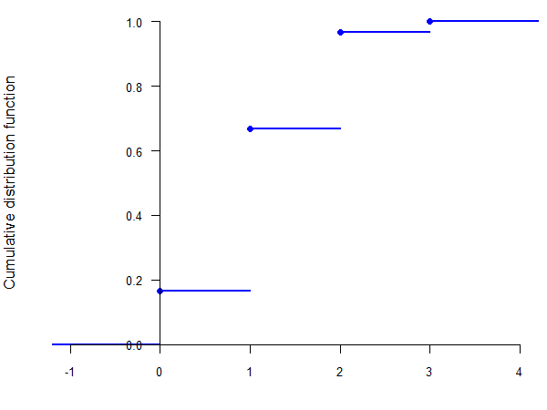
]

---
# The hypergeometric probability function ($n = 3$, $M = 4$, $N = 10$)

.center[
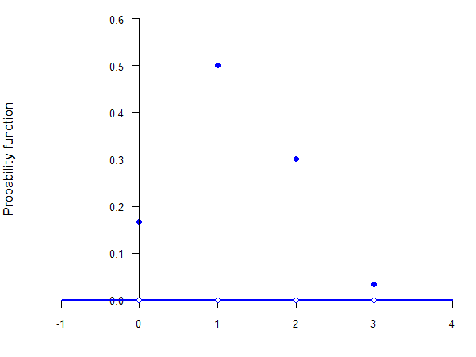
]

---
# The hypergeometric distribution

.pull-left-wide[
- In general, if $Y$ follows a hypergeometric distribution with parameters $n$, $M$ and $N$, its probability function is given by:
$$f(k) = \frac{{M \choose k} \cdot {N - M \choose n - k}}{{N \choose n}}$$
]

--

.pull-left-wide[
- We can also show (although not quite that easily) that the expected value and variance of $Y$ are:
$$E(Y) = \frac{nM}{N}$$
]

--

.pull-left-wide[
$$Var(Y) = n \cdot \frac{M}{N} \cdot \frac{N - M}{N} \cdot \frac{N - n}{N - 1}$$
]


---
# The hypergeometric distribution — limit to the binomial (1/2)

.pull-left-wide[
- **Setup:** let $p = M/N$ be the proportion of successes in the urn. Rewrite each binomial coefficient as a product of falling factors:
]
--

.pull-left-wide[

$$f(k) = {n \choose k} \cdot \underbrace{\frac{M}{N} \cdot \frac{M-1}{N-1} \cdots \frac{M-k+1}{N-k+1}}_{k \text{ factors}} \cdot \underbrace{\frac{N-M}{N-k} \cdots \frac{N-M-n+k+1}{N-n+1}}_{n-k \text{ factors}}$$

]

--

.pull-left-wide[

- This follows from expanding $\binom{M}{k} = \frac{M(M-1)\cdots(M-k+1)}{k!}$, and similarly for the other two coefficients, then collecting the $k!$ and $(n-k)!$ into $\binom{n}{k}$
]

---
# The hypergeometric distribution — limit to the binomial (2/2)

.pull-left-wide[
- As $N \to \infty$ with $p = M/N$ fixed, each factor in the **first group** satisfies:
$$\frac{M - j}{N - j} = \frac{pN - j}{N - j} \;\longrightarrow\; p$$
]

--

.pull-left-wide[
- Each factor in the **second group** satisfies:
$$\frac{N - M - j}{N - k - j} = \frac{(1-p)N - j}{N - k - j} \;\longrightarrow\; 1 - p$$
]

--
.pull-left-wide[
- Therefore, as $N \to \infty$:
$$f(k) \;\longrightarrow\; {n \choose k}\, p^k\,(1-p)^{n-k}$$
  which is the **binomial** PMF with parameters $n$ and $p = M/N$ $\blacksquare$
]

--
.pull-right-narrow[
- For this reason, when the population is large, we often assume sampling with replacement (binomial) as an approximation to sampling without replacement (hypergeometric).
]

---
# .red[Practice 3: Hypergeometric distribution]

.pull-left-wide[
An urn contains 15 balls, of which 6 are blue. You draw 4 balls without replacement. Let $Y$ be the number of blue balls drawn.

(a) Write the distribution.

(b) Calculate $f(2)$.

(c) Find $E(Y)$.
]

```{r practice-3, eval=FALSE, include=FALSE}
# ANSWER:
# (a) Y ~ Hyp(4, 6, 15)
# (b) f(2) = C(6,2) * C(9,2) / C(15,4) ≈ 0.360
# (c) E(Y) = n*M/N = 4*6/15 = 1.6
```

---
class: inverse, middle, center
# The Poisson distribution

---
# The Poisson distribution — origins

.pull-left-wide[
- **Siméon Denis Poisson** (1781–1840) derived this in 1837 to model **wrongful convictions** in French criminal courts — one of the earliest uses of statistics in law

- Ladislaus Bortkiewicz (1898) famously validated it with **deaths by horse kick** in the Prussian cavalry: 20 corps over 20 years — rare events predicted with striking accuracy

- Today: **insurance claims per month**, **customers arriving at a bank**, **trading orders per second**, **workplace accidents per year** — and the **gravity equation of trade** (Santos Silva & Tenreyro, 2006), where PPML is required to deal with zero trade flows.

- Any process where events arrive randomly and rarely in continuous time tends to be Poisson
]

.pull-right-narrow[

.small123[*Source: Wikimedia commons*]
]

.footnote[
.small123[*Sources: [Wikipedia — Poisson distribution](https://en.wikipedia.org/wiki/Poisson_distribution); [Wikipedia — Ladislaus Bortkiewicz](https://en.wikipedia.org/wiki/Ladislaus_Bortkiewicz)*]
]

---
# The Poisson distribution

.pull-left-wide[
- The binomial distribution describes sampling with replacement: how many successes you can observe if you have $n$ independent draws

- The hypergeometric distribution describes sampling without replacement: how many successes you can observe if you have $n$ draws without replacing the element drawn

- In both cases, the question is "how many successes in $n$ draws," irrespective of how long it takes to make the $n$ draws
]

--

.pull-left-wide[
- Alternatively, we could ask: "how many successes can we observe in a unit of time," irrespective of the number of draws needed
]

---
# The Poisson distribution

.pull-left-wide[
- For example, we could ask: "How many times did you go to the family doctor this year?"

- Let $Y$ be the random variable describing this experiment (so $Y$ is the number of times the person went to the doctor that year)

- We could divide the year into months, and ask for each month: "Did you go to the doctor this month?"

- This would be a Bernoulli-distributed random variable since it can only take 2 values ("yes" or "no")
]

--

.pull-left-wide[
- If the person went to the doctor at most once per month, $Y$ is the sum of 12 Bernoulli-distributed random variables

- If the probability that the individual goes to the doctor each month is independent from the other months, then $Y$ is a binomially-distributed random variable
]

---
# The Poisson distribution - informal derivation

.pull-left-wide[
- But it is possible that the person went to the doctor more than once per month, in which case $Y$ would not be equal to the number of times the individual went to the doctor
]

--

.pull-left-wide[
- We could make the time interval even shorter: week, day, hour, etc. $\Rightarrow$ $Y$ is the sum of 52, 365, or 8,760 Bernoulli-distributed random variables

- Still, there is a chance that the person went to the doctor more than once per week/day/hour
]

--

.pull-left-wide[
- Therefore, we want to make the time interval as small as possible ($\Delta~t~\rightarrow~0$) $\Rightarrow$ $Y$ is the sum of an infinity of Bernoulli-distributed random variables

- Which means that we cannot use the binomial distribution
]

---
# The Poisson distribution

.pull-left-wide[
- This distribution is called the **Poisson distribution**, and it gives the number of successes when we *continuously* draw (i.e., without interruption) from a Bernoulli population in a given period of time
]

--

.pull-left-wide[
- In order to obtain a Poisson distribution, the following three conditions need to be fulfilled:
  - the number of successes in each time interval must be independent from each other
  - the probability of observing a certain number of successes in any two time intervals of the same length has to be the same
  - the probability of more than one success in a really short time interval is zero
]

---
# The Poisson distribution

.pull-left-wide[
- Let $Y$ be the random variable representing the number of successes in this experiment, and let $\lambda$ (*lambda*) be the expected value of $Y$

> We say that $Y$ follows a **Poisson distribution** with parameter $\lambda$:
> $$Y \sim Poisson(\lambda)$$
]

--

.pull-left-wide[
- The probability function of $Y$ is given by:
$$f(k) = \frac{\lambda^k e^{-\lambda}}{k!}$$
]

--

.pull-left-wide[
- Note that $Y$ can take an infinity of values, because we can have an infinity of successes

- However, this is a *countable* infinite, meaning that $Y$ is again a discrete random variable
]

---
# The Poisson cumulative distribution function ($\lambda = 4$)

.center[
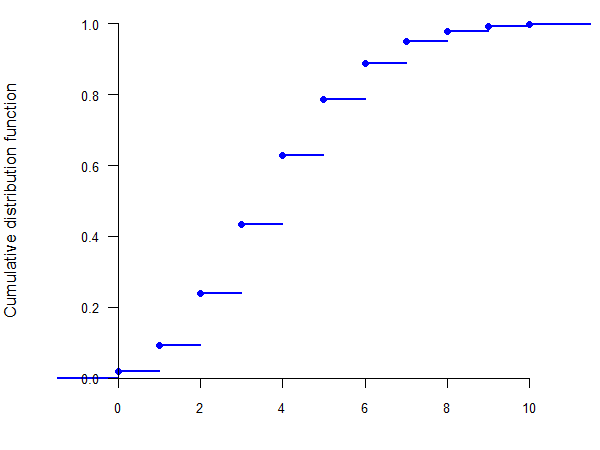
]

---
# The Poisson probability function ($\lambda = 4$)

.center[
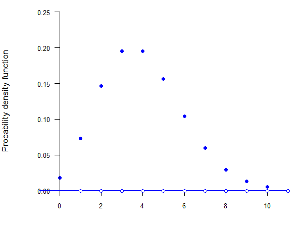
]

---
# The Poisson distribution

.pull-left-wide[
- It can be shown that the expected value and the variance of the Poisson distribution are both equal to $\lambda$:
$$E(Y) = \lambda$$

$$Var(Y) = \lambda$$
]

--

.pull-left-wide[
- This is not a particularly attractive feature of the distribution: if the expected number of events is high, then the variance is also high (which may not necessarily be the case in reality)

- Distributions such as the **negative binomial** generalise Poisson to allow $E(Y) \neq Var(Y)$
]

---
# .red[Practice 4: Poisson distribution]

.pull-left-wide[
A call centre receives on average 8 calls per hour. Let $Y \sim Poisson(8)$.

(a) Calculate $f(5)$.

(b) Find $E(Y)$ and $Var(Y)$.

(c) What is $f(0)$?

(d) What is F(Y > 10)?
]

```{r practice-4, eval=FALSE, include=FALSE}
# ANSWER:
# (a) f(5) = 8^5 * e^{-8} / 5! ≈ 0.0916
# (b) E(Y) = lambda = 8; Var(Y) = lambda = 8
# (c) f(0) = e^{-8} ≈ 0.000335
# (d) F(Y > 10) = 1 - F(Y <= 10)

# (d) in code:
1 - sum(dpois(0:10, lambda=8))
```

---
# The Poisson distribution — deriving $E(Y)$

.pull-left-wide[
- Start from the definition and drop the $k=0$ term (it contributes zero):
$$E(Y) = \sum_{k=0}^{\infty} k \cdot \frac{\lambda^k e^{-\lambda}}{k!} = \sum_{k=1}^{\infty} \frac{\lambda^k e^{-\lambda}}{(k-1)!}$$
]

--

.pull-left-wide[
- Factor out $\lambda$ and substitute $j = k - 1$:
$$= \lambda e^{-\lambda} \sum_{j=0}^{\infty} \frac{\lambda^j}{j!} = \lambda e^{-\lambda} \cdot e^{\lambda} = \boxed{\lambda}$$

where we used the Taylor series $e^{\lambda} = \sum_{j=0}^{\infty} \lambda^j / j!$
]


---
# The Poisson distribution — deriving $Var(Y)$

.pull-left-wide[
- Compute $E[Y(Y-1)]$ using the same shift trick (drop $k=0,1$, substitute $j = k-2$):
$$E[Y(Y-1)] = \sum_{k=2}^{\infty} \frac{\lambda^k e^{-\lambda}}{(k-2)!} = \lambda^2 e^{-\lambda} \sum_{j=0}^{\infty} \frac{\lambda^j}{j!} = \lambda^2$$
]

--

.pull-left-wide[
- Then $E(Y^2) = E[Y(Y-1)] + E(Y) = \lambda^2 + \lambda$, so:
$$Var(Y) = E(Y^2) - [E(Y)]^2 = \lambda^2 + \lambda - \lambda^2 = \boxed{\lambda}$$
]

--

.pull-left-wide[
- $E(Y) = Var(Y) = \lambda$ is not a particularly attractive feature: if the expected count is high, the variance is equally high — which may not hold in practice

- Distributions such as the **negative binomial** generalise Poisson to allow $E(Y) \neq Var(Y)$
]

---
# The Poisson distribution — limit of the Binomial (1/2)

.pull-left-wide[
- **Setup:** let $Y \sim Bin(n, p)$ with $\lambda = np$ fixed, so $p = \lambda/n$. The PMF is:
$$f(k) = \binom{n}{k} \left(\frac{\lambda}{n}\right)^k \left(1 - \frac{\lambda}{n}\right)^{n-k}$$
]

--

.pull-left-wide[
- Expand the binomial coefficient and collect powers of $n$:
$$f(k) = \frac{n(n-1)\cdots(n-k+1)}{k!} \cdot \frac{\lambda^k}{n^k} \cdot \left(1-\frac{\lambda}{n}\right)^n \cdot \left(1-\frac{\lambda}{n}\right)^{-k}$$
]

--

.pull-left-wide[
- As $n \to \infty$ with $\lambda$ fixed, three limits apply:
$$\frac{n(n-1)\cdots(n-k+1)}{n^k} \;\longrightarrow\; 1 \qquad \left(1-\frac{\lambda}{n}\right)^{-k} \;\longrightarrow\; 1$$
]

---
# The Poisson distribution — limit of the Binomial (2/2)

.pull-left-wide[
- The key limit uses the definition of $e$:
$$\left(1 - \frac{\lambda}{n}\right)^n \;\longrightarrow\; e^{-\lambda}$$
]

--

.pull-left-wide[
- Combining all three limits:
$$f(k) \;\longrightarrow\; \frac{\lambda^k\, e^{-\lambda}}{k!}$$
which is the **Poisson** PMF with parameter $\lambda$ $\blacksquare$
]


--

.pull-left-wide[
- **Interpretation:** the Poisson distribution is the limiting case of the Binomial as the number of trials becomes infinite and the probability of success in each trial becomes infinitesimally small, while the expected number of successes $\lambda = np$ remains fixed

- This is why the Poisson is used for counts of rare events over continuous time
]

---
class: inverse, middle, center
# The normal distribution

---
# The normal distribution — origins

.pull-left-wide[
- **Carl Friedrich Gauss** (1809) used it to model **measurement errors in astronomical observations** — hence the alternative name "Gaussian distribution"

- **Adolphe Quetelet** (1835) applied it to human height and weight, coining the concept of the *"average man"* — the first large-scale statistical description of a human population

- The **Central Limit Theorem** explains its ubiquity: sums of many independent random variables converge to normal regardless of the original distribution — which is why OLS estimators, sample means, and test statistics all tend to be approximately normal

- The **68–95–99.7 rule**: roughly 68%, 95%, and 99.7% of observations fall within 1, 2, and 3 standard deviations of the mean
]

.pull-right-narrow[

.small123[*Source: Wikimedia commons*]
]

.footnote[
.small123[*Sources: [Wikipedia — Normal distribution](https://en.wikipedia.org/wiki/Normal_distribution); [Wikipedia — Adolphe Quetelet](https://en.wikipedia.org/wiki/Adolphe_Quetelet)*]
]

---
# The normal distribution

.pull-left-wide[
- All the distributions until now were described by discrete random variables (hence, they were *discrete distributions*), whether finite or infinite

- Oftentimes we need to model a population that can take an uncountably infinite number of values

- One of the most popular *continuous distributions* (i.e., a distribution described by a continuous random variable) is the **normal distribution**

- .red[Arises as the limiting distribution of the sum of many independent random variables (Central Limit Theorem)]
]

--

.pull-right-narrow[
- It is most known as a "bell curve"

- It is a very useful distribution because many of the measures we will see later on follow a normal distribution
]

---
# The normal distribution

.pull-left-wide[
- The normal distribution is defined over the entire set of real numbers $\mathbb{R}$

- The **normal distribution** depends on two parameters:
  - its expected value, or mean, $\mu$
  - its variance, $\sigma^2$
]

--

.pull-left-wide[
> A continuous random variable $Y$ is **normally distributed** if:
> $$Y \sim \mathcal{N}(\mu, \sigma^2)$$
> with probability density function:
> $$f(y) = \frac{1}{\sigma \sqrt{2 \pi}} e^{-\frac{(y - \mu)^2}{2 \sigma^2}}$$
]


--
.pull-right-narrow[
The cumulative distribution function of a normal distribution is defined as:
$$F(y) = \int_{-\infty}^y f(t) dt$$
]

--

.pull-right-narrow[
- Unfortunately, there is no analytic form for the cumulative distribution function $F(y)$
]

---
# Normal cumulative distribution function ($\mu = 2$, $\sigma^2 = 3$)

.center[
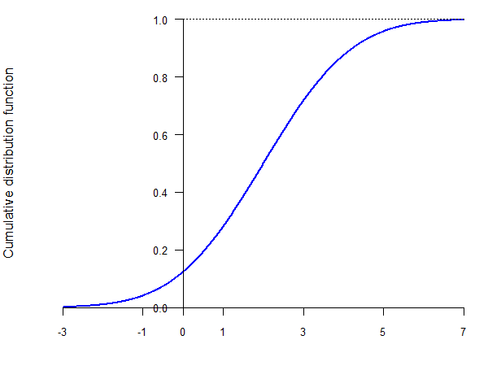
]

---
# The normal probability density function ($\mu = 2$, $\sigma^2 = 3$)

.center[
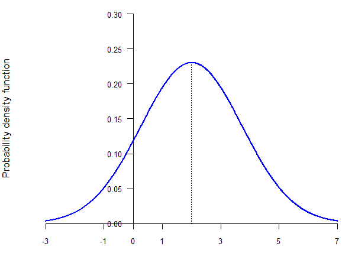
]

---
# The standard normal distribution

.pull-left-wide[
- Fortunately, we can calculate cumulative probabilities based on only one particular normal distribution

- The **standard normal distribution** is a normal distribution with mean 0 and variance 1: $\mathcal{N}(0, 1)$
]

--

.pull-left-wide[
- The standard normal distribution is so important that its cumulative distribution function and probability density functions have their own notation, $\Phi(\cdot)$ and $\phi(\cdot)$ (*phi*):
$$F(y) = P(Y \leq y) = \Phi(y)$$

$$f(y) = \phi(y) = \frac{1}{\sqrt{2 \pi}} e^{-\frac{y^2}{2}}$$
]

--

.pull-left-wide[
- The values of the cumulative distribution function of the standard normal distribution (calculated via computer simulations) are tabulated at the end of most statistics books
]

---
# The standard normal cumulative distribution function

.center[
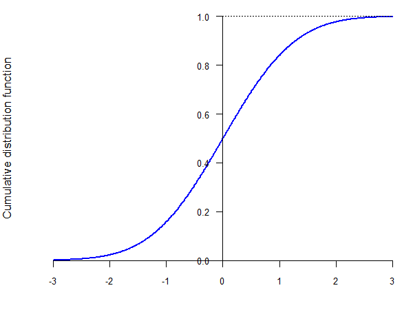
]

---
# The standard normal probability density function

.center[
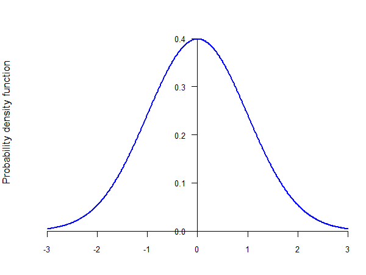
]

---
# Standardization of a random variable

.pull-left-wide[
> Let $Y$ be a random variable with expected value $E(Y) = \mu$ and variance $Var(Y) = \sigma^2$. The random variable is **standardized** by calculating:
> $$Z = \frac{Y - \mu}{\sigma}$$
> In the particular case when $Y \sim \mathcal{N}(\mu, \sigma^2)$, then $Z \sim \mathcal{N}(0, 1)$ is a standard normal random variable
]

---
# Properties of the normal distribution

.pull-left-wide[
- Let $Y \sim \mathcal{N}(\mu, \sigma^2)$. Then:

  - $P(Y \leq a) = F(a) = \Phi \left( \dfrac{a - \mu}{\sigma} \right)$
]

--

.pull-left-wide[
  - $P(Y \geq a) = 1 - F(a) = 1 - \Phi \left( \dfrac{a - \mu}{\sigma} \right)$
]

--

.pull-left-wide[
  - $P(b \leq Y \leq a) = F(a) - F(b) = \Phi \left( \dfrac{a - \mu}{\sigma} \right) - \Phi \left( \dfrac{b - \mu}{\sigma} \right)$
]

--

.pull-left-wide[
- In addition, note that the probability density function of a standard normal random variable is symmetric around zero

- This implies that:
$$\Phi(-a) = 1 - \Phi(a)$$
]

---
# The standard normal probability density function

.center[
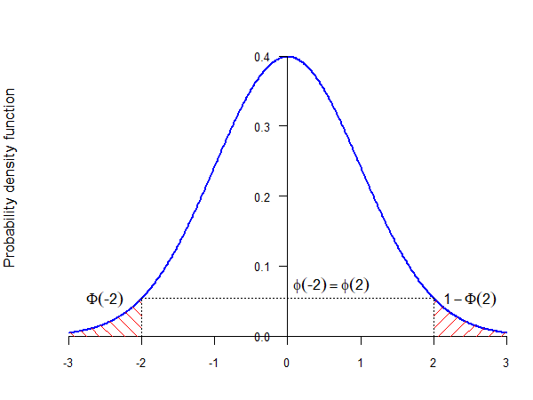
]


---
# .red[Practice 5: Normal distribution]

.pull-left-wide[
Let $Y \sim \mathcal{N}(5, 4)$ (so $\mu=5$, $\sigma^2=4$, $\sigma=2$).

(a) Standardise $Y$ to get $Z$.

(b) Find $F(7)$.

(c) Find $F(9) - F(3)$. What does this represent?

(d) Find the probability that  $Y > 7$.
]

```{r practice-5, eval=FALSE, include=FALSE}
# ANSWER:
# (a) Z = (Y - 5) / 2, so Z ~ N(0,1)
# (b) F(7) = Phi((7-5)/2) = Phi(1) ≈ 0.841
# (c) F(9) - F(3) = Phi((9-5)/2) - Phi((3-5)/2)
#                 = Phi(2) - Phi(-1)
#                 = Phi(2) - (1 - Phi(1))
#                 ≈ 0.977 - 0.159 = 0.818
# (d) F(inf) - F(7) = 1 - F(7) = 1 - Phi(1) ≈ 1 - 0.841 = 0.159
#     F(inf) = 1 because the normal distribution has all its mass on (-inf, inf)
#     This is the probability that Y > 7
```

---
# .red[Raise your hand 2: Properties of the normal distribution]

```{r ryh-normal-timer, echo=FALSE}
library(countdown)
countdown(0, 20, top=TRUE)
```

.pull-left-wide[
**Q1.** $Y \sim \mathcal{N}(3, 9)$. A student writes $P(Y = 3)$. What does this equal?

- **A)** 0.5 — the median equals the mean for a symmetric distribution
- **B)** 0 — continuous RVs have zero probability at any single point
- **C)** $\phi(0) \approx 0.399$ — the density evaluated at the mean
]

--

.pull-left-wide[
**Q2.** $Z \sim \mathcal{N}(0,1)$. You know $\Phi(1.5) = 0.933$. What is $P(Z < -1.5)$?

- **A)** Cannot be determined without tables
- **B)** $1 - 0.933 = 0.067$ — by symmetry of the standard normal
- **C)** $0.933$ — same as $P(Z < 1.5)$ by symmetry
]

```{r ryh-normal, eval=FALSE, include=FALSE}
# ANSWERS
#
# Q1: Answer B — for a continuous RV, P(Y = any single value) = 0 always
#   A: 0.5 is the CDF value F(3) = P(Y <= 3), not P(Y = 3)
#   C: phi(0) is the density at the mean — density is not a probability
#
# Q2: Answer B — by symmetry Phi(-a) = 1 - Phi(a), so P(Z < -1.5) = 1 - 0.933 = 0.067
#   A: Symmetry of the standard normal allows us to determine this directly
#   C: 0.933 = P(Z < 1.5), not P(Z < -1.5); confusing Phi(a) with Phi(-a)
```

---
# The normal distribution — deriving $E(Y) = \mu$

.pull-left-wide[
- Substitute $z = (y - \mu)/\sigma$ (so $y = \mu + \sigma z$, $dy = \sigma\, dz$) into the definition of $E(Y)$:

$$E(Y) = \int_{-\infty}^{\infty} (\mu + \sigma z) \cdot \underbrace{\frac{1}{\sqrt{2\pi}} e^{-z^2/2}}_{\phi(z)}\, dz$$
]

--

.pull-left-wide[
- Split into two integrals:

$$= \mu \underbrace{\int_{-\infty}^{\infty} \phi(z)\, dz}_{=\,1} \;+\; \sigma \underbrace{\int_{-\infty}^{\infty} z\,\phi(z)\, dz}_{=\,0}= \boxed{\mu}$$

- The second integral is zero because $z\,\phi(z)$ is an **odd function** — it is symmetric about zero with opposite signs, so the positive and negative halves cancel exactly
]

---
# The normal distribution — deriving $Var(Y) = \sigma^2$

.pull-left-wide[
- Using the same substitution $z = (y-\mu)/\sigma$:

$$Var(Y) = E[(Y-\mu)^2] = \sigma^2 \int_{-\infty}^{\infty} z^2\, \phi(z)\, dz$$
]

--

.pull-left-wide[
- Integrate by parts with $u = z$ and $dv = z\,e^{-z^2/2}\,dz$ (so $v = -e^{-z^2/2}$):

$$\int_{-\infty}^{\infty} z^2\, e^{-z^2/2}\,dz = \Big[-z\,e^{-z^2/2}\Big]_{-\infty}^{\infty} + \int_{-\infty}^{\infty} e^{-z^2/2}\,dz = 0 + \sqrt{2\pi}$$
]

--

.pull-left-wide[
- Dividing by $\sqrt{2\pi}$: $\displaystyle\int_{-\infty}^{\infty} z^2\,\phi(z)\,dz = 1$, and therefore:

$$Var(Y) = \sigma^2 \cdot 1 = \boxed{\sigma^2}$$
]


---
class: inverse, middle, center
# The multinomial distribution

---
# The multinomial distribution — origins

.pull-left-wide[
- The multinomial distribution is the natural model for **multi-candidate elections**, **consumer choice across brands**, and **categorical survey responses**

- In econometrics, it underpins **discrete choice models** — which product does a consumer buy? Which transport mode? Which occupation? — for which **Daniel McFadden** was awarded the **Nobel Prize in Economics in 2000**

- Also used in **text analysis and machine learning**: a document is modelled as $n$ words drawn from a vocabulary, each word following a multinomial distribution across topics

- Whenever you have counts across more than two categories from $n$ independent draws, the multinomial is the right model
]

.pull-right-narrow[

.small123[*Source: Wikimedia commons*]
]

.footnote[
.small123[*Sources: [Wikipedia — Multinomial distribution](https://en.wikipedia.org/wiki/Multinomial_distribution); [Wikipedia — Daniel McFadden](https://en.wikipedia.org/wiki/Daniel_McFadden)*]
]

---
# The multinomial distribution

.pull-left-wide[
- The binomial distribution described the following experiment: we draw $n$ times from a population where we can have only two outcomes, and we count the number of "successes"

- For example, suppose we ask people if they will vote in the next election

- They could answer "yes", "no" or "not sure"
]

--

.pull-left-wide[
- Sometimes, the population can have more than two outcomes

- If we are interested in the number of answers for all categories, then we cannot use the binomial distribution anymore
]

---
# The multinomial distribution

.pull-left-wide[
- What we can do, however, is "split" the problem into smaller problems

- We can analyze each type of outcome separately:
  - let $X$ be a random variable that indicates whether the individual answered "yes" or not (so we bunch "no" and "not sure" together)
  - then $X$ follows a Bernoulli distribution
  - let $Y_1$ be the random variable that counts the number of "yes" answers
]

--

.pull-left-wide[
- We can define in a similar way $Y_2$ and $Y_3$ as two random variables representing the number of "no" answers and of "not sure" answers, respectively
]

---
# The multinomial distribution

.pull-left-wide[
- If we were interested only in $Y_1$, or only in $Y_2$, or only in $Y_3$, then we could use the binomial distribution for each of them separately

- If, however, we are interested in $Y_1$, $Y_2$ and $Y_3$ at the same time, then we need a *joint* distribution
]

--

.pull-left-wide[
- The joint distribution of $(Y_1, Y_2, Y_3)$ is called a **multinomial distribution**

- The multinomial distribution is a generalization of the binomial distribution to situations when we have more than two outcomes
]

---
# The multinomial distribution

.pull-left-wide[
- In order to calculate the probability function of $(Y_1, Y_2, Y_3)$, we apply a similar strategy to before

- Suppose we ask 6 people and that:
  - $p_1 =$ probability of getting a "yes" answer
  - $p_2 =$ probability of getting a "no" answer
  - $p_3 = 1 - p_1 - p_2 =$ the probability of a "not sure" answer
]

--

.pull-left-wide[
- If the first three people answer "yes," the next two people answer "no," and the last person answers "not sure," we have:
$$p_1 \cdot p_1 \cdot p_1 \cdot p_2 \cdot p_2 \cdot p_3 = p_1^3 \cdot p_2^2 \cdot p_3$$
]

--

.pull-left-wide[
- But this is just one of the potential combinations of answers that give us three "yes," two "no" and one "not sure"
]

---
# The multinomial distribution

.pull-left-wide[
- What is the total number of combinations of answers that give us three "yes," two "no" and one "not sure"?

- It is the product of:
  - the total number of combinations that give us 3 "yes" answers out of 6 total answers: ${6 \choose 3}$
  - the total number of combinations that give us 2 "no" answers out of the remaining $6 - 3 = 3$ answers: ${3 \choose 2}$
  - the total number of combinations that give us one "not sure" answer out of the remaining $3 - 2 = 1$ answers: ${1 \choose 1}$

- The total number of combinations is:
$${6 \choose 3} \cdot {3 \choose 2} \cdot {1 \choose 1} = \frac{6!}{3! \cdot 2! \cdot 1!} = 60$$
]

--

.pull-left-wide[
- Thus, the probability of three "yes," two "no" and one "not sure" is:
$$f(3, 2, 1) = 60 \cdot p_1^3 \cdot p_2^2 \cdot p_3$$
]

---
# The multinomial distribution

.pull-left-wide[
- We can generalize this to the following experiment:
  - $m$ possible outcomes
  - probability of outcome 1 is $p_1$, of outcome 2 is $p_2$, ..., of outcome $m$ is $p_m$
  - $n$ independent draws (with replacement)
  - $Y_1$ is the number of times outcome 1 is drawn, $Y_2$ is the number of times outcome 2 is drawn, ..., $Y_m$ is the number of times outcome $m$ is drawn
]

--

.pull-left-wide[
> We say that $(Y_1, Y_2, \ldots, Y_m)$ follows a **multinomial distribution**:
> $$(Y_1, Y_2, \ldots, Y_m) \sim M(n, p_1, p_2, \ldots, p_m)$$
]

---
# The multinomial distribution

.pull-left-wide[
- The total number of combinations that give us $k_1$ of the first outcome, $k_2$ of the second, ..., $k_m$ of the $m$-th outcome is given by the **multinomial coefficient**:
$${n \choose {k_1, k_2, \ldots, k_m}} = \frac{n!}{k_1! \cdot k_2! \cdot \ldots \cdot k_m!}$$
]

--

.pull-left-wide[
- Therefore, the probability function is:
$$f(k_1, k_2, \ldots, k_m) = {n \choose {k_1, k_2, \ldots, k_m}} \cdot p_1^{k_1} \cdot p_2^{k_2} \cdot \ldots \cdot p_m^{k_m}$$
]

--

.pull-left-wide[
- Since this is a joint distribution, we can calculate the mean and variance for each individual random variable:
  - $E(Y_i) = n p_i$
  - $Var(Y_i) = n p_i (1 - p_i)$

- This should not be entirely surprising, since each $Y_i$ is a binomial random variable with parameters $n$ and $p_i$
]

---
# .red[Practice 6: Multinomial distribution]

.pull-left-wide[
You ask 10 people which transport mode they prefer: car (probability 0.5), bicycle (0.3), or public transport (0.2). Let $(Y_1, Y_2, Y_3) \sim M(10, 0.5, 0.3, 0.2)$.

(a) What is $f(5, 3, 2)$?

(b) Find $E(Y_1)$ and $Var(Y_2)$.
]

```{r practice-6, eval=FALSE, include=FALSE}
# ANSWER:
# (a) f(5,3,2) = 10!/(5!*3!*2!) * 0.5^5 * 0.3^3 * 0.2^2 ≈ 0.0851
# (b) E(Y1) = n*p1 = 10*0.5 = 5
#     Var(Y2) = n*p2*(1-p2) = 10*0.3*0.7 = 2.1
```

---
# Distribution cheat sheet

.small123[
| Distribution | Notation | Type | $E(Y)$ | $Var(Y)$ | Typical use |
|:---|:---|:---:|:---:|:---:|:---|
| Bernoulli | $Ber(p)$ | Discrete | $p$ | $p(1-p)$ | Single binary outcome |
| Binomial | $Bin(n,p)$ | Discrete | $np$ | $np(1-p)$ | Count successes in $n$ trials |
| Hypergeometric | $Hyp(n,M,N)$ | Discrete | $\tfrac{nM}{N}$ | $n\tfrac{M}{N}\tfrac{N-M}{N}\tfrac{N-n}{N-1}$ | Sampling without replacement |
| Poisson | $Pois(\lambda)$ | Discrete | $\lambda$ | $\lambda$ | Count rare events over time |
| Normal | $\mathcal{N}(\mu,\sigma^2)$ | Continuous | $\mu$ | $\sigma^2$ | Symmetric continuous data |
| Multinomial | $M(n,p_1,\ldots,p_m)$ | Discrete | $np_i$ | $np_i(1-p_i)$ | Counts across $m$ categories |

**Key relationships:**
- $Bin(1, p) = Ber(p)$ — Binomial with one trial is Bernoulli
- $Hyp(n, M, N) \approx Bin(n, M/N)$ — hypergeometric approaches binomial when $N$ is large
- $Bin(n, p) \approx Pois(np)$ — binomial approaches Poisson when $n$ is large and $p$ is small
- $Bin(n, p) \approx \mathcal{N}(np,\, np(1-p))$ — by the Central Limit Theorem when $n$ is large
]

---
# Honest study suggestion

.pull-left-wide[
Statistics introduces many distributions. It is easy to lose track of them.

**A simple habit that works:** for every distribution you encounter — in lectures, exercises, or your own reading — write a short personal note containing:

- **What it models:** one sentence on the real-world situation it describes
- **Parameters:** what they control and what they mean
- **$E(Y)$ and $Var(Y)$:** the formulas, not just the symbols
- **Key relationships:** how it connects to distributions you already know
- **One concrete example:** from economics, your field, or everyday life

This is not about memorising — it is about building a mental map. The cheat sheet on the previous slide is the skeleton; your notes are the flesh.
]

---
# Before next time

.pull-left[
- Next time: Stochastic processes $\rightarrow$ Chapter 7
]

.pull-right[

]
