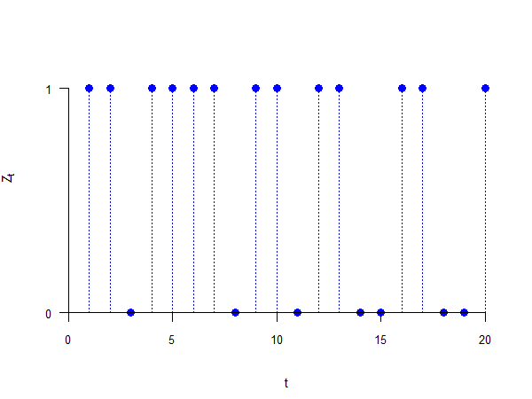
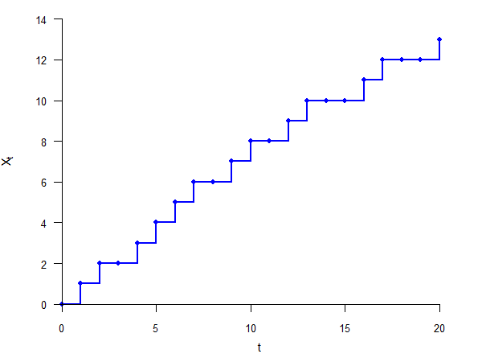
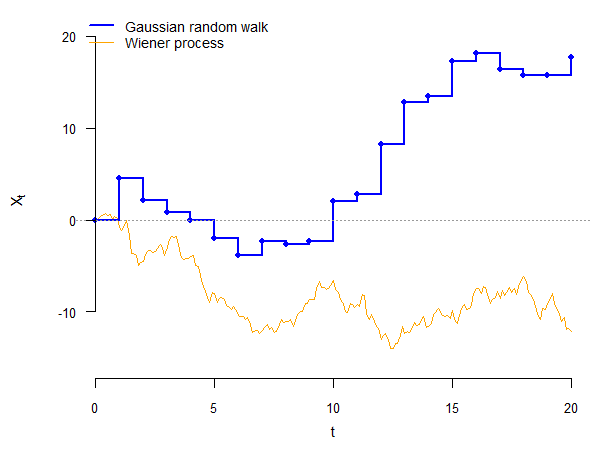

---
output:
  xaringan::moon_reader:
    seal: false
    includes:
      after_body: insert-logo.html
    self_contained: false
    lib_dir: libs
    nature:
      highlightStyle: github
      highlightLines: true
      countIncrementalSlides: false
      ratio: '16:9'
editor_options:
  chunk_output_type: console
---
class: center, inverse, middle

```{r xaringan-panelset, echo=FALSE}
xaringanExtra::use_panelset()
```

```{r xaringan-tile-view, echo=FALSE}
xaringanExtra::use_tile_view()
```

```{r xaringanExtra, echo = FALSE}
xaringanExtra::use_progress_bar(color = "#808080", location = "top")
```

```{css echo=FALSE}
.pull-left {
  float: left;
  width: 44%;
}
.pull-right {
  float: right;
  width: 44%;
}
.pull-right ~ p {
  clear: both;
}


.pull-left-wide {
  float: left;
  width: 66%;
}
.pull-right-wide {
  float: right;
  width: 66%;
}
.pull-right-wide ~ p {
  clear: both;
}

.pull-left-narrow {
  float: left;
  width: 30%;
}
.pull-right-narrow {
  float: right;
  width: 30%;
}

.tiny123 {
  font-size: 0.40em;
}

.small123 {
  font-size: 0.80em;
}

.large123 {
  font-size: 2em;
}

.red {
  color: red
}

.orange {
  color: orange
}

.green {
  color: green
}
```


# Statistics
## Stochastic processes
### (Chapter 7)

### Seetha Menon,<br>Department of Economics<br>University of Southern Denmark

### Email: [smr@sam.sdu.dk](mailto:smr@sam.sdu.dk)

### Updated `r Sys.Date()`


---
class: inverse, middle, center
# Stochastic processes

---
# Time dimension

--

- Often, uncertain situations involve a time dimension (e.g., the evolution of a stock price over time)

--

- Let us consider a simple example: every morning, a couple has to decide who will take out the trash

--

- To make this fair, they toss a coin every morning

--

- Let $Z_t$ be the random variable indicating who took the trash out on the $t$-th morning:
$$Z_t = \begin{cases} 0, & \text{if husband takes the trash out on morning } t \\ 1, & \text{if wife takes the trash out on morning } t \end{cases}$$

--

- We may be interested in several aspects of this:
  - how many times did the wife take the trash out in a year, on average?
  - what is the probability that either of them takes the trash out for a whole week in a row?
  - how many days of "break" can they expect to have between days when they take out the trash?

---
# Stochastic process

--

> A **stochastic process** $\{Z_t, t \in T\}$ is a collection of random variables $Z_t$ indexed by time $t$, which belongs to the index set $T$.
>
> The outcome of a stochastic process, $\{z_t, t \in T\}$, is called a **realization** or a **sample path**.
>
> The outcome $z_t$ of one of the random variables $Z_t$ in a stochastic process is called an **incident**.

--

- Like random variables, stochastic processes are *functions* that assign a random variable $Z_t$ to a point in time $t$

--

- Same as with random variables, stochastic processes can be of two types:
  - in *discrete time*, if the index set $T$ is countable (finite or infinite)
  - in *continuous time*, if the index set $T$ is uncountable (infinite)

---
# Stochastic process

--

- Suppose that we follow our couple for a week, so $T = \{ 1, 2, \ldots, 7 \}$

--

- A realization may be:
$$z = \{1, 0, 0, 1, 1, 1, 0 \}$$

--

- That is, $z_1 = 1$, $z_2 = 0$, $z_3 = 0$, ..., $z_7 = 0$

--

- Same as we could assign probabilities to random variables, we can also assign probabilities to stochastic processes

--

- In this case, it is the probability of a certain realization (sample path)

--

- In our example, if the coin tosses are independent, the probability of each sample path is $0.5^7 = 0.0078$ (because there are $2^7$ possible paths, all with equal probability)


---
class: inverse, middle, center
# Transformations of a stochastic process

---
# Partial sum

--

- One advantage to working with stochastic processes is that we can use them to model real-life events

--

- Transformations make our job even easier

--

- For example, suppose you want to see how many times the wife took out the trash until a certain date

--

- We can define the random variable $X_t$ as:
$$X_t = Z_1 + Z_2 + \ldots + Z_t = \sum_{s=1}^t Z_s$$

--

- The stochastic process $\{ X_t, t \in T \}$ is a **partial sum transformation** of the initial stochastic process $\{Z_t, t \in T\}$

--

- In our example, we would have $x = \{ 1, 1, 1, 2, 3, 4, 4 \}$

---
# Other transformations

--

- Another useful transformation is the **first-difference**, which shows the change in a stochastic process from one period to the next (e.g., change in income)

--

- This can be done in absolute terms:
$$X_t = \Delta Z_t = Z_t - Z_{t-1}$$

--

- It can also be done in relative terms (e.g., inflation rate):
$$X_t = \frac{Z_t - Z_{t-1}}{Z_{t-1}}$$

--

- Note that in both of these cases, the transformed stochastic process is "shorter" by one period ($t$ starts at 2!)


---
class: inverse, middle, center
# States and waiting times

---
# States

--

- One aspect of a stochastic process that is particularly interesting is its state at a certain point in time

--

- The **state** of a stochastic process at time $t$ is given by the random variable representing the value taken at time $t$

--

- In our example, consider the partial sum transformation $\{ X_t, t \in T \}$

--

- The state of this process at time $t_0 = 2$ is simply $X_2$

---
# State distribution

--

- Note that $X_2$ (the sum of $Z_1$ and $Z_2$) can take three values: 0, 1, or 2, with probabilities:
$$P(X_2 = 0) = P(Z_1 = 0, Z_2 = 0) = 0.25$$
$$P(X_2 = 1) = P(Z_1 = 0, Z_2 = 1) + P(Z_1 = 1, Z_2 = 0) = 0.5$$
$$P(X_2 = 2) = P(Z_1 = 1, Z_2 = 1) = 0.25$$

--

- The distribution of $X_2$ is called the **state distribution** of the stochastic process at time 2

--

- This also shows the usefulness of stochastic processes: instead of directly specifying the distribution of the number of times the wife took out the trash, we can use a stochastic process

--

- This approach is more intuitive and often easier

---
# Waiting time

--

- Another interesting aspect of a stochastic process is the **waiting time**, i.e., the time it will take until a particular state is reached (or passed) for the first time

--

- For example, we may want to know how long it takes until the wife takes the trash out twice

--

- Since the stochastic process consists of random variables, the time until one particular state is realized is also random

--

- Let $Y_2$ be the random variable indicating how long it takes until the wife takes the trash out twice

---
# Waiting-time distribution

--

- The distribution of the random variable $Y_2$ is called a **waiting-time distribution**

--

- In our example, $Y_2$ can take the values 2, 3, ..., 7

--

- We can then calculate probabilities for these values. For example:
  - $Y_2 = 2$ if $Z_1 = 1$ and $Z_2 = 1$, which can happen with probability 0.25
  - $Y_2 = 3$ if:
    - $Z_1 = 1$, $Z_2 = 0$, and $Z_3 = 1$, which occurs with probability 0.125
    - $Z_1 = 0$, $Z_2 = 1$, and $Z_3 = 1$, which occurs with probability 0.125
  - $\Rightarrow$ $P(Y_2 = 3) = 2 \cdot 0.125 = 0.25$

--

- Note that the stochastic process may not be "long enough" for us to observe the desired value

--

- In this case, we can calculate $P(Y_2 > 7)$ and/or $P(Y_2 \geq 7)$

---
# Types of processes

--

.small123[
| | Discrete State | Continuous State |
|---|:---:|:---:|
| **Discrete Time** | Bernoulli, Binomial | Gaussian random walk |
| **Continuous Time** | Poisson | Wiener |
]


---
class: inverse, middle, center
# The Bernoulli process and the binomial process

---
# The Bernoulli process

--

> A **Bernoulli process** $\{Z_t, t \in T \}$ satisfies the following conditions:
>
> 1. Time: $T = \{ 1, 2, 3, \ldots \}$
>
> 2. State: $Z_t \in \{ 0, 1 \}$ for all $t$
>
> 3. Distribution of outcomes: each state follows a Bernoulli distribution with parameter $p$
>
> 4. Relationship between outcomes: each state is independent of the other states: $Z_t$ and $Z_s$ are independent for all $s \not= t$

---
# The Bernoulli process

--

- The Bernoulli process is characterized by the fact that, at each point in time, an incident can either occur ($Z_t = 1$) or not ($Z_t = 0$)

--

- This means that an element from a Bernoulli population is drawn at each point in time

--

- According to the fourth assumption, each draw is independent

--

- Our previous example (taking the trash out) is a Bernoulli process with $p = 0.5$

---
# Example of path of a Bernoulli process ($p = 0.5$)

.center[

]

---
# The binomial process

--

- Sometimes, what is of interest is the number of events in a Bernoulli process

--

- As before, we can obtain this using the partial sum transformation:
$$X_t = \sum_{s=1}^t Z_s$$

--

- This is a sum of independent Bernoulli-distributed random variables, which yields a binomial process

---
# The binomial process

--

> A **binomial process** $\{X_t, t \in T \}$ satisfies the following conditions:
>
> 1. Time: $T = \{ 1, 2, 3, \ldots \}$
>
> 2. State: $X_t \in \{ 0, 1, \ldots, t \}$ for all $t$
>
> 3. Distribution of outcomes: states are such that $(X_{t+n} - X_t)$ follows a binomial distribution with parameters $n$ and $p$, for all $n$ and $t$, and $X_0 = 0$
>
> 4. Relationship between outcomes: $(X_{t_1} - X_{t_2})$ and $(X_{t_3} - X_{t_4})$ are independent, for all $t_1 > t_2 > t_3 > t_4$

---
# Example of path of a binomial process ($p = 0.5$)

.center[

]

---
# The binomial process

--

- With a binomial process, the probability of a certain number of events in a time interval depends on the *length* of the time interval and not on *when* this time interval occurs

--

- In addition, the number of events in a time interval is independent of the number of events in any other non-overlapping time interval

--

- A binomial process is a **counting process**: it models the number of events that occurred up to a certain point in time

---
# State distribution of a binomial process

--

- Using the definition of the binomial process, we can easily see that:
$$X_t - X_0 = X_t \sim Bin(t, p)$$

--

- This gives us the state distribution of the binomial process

--

- We can therefore determine the probability function of $X_t$:
$$f(x) = {t \choose x} \cdot p^x \cdot (1 - p)^{t-x}$$

--

- The expected value and variance of $X_t$ also come from the binomial distribution:
$$E(X_t) = t \cdot p$$
$$Var(X_t) = t \cdot p \cdot (1 - p)$$

---
# Waiting-time distribution of a binomial process

--

- As before, let $Y_{x_0}$ be the time until $X_t = x_0$ for the first time

--

- The distribution of $Y_{x_0}$ in the case of a binomial process is also a very common distribution, called the **negative binomial distribution**:
$$Y_{x_0} \sim Negbin(x_0, p)$$

--

- The probability function of $Y_{x_0}$ is:
$$f(y) = {{y - 1} \choose {x_0 - 1}} \cdot p^{x_0} \cdot (1 - p)^{y - x_0}$$

--

- The expected value and variance of $Y_{x_0}$ are:
$$E(Y_{x_0}) = \frac{x_0}{p} \qquad Var(Y_{x_0}) = x_0 \cdot \frac{1 - p}{p^2}$$

---
# Waiting-time distribution of a binomial process

--

- We can also ask: what is the time until the first event occurs?

--

- This is a negative binomial distribution with parameters 1 and $p$

--

- This distribution is also very useful and has its own name: the **geometric distribution**
$$Y_{1} \sim Negbin(1, p) = Geo(p)$$

--

- The probability function for the geometric distribution is:
$$f(y) = p \cdot (1 - p)^{y - 1}$$

--

- This distribution also represents the distribution of the waiting time until the next event occurs


---
class: inverse, middle, center
# The Poisson process

---
# The Poisson process

--

> A **Poisson process** $\{X_t, t \in T \}$ satisfies the following conditions:
>
> 1. Time: $T = (0, \infty)$
>
> 2. State: $X_t \in \{ 0, 1, 2, \ldots \}$ for all $t$
>
> 3. Distribution of outcomes: states are such that $(X_{t + \tau} - X_t)$ follows a Poisson distribution with parameter $(\lambda \cdot \tau)$, for all $\tau$ and $t$, and $X_0 = 0$
>
> 4. Relationship between outcomes: $(X_{t_1} - X_{t_2})$ and $(X_{t_3} - X_{t_4})$ are independent, for all $t_1 > t_2 > t_3 > t_4$

---
# The Poisson process

--

- The Poisson process gives the number of events that have occurred up to a given point in time

--

- Therefore, it is also a counting process, but in continuous time

--

- Note that the number of events occurring in any time interval of length $\tau$ follows a Poisson distribution with parameter $\lambda \cdot \tau$, meaning that only the *length* of the interval matters, not *when* the time interval starts

---
# State distribution of a Poisson process

--

- Using the definition of the Poisson process, we can easily see that:
$$X_t - X_0 = X_t \sim Poisson(\lambda \cdot t)$$

--

- This gives us the state distribution of the Poisson process as a Poisson distribution

--

- We can therefore determine the probability function of $X_t$:
$$f(x) = \frac{(\lambda \cdot t)^x}{x!} \cdot e^{-(\lambda \cdot t)}$$

--

- The expected value and variance of $X_t$ also come from the Poisson distribution:
$$E(X_t) = \lambda \cdot t \qquad Var(X_t) = \lambda \cdot t$$

---
# Probability updating in a Poisson process

--

- If we know that $b$ events occurred until time $s$, we can update the probability that $x$ events will occur until time $t$:
$$P(X_t = x | X_s = b) = P(X_t - X_s = x - b)$$

--

- But we know that $X_t - X_s$ follows a Poisson distribution with parameter $\lambda \cdot (t - s)$

--

- Therefore, the probability that $x$ events will occur until time $t$ becomes:
$$P(X_t = x | X_s = b) = \frac{[\lambda \cdot (t - s)]^{x - b}}{(x - b)!} \cdot e^{-[\lambda \cdot (t-s)]}$$

---
# Waiting-time distribution of a Poisson process

--

- As before, let $Y_{x_0}$ be the time until $X_t = x_0$ for the first time

--

- The distribution of $Y_{x_0}$ in the case of a Poisson process is called the **Erlang distribution**:
$$Y_{x_0} \sim Erlang(\lambda, x_0)$$

--

- The probability function of $Y_{x_0}$ is:
$$f(y) = \frac{\lambda^{x_0} \cdot y^{x_0 - 1}}{(x_0 - 1)!} \cdot e^{-\lambda \cdot y}$$

--

- The expected value and variance of $Y_{x_0}$ are:
$$E(Y_{x_0}) = \frac{x_0}{\lambda} \qquad Var(Y_{x_0}) = \frac{x_0}{\lambda^2}$$

---
# Waiting-time distribution of a Poisson process

--

- We can also ask: what is the time until the first (or the next) event occurs?

--

- This is an Erlang distribution with parameters $\lambda$ and 1

--

- This distribution is also quite useful and has its own name: the **exponential distribution**
$$Y_{1} \sim Erlang(1, \lambda) = Exp(\lambda)$$

--

- The probability function for the exponential distribution is:
$$f(y) = \lambda \cdot e^{-\lambda \cdot y}$$


---
class: inverse, middle, center
# The Gaussian random walk

---
# The Gaussian random walk

--

> A **Gaussian random walk** $\{X_t, t \in T \}$ satisfies the following conditions:
>
> 1. Time: $T = \{ 1, 2, 3, \ldots \}$
>
> 2. State: $X_t \in (-\infty, \infty)$ for all $t$
>
> 3. Distribution of outcomes: states are such that $(X_{t + n} - X_t)$ follows a Normal distribution with mean $n \cdot \mu$ and variance $n \cdot \sigma^2$, for all $n$ and $t$; and $X_0 = 0$
>
> 4. Relationship between outcomes: $(X_{t_1} - X_{t_2})$ and $(X_{t_3} - X_{t_4})$ are independent, for all $t_1 > t_2 > t_3 > t_4$

--

- $\mu$ is called the *drift* parameter and $\sigma^2$ the *diffusion* parameter

---
# The Gaussian random walk

--

- A random walk is a partial sum of independent and identically distributed random variables (e.g., the binomial process is a random walk)

--

- The Gaussian random walk is a continuous-state discrete-time process

--

- It represents the "drunken walk:" each step can occur in a random direction, either forwards or backwards

--

- The change in this process, at any point in time, is normally distributed with mean and variance that depend on the *length* of the time interval but not on *when* the interval starts

---
# State distribution of a Gaussian random walk

--

- Using the definition of the Gaussian random walk, we can easily see that:
$$X_t - X_0 = X_t \sim \mathcal{N}(t \cdot \mu, t \cdot \sigma^2)$$

--

- This gives us the state distribution of the Gaussian random walk as a normal distribution

--

- We can therefore determine the probability density function of $X_t$:
$$f(x) = \frac{1}{ \sigma \cdot \sqrt{2 \cdot \pi \cdot t }} \cdot e^{- \frac{(x - t \cdot \mu)^2}{2 \cdot t \cdot \sigma^2}}$$

--

- The expected value and variance of $X_t$ also come from the normal distribution:
$$E(X_t) = t \cdot \mu \qquad Var(X_t) = t \cdot \sigma^2$$

---
# Probability updating in a Gaussian random walk

--

- Same as in the case of a Poisson process, we can calculate the conditional probability of a particular value $x$ at a particular time $t$, if we know that a value $b$ was reached at time $s$:
$$P(X_t \leq x | X_s = b) = P(X_t - X_s \leq x - b)$$

--

- But we know that $X_t - X_s$ follows a normal distribution with mean $(t - s) \cdot \mu$ and variance $(t - s) \cdot \sigma^2$

--

- Therefore, the probability above can be derived from the normal distribution $\mathcal{N}((t - s) \cdot \mu, (t - s) \cdot \sigma^2)$:
$$P(X_t \leq x | X_s = b) = \Phi \left( \frac{(x - b) - (t - s) \cdot \mu}{\sqrt{(t - s) \cdot \sigma^2}} \right)$$


---
class: inverse, middle, center
# The Wiener process

---
# The Wiener process

--

> A **Wiener process** (**Brownian motion**) $\{X_t, t \in T \}$ satisfies the following conditions:
>
> 1. Time: $T = (0, \infty)$
>
> 2. State: $X_t \in (-\infty, \infty)$ for all $t$
>
> 3. Distribution of outcomes: states are such that $(X_{t + \tau} - X_t)$ follows a Normal distribution with mean $\tau \cdot \mu$ and variance $\tau \cdot \sigma^2$, for all $\tau$ and $t$; and $X_0 = 0$
>
> 4. Relationship between outcomes: $(X_{t_1} - X_{t_2})$ and $(X_{t_3} - X_{t_4})$ are independent, for all $t_1 > t_2 > t_3 > t_4$

---
# The Wiener process vs Gaussian random walk

--

- The Wiener process is very similar to a Gaussian random walk, except that it takes place in continuous time

--

- In other words, the Gaussian random walk only changes at certain points in time (positive integers), while the Wiener process changes continuously

---
# Example of path of a Gaussian random walk and of a Wiener process ($\mu = 0$, $\sigma^2 = 4$)

.center[

]

---
# State distribution of a Wiener process

--

- The state distribution of a Wiener process is completely identical to the state distribution of a Gaussian random walk:
$$X_t - X_0 = X_t \sim \mathcal{N}(t \cdot \mu, t \cdot \sigma^2)$$

--

with probability density function:
$$f(x) = \frac{1}{ \sigma \cdot \sqrt{2 \cdot \pi \cdot t }} \cdot e^{- \frac{(x - t \cdot \mu)^2}{2 \cdot t \cdot \sigma^2}}$$

--

- The expected value and variance of $X_t$ are:
$$E(X_t) = t \cdot \mu \qquad Var(X_t) = t \cdot \sigma^2$$

---
# Waiting-time distribution of a Wiener process

--

- As before, let $Y_{x_0}$ be the time until $X_t = x_0$ for the first time

--

- The distribution of $Y_{x_0}$ in the case of a Wiener process is called the **inverse Gaussian distribution**, or the **Wald distribution**:
$$Y_{x_0} \sim IG \left( \frac{x_0}{\mu}, \frac{x_0^2}{\sigma^2} \right)$$

--

- The expected value and variance of $Y_{x_0}$ are:
$$E(Y_{x_0}) = \frac{x_0}{\mu} \qquad Var(Y_{x_0}) = \frac{x_0}{\mu} \cdot \frac{\sigma^2}{\mu^2}$$

