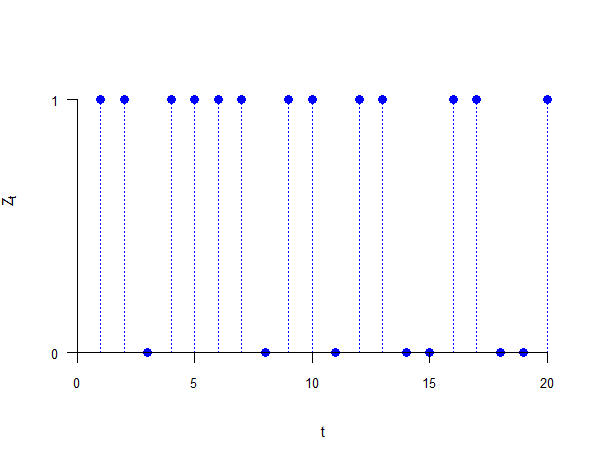
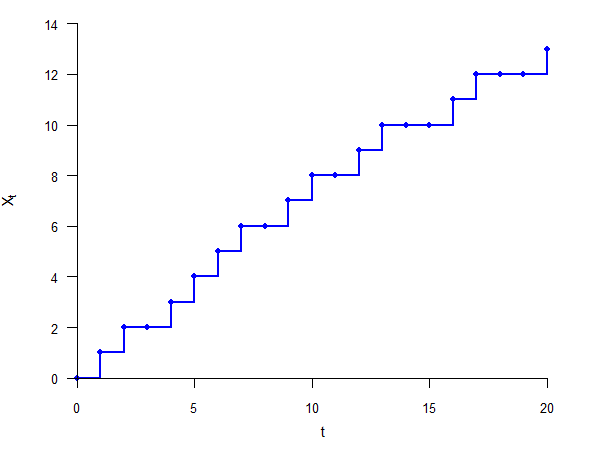
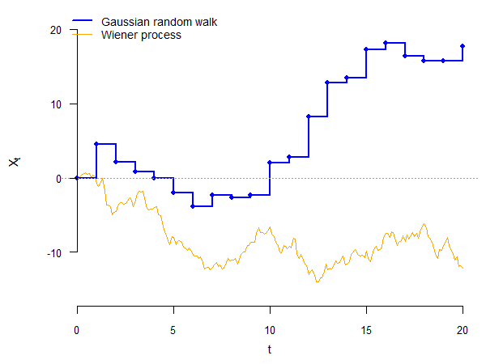

---
output:
  xaringan::moon_reader:
    seal: false
    includes:
      after_body: insert-logo.html
    self_contained: false
    lib_dir: libs
    nature:
      highlightStyle: github
      highlightLines: true
      countIncrementalSlides: false
      ratio: '16:9'
editor_options:
  chunk_output_type: console
---
class: center, inverse, middle

```{r xaringan-panelset, echo=FALSE}
xaringanExtra::use_panelset()
```

```{r xaringan-tile-view, echo=FALSE}
xaringanExtra::use_tile_view()
```

```{r xaringanExtra, echo = FALSE}
xaringanExtra::use_progress_bar(color = "#808080", location = "top")
```

```{css echo=FALSE}
.pull-left {
  float: left;
  width: 44%;
}
.pull-right {
  float: right;
  width: 44%;
}
.pull-right ~ p {
  clear: both;
}


.pull-left-wide {
  float: left;
  width: 66%;
}
.pull-right-wide {
  float: right;
  width: 66%;
}
.pull-right-wide ~ p {
  clear: both;
}

.pull-left-narrow {
  float: left;
  width: 30%;
}
.pull-right-narrow {
  float: right;
  width: 30%;
}

.tiny123 {
  font-size: 0.40em;
}

.small123 {
  font-size: 0.80em;
}

.large123 {
  font-size: 2em;
}

.red {
  color: red
}

.orange {
  color: orange
}

.green {
  color: green
}
```


# Statistics
## Stochastic processes
### (Chapter 7)

### Christian Vedel,<br>Department of Economics<br>University of Southern Denmark

### Email: [christian-vs@sam.sdu.dk](mailto:christian-vs@sam.sdu.dk)

### Updated `r Sys.Date()`


---
class: middle
# Today's lecture
.pull-left-wide[
**Modelling random phenomena that evolve over time**

- **Section 1:** Stochastic processes — definition and sample paths
- **Section 2:** Transformations — partial sums and first differences
- **Section 3:** States and waiting times
- **Section 4:** Bernoulli and binomial processes
- **Section 5:** Poisson process
- **Section 6:** Gaussian random walk
- **Section 7:** Wiener process (Brownian motion)
]

.pull-right-narrow[

]

---
# Why stochastic processes?

.pull-left-wide[
- Economic variables evolve over time: GDP growth, interest rates, exchange rates, asset prices
- **Time series econometrics** builds formal probability models for these sequences
- The processes covered today are the *building blocks* for some of the most important models in economics and finance
]

--

.pull-left-wide[
- The next two slides show exactly where this leads
]

--

.pull-left-wide[
> .orange[**Heads up:** the mathematics on the next slides will look unfamiliar — that is intentional. You are **not** expected to understand it now. Return to it after the course and notice how much has clicked into place.]
]

---
# What you are building towards: time series

.pull-left-wide[
> .orange[**Preview only — no need to understand this now**]
]

.pull-left-wide[
The workhorse model of time series econometrics is the **AR(1)**:
$$Y_t = \mu + \rho \, Y_{t-1} + \varepsilon_t, \qquad \varepsilon_t \overset{iid}{\sim} \mathcal{N}(0,\sigma^2)$$
]

--

.pull-left-wide[
The parameter $\rho$ determines everything:

| $\rho$ | Process | Consequence |
|:---:|:---|:---|
| $abs(\rho) < 1$ | Stationary — mean-reverting | Standard regression is valid |
| $\rho = 1$ | **Gaussian random walk** with drift | Spurious regression — $R^2 \to 1$ even for unrelated series |
| $abs(\rho) > 1$ | Explosive | Variance grows without bound |
]

--

.pull-right-narrow[
- Deciding which case applies requires knowing what a random walk *is* — and how to test for one (**unit root tests**, e.g., Augmented Dickey–Fuller)
- You will encounter all of this in later courses
]

---
# What you are building towards: finance

.pull-left-wide[
> .orange[**Preview only — no need to understand this now**]
]

.pull-left-wide[
Stock prices are modelled as **geometric Brownian motion**:
$$dS_t = \mu \, S_t \, dt + \sigma \, S_t \, dW_t$$
where $W_t$ is a **Wiener process** — the continuous-time process you will meet today
]

--

.pull-left-wide[
- The **Black–Scholes** option pricing formula is a direct consequence of this model
- Every modern derivatives textbook starts from $dW_t$
]

---
# What you are building towards: Markov chains

.pull-left-wide[
> .orange[**Preview only — no need to understand this now**]
]

.pull-left-wide[
Today's lecture also lays the groundwork for **Markov chains** — processes where the future depends *only* on the current state, not the full history:
$$P(Z_{t+1} = j \mid Z_t = i, Z_{t-1}, \ldots) = P(Z_{t+1} = j \mid Z_t = i)$$
]

--

.pull-left-wide[
- Markov chains are used in macroeconomic models of recessions, credit-rating transitions, and job search theory
- They also underlie many machine learning algorithms and reinforcement learning
]

---
class: inverse, middle, center
# Stochastic processes

---
# Time dimension

.pull-left-wide[
- Often, uncertain situations involve a time dimension (e.g., the evolution of a stock price over time)
]

--

.pull-left-wide[
- Let us consider a simple example: every morning, we toss a fair coin
]

---

# Tossing a coin

.pull-left-wide[
- Let $Z_t$ be the random variable indicating the outcome of the $t$-th coin toss:
$$Z_t = \begin{cases} 0, & \text{tails on toss } t \\ 1, & \text{heads on toss } t \end{cases}$$
]

--

.pull-left-wide[
- We may be interested in several aspects of this:
  - how many times did heads appear in a year, on average?
  - what is the probability of getting heads (or tails) for a whole week in a row?
  - how many tosses can we expect between two heads?
]

---
# Stochastic process

.pull-left-wide[
> A **stochastic process** $\{Z_t, t \in T\}$ is a collection of random variables $Z_t$ indexed by time $t$, which belongs to the index set $T$.
>
> The outcome of a stochastic process, $\{z_t, t \in T\}$, is called a **realization** or a **sample path**.
>
> The outcome $z_t$ of one of the random variables $Z_t$ in a stochastic process is called an **incident**.
]

--

.pull-left-wide[
- Like random variables, stochastic processes are *functions* that assign a random variable $Z_t$ to a point in time $t$
]

--

.pull-left-wide[
- Same as with random variables, stochastic processes can be of two types:
  - in *discrete time*, if the index set $T$ is countable (finite or infinite)
  - in *continuous time*, if the index set $T$ is uncountable (infinite)
]

---
# Stochastic process

.pull-left-wide[
- Suppose that we follow our couple for a week, so $T = \{ 1, 2, \ldots, 7 \}$
- A realization may be:
$$z = \{1, 0, 0, 1, 1, 1, 0 \}$$
- That is, $z_1 = 1$, $z_2 = 0$, $z_3 = 0$, ..., $z_7 = 0$
]

--

.pull-left-wide[
- Same as we could assign probabilities to random variables, we can also assign probabilities to stochastic processes
- In this case, it is the probability of a certain realization (sample path)
]

--

.pull-left-wide[
- In our example, if the coin tosses are independent, the probability of each sample path is $0.5^7 = 0.0078$ (because there are $2^7$ possible paths, all with equal probability)
]

---
# .red[Practice 1: Stochastic processes]

.pull-left-wide[
**1.** Consider the coin-toss example with $T = \{1, 2, 3\}$ and $p = 0.5$.

  a) How many possible sample paths are there?

  b) What is the probability of the sample path $z = \{1, 1, 0\}$?

**2.** A student records whether it rains ($Z_t = 1$) or not ($Z_t = 0$) each day for 5 days. Assume each day is independent with $p = 0.3$.

  a) What is the probability of the sample path $z = \{0, 0, 0, 0, 0\}$?
]

```{r practice1-answers, eval=FALSE, include=FALSE}
# ANSWERS
#
# 1a) 2^3 = 8 possible sample paths
# 1b) P(z = {1,1,0}) = 0.5 * 0.5 * 0.5 = 0.125
#
# 2a) P(z = {0,0,0,0,0}) = 0.7^5 = 0.168
```

---
class: inverse, middle, center
# Transformations of a stochastic process

---
# Partial sum

.pull-left-wide[
- One advantage to working with stochastic processes is that we can use them to model real-life events
- Transformations make our job even easier
]

--

.pull-left-wide[
- For example, suppose you want to count how many times heads appeared until a certain toss
- We can define the random variable $X_t$ as:
$$X_t = Z_1 + Z_2 + \ldots + Z_t = \sum_{s=1}^t Z_s$$
]

--

.pull-left-wide[
- The stochastic process $\{ X_t, t \in T \}$ is a **partial sum transformation** of the initial stochastic process $\{Z_t, t \in T\}$
- In our example, we would have $x = \{ 1, 1, 1, 2, 3, 4, 4 \}$
]

---
# Other transformations

.pull-left-wide[
- Another useful transformation is the **first-difference**, which shows the change in a stochastic process from one period to the next (e.g., change in income)
]

--

.pull-left-wide[
- This can be done in absolute terms:
$$X_t = \Delta Z_t = Z_t - Z_{t-1}$$
]

--

.pull-left-wide[
- It can also be done in relative terms (e.g., inflation rate):
$$X_t = \frac{Z_t - Z_{t-1}}{Z_{t-1}}$$
]

--

.pull-left-wide[
- Note that in both of these cases, the transformed stochastic process is "shorter" by one period ($t$ starts at 2!)
]

---
# .red[Practice 2: Transformations]

.pull-left-wide[
Consider the realization $z = \{2, 5, 3, 8, 6\}$ for $t = 1, 2, 3, 4, 5$.

**1.** Compute the partial sum process $x_t = \sum_{s=1}^t z_s$ for $t = 1, \ldots, 5$.

**2.** Compute the absolute first-difference $x_t = z_t - z_{t-1}$ for $t = 2, \ldots, 5$.

**3.** Compute the relative first-difference $x_t = \frac{z_t - z_{t-1}}{z_{t-1}}$ for $t = 2, \ldots, 5$.

**4.** Why does the first-difference process have one fewer observation than the original?
]

```{r practice2-answers, eval=FALSE, include=FALSE}
# ANSWERS
#
# 1. Partial sum: x = {2, 7, 10, 18, 24}
#
# 2. Absolute first-difference: x = {3, -2, 5, -2}  (t = 2,3,4,5)
#
# 3. Relative first-difference: x = {1.5, -0.4, 1.667, -0.25}  (t = 2,3,4,5)
#
# 4. The first-difference requires z_{t-1}, so t=1 has no predecessor —
#    the transformed process starts at t=2.
```

---
# .red[Raise your hand 1: Transformations]

```{r raiseyourhand1-timer, echo=FALSE}
library(countdown)
countdown(0, 20, top=TRUE)
```

.pull-left-wide[
**Q1.** Consider $z = \{3, 1, 4, 1\}$. What is the partial sum $x_3$?

- **A)** 4 — the value of $z_3$
- **B)** 8 — the sum of the first 3 values
- **C)** 9 — the sum of all 4 values
]

--

.pull-left-wide[
**Q2.** A realization is $z = \{4, 2, 8, 5\}$. What is the absolute first-difference $\Delta z_4 = z_4 - z_3$?

- **A)** 5 — the level at $t = 4$
- **B)** $-3$ — the change from $t = 3$ to $t = 4$
- **C)** 3 — the absolute value of the change
]

```{r raiseyourhand1-answers, eval=FALSE, include=FALSE}
# ANSWERS
#
# Q1: Answer B — x_3 = z_1 + z_2 + z_3 = 3 + 1 + 4 = 8
#   A: Confuses the level z_3 with the cumulative sum — a common mix-up
#   B: Correct — partial sum accumulates all values up to t
#   C: Includes z_4, confusing x_3 with x_4
#
# Q2: Answer B — Delta z_4 = z_4 - z_3 = 5 - 8 = -3
#   A: Confuses the level z_4 with the change — a very common mistake
#   B: Correct — first-difference is the change, not the level
#   C: Takes the absolute value, losing the sign — direction of change matters
```

---
class: inverse, middle, center
# States and waiting times

---
# States

.pull-left-wide[
- One aspect of a stochastic process that is particularly interesting is its state at a certain point in time
- The **state** of a stochastic process at time $t$ is given by the random variable representing the value taken at time $t$
]

--

.pull-left-wide[
- In our example, consider the partial sum transformation $\{ X_t, t \in T \}$
- The state of this process at time $t_0 = 2$ is simply $X_2$
]

---
# State distribution

.pull-left-wide[
- Note that $X_2$ (the sum of $Z_1$ and $Z_2$) can take three values: 0, 1, or 2, with probabilities:
$$f(0) = P(Z_1 = 0, Z_2 = 0) = 0.25$$
$$f(1) = P(Z_1 = 0, Z_2 = 1) + P(Z_1 = 1, Z_2 = 0) = 0.5$$
$$f(2) = P(Z_1 = 1, Z_2 = 1) = 0.25$$
]

--

.pull-left-wide[
- The distribution of $X_2$ is called the **state distribution** of the stochastic process at time 2
]

--

.pull-left-wide[
- This also shows the usefulness of stochastic processes: instead of directly specifying the distribution of the number of times heads appeared, we can use a stochastic process
- This approach is more intuitive and often easier
]

---
# Waiting time

.pull-left-wide[
- Another interesting aspect of a stochastic process is the **waiting time**, i.e., the time it will take until a particular state is reached (or passed) for the first time
]

--

.pull-left-wide[
- For example, we may want to know how long it takes until heads appears twice
- Since the stochastic process consists of random variables, the time until one particular state is realized is also random
]

--

.pull-left-wide[
- Let $Y_2$ be the random variable indicating how long it takes until heads appears twice
]

---
# Waiting-time distribution

.pull-left-wide[
- The distribution of the random variable $Y_2$ is called a **waiting-time distribution**
- In our example, $Y_2$ can take the values 2, 3, ..., 7
]

--

.pull-left-wide[
- We can then calculate probabilities for these values. For example:
  - $f(2)$: $Y_2 = 2$ if $Z_1 = 1$ and $Z_2 = 1$, which can happen with probability 0.25
  - $f(3)$: $Y_2 = 3$ if:
    - $Z_1 = 1$, $Z_2 = 0$, and $Z_3 = 1$, which occurs with probability 0.125
    - $Z_1 = 0$, $Z_2 = 1$, and $Z_3 = 1$, which occurs with probability 0.125
  - $\Rightarrow$ $f(3) = 2 \cdot 0.125 = 0.25$
]

--

.pull-left-wide[
- Note that the stochastic process may not be "long enough" for us to observe the desired value
- In this case, we can calculate $1 - F(7)$ and/or $1 - F(6)$
]

---
# Types of processes

.pull-left-wide[
.small123[
| | Discrete State | Continuous State |
|---|:---:|:---:|
| **Discrete Time** | Bernoulli, Binomial | Gaussian random walk |
| **Continuous Time** | Poisson | Wiener |
]
]

---
# .red[Practice 3: States and waiting times]

.pull-left-wide[
A quality inspector checks items on a production line. Each item is defective with probability $p = 0.3$, independently. Let $X_t$ be the number of defective items found by inspection $t$.

**1.** Find the state distribution of $X_4$ — compute $f(0)$, $f(1)$, $f(2)$.

**2.** Let $Y_1$ be the waiting time until the first defective item is found. Compute $f(1)$, $f(2)$, $f(3)$.

**3.** What is $1 - F(3)$ for $Y_1$? What does this represent in the context of quality control?
]

```{r practice3-answers, eval=FALSE, include=FALSE}
# ANSWERS
#
# 1. X_4 ~ Bin(4, 0.3)
#    f(0) = 0.7^4 = 0.2401
#    f(1) = C(4,1) * 0.3 * 0.7^3 = 4 * 0.3 * 0.343 = 0.4116
#    f(2) = C(4,2) * 0.3^2 * 0.7^2 = 6 * 0.09 * 0.49 = 0.2646
#
# 2. Y_1 ~ Geo(0.3)
#    f(1) = 0.3
#    f(2) = 0.7 * 0.3 = 0.21
#    f(3) = 0.7^2 * 0.3 = 0.147
#
# 3. 1 - F(3) = P(Y_1 > 3) = 0.7^3 = 0.343
#    The probability that the first 3 items inspected are all non-defective —
#    i.e., no defect is caught in the first 3 inspections.
```

---
class: inverse, middle, center
# The Bernoulli process and the binomial process

---
# The Bernoulli process

.pull-left-wide[
> A **Bernoulli process** $\{Z_t, t \in T \}$ satisfies the following conditions:
>
> 1. Time: $T = \{ 1, 2, 3, \ldots \}$
>
> 2. State: $Z_t \in \{ 0, 1 \}$ for all $t$
>
> 3. Distribution of outcomes: each state follows a Bernoulli distribution with parameter $p$
>
> 4. Relationship between outcomes: each state is independent of the other states: $Z_t$ and $Z_s$ are independent for all $s \not= t$
]

---
# The Bernoulli process

.pull-left-wide[
- The Bernoulli process is characterized by the fact that, at each point in time, an incident can either occur ($Z_t = 1$) or not ($Z_t = 0$)
- This means that an element from a Bernoulli population is drawn at each point in time
]

--

.pull-left-wide[
- Our previous example (coin toss) is a Bernoulli process with $p = 0.5$
]

---
# Example of path of a Bernoulli process ($p = 0.5$)

.center[

]

---
# The binomial process

.pull-left-wide[
- Sometimes, what is of interest is the number of events in a Bernoulli process
- As before, we can obtain this using the partial sum transformation:
$$X_t = \sum_{s=1}^t Z_s$$
]

--

.pull-left-wide[
- This is a sum of independent Bernoulli-distributed random variables, which yields a binomial process
]

---
# The binomial process

.pull-left-wide[
> A **binomial process** $\{X_t, t \in T \}$ satisfies the following conditions:
>
> 1. Time: $T = \{ 1, 2, 3, \ldots \}$
>
> 2. State: $X_t \in \{ 0, 1, \ldots, t \}$ for all $t$
>
> 3. Distribution of outcomes: states are such that $(X_{t+n} - X_t)$ follows a binomial distribution with parameters $n$ and $p$, for all $n$ and $t$, and $X_0 = 0$
>
> 4. Relationship between outcomes: $(X_{t_1} - X_{t_2})$ and $(X_{t_3} - X_{t_4})$ are independent, for all $t_1 > t_2 > t_3 > t_4$
]

---
# Example of path of a binomial process ($p = 0.5$)

.center[

]

---
# The binomial process

.pull-left-wide[
- With a binomial process, the probability of a certain number of events in a time interval depends on the *length* of the time interval and not on *when* this time interval occurs
]

--

.pull-left-wide[
- In addition, the number of events in a time interval is independent of the number of events in any other non-overlapping time interval
]

--

.pull-left-wide[
- A binomial process is a **counting process**: it models the number of events that occurred up to a certain point in time
]

---
# State distribution of a binomial process

.pull-left-wide[
- Using the definition of the binomial process, we can easily see that:
$$X_t - X_0 = X_t \sim Bin(t, p)$$
- This gives us the state distribution of the binomial process
]

--

.pull-left-wide[
- We can therefore determine the probability function of $X_t$:
$$f(x) = {t \choose x} \cdot p^x \cdot (1 - p)^{t-x}$$
]

--

.pull-left-wide[
- The expected value and variance of $X_t$ also come from the binomial distribution:
$$E(X_t) = t \cdot p \qquad Var(X_t) = t \cdot p \cdot (1 - p)$$
]

.pull-right-narrow[
*Coin toss:* The number of heads after $t$ fair coin tosses follows $Bin(t,\; 0.5)$.
]


---
# Waiting-time distribution of a binomial process

.pull-left-wide[
- As before, let $Y_{x_0}$ be the time until $X_t = x_0$ for the first time
- The distribution of $Y_{x_0}$ is called the **negative binomial distribution**:
$$Y_{x_0} \sim Negbin(x_0, p)$$
]

--

.pull-left-wide[
- The probability function of $Y_{x_0}$ is:
$$f(y) = {{y - 1} \choose {x_0 - 1}} \cdot p^{x_0} \cdot (1 - p)^{y - x_0}$$
]

--

.pull-left-wide[
- The expected value and variance of $Y_{x_0}$ are:
$$E(Y_{x_0}) = \frac{x_0}{p} \qquad Var(Y_{x_0}) = x_0 \cdot \frac{1 - p}{p^2}$$
]

.pull-right-narrow[
*Coin toss:* The number of tosses needed to get $x_0$ heads follows $Negbin(x_0,\; 0.5)$.
]

---
# Waiting-time distribution of a binomial process

.pull-left-wide[
- We can also ask: what is the time until the first event occurs?
- This is a negative binomial distribution with parameters 1 and $p$
]

--

.pull-left-wide[
- This distribution is also very useful and has its own name: the **geometric distribution**:
$$Y_{1} \sim Negbin(1, p) = Geo(p)$$
]

--

.pull-left-wide[
- The probability function for the geometric distribution is:
$$f(y) = p \cdot (1 - p)^{y - 1}$$
- This distribution also represents the distribution of the waiting time until the next event occurs
]

.pull-right-narrow[
*Coin toss:* The number of fair coin tosses until the first head follows $Geo(0.5)$.
]

---
# .red[Practice 4: Bernoulli and binomial processes]

.pull-left-wide[
A website receives visits according to a Bernoulli process with $p = 0.4$ per minute.

**1.** What is $f(3)$ — the probability of exactly 3 visits in the first 8 minutes?

**2.** What are $E(X_8)$ and $Var(X_8)$?

**3.** What is the probability that the first visit occurs on minute 4? Use the geometric distribution.

**4.** What is the expected waiting time until the 2nd visit?
]

```{r practice4-answers, eval=FALSE, include=FALSE}
# ANSWERS
#
# 1. X_8 ~ Bin(8, 0.4)
#    f(3) = C(8,3) * 0.4^3 * 0.6^5 = 56 * 0.064 * 0.07776 = 0.2787
#
# 2. E(X_8) = 8 * 0.4 = 3.2
#    Var(X_8) = 8 * 0.4 * 0.6 = 1.92
#
# 3. Y_1 ~ Geo(0.4)
#    f(4) = 0.4 * 0.6^3 = 0.0864
#
# 4. Y_2 ~ Negbin(2, 0.4)
#    E(Y_2) = 2 / 0.4 = 5 minutes
```

---
# .red[Raise your hand 2: Bernoulli and binomial processes]

```{r raiseyourhand2-timer, echo=FALSE}
library(countdown)
countdown(0, 20, top=TRUE)
```

.pull-left-wide[
**Q1.** A binomial process has $p = 0.3$ and $t = 10$. What is $E(X_{10})$?

- **A)** 0.3 — the probability of success
- **B)** 3 — expected count of events
- **C)** 7 — expected number of non-events
]

--

.pull-left-wide[
**Q2.** The waiting time until the *first* event in a Bernoulli process follows which distribution?

- **A)** Binomial — counts the total number of events in a fixed number of trials
- **B)** Geometric — special case of negative binomial with $x_0 = 1$
- **C)** Negative binomial — the general distribution for waiting times in a binomial process
]

```{r raiseyourhand2-answers, eval=FALSE, include=FALSE}
# ANSWERS
#
# Q1: Answer B — E(X_10) = 10 * 0.3 = 3
#   A: Confuses the parameter p with the expected value — tempting because p appears in the formula
#   B: Correct — E(X_t) = t * p
#   C: Confuses expected successes with expected failures (10 * 0.7 = 7)
#
# Q2: Answer B — Geometric distribution
#   A: Binomial counts events over a fixed number of trials — confuses counting distribution with waiting distribution
#   B: Correct — Geo(p) = Negbin(1, p), the special case for the first event
#   C: Negative binomial is the general waiting-time family — Geo IS the right member of that family,
#      but Negbin(x_0, p) with x_0 > 1 gives the wait for the x_0-th event, not the first
```

---
class: inverse, middle, center
# The Poisson process

---
# The Poisson process

.pull-left-wide[
> A **Poisson process** $\{X_t, t \in T \}$ satisfies the following conditions:
>
> 1. Time: $T = (0, \infty)$
>
> 2. State: $X_t \in \{ 0, 1, 2, \ldots \}$ for all $t$
>
> 3. Distribution of outcomes: states are such that $(X_{t + \tau} - X_t)$ follows a Poisson distribution with parameter $(\lambda \cdot \tau)$, for all $\tau$ and $t$, and $X_0 = 0$
>
> 4. Relationship between outcomes: $(X_{t_1} - X_{t_2})$ and $(X_{t_3} - X_{t_4})$ are independent, for all $t_1 > t_2 > t_3 > t_4$
]

---
# The Poisson process

.pull-left-wide[
- The Poisson process gives the number of events that have occurred up to a given point in time
- Therefore, it is also a counting process, but in continuous time
]

--

.pull-left-wide[
- Note that the number of events occurring in any time interval of length $\tau$ follows a Poisson distribution with parameter $\lambda \cdot \tau$, meaning that only the *length* of the interval matters, not *when* the time interval starts
]

---
# State distribution of a Poisson process

.pull-left-wide[
- Using the definition of the Poisson process, we can easily see that:
$$X_t - X_0 = X_t \sim Poisson(\lambda \cdot t)$$
- This gives us the state distribution of the Poisson process as a Poisson distribution
]

--

.pull-left-wide[
- We can therefore determine the probability function of $X_t$:
$$f(x) = \frac{(\lambda \cdot t)^x}{x!} \cdot e^{-(\lambda \cdot t)}$$
]

--

.pull-left-wide[
- The expected value and variance of $X_t$ also come from the Poisson distribution:
$$E(X_t) = \lambda \cdot t \qquad Var(X_t) = \lambda \cdot t$$
]

---
# Probability updating in a Poisson process

.pull-left-wide[
- If we know that $b$ events occurred until time $s$, we can update the probability that $x$ events will occur until time $t$:
$$f(x \mid X_s = b) = P(X_t - X_s = x - b)$$
]

--

.pull-left-wide[
- But we know that $X_t - X_s$ follows a Poisson distribution with parameter $\lambda \cdot (t - s)$
- Therefore, the conditional probability function becomes:
$$f(x \mid X_s = b) = \frac{[\lambda \cdot (t - s)]^{x - b}}{(x - b)!} \cdot e^{-[\lambda \cdot (t-s)]}$$
]

---
# Waiting-time distribution of a Poisson process

.pull-left-wide[
- As before, let $Y_{x_0}$ be the time until $X_t = x_0$ for the first time
- The distribution of $Y_{x_0}$ is called the **Erlang distribution**:
$$Y_{x_0} \sim Erlang(\lambda, x_0)$$
]

--

.pull-left-wide[
- The probability function of $Y_{x_0}$ is:
$$f(y) = \frac{\lambda^{x_0} \cdot y^{x_0 - 1}}{(x_0 - 1)!} \cdot e^{-\lambda \cdot y}$$
]

--

.pull-left-wide[
- The expected value and variance of $Y_{x_0}$ are:
$$E(Y_{x_0}) = \frac{x_0}{\lambda} \qquad Var(Y_{x_0}) = \frac{x_0}{\lambda^2}$$
]

.footnote[
  .small123[After Danish statistician Agner Krarup Erlang: https://en.wikipedia.org/wiki/Agner_Krarup_Erlang]
]

---
# Waiting-time distribution of a Poisson process

.pull-left-wide[
- We can also ask: what is the time until the first (or the next) event occurs?
- This is an Erlang distribution with parameters $\lambda$ and 1
]

--

.pull-left-wide[
- This distribution is also quite useful and has its own name: the **exponential distribution**:
$$Y_{1} \sim Erlang(1, \lambda) = Exp(\lambda)$$
]

--

.pull-left-wide[
- The probability function for the exponential distribution is:
$$f(y) = \lambda \cdot e^{-\lambda \cdot y}$$
]

---
# .red[Practice 5: Poisson process]

.pull-left-wide[
Customers arrive at a shop according to a Poisson process with rate $\lambda = 3$ per hour.

**1.** What is $f(5)$ — the probability that exactly 5 customers arrive in the first 2 hours?

**2.** What are $E(X_2)$ and $Var(X_2)$?

**3.** If 4 customers arrived by hour 1, what is $f(x \mid X_1 = 4)$ for the number arriving by hour 2?

**4.** What is the expected waiting time until the 3rd customer arrives?
]

```{r practice5-answers, eval=FALSE, include=FALSE}
# ANSWERS
#
# 1. X_2 ~ Poisson(3 * 2) = Poisson(6)
#    f(5) = 6^5 / 5! * exp(-6) = 7776/120 * 0.00248 = 0.1606
#
# 2. E(X_2) = 3 * 2 = 6
#    Var(X_2) = 6
#
# 3. X_2 - X_1 ~ Poisson(3 * 1) = Poisson(3)
#    f(x | X_1 = 4) = 3^(x-4) / (x-4)! * exp(-3)  for x >= 4
#
# 4. Y_3 ~ Erlang(3, 3)
#    E(Y_3) = 3 / 3 = 1 hour
```

---
# .red[Raise your hand 3: Poisson process]

```{r raiseyourhand3-timer, echo=FALSE}
library(countdown)
countdown(0, 20, top=TRUE)
```

.pull-left-wide[
**Q1.** A Poisson process has $\lambda = 4$ per hour. What is $Var(X_3)$?

- **A)** 4 — the rate parameter $\lambda$
- **B)** 12 — $\lambda \cdot t$
- **C)** 16 — $\lambda^2$
]

--

.pull-left-wide[
**Q2.** 10 customers arrived in the first 2 hours of a Poisson process with $\lambda = 3$. How are the arrivals in the *next* hour distributed?

- **A)** Poisson(3) — non-overlapping intervals are independent
- **B)** Poisson(13) — adding the 10 existing arrivals to $\lambda$
- **C)** Poisson(5) — because 10 customers arrived in 2 hours, suggesting a rate of 5 per hour
]

```{r raiseyourhand3-answers, eval=FALSE, include=FALSE}
# ANSWERS
#
# Q1: Answer B — Var(X_3) = lambda * t = 4 * 3 = 12
#   A: Confuses the rate lambda with the variance — ignores time scaling
#   B: Correct — for a Poisson process, Var(X_t) = lambda * t
#   C: Confuses lambda^2 with lambda * t — squaring when you should multiply
#
# Q2: Answer A — by the independence of non-overlapping increments,
#     arrivals in (2, 3] ~ Poisson(lambda * 1) = Poisson(3) regardless of past
#   A: Correct — the memoryless property / independence of increments
#   B: Adds the observed count to lambda — confuses the cumulative state with the rate parameter
#   C: Uses the observed sample rate (10/2 = 5) instead of the given lambda — confuses
#      empirical estimation with the known true parameter
```

---
class: inverse, middle, center
# The Gaussian random walk

---
# The Gaussian random walk

.pull-left-wide[
> A **Gaussian random walk** $\{X_t, t \in T \}$ satisfies the following conditions:
>
> 1. Time: $T = \{ 1, 2, 3, \ldots \}$
>
> 2. State: $X_t \in (-\infty, \infty)$ for all $t$
>
> 3. Distribution of outcomes: states are such that $(X_{t + n} - X_t)$ follows a Normal distribution with mean $n \cdot \mu$ and variance $n \cdot \sigma^2$, for all $n$ and $t$; and $X_0 = 0$
>
> 4. Relationship between outcomes: $(X_{t_1} - X_{t_2})$ and $(X_{t_3} - X_{t_4})$ are independent, for all $t_1 > t_2 > t_3 > t_4$
]

--

.pull-left-wide[
- $\mu$ is called the **drift** parameter and $\sigma^2$ the **diffusion** parameter
]

---
# The Gaussian random walk

.pull-left-wide[
- A random walk is a partial sum of independent and identically distributed random variables (e.g., the binomial process is a random walk)
- The Gaussian random walk is a continuous-state discrete-time process
]

--

.pull-left-wide[
- It represents the "drunken walk:" each step can occur in a random direction, either forwards or backwards
- The change in this process, at any point in time, is normally distributed with mean and variance that depend on the *length* of the time interval but not on *when* the interval starts
]

---
# State distribution of a Gaussian random walk

.pull-left-wide[
- Using the definition of the Gaussian random walk, we can easily see that:
$$X_t - X_0 = X_t \sim \mathcal{N}(t \cdot \mu, t \cdot \sigma^2)$$
- This gives us the state distribution of the Gaussian random walk as a normal distribution
]

--

.pull-left-wide[
- We can therefore determine the probability density function of $X_t$:
$$f(x) = \frac{1}{ \sigma \cdot \sqrt{2 \cdot \pi \cdot t }} \cdot e^{- \frac{(x - t \cdot \mu)^2}{2 \cdot t \cdot \sigma^2}}$$
]

--

.pull-left-wide[
- The expected value and variance of $X_t$ also come from the normal distribution:
$$E(X_t) = t \cdot \mu \qquad Var(X_t) = t \cdot \sigma^2$$
]

---
# Probability updating in a Gaussian random walk

.pull-left-wide[
- Same as in the case of a Poisson process, we can calculate the conditional CDF of $X_t$ given that $X_s = b$:
$$F(x \mid X_s = b) = P(X_t - X_s \leq x - b)$$
]

--

.pull-left-wide[
- But we know that $X_t - X_s$ follows a normal distribution with mean $(t - s) \cdot \mu$ and variance $(t - s) \cdot \sigma^2$
- Therefore, the conditional CDF can be derived from the normal distribution $\mathcal{N}((t - s) \cdot \mu, (t - s) \cdot \sigma^2)$:
$$F(x \mid X_s = b) = \Phi \left( \frac{(x - b) - (t - s) \cdot \mu}{\sqrt{(t - s) \cdot \sigma^2}} \right)$$
]

---
class: inverse, middle, center
# The Wiener process

---
# The Wiener process

.pull-left-wide[
> A **Wiener process** (**Brownian motion**) $\{X_t, t \in T \}$ satisfies the following conditions:
>
> 1. Time: $T = (0, \infty)$
>
> 2. State: $X_t \in (-\infty, \infty)$ for all $t$
>
> 3. Distribution of outcomes: states are such that $(X_{t + \tau} - X_t)$ follows a Normal distribution with mean $\tau \cdot \mu$ and variance $\tau \cdot \sigma^2$, for all $\tau$ and $t$; and $X_0 = 0$
>
> 4. Relationship between outcomes: $(X_{t_1} - X_{t_2})$ and $(X_{t_3} - X_{t_4})$ are independent, for all $t_1 > t_2 > t_3 > t_4$
]

---
# The Wiener process vs Gaussian random walk

.pull-left-wide[
- The Wiener process is very similar to a Gaussian random walk, except that it takes place in continuous time
]

--

.pull-left-wide[
- In other words, the Gaussian random walk only changes at certain points in time (positive integers), while the Wiener process changes continuously
]

---
# Example of path of a Gaussian random walk and of a Wiener process ($\mu = 0$, $\sigma^2 = 4$)

.center[

]

---
# State distribution of a Wiener process

.pull-left-wide[
- The state distribution of a Wiener process is completely identical to the state distribution of a Gaussian random walk:
$$X_t - X_0 = X_t \sim \mathcal{N}(t \cdot \mu, t \cdot \sigma^2)$$
]

--

.pull-left-wide[
- With probability density function:
$$f(x) = \frac{1}{ \sigma \cdot \sqrt{2 \cdot \pi \cdot t }} \cdot e^{- \frac{(x - t \cdot \mu)^2}{2 \cdot t \cdot \sigma^2}}$$
]

--

.pull-left-wide[
- The expected value and variance of $X_t$ are:
$$E(X_t) = t \cdot \mu \qquad Var(X_t) = t \cdot \sigma^2$$
]

---
# Waiting-time distribution of a Wiener process

.pull-left-wide[
- As before, let $Y_{x_0}$ be the time until $X_t = x_0$ for the first time
- The distribution of $Y_{x_0}$ is called the **inverse Gaussian distribution**, or the **Wald distribution**:
$$Y_{x_0} \sim IG \left( \frac{x_0}{\mu}, \frac{x_0^2}{\sigma^2} \right)$$
]

--

.pull-left-wide[
- The expected value and variance of $Y_{x_0}$ are:
$$E(Y_{x_0}) = \frac{x_0}{\mu} \qquad Var(Y_{x_0}) = \frac{x_0}{\mu} \cdot \frac{\sigma^2}{\mu^2}$$
]

---
# .red[Practice 6: Gaussian random walk and Wiener process]

.pull-left-wide[
A stock price follows a Gaussian random walk with $\mu = 0.1$ and $\sigma^2 = 1$.

**1.** What is the distribution of $X_{10}$? Give the mean and variance.

**2.** If $X_5 = 3$, what is the conditional distribution of $X_{10}$?

**3.** Compute $F(4 \mid X_5 = 3)$ — the probability that $X_{10} \leq 4$ given $X_5 = 3$.

**4.** How does the Wiener process differ from the Gaussian random walk? What stays the same?
]

```{r practice6-answers, eval=FALSE, include=FALSE}
# ANSWERS
#
# 1. X_10 ~ N(10 * 0.1, 10 * 1) = N(1, 10)
#    Mean = 1, Variance = 10
#
# 2. X_10 - X_5 ~ N(5 * 0.1, 5 * 1) = N(0.5, 5)
#    Given X_5 = 3: X_10 | X_5 = 3 has mean 3 + 0.5 = 3.5 and variance 5
#
# 3. F(4 | X_5 = 3) = Phi((4 - 3 - 5*0.1) / sqrt(5))
#                   = Phi((1 - 0.5) / 2.236)
#                   = Phi(0.224) ≈ 0.589
#
# 4. Different: time is continuous in Wiener (T = (0,inf)) vs discrete in Gaussian RW (T = {1,2,...})
#    Same: state distribution, normal increments, independence of non-overlapping increments
```

---
# .red[Raise your hand 4: Poisson and Gaussian]

```{r raiseyourhand4-timer, echo=FALSE}
library(countdown)
countdown(0, 20, top=TRUE)
```

.pull-left-wide[
**Q1.** A Poisson process has $\lambda = 2$ per hour. What is $E(X_3)$?

- **A)** 2 — the rate parameter
- **B)** 6 — rate times time
- **C)** 0.5 — the mean waiting time until the first event
]

--

.pull-left-wide[
**Q2.** A Gaussian random walk has $\mu = 0$ and $\sigma^2 = 1$. What is $Var(X_4)$?

- **A)** 1 — the diffusion parameter
- **B)** 2 — square root of 4
- **C)** 4 — variance scales with time
]

```{r raiseyourhand4-answers, eval=FALSE, include=FALSE}
# ANSWERS
#
# Q1: Answer B — E(X_3) = lambda * t = 2 * 3 = 6
#   A: Confuses the rate lambda with the expected count — common when t is not made explicit
#   B: Correct — E(X_t) = lambda * t
#   C: This is E(Y_1) = 1/lambda — mixing up state distribution with waiting-time distribution
#
# Q2: Answer C — Var(X_4) = t * sigma^2 = 4 * 1 = 4
#   A: Confuses the diffusion parameter sigma^2 with Var(X_t) — ignores time scaling
#   B: Confuses sqrt(t) with t — a common error from standardising normal distributions
#   C: Correct — Var(X_t) = t * sigma^2
```

---
# Before next time
.pull-left[
- Read the assigned reading
- Next time: The sampling process

.red[We will do things with numbers from the real world!!]

]

.pull-right[

]
