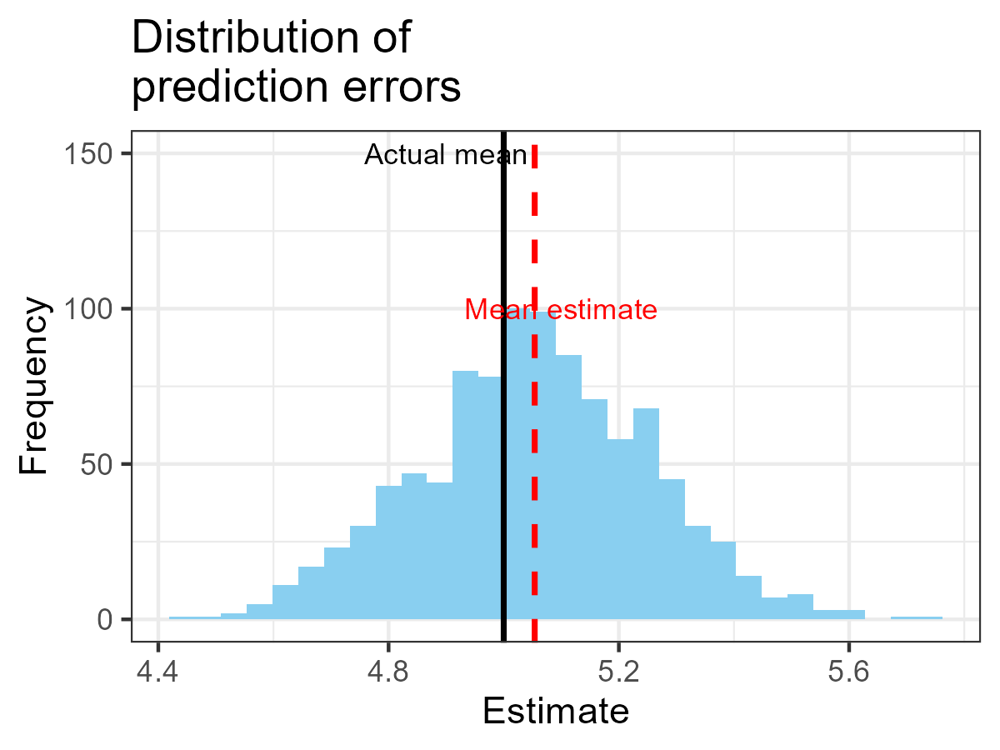
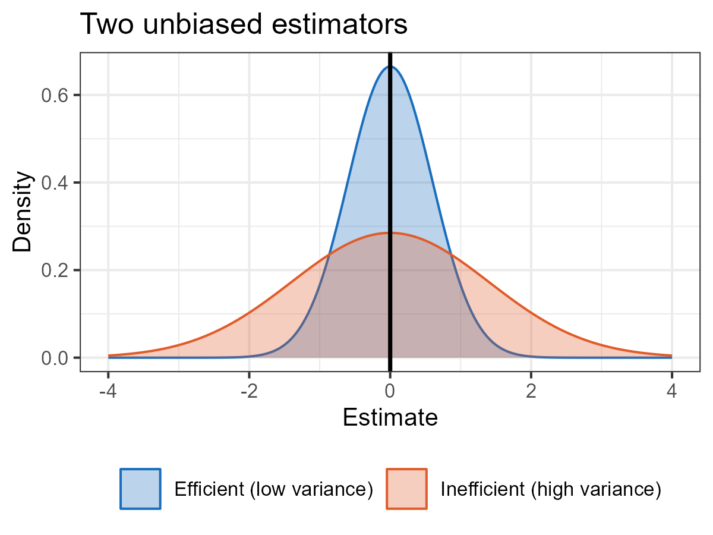
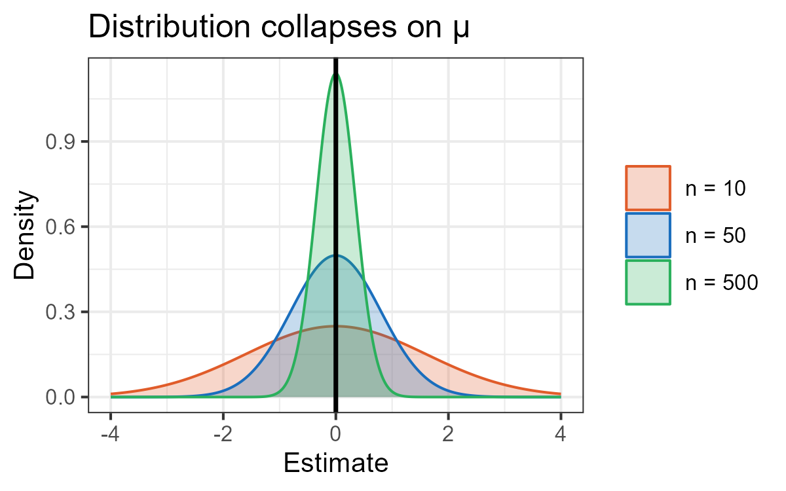
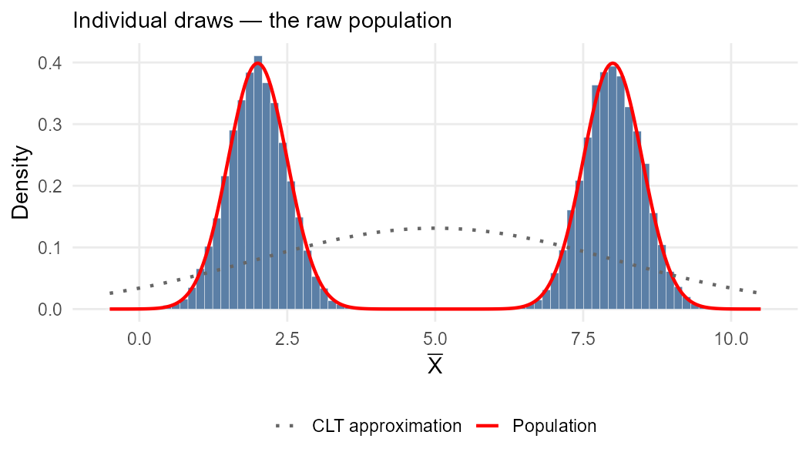
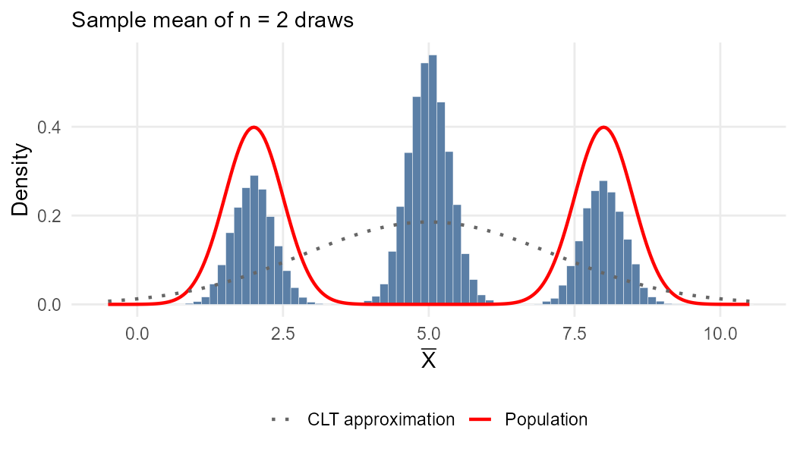
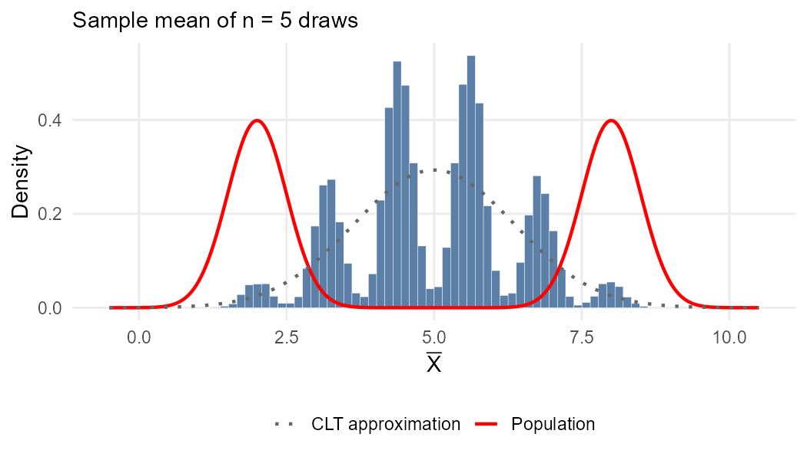
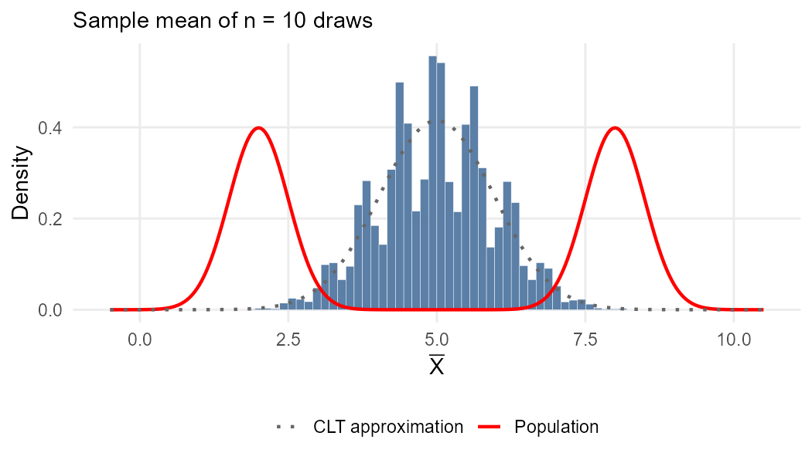
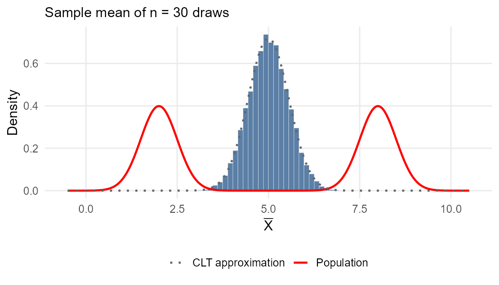
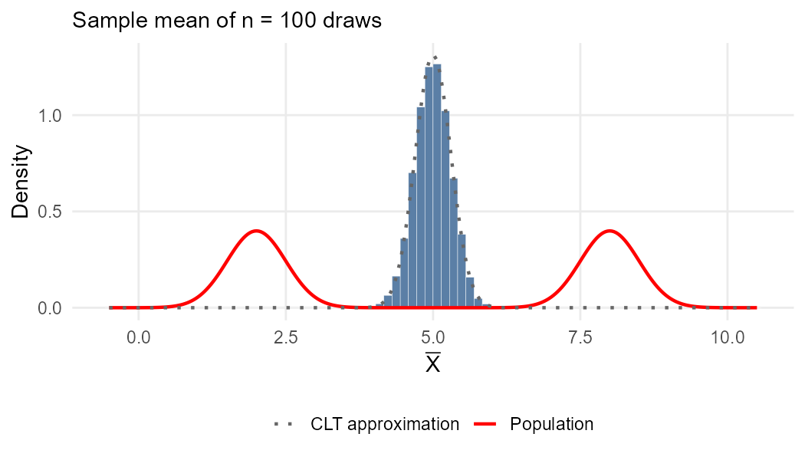
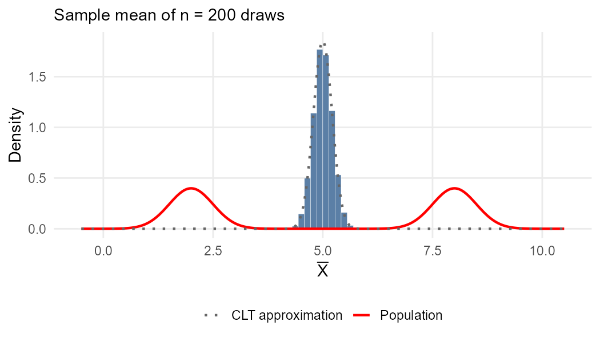

---
output:
  xaringan::moon_reader:
    seal: false
    includes:
      after_body: insert-logo.html
    self_contained: false
    lib_dir: libs
    nature:
      highlightStyle: github
      highlightLines: true
      countIncrementalSlides: false
      ratio: '16:9'
editor_options:
  chunk_output_type: console
---
class: center, inverse, middle

```{r xaringan-panelset, echo=FALSE}
xaringanExtra::use_panelset()
```

```{r xaringan-tile-view, echo=FALSE}
xaringanExtra::use_tile_view()
```

```{r xaringanExtra, echo = FALSE}
xaringanExtra::use_progress_bar(color = "#808080", location = "top")
```

```{css echo=FALSE}
.pull-left {
  float: left;
  width: 44%;
}
.pull-right {
  float: right;
  width: 44%;
}
.pull-right ~ p {
  clear: both;
}


.pull-left-wide {
  float: left;
  width: 66%;
}
.pull-right-wide {
  float: right;
  width: 66%;
}
.pull-right-wide ~ p {
  clear: both;
}

.pull-left-narrow {
  float: left;
  width: 30%;
}
.pull-right-narrow {
  float: right;
  width: 30%;
}

.tiny123 {
  font-size: 0.40em;
}

.small123 {
  font-size: 0.80em;
}

.large123 {
  font-size: 2em;
}

.red {
  color: red
}

.orange {
  color: orange
}

.green {
  color: green
}
```


# Statistics
## Estimating the mean using a simple random sample
### (Chapter 10)

### Christian Vedel,<br>Department of Economics<br>University of Southern Denmark

### Email: [christian-vs@sam.sdu.dk](mailto:christian-vs@sam.sdu.dk)

### Updated `r Sys.Date()`


---
class: middle
# Today's lecture

.pull-left-wide[
**Estimating the population mean from a sample, and understanding the properties that make an estimator reliable.**

- **Section 1:** Simple random sampling
- **Section 2:** Constructing an estimator of the mean value
- **Section 3:** Properties of estimators
- **Section 4:** The distribution of the estimator $\bar{X}$
]

.pull-right-narrow[

]

---
# What are we building towards?

.pull-left-wide[
- Suppose you compute the sample average wage from 800 workers: $\bar{x} = 47{,}200$ DKK
- That is just a number. The real question is: **what does it tell us about the world?**
]

--

.pull-left-wide[
- Is the true average wage above 45,000 DKK? Could the gap between men and women be zero and we just got unlucky with our sample?
- To answer these questions we need to know **how much to trust our estimate** — i.e. how the estimator $\bar{X}$ behaves across all possible samples
]

--

.pull-left-wide[
- This lecture builds the foundation. Once we know the distribution of $\bar{X}$, we can:
  - Build a **confidence interval**: a range of plausible values for the true mean
  - Run a **hypothesis test**: decide whether an effect is real or just noise
  - Do **inference**: draw conclusions about populations from samples
]

--

.pull-right-narrow[
*We will 'invent' an estimator of the mean: the average of the sample. And then we will study its properties. This is a common task in econometrics.*
]

---
class: inverse, middle, center
# Simple random sampling

---
# Descriptive measures in a sample

.pull-left-wide[
- Often, we want to derive information from a sample about the unknown distribution in the population
]

--

.pull-left-wide[
- There are various ways to characterize the population distribution, but it is common to use a **descriptive measure**
]

--

.pull-left-wide[
- The question is: how can we use the information in the sample to infer something about the value of a descriptive measure in the population?
]

---
# Simple random sample

.pull-left-wide[
> A **simple random sample** is a sample $(X_1, X_2, \ldots, X_n)$ such that:
>
> 1. $X_1$, $X_2$, $\ldots$, $X_n$ are statistically independent
> 2. $X_1$, $X_2$, $\ldots$, $X_n$ have the same marginal distribution $f_X(x)$
]

--

.pull-left-wide[
- The marginal distribution $f_X(x)$ is the distribution of interest (in the population)
]

--

.pull-left-wide[
- The second condition assures that the simple random sample is a representative sample for $X$
]

--

.pull-right-narrow[
> .red[If data is generated according to the rules of being above, we say that it is **i.i.d.** (independent and identically distributed)]
]

---
# Distribution of a simple random sample

.pull-left-wide[
- It is easy to determine the joint distribution of the sample using the two conditions in the definition:
$$f(x_1, \ldots, x_n) = f_X(x_1) \cdot f_X(x_2) \cdot \ldots \cdot f_X(x_n)$$
]

--

.pull-left-wide[
- So, if we knew the distribution of $X$ in the population, we would be able to determine the distribution of the simple random sample
]

---
# Distribution of a simple random sample

.pull-left-wide[
- For example, suppose $X$ follows a Bernoulli distribution with $p = 0.7$, so $f_X(0) = 0.3$ and $f_X(1) = 0.7$, and $n = 3$
]

--

.pull-left-wide[
- Then we can calculate $f(x_1, x_2, x_3)$ for any realized sample:

$$f(0, 0, 0) = f_X(0) \cdot f_X(0) \cdot f_X(0) = 0.3^3 = 0.027$$

$$f(0, 0, 1) = f_X(0) \cdot f_X(0) \cdot f_X(1) = 0.3^2 \cdot 0.7 = 0.063$$

$$\vdots$$

$$f(1, 1, 1) = f_X(1) \cdot f_X(1) \cdot f_X(1) = 0.7^3 = 0.343$$
]

--

.pull-right-narrow[
.red[**But, remember:** In practice, we do not know the distribution of $X$ in the population. We have to infer rather than deduce.]
]

---
# .red[Raise your hand 1: Simple random sampling]

```{r ryh1-timer, echo=FALSE}
library(countdown)
countdown(0, 20, top=TRUE)
```

.pull-left-wide[
**Q1.** A researcher surveys 200 workers by asking each manager to nominate two employees. Is this a simple random sample?

- **A)** Yes — the sample size is large enough to be representative
- **B)** No — nominations by managers likely violate independence and identical distribution; certain workers are more likely to be chosen
- **C)** Yes — as long as each worker could in principle be nominated
]

--

.pull-left-wide[
**Q2.** We draw a simple random sample $(X_1, X_2, X_3)$. A colleague says: "Since the draws are independent, $f(x_1, x_2, x_3)$ tells us nothing about the population distribution $f_X$." Is this right?

- **A)** Yes — independence means the joint distribution carries no information about the marginal
- **B)** Yes — we need a much larger sample before $f_X$ can be inferred
- **C)** No — because $f(x_1, x_2, x_3) = f_X(x_1) \cdot f_X(x_2) \cdot f_X(x_3)$, the joint distribution is built directly from $f_X$
]

```{r ryh1-answers, eval=FALSE, include=FALSE}
# ANSWERS
#
# Q1: Answer B
#   A: Tempting — large samples often feel representative; but SRS requires each
#      element to have an equal and independent chance of selection; manager
#      nominations introduce systematic selection bias (popular or visible workers
#      are over-represented)
#   B: Correct — both conditions of SRS are likely violated: observations are not
#      independent (manager picks correlated workers) and not identically distributed
#      (selection probability depends on the manager's preferences)
#   C: Tempting — "could in principle be nominated" sounds like equal probability;
#      but equal probability in principle is not the same as equal probability in practice
#
# Q2: Answer C
#   A: Tempting — independence sounds like it decouples everything; but independence
#      here means draws don't affect each other, not that marginals are uninformative
#   B: Tempting — sounds epistemically cautious; but the factoring identity holds
#      for any n >= 1; the joint distribution always encodes f_X
#   C: Correct — the i.i.d. factoring f(x1,...,xn) = prod f_X(x_i) is the whole
#      point: the joint distribution is a direct product of the marginal, so
#      observing the sample gives us information about f_X
```

---
class: inverse, middle, center
# Constructing an estimator of the mean value

---
# Estimating the mean value

.pull-left-wide[
- Recall that each element of the sample is a random variable following the same distribution
- In other words, each element of the sample has the same mean value
]

--

.pull-left-wide[
- We could use each realized value as an estimate (approximation) of the mean
]

--

.pull-left-wide[
- This gives us $n$ different estimates of one value $\Rightarrow$ we should combine them into one single value
]

---
# The analogy principle

.red[*This is the central principle of estimation. You meet it everywhere.*]

--

.pull-left-wide[
- The **analogy principle** of estimation says: use the formulas we would use if we knew the population distribution, but replace all unknown population quantities with the corresponding sample quantities
]

--

.pull-left-wide[
- If we knew the distribution of $X$, taking values $x_1, \ldots, x_N$ with probabilities $f(x_1), \ldots, f(x_N)$, its mean value is:
$$\mu = \sum_{i=1}^N x_i f(x_i) = x_1 f(x_1) + x_2 f(x_2) + \ldots + x_N f(x_N)$$
]

---
# The sample average

.pull-left-wide[
- In practice, we have a sample of $n$ values $x_1, x_2, \ldots, x_n$, each occurring with probability $1/n$
]

--

.pull-right-narrow[
.red[
**Recall (Lecture 3):**

$X_i$ is a **random variable** — it could take many values before we observe the sample

$x_i$ is a **realized value** — the specific number we actually observed

Uppercase = random; lowercase = realized
]
]

--

.pull-left-wide[
- The analogy principle gives us the **sample average** (realized value):
$$\bar{x} = x_1 \cdot \frac{1}{n} + x_2 \cdot \frac{1}{n} + \cdots + x_n \cdot \frac{1}{n}$$
$$= \sum_{i=1}^n x_i \cdot \frac{1}{n} = \frac{1}{n} \cdot \sum_{i=1}^n x_i$$
]


--

.pull-left-wide[
- Since this can be calculated for any realized sample, we define the **sample average estimator** as:
$$\bar{X} = \frac{1}{n} \cdot \sum_{i=1}^n X_i$$
]


---
# Estimate vs estimator

.pull-left-wide[
- $\bar{X}$ is a *random variable*, while $\bar{x}$ is a realized value of $\bar{X}$
]

--

.pull-left-wide[
- $\bar{X}$ is an **estimator**: a random variable that is a function of the sample and aims to replicate a population parameter
]

--

.pull-left-wide[
- $\bar{x}$ is an **estimate** (or **estimated value**): a realized value of the estimator, based on a particular sample
- The estimate is our guess of the true value of the parameter
]

--


.pull-left-wide[
#### Why the distinction?
]

--

.pull-left-wide[
- We can now begin to think of questions of the form $P(\bar{X} = \bar{x})$, which is the probability that the estimator takes a particular value
- This is the basis for inference.
]

--

.pull-right-narrow[
- Notice any problems here? $\bar{X}$ is a **continuous** random variable.
- We usually study questions of the form $P(\bar{X} \leq 5)$
]

---
# .red[Practice 1: The sample average]

.pull-left-wide[
Suppose we observe the sample: $x_1 = 3,\ x_2 = 7,\ x_3 = 2,\ x_4 = 8,\ x_5 = 5$.

1. Calculate the sample average $\bar{x}$
2. We now draw a new sample of size $n = 100$ from a population with $\mu = 5$ and $\sigma^2 = 4$. What are $E(\bar{X})$ and $Var(\bar{X})$?

.small123[
*Hint:* $E(\bar{X}) = \dfrac{1}{n}\displaystyle\sum_{i=1}^n E(X_i)$ and $Var(\bar{X}) = \dfrac{1}{n^2}\displaystyle\sum_{i=1}^n Var(X_i)$
]
]

```{r practice2-answer, eval=FALSE, include=FALSE}
# 1. xbar = (3 + 7 + 2 + 8 + 5) / 5 = 25 / 5 = 5

# 2. E(X_bar) = mu = 5
#    Var(X_bar) = sigma^2 / n = 4 / 100 = 0.04
```

---
class: inverse, middle, center
# Properties of estimators


---
# Roadmap for the remainder of the lecture
.pull-left-wide[
  - We have now used the analogy principle to construct an estimator of the mean value: the sample average $\bar{X}$
  - But how good is this estimator? How much can we trust it?
  - ... and can we say anything about its probability distribution function in general?
]

--

.pull-left-wide[
  - We will derive the classical properties of a 'good' estimator: **unbiasedness**, **efficiency**, and **consistency**
  - One of these have a special name for the 'average' as an estimator: the **Law of Large Numbers**
  - We will then proceed to derive the *Central Limit Theorem*, which gives us the distribution of $\bar{X}$ in large samples
]

---
# Properties of estimators

.pull-left-wide[
- We can construct infinitely many estimators, but we want a *good* one
- We need to define what makes an estimator *good*, given that we do not know the true value of the parameter
]

--

.pull-left-wide[
- We are generally interested in three properties:
  - **Unbiasedness:** Our guess is correct on average across all possible samples
  - **Efficiency:** We leave no information from the sample unused; the estimator is as precise as possible
  - **Consistency:** The estimator gets closer to the true parameter as the sample size grows — for the sample average this is known as the **Law of Large Numbers**
]

---
# Unbiasedness

.pull-left-wide[
> An estimator is **unbiased** if its expected value equals the parameter it aims to approximate
]

--

.pull-left[
- Suppose we could sample many times and calculate the estimator in each sample
- We would want these values to be "around" the true parameter — on average equal to it
]

--

.pull-left-wide[
#### Counter example
1. We take 100 samples from a normal distribution and use an estimator
2. Repeat this process 1,000 times to get a distribution of estimates
3. The vertical solid line is the true mean (5), while the dashed red line is the average of the estimates (5.05)  
*This estimator is **not** unbiased but close*
]

.pull-right-narrow[
```{r unbiased-fig-save, echo=FALSE, eval=FALSE, include=FALSE}
library(ggplot2)
set.seed(20)

estimates <- numeric(1000)
for(i in 1:1000) {
  sample <- rnorm(100, mean = 5, sd = 2)
  estimates[i] <- mean(sample) + 0.05 # add a small bias to make the estimator slightly off
}

p = ggplot(data.frame(e = estimates), aes(x = e)) +
  geom_histogram(fill = "#89CFF0", bins = 30) +
  geom_vline(xintercept = 5, linewidth = 0.8) +
  geom_vline(xintercept = mean(estimates), color = "red",
             linetype = "dashed", linewidth = 0.8) +
  annotate("text", x = 5.1, y = 100, label = "Mean estimate",
           color = "red", size = 3) +
  annotate("text", x = 4.9, y = 150, label = "Actual mean",
           color = "black", size = 3) +
  labs(title = "Distribution of\nprediction errors",
       x = "Estimate",
       y = "Frequency") + 
  theme_bw()

ggsave("Statistics\\08_Estimating_the_mean\\Figures\\unbiased-fig.png", plot = p, width = 4, height = 3)
```

]

---
# Unbiasedness of sample average

.pull-left-wide[
$$\begin{align}
E(\bar{X}) &= E\!\left[\frac{1}{n}\sum_{i=1}^n X_i\right] \\[6pt]
&= \frac{1}{n} \cdot E\!\left[\sum_{i=1}^n X_i\right] && \text{(constant out)} \\[6pt]
&= \frac{1}{n} \cdot \sum_{i=1}^n E(X_i) && \text{(sum of expectations)} \\[6pt]
&= \frac{1}{n} \cdot n\mu = \mu && \text{(i.i.d.: } E(X_i)=\mu\text{)}
\end{align}$$
]

--

.pull-right-narrow[
.red[
**Intuition:** Some draws land above $\mu$, some below — they cancel out on average. No systematic over- or underestimation.
]
]

---
# Efficiency

.pull-left-wide[
- In practice, we cannot resample many times — we usually only have one realized sample
]

--

.pull-left-wide[
> An estimator is more **efficient** than another if its variance is smaller
]

--

.pull-left[
- Since the estimator is a random variable, its realized value can be far from the parameter even if unbiased
- We want its variance to be as small as possible (a *precise* estimator)
]

.pull-right[
```{r efficiency-fig-save, echo=FALSE, eval=FALSE, include=FALSE}
library(ggplot2)
x <- seq(-4, 4, length.out = 500)
df <- rbind(
  data.frame(x = x, y = dnorm(x, 0, 0.6), Estimator = "Efficient (low variance)"),
  data.frame(x = x, y = dnorm(x, 0, 1.4), Estimator = "Inefficient (high variance)")
)
p <- ggplot(df, aes(x = x, y = y, colour = Estimator, fill = Estimator)) +
  geom_area(alpha = 0.3, position = "identity") +
  geom_vline(xintercept = 0, linewidth = 0.8) +
  scale_colour_manual(values = c("#1a6ebd", "#e05c2a")) +
  scale_fill_manual(values = c("#1a6ebd", "#e05c2a")) +
  labs(title = "Two unbiased estimators",
       x = "Estimate", y = "Density",
       colour = NULL, fill = NULL) +
  theme_bw(base_size = 10) +
  theme(legend.position = "bottom")
ggsave("Statistics\\08_Estimating_the_mean\\Figures\\efficiency-fig.png",
       plot = p, width = 4, height = 3)
```

]

---
# Variance of sample average

.pull-left-wide[
- Because sample elements are independent, we can calculate the variance directly:

$$Var(\bar{X}) = Var \left[ \frac{1}{n} \sum_{i=1}^n X_i \right] = \frac{1}{n^2} \cdot \sum_{i=1}^n Var(X_i)$$
]

--

.pull-left-wide[
$$= \frac{1}{n^2} \cdot n \cdot \sigma^2 = \frac{\sigma^2}{n}$$

- The variance of $\bar{X}$ decreases with sample size: the larger the sample, the more precise the estimator
]

--

.pull-left-wide[
- *Next semester you will learn about the 'Best Linear Unbiased Estimator' estimator.*
  - 'Best' means lowest possible variance
  - Turns out the 'average' is the best linear unbiased estimator of the mean value
]

---
# Consistency

.pull-left-wide[
> An estimator is **consistent** if it is unbiased and its variance goes to zero as $n \to \infty$
]

--

.pull-left-wide[
- As sample size grows toward infinity, the distribution of the estimator collapses on a single value
- If that value equals the true parameter, the estimator is consistent
]

--

.pull-left[
- This implies that a consistent estimator will have realized values very close to the true parameter in a "sufficiently large" sample
]

.pull-right[
```{r consistency-fig-save, echo=FALSE, eval=FALSE, include=FALSE}
library(ggplot2)
x <- seq(-4, 4, length.out = 500)
df <- rbind(
  data.frame(x = x, y = dnorm(x, 0, 1.6),   n = "n = 10"),
  data.frame(x = x, y = dnorm(x, 0, 0.8),   n = "n = 50"),
  data.frame(x = x, y = dnorm(x, 0, 0.35),  n = "n = 500")
  
)
df$n <- factor(df$n, levels = c("n = 10", "n = 50", "n = 500"))
p <- ggplot(df, aes(x = x, y = y, colour = n, fill = n)) +
  geom_area(alpha = 0.25, position = "identity") +
  geom_vline(xintercept = 0, linewidth = 0.8) +
  scale_colour_manual(values = c("#e05c2a", "#1a6ebd", "#2ab05c")) +
  scale_fill_manual(  values = c("#e05c2a", "#1a6ebd", "#2ab05c")) +
  labs(title = "Distribution collapses on \u03bc",
       x = "Estimate", y = "Density",
       colour = NULL, fill = NULL) +
  theme_bw(base_size = 10)
  # theme(legend.position = "bottom")
ggsave("Statistics\\08_Estimating_the_mean\\Figures\\consistency-fig.png",
       plot = p, width = 4, height = 2.5)
```

]

---
# Consistency of sample average

.pull-left-wide[
- Recall that the sample average is unbiased: $E(\bar{X}) = \mu$
]

--

.pull-left-wide[
- Its variance goes to zero as sample size grows:
$$\lim_{n \rightarrow \infty} Var(\bar{X}) = \lim_{n \rightarrow \infty} \frac{\sigma^2}{n} = 0$$
]

--

.pull-left-wide[
- Therefore, the sample average is a **consistent** estimator of $\mu$
]

---
# Estimators: mixing and matching properties


| Estimator | Unbiased? | Efficient? | Consistent? |
|:---|:---:|:---:|:---:|
| OLS (Gauss-Markov assumptions hold) | ✓ | ✓ | ✓ |
| OLS (heteroskedastic errors) | ✓ | ✗ | ✓ |
| IV / 2SLS | ✗ | ✗ | ✓ |
| OLS (endogeneity) | ✗ | ✗ | ✗ |
| First observation $X_1$ only | ✓ | ✗ | ✗ |
| Self-selected survey (e.g. opt-in online poll) | ✗ | ✗ | ✗ |

--

.orange[
.pull-left-wide[
.small123[
*You will meet all of these estimators in future courses. The point now is that the properties you are learning today — unbiasedness, efficiency, consistency — are exactly what practitioners use to evaluate and choose between estimators.*

- **OLS** is the workhorse of econometrics — its position in the table depends entirely on whether the assumptions hold
- **IV / 2SLS** is the go-to fix when OLS fails due to endogeneity — it sacrifices some efficiency to restore consistency
- **Convenience samples** are a warning: a biased and inconsistent estimator can look convincing but mislead systematically
]
]
]

---
# The Law of Large Numbers

.pull-left-wide[
> **Law of Large Numbers:** As the sample size $n \to \infty$, the sample average $\bar{X}$ converges to the true population mean $\mu$
]

--

.pull-left-wide[
**Example 1 — Coin flips.** A fair coin has $\mu = 0.5$. With $n = 10$ flips the proportion of heads might be 0.3 or 0.7. With $n = 10{,}000$ flips it will be very close to 0.5. The randomness averages out.
]

--

.pull-left-wide[
**Example 2 — Wages.** Survey 5 workers: the sample average wage could easily be far from the true national average. Survey 50,000 workers: the sample average will be extremely close to the true average — any one unusual wage is drowned out by the rest.
]

--

.pull-left-wide[
**Example 3 — Dice.** Roll a die once: you get a number from 1 to 6. The true mean is 3.5. Roll it 100,000 times and average the results: you will get almost exactly 3.5.
]

---
# .red[Practice 2: Properties of estimators]

.pull-left-wide[
Consider $\tilde{X} = X_1$ (just the first observation) as an estimator of $\mu$.

1. Is $\tilde{X}$ unbiased? Show your work.
2. Compare $Var(\tilde{X})$ to $Var(\bar{X})$ for $n > 1$. Which is more efficient?
3. Is $\tilde{X}$ consistent? Why or why not?
]

```{r practice3-answer, eval=FALSE, include=FALSE}
# 1. E(X_1) = mu  =>  X_1 is unbiased (X_1 has the same distribution as X)

# 2. Var(X_1) = sigma^2
#    Var(X_bar) = sigma^2 / n
#    For n > 1: Var(X_1) > Var(X_bar), so X_bar is more efficient

# 3. X_1 is NOT consistent:
#    Var(X_1) = sigma^2, which does not go to 0 as n -> infinity
#    The distribution of X_1 does not collapse on mu as n grows
```

---
# .red[Raise your hand 2: Estimator properties]

```{r ryh2-timer, echo=FALSE}
library(countdown)
countdown(0, 20, top=TRUE)
```

.pull-left-wide[
**Q1.** The sample average $\bar{X}$ is unbiased for $\mu$. Define $\tilde{X} = 2\bar{X}$. Is $\tilde{X}$ unbiased for $\mu$?

- **A)** No — $E(\tilde{X}) = 2\mu \neq \mu$, so it is biased
- **B)** It depends on whether $\mu > 0$
- **C)** Yes — it is a function of the sample, so it inherits unbiasedness
]

--

.pull-left-wide[
**Q2.** Which statement about consistency is correct?

- **A)** Any unbiased estimator is automatically consistent
- **B)** Consistency only requires that the estimator's bias goes to zero
- **C)** An estimator can be consistent without being unbiased in finite samples
]

```{r ryh2-answers, eval=FALSE, include=FALSE}
# ANSWERS
#
# Q1: Answer A — E(2*X_bar) = 2*mu ≠ mu for all mu ≠ 0
#   A: Correct
#   B: Tempting because "depends on mu" sounds nuanced; but 2*mu ≠ mu for any mu ≠ 0,
#      so it is always biased (the special case mu=0 is a degenerate exception)
#   C: Tempting because unbiasedness seems like a structural property that survives
#      transformations; but scaling by 2 doubles the expected value
#
# Q2: Answer C — an estimator can have finite-sample bias yet still be consistent,
#      as long as both the bias and variance go to zero as n -> infinity
#   A: Tempting because unbiasedness + shrinking variance implies consistency;
#      but unbiasedness alone does not guarantee consistency (variance must also -> 0)
#   B: Tempting because "bias goes to zero" sounds like the right sufficient condition;
#      but variance must also go to zero
#   C: Correct — e.g., many MLE estimators are slightly biased in small samples
#      but consistent
```

---
class: inverse, middle, center
# The distribution of the estimator $\bar{X}$

---
# Why does the shape of $\bar{X}$ matter?

.pull-left-wide[
- We know $E(\bar{X}) = \mu$ and $Var(\bar{X}) = \sigma^2/n$ — but that only tells us the *centre* and *spread*
]

--

.pull-left-wide[
- In practice, we want to answer questions like:
  - *"A central bank surveys 500 firms. What is the probability that the true average inflation expectation across all firms exceeds 2% — enough to justify raising interest rates?"*
  - *"From 800 sampled workers, what can we say about the gender wage gap across all 3 million workers in the country?"*
- These require knowing the **shape** of the distribution of $\bar{X}$
]

--

.pull-left-wide[
- Coming up: The *Central Limit Theorem* — a result so powerful it works **regardless of what the distribution of $X$ looks like**
]

--

.pull-right-narrow[
.red[**Key idea**]

*Chaos averages into order*

No matter how strange the individual outcomes are, their averages always converge to the same universal shape
]


---
# The distribution of $\bar{X}$ if sample is normal

.red[*First a simpler result*]

--

.pull-left-wide[
- Suppose $X \sim \mathcal{N}(\mu, \sigma^2)$. Then each $X_i \sim \mathcal{N}(\mu, \sigma^2)$, so:
$$\frac{X_i}{n} \sim \mathcal{N}\left(\frac{\mu}{n}, \frac{\sigma^2}{n^2} \right)$$
]

--

.pull-left-wide[
- As a sum of normally-distributed random variables:
$$\bar{X} = \frac{X_1}{n} + \frac{X_2}{n} + \ldots + \frac{X_n}{n} \sim \mathcal{N}\left(\mu, \frac{\sigma^2}{n} \right)$$
]

--

.pull-left-wide[
> ***Interpretation:*** *If the sample is drawn from a normal distribution, the sample average is also normally distributed.*
]

-- 

.pull-right-narrow[
.red[**But what if the sample is not normal?**]
]

---
# The CLT in action

```{r clt-save-figures, echo=FALSE, message=FALSE, warning=FALSE, eval=FALSE}
library(ggplot2)
set.seed(20)

# Bimodal population: mixture of N(2, 0.5^2) and N(8, 0.5^2)
rdist  <- function(n) ifelse(runif(n) < 0.5, rnorm(n, 2, 0.5), rnorm(n, 8, 0.5))
mu     <- 5
sigma2 <- 9.25   # Var(X) = 0.5*0.25 + 0.5*0.25 + 0.5*(2-5)^2 + 0.5*(8-5)^2
B      <- 20000

make_clt_plot <- function(n) {
  xbars   <- replicate(B, mean(rdist(n)))
  x_seq   <- seq(-0.5, 10.5, length.out = 300)
  pop_df  <- data.frame(x = x_seq,
                        y = 0.5 * dnorm(x_seq, 2, 0.5) + 0.5 * dnorm(x_seq, 8, 0.5))
  sd_n    <- sqrt(sigma2 / n)
  clt_df  <- data.frame(x = x_seq, y = dnorm(x_seq, mu, sd_n))
  subtitle <- if (n == 1) "Individual draws — the raw population" else
              paste0("Sample mean of n = ", n, " draws")
  ggplot(data.frame(xbar = xbars), aes(x = xbar)) +
    geom_histogram(aes(y = after_stat(density)), bins = 80,
                   fill = "#5b7fa6", colour = "white", linewidth = 0.1) +
    geom_line(data = pop_df, aes(x = x, y = y, colour = "Population", linetype = "Population"),
              linewidth = 1) +
    geom_line(data = clt_df, aes(x = x, y = y, colour = "CLT approximation", linetype = "CLT approximation"),
              linewidth = 1) +
    scale_colour_manual(values = c("Population" = "red", "CLT approximation" = "grey40")) +
    scale_linetype_manual(values = c("Population" = "solid", "CLT approximation" = "dotted")) +
    labs(x = expression(bar(X)), y = "Density", subtitle = subtitle,
         colour = NULL, linetype = NULL) +
    theme_minimal(base_size = 14) +
    theme(panel.grid.minor = element_blank(),
          legend.position = "bottom")
}

for (n in c(1, 2, 5, 10, 30, 100, 200)) {
  ggsave(paste0("Statistics/08_Estimating_the_mean/Figures/clt_n", n, ".png"), make_clt_plot(n),
         width = 7, height = 4, dpi = 150)
}
```


.pull-left-narrow[
- We draw samples of size $n = 1$, $n = 2$, $n = 5$, $n = 10$, $n = 30$, $n = 100$, and $n = 200$ from a weird distribution
- We take the average
- What is the distribution of this average across many samples?
]

.pull-right-wide[
.panelset[
.panel[.panel-name[n = 1]
.center[

]
]
.panel[.panel-name[n = 2]
.center[

]
]
.panel[.panel-name[n = 5]
.center[

]
]
.panel[.panel-name[n = 10]
.center[

]
]
.panel[.panel-name[n = 30]
.center[

]
]
.panel[.panel-name[n = 100]
  .center[
  
  ]
]
.panel[.panel-name[n = 200]
.center[

]
]
]
]

---
# The approximate distribution of $\bar{X}$

.pull-left-wide[
- In practice, we will not know the distribution of $X$ — but we have a very powerful result
]

--

.pull-left-wide[
> **Central limit theorem**
>
> Suppose we have a simple random sample $X_1, X_2, \ldots, X_n$ with $E(X_i) = \mu$ and $Var(X_i) = \sigma^2$ for all $i$. As $n \to \infty$, the sample mean converges to a normal distribution:
>
> $$\bar{X} \overset{a}{\sim} \mathcal{N}\left(\mu, \frac{\sigma^2}{n} \right)$$

- This holds *regardless* of the distribution of $X$ — it is one of the most important results in statistics
]

--

.pull-right-narrow[
.small123[
#### More on the CLT
- 3Blue1Brown does a good job of explaining how powerfull and widely applicable the CLT is: https://youtu.be/zeJD6dqJ5lo?si=aCQrLf-SJWl8fXyW

#### Proving the CLT
- The proof is beyond the scope of this course, but it relies on the fact that the moment generating function of $\bar{X}$ converges to that of a normal distribution as $n \to \infty$
- A concise proof is given here: https://youtu.be/nWadI0_u6QU?si=zkzSdGqI9DuUHS0t 
]
]

---
# .red[Practice 3: The central limit theorem]

.pull-left-wide[
Household incomes have mean $\mu = 450{,}000$ DKK and standard deviation $\sigma = 120{,}000$ DKK. We draw a simple random sample of $n = 144$ households.

1. State the approximate distribution of $\bar{X}$. What are its mean and variance?
2. Using the CLT, approximate $F(460{,}000)$
3. How does your answer change if $n = 36$?
]

```{r practice4-answer, eval=FALSE, include=FALSE}
# 1. By CLT: X_bar ~a N(mu, sigma^2/n) = N(450000, 120000^2/144)
#    Variance = 14400000000 / 144 = 100000000
#    SD = 10000
#    X_bar ~a N(450000, 100000000)

# 2. F(460000) = P(X_bar <= 460000)
#    Standardize: Z = (460000 - 450000) / 10000 = 1
#    F(460000) ≈ Phi(1) ≈ 0.841

# 3. If n = 36: Var = 120000^2/36 = 400000000, SD = 20000
#    Z = (460000 - 450000) / 20000 = 0.5
#    F(460000) ≈ Phi(0.5) ≈ 0.691
#    Smaller sample => larger variance => less precise => lower probability
```


---

# Summary

.pull-left-wide[
Central question: **How good is the 'average' as an estimator of $\mu$?**
- **Unbiased**: $E(\bar{X}) = \mu$ — correct on average
- **Efficient**: Smallest variance among unbiased linear estimators
- **Consistent**: $\bar{X} \xrightarrow{p} \mu$ as $n \to \infty$ (**Law of Large Numbers**)
]

--

.pull-left-wide[
**Distribution of $\bar{X}$ (Central Limit Theorem)**

For large $n$, regardless of the population distribution:
$$\bar{X} \overset{a}{\sim} N\!\left(\mu,\, \frac{\sigma^2}{n}\right)$$
]

--

.pull-left-wide[
These properties — unbiasedness, efficiency, consistency — are exactly the criteria used to evaluate estimators in future courses (OLS, IV, and beyond).
]

---
# Next time

.pull-left[
- Stratified/Cluster, Estimators
- .red[Remember, it's on Monday 12:00-14:00 in U168.]
]

.pull-right[

]
