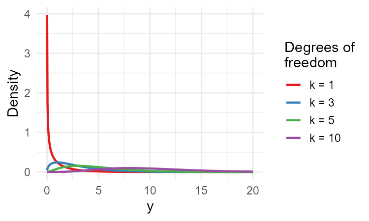
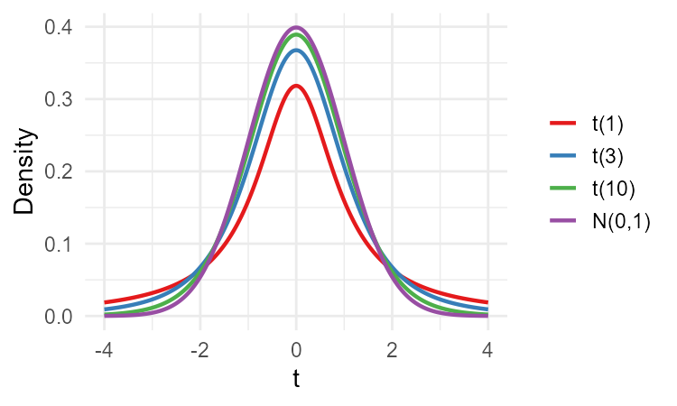
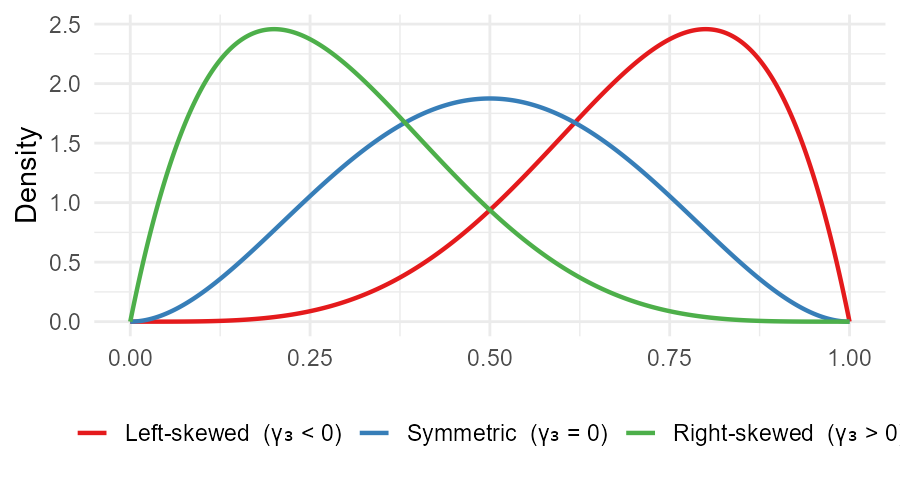
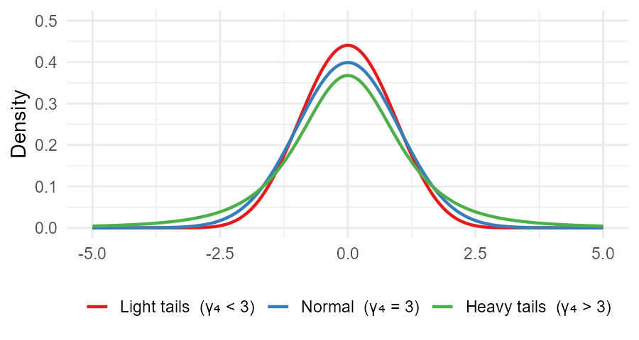

---
output:
  xaringan::moon_reader:
    seal: false
    includes:
      after_body: insert-logo.html
    self_contained: false
    lib_dir: libs
    nature:
      highlightStyle: github
      highlightLines: true
      countIncrementalSlides: false
      ratio: '16:9'
editor_options:
  chunk_output_type: console
---
class: center, inverse, middle

```{r xaringan-panelset, echo=FALSE}
xaringanExtra::use_panelset()
```

```{r xaringan-tile-view, echo=FALSE}
xaringanExtra::use_tile_view()
```

```{r xaringanExtra, echo = FALSE}
xaringanExtra::use_progress_bar(color = "#808080", location = "top")
```

```{css echo=FALSE}
.pull-left {
  float: left;
  width: 44%;
}
.pull-right {
  float: right;
  width: 44%;
}
.pull-right ~ p {
  clear: both;
}


.pull-left-wide {
  float: left;
  width: 66%;
}
.pull-right-wide {
  float: right;
  width: 66%;
}
.pull-right-wide ~ p {
  clear: both;
}

.pull-left-narrow {
  float: left;
  width: 30%;
}
.pull-right-narrow {
  float: right;
  width: 30%;
}

.tiny123 {
  font-size: 0.40em;
}

.small123 {
  font-size: 0.80em;
}

.large123 {
  font-size: 2em;
}

.red {
  color: red
}

.orange {
  color: orange
}

.green {
  color: green
}
```


# Statistics
## Estimators of other descriptive measures
### (Chapter 12)

### Christian Vedel,<br>Department of Economics<br>University of Southern Denmark

### Email: [christian-vs@sam.sdu.dk](mailto:christian-vs@sam.sdu.dk)

### Updated `r Sys.Date()`


???
1 min // 12:16

---
class: middle
# Today's lecture
.pull-left-wide[
**Extending the analogy principle to estimate variance, shape, and distribution**

- **Section 0:** A few more distributions
- **Section 1:** An estimator of the variance
- **Section 2:** Estimators of higher-order moments
- **Section 3:** Estimators of the covariance and correlation coefficient
- **Section 4:** Estimating a distribution
- **Section 5:** Estimators of quantiles
]

.pull-right-narrow[

]

???
2 min // 12:18

---
# The chi-square distribution

```{r chisq-fig-save, eval=FALSE, include=FALSE}
library(ggplot2)
df_chisq <- data.frame(
  x = rep(seq(0.1, 25, length.out = 500), 4),
  k = rep(c(2, 4, 7, 10), each = 500)
)
df_chisq$density <- dchisq(df_chisq$x, df = df_chisq$k)
df_chisq$k <- factor(df_chisq$k, labels = c("k = 2", "k = 4", "k = 7", "k = 10"))

p <- ggplot(df_chisq, aes(x = x, y = density, colour = k)) +
  geom_line(linewidth = 1) +
  scale_colour_brewer(palette = "Set1", name = "Degrees of\nfreedom") +
  coord_cartesian(ylim = c(0, 0.35)) +
  labs(x = "y", y = "Density") +
  theme_minimal(base_size = 14)

ggsave("Statistics/10_Estimators_of_other_measures/Figures/chisq-fig.png", p, width = 5, height = 3, dpi = 150)
```

.pull-left[
> If $Z_1, \ldots, Z_k \overset{iid}{\sim} N(0,1)$, then:
$$Y = \sum_{i=1}^k Z_i^2 \sim \chi^2(k)$$
- $E(Y) = k$, $\quad Var(Y) = 2k$
- Right-skewed, positive values only
- We will use it for the distribution of $S^2$
]

.pull-right[

]

???
3 min // 12:21

---
# The Student's $t$-distribution

```{r t-fig-save, eval=FALSE, include=FALSE}
library(ggplot2)
df_t <- data.frame(
  x = rep(seq(-4, 4, length.out = 500), 4),
  k = rep(c(1, 3, 10, Inf), each = 500)
)
df_t$density <- ifelse(
  df_t$k == Inf,
  dnorm(df_t$x),
  dt(df_t$x, df = df_t$k)
)
df_t$dist <- factor(df_t$k, labels = c("t(1)", "t(3)", "t(10)", "N(0,1)"))

p <- ggplot(df_t, aes(x = x, y = density, colour = dist)) +
  geom_line(linewidth = 1) +
  scale_colour_brewer(palette = "Set1", name = NULL) +
  labs(x = "t", y = "Density") +
  theme_minimal(base_size = 14)

ggsave("Statistics/10_Estimators_of_other_measures/Figures/t-fig.png", p, width = 5, height = 3, dpi = 150)
```

.pull-left[
> If $Z \sim N(0,1)$ and $Y \sim \chi^2(k)$ independent:
$$T = \frac{Z}{\sqrt{Y/k}} \sim t(k)$$
- $E(T) = 0$, $\quad Var(T) = \dfrac{k}{k-2}$
- Heavier tails than normal; $t(k) \to N(0,1)$ as $k \to \infty$
- .red[**Next lecture:** used for CI when $\sigma^2$ is unknown]
]

.pull-right[

]

???
3 min // 12:24

---
# Variance estimators

.pull-left-wide[
**Analogy principle:** estimate $Var(X) = \sum_{i=1}^N (x_i - \mu)^2 \cdot f_X(x_i)$ by replacing all unknown population quantities with sample counterparts
]

--

.pull-left-wide[
> **When $\mu$ is known** — replace $f_X(x_i)$ with $1/n$:
$$\tilde{S}^2 = \frac{1}{n} \cdot \sum_{i=1}^n (X_i - \mu)^2 \quad \text{(unbiased for } \sigma^2\text{)}$$
]

--

.pull-left-wide[
> **When $\mu$ is unknown** — also replace $\mu$ with $\bar{X}$:
$$b^2 = \frac{1}{n} \cdot \sum_{i=1}^n \left(X_i - \bar{X}\right)^2$$
- **Biased:** $E(b^2) = \dfrac{n-1}{n}\sigma^2 < \sigma^2$ — underestimates $\sigma^2$
]

???
4 min // 12:28

---
# The sample variance

.pull-left-wide[
**Why is $b^2$ biased?** Decompose $(X_i - \bar{X}) = (X_i - \mu) - (\bar{X} - \mu)$, square and sum:
$$\sum_{i=1}^n (X_i - \bar{X})^2 = \sum_{i=1}^n (X_i-\mu)^2 - n(\bar{X}-\mu)^2$$
Taking expectations (using $E(X_i-\mu)^2 = \sigma^2$ and $E(\bar{X}-\mu)^2 = \sigma^2/n$):
$$E\!\left[\sum_{i=1}^n (X_i - \bar{X})^2\right] = n\sigma^2 - \sigma^2 = (n-1)\sigma^2, \quad \text{so } E(b^2) = \frac{n-1}{n}\sigma^2 < \sigma^2 \quad\blacksquare$$
]

--

.pull-left-wide[
> Correcting for the bias — divide by $n-1$ instead of $n$:
$$S^2 = \frac{1}{n-1} \cdot \sum_{i=1}^n \left(X_i - \bar{X}\right)^2$$
- $S^2$ is **unbiased** and **consistent** for $\sigma^2$
]

???
10 min // 12:38

---
# An estimator of the standard deviation

.pull-left-wide[
- Natural estimator of $\sigma$: $S = \sqrt{S^2}$
- But $E[g(X)] \neq g[E(X)]$ in general, so:
$$E(S) = E\!\left(\sqrt{S^2}\right) \neq \sqrt{E(S^2)} = \sqrt{\sigma^2} = \sigma$$
]

--

.pull-left-wide[
**Why is $S$ biased?** Since $\sqrt{\cdot}$ is **concave**, Jensen's inequality gives:
$$E(S) = E\!\left[\sqrt{S^2}\right] \leq \sqrt{E\!\left[S^2\right]} = \sigma \quad\blacksquare$$
- $S$ strictly **underestimates** $\sigma$ for finite $n$
- As $n \to \infty$: $S^2 \xrightarrow{p} \sigma^2$, so $S \xrightarrow{p} \sigma$ — **consistent** despite the bias
]

???
3 min // 12:41

---
# Distribution of $S^2$ and the chi-square

.pull-left-wide[
In a normal population, the scaled quantity $Y = S^2 \cdot \dfrac{n-1}{\sigma^2} \sim \chi^2(n-1)$

$$F(S^2 \leq a) = P\!\left(\chi^2(n-1) \leq a \cdot \frac{n-1}{\sigma^2}\right)$$
- The $\chi^2$ distribution is **not symmetric** and takes only positive values
]

--

.pull-left-wide[
**Example:** Wages are normally distributed with $\sigma^2 = 100$. We draw $n = 11$ and observe $S^2 = 130$.

Scale to $\chi^2$: $\quad Y = 130 \cdot \dfrac{10}{100} = 13$

$$F(S^2 \leq 130) = P(\chi^2(10) \leq 13) \approx 0.77$$

About 77% of samples would produce a variance at most this large — not unusual.
]

???
3 min // 12:44

---
# .red[Raise your hand 1: Sample variance]

```{r ryh1-timer, echo=FALSE}
library(countdown)
countdown(0, 20, top=TRUE)
```

.pull-left-wide[
**Q1.** Which of the following are correct reasons to divide by $n - 1$ rather than $n$? (There may be more than one.)

- **A)** It corrects for bias — $b^2$ underestimates $\sigma^2$ because $\bar{X}$ is chosen to minimise the very deviations we are summing
- **B)** The $n$ deviations $(X_i - \bar{X})$ must sum to zero, so only $n-1$ are free
- **C)** It makes $S^2$ consistent — $b^2$ is not consistent
]

--

.pull-left-wide[
**Q2.** $S^2$ is unbiased for $\sigma^2$. Is $S = \sqrt{S^2}$ unbiased for $\sigma$?

- **A)** Yes — the square root of an unbiased estimator is also unbiased
- **B)** Yes — because $S^2$ is consistent, $S$ inherits unbiasedness
- **C)** No — $E(\sqrt{S^2}) \neq \sqrt{E(S^2)}$ in general, so $S$ is biased (though consistent)
]

```{r ryh1-answers, eval=FALSE, include=FALSE}
# ANSWERS
#
# Q1: Answers A and B
#   A: Correct — X_bar minimises the sum of squared deviations from the sample,
#      so (X_i - X_bar) are systematically smaller than (X_i - mu); b^2 is biased downward
#   B: Correct — the n deviations must sum to zero (since sum(X_i - X_bar) = 0),
#      so only n-1 are free; this is the degrees-of-freedom interpretation
#   C: Wrong — both b^2 and S^2 are consistent; the n-1 correction is about
#      unbiasedness, not consistency
#
# Q2: Answer C
#   A: Tempting — sounds like a natural inheritance property; but the square root
#      is a concave transformation so Jensen's inequality gives E(sqrt(S^2)) < sqrt(E(S^2))
#   B: Tempting — consistency and unbiasedness are related concepts; but consistency
#      only guarantees convergence in probability, not that the expected value is exact
#   C: Correct — this is a direct consequence of Jensen's inequality for concave functions
```

???
3 min // 12:47

---
# .red[Practice 1: Sample variance]

.pull-left-wide[
A sample of $n = 5$ observations: $\{2, 4, 4, 6, 9\}$.

1. Calculate $\bar{X}$
2. Calculate $S^2$ (the unbiased sample variance)
3. Why would $b^2 = \frac{1}{n}\sum(X_i - \bar{X})^2$ give a different answer? Calculate $b^2$ and compare
4. For large $n$, does the difference between $S^2$ and $b^2$ matter? Why?
]

```{r practice1-answer, eval=FALSE, include=FALSE}
# ANSWER
# 1. X_bar = (2+4+4+6+9)/5 = 25/5 = 5
#
# 2. Deviations: (2-5)^2=9, (4-5)^2=1, (4-5)^2=1, (6-5)^2=1, (9-5)^2=16
#    Sum = 28
#    S^2 = 28/(5-1) = 28/4 = 7
#
# 3. b^2 = 28/5 = 5.6
#    b^2 < S^2 because it divides by n rather than n-1
#    E(b^2) = (n-1)/n * sigma^2 = 4/5 * sigma^2 — biased downward
#
# 4. For large n, n-1 ≈ n so the difference is negligible.
#    In small samples the correction matters more.
```

???
3 min // 12:50

---
# Central moments and skewness

```{r skewness-fig-save, eval=FALSE, include=FALSE}
library(ggplot2)
x <- seq(0, 1, length.out = 500)
df_skew <- data.frame(
  x = rep(x, 3),
  y = c(dbeta(x, 5, 2),   # left-skewed
        dbeta(x, 3, 3),   # symmetric
        dbeta(x, 2, 5)),  # right-skewed
  type = rep(c("Left-skewed  (γ₃ < 0)", "Symmetric  (γ₃ = 0)", "Right-skewed  (γ₃ > 0)"), each = 500)
)
df_skew$type <- factor(df_skew$type, levels = c("Left-skewed  (γ₃ < 0)", "Symmetric  (γ₃ = 0)", "Right-skewed  (γ₃ > 0)"))
p <- ggplot(df_skew, aes(x = x, y = y, colour = type)) +
  geom_line(linewidth = 1) +
  scale_colour_brewer(palette = "Set1", name = NULL) +
  labs(x = NULL, y = "Density") +
  theme_minimal(base_size = 14) +
  theme(legend.position = "bottom")
ggsave("Statistics/10_Estimators_of_other_measures/Figures/skewness-fig.png", p, width = 6, height = 3.2, dpi = 150)
```

.pull-left[
- The $k$-th **central moment** and its estimator:
$$m_k^* = E\!\left[(X-\mu)^k\right], \quad \hat{m}_k^* = \frac{1}{n}\sum_{i=1}^n(X_i-\bar{X})^k$$

> **Skewness** (standardised 3rd central moment):
$$\gamma_3 = \frac{m_3^*}{\sigma^3}, \qquad \hat{\gamma}_3 = \frac{\hat{m}_3^*}{S^3}$$
- $\gamma_3 > 0$: right-skewed (long right tail)
- $\gamma_3 < 0$: left-skewed (long left tail)
- $\gamma_3 = 0$: symmetric
]

.pull-right[

]

???
4 min // 12:54

---
# Kurtosis

```{r kurtosis-fig-save, eval=FALSE, include=FALSE}
library(ggplot2)
x <- seq(-5, 5, length.out = 500)
# Light tails: Beta(10,10) rescaled from [0,1] to [-4,4]
y_light <- dbeta((x + 4) / 8, 10, 10) / 8
df_kurt <- data.frame(
  x = rep(x, 3),
  y = c(dnorm(x),
        dt(x, df = 3),  # heavy tails (high kurtosis)
        y_light),       # light tails (low kurtosis)
  type = rep(c("Normal  (γ₄ = 3)", "Heavy tails  (γ₄ > 3)", "Light tails  (γ₄ < 3)"), each = 500)
)
df_kurt$type <- factor(df_kurt$type, levels = c("Light tails  (γ₄ < 3)", "Normal  (γ₄ = 3)", "Heavy tails  (γ₄ > 3)"))
p <- ggplot(df_kurt, aes(x = x, y = y, colour = type)) +
  geom_line(linewidth = 1) +
  scale_colour_brewer(palette = "Set1", name = NULL) +
  coord_cartesian(ylim = c(0, 0.5)) +
  labs(x = NULL, y = "Density") +
  theme_minimal(base_size = 14) +
  theme(legend.position = "bottom")
ggsave("Statistics/10_Estimators_of_other_measures/Figures/kurtosis-fig.png", p, width = 6, height = 3.2, dpi = 150)
```

.pull-left[
> **Kurtosis** is the standardised fourth central moment:
$$\gamma_4 = \frac{m_4^*}{\sigma^4}, \qquad \hat{\gamma}_4 = \frac{\hat{m}_4^*}{S^4}$$

- $\gamma_4 > 3$: heavier tails than normal (leptokurtic)
- $\gamma_4 < 3$: lighter tails (platykurtic)
- $\gamma_4 = 3$: normal distribution
- Deviations from $\gamma_3 = 0$ or $\gamma_4 = 3$ signal non-normality
]

.pull-right[

]

???
3 min // 12:57

---
# .red[Raise your hand 2: Skewness and kurtosis]

```{r ryh2-timer, echo=FALSE}
library(countdown)
countdown(0, 20, top=TRUE)
```

.pull-left-wide[
**Q1.** A sample gives $\hat{\gamma}_3 = 1.8$. What does this indicate?

- **A)** The distribution has a longer right tail than left — it is right-skewed
- **B)** The distribution is more peaked than the normal
- **C)** The distribution has higher variance than a symmetric distribution would
]

--

.pull-left-wide[
**Q2.** A sample gives $\hat{\gamma}_4 = 5$, compared to 3 for the normal. What does this suggest?

- **A)** The distribution is more spread out (higher variance) than the normal
- **B)** The distribution has heavier tails and a sharper peak than the normal — excess kurtosis
- **C)** The distribution is right-skewed
]

```{r ryh2-answers, eval=FALSE, include=FALSE}
# ANSWERS
#
# Q1: Answer A
#   A: Correct — positive gamma_3 means the right tail is heavier; the mass is pulled
#      toward the right
#   B: Tempting — students sometimes confuse skewness and kurtosis; peakedness is
#      measured by gamma_4, not gamma_3
#   C: Tempting — a skewed distribution does often have a different variance; but
#      gamma_3 specifically measures asymmetry, not spread
#
# Q2: Answer B
#   A: Tempting — higher kurtosis sounds like "more spread out"; but kurtosis measures
#      the concentration of mass in the tails relative to the shoulders, not total variance
#   B: Correct — kurtosis > 3 (excess kurtosis > 0) means heavier tails and sharper
#      peak than normal; called leptokurtic
#   C: Tempting — students may confuse kurtosis with skewness; gamma_3 measures
#      asymmetry, gamma_4 measures tail weight / peakedness
```

???
3 min // 13:00 — BREAK

---
# .red[Practice 2: Skewness and kurtosis]

.pull-left-wide[
A dataset of $n = 6$ income values (in €k): $\{10, 12, 14, 14, 16, 60\}$.

1. Calculate $\bar{X}$ and $S^2$
2. Calculate $\hat{m}_3^*$ (the third central moment)
3. Calculate $\hat{\gamma}_3$. Is income right- or left-skewed? Does this make intuitive sense?
]

```{r practice2-answer, eval=FALSE, include=FALSE}
# ANSWER
# 1. X_bar = (10+12+14+14+16+60)/6 = 126/6 = 21
#    Deviations: -11, -9, -7, -7, -5, 39
#    Sum of sq dev = 121+81+49+49+25+1521 = 1846
#    S^2 = 1846/5 = 369.2
#    S = sqrt(369.2) ≈ 19.21
#
# 2. m_hat_3* = (1/6) * [(-11)^3 + (-9)^3 + (-7)^3 + (-7)^3 + (-5)^3 + 39^3]
#             = (1/6) * [-1331 - 729 - 343 - 343 - 125 + 59319]
#             = (1/6) * 56448 = 9408
#
# 3. gamma_hat_3 = 9408 / 19.21^3 = 9408 / 7096.5 ≈ 1.33
#    Positive: right-skewed — the one high-income outlier (60) pulls the right tail
#    This is typical of income distributions
```

???
4 min // 13:19 — SESSION 2 resumes 13:15

---
# Covariance and correlation

.pull-left-wide[
> The **sample covariance** is:
$$\widehat{Cov}(X, Y) = \frac{1}{n} \cdot \sum_{i=1}^n \left(X_i - \bar{X}\right)\!\left(Y_i - \bar{Y}\right)$$
- Constructed by replacing $\mu_X$, $\mu_Y$, and $f(x_i, y_j)$ with their sample counterparts
]

--

.pull-left-wide[
> The **sample correlation coefficient** is:
$$\hat{\rho}(X, Y) = \frac{\widehat{Cov}(X, Y)}{\sqrt{S_X^2 \cdot S_Y^2}}$$
- For large $n$: $\hat{\rho}(X, Y) \overset{a}{\sim} \mathcal{N}\!\left(\rho,\, \dfrac{(1 - \rho^2)^2}{n - 2}\right)$
]

???
4 min // 13:23

---
# .red[Raise your hand 3: Covariance and correlation]

```{r ryh3-timer, echo=FALSE}
library(countdown)
countdown(0, 20, top=TRUE)
```

.pull-left-wide[
**Q1.** $\widehat{Cov}(X, Y) = 0$ in a sample. Can we conclude that $X$ and $Y$ are independent?

- **A)** No — zero covariance rules out a linear relationship but not non-linear dependence
- **B)** Yes — zero covariance is equivalent to independence
- **C)** Only if both $X$ and $Y$ are normally distributed, since normality makes independence and zero covariance equivalent
]

--

.pull-left-wide[
**Q2.** $\hat{\rho} = 0.9$ between education and income. A colleague concludes "education causes higher income." What is the problem?

- **A)** Nothing — high correlation always implies causation
- **B)** Correlation measures linear association, not causation — a common cause (e.g. family background) could drive both
- **C)** The formula for $\hat{\rho}$ is only valid when both variables are normally distributed
]

```{r ryh3-answers, eval=FALSE, include=FALSE}
# ANSWERS
#
# Q1: Answer A
#   A: Correct — zero covariance means no *linear* relationship; non-linear relationships
#      (e.g. X and X^2 where X is symmetric around zero) can have zero covariance
#      but clear dependence
#   B: Tempting — students often learn "independent => zero covariance" and reverse it;
#      the reverse is only true for jointly normal variables
#   C: Tempting — this correctly identifies the normality exception; but it overstates
#      the case: the statement in A is always true regardless of distribution
#
# Q2: Answer B
#   A: Tempting — students who confuse correlation and causation pick this directly
#   B: Correct — correlation is a symmetric measure of linear association; it cannot
#      distinguish X->Y from Y->X from a common cause Z->X and Z->Y
#   C: Tempting — normality assumptions do appear in statistical inference; but the
#      formula for rho_hat is valid regardless of distribution; the approximate normal
#      distribution of rho_hat requires large n, not normality of X and Y
```

???
4 min // 13:27

---
# .red[Practice 3: Covariance and correlation]

.pull-left-wide[
A researcher records hours of sleep the night before an exam and the exam score for 5 students:

| Student | Sleep $X$ (hrs) | Score $Y$ |
|:---:|:---:|:---:|
| 1 | 4 | 45 |
| 2 | 6 | 60 |
| 3 | 7 | 70 |
| 4 | 8 | 80 |
| 5 | 9 | 85 |

1. Calculate $\bar{X}$, $\bar{Y}$, $S_X^2$, $S_Y^2$
2. Calculate $\widehat{Cov}(X, Y)$
3. Calculate $\hat{\rho}(X, Y)$. Interpret the result
4. Does this prove that more sleep *causes* better exam scores?
]

```{r practice3-answer, eval=FALSE, include=FALSE}
# ANSWER
# 1. X_bar = (4+6+7+8+9)/5 = 34/5 = 6.8
#    Y_bar = (45+60+70+80+85)/5 = 340/5 = 68
#    S_X^2 = [(4-6.8)^2+(6-6.8)^2+(7-6.8)^2+(8-6.8)^2+(9-6.8)^2] / 4
#          = [7.84+0.64+0.04+1.44+4.84] / 4 = 14.8/4 = 3.7
#    S_Y^2 = [(45-68)^2+(60-68)^2+(70-68)^2+(80-68)^2+(85-68)^2] / 4
#          = [529+64+4+144+289] / 4 = 1030/4 = 257.5
#
# 2. Cov_hat = (1/5)*[(-2.8)(-23)+(-0.8)(-8)+(0.2)(2)+(1.2)(12)+(2.2)(17)]
#            = (1/5)*[64.4 + 6.4 + 0.4 + 14.4 + 37.4]
#            = (1/5)*123 = 24.6
#
# 3. rho_hat = 24.6 / sqrt(3.7 * 257.5) = 24.6 / sqrt(952.75) = 24.6 / 30.87 ≈ 0.80
#    Strong positive linear relationship — students who sleep more tend to score higher
#
# 4. No — correlation measures association, not causation.
#    A common cause (e.g. being well-prepared) could drive both more sleep AND better scores.
#    Or students who study more may sleep better because they feel confident.
```

???
4 min // 13:31

---
# The empirical distribution function

.pull-left-wide[
- Recall that the CDF is $F_X(x) = P(X \leq x)$; by the analogy principle, $P(X \leq x)$ is estimated by the fraction of sample observations $\leq x$

> $$\hat{F}_X(x) = \frac{\text{number of sample elements with } x_i \leq x}{n}$$
]

--

.pull-left-wide[
- **Unbiased and consistent:** $E\!\left[\hat{F}_X(x)\right] = F_X(x)$ for all $x$
- **Asymptotically normal:**
$$\hat{F}_X(x) \overset{a}{\sim} \mathcal{N}\!\left(F_X(x),\; \frac{F_X(x)\left[1 - F_X(x)\right]}{n}\right)$$
- Useful for: normality tests, comparing distributions, non-parametric CI for the full CDF
]

???
4 min // 13:35

---
# .red[Raise your hand 4: Empirical distribution function]

```{r ryh4-timer, echo=FALSE}
library(countdown)
countdown(0, 20, top=TRUE)
```

.pull-left-wide[
**Q1.** A sample of $n = 10$ gives $\hat{F}_X(3) = 0.4$. What does this mean?

- **A)** 40% of the sample observations are $\leq 3$
- **B)** The probability that $X = 3$ in the population is 0.4
- **C)** The 40th percentile of the distribution equals 3
]

--

.pull-left-wide[
**Q2.** Why is $\hat{F}_X(x)$ approximately normally distributed for large $n$?

- **A)** Because the CDF $F_X(x)$ is a smooth, continuous function
- **B)** Because $\hat{F}_X(x)$ is a sample proportion — the mean of Bernoulli indicators $\mathbf{1}(X_i \leq x)$ — and the CLT applies
- **C)** Because all sample statistics are approximately normal for large $n$
]

```{r ryh4-answers, eval=FALSE, include=FALSE}
# ANSWERS
#
# Q1: Answer A
#   A: Correct — F_hat(3) counts the fraction of observations at or below 3
#   B: Tempting — students may confuse the CDF with a point probability; F_hat(3)
#      gives cumulative probability up to 3, not the probability of exactly 3
#   C: Tempting — this sounds related (quantile vs CDF are inverses); but q_0.4 = 3
#      is the correct inverse statement; F_hat(3) = 0.4 says something about the value 3,
#      not about the 40th percentile
#
# Q2: Answer B
#   A: Tempting — the smoothness of F_X(x) sounds relevant; but the normality of
#      F_hat_X(x) comes from the sampling distribution, not the shape of the CDF
#   B: Correct — 1(X_i <= x) are iid Bernoulli(F_X(x)) variables; their average
#      F_hat_X(x) is approximately normal by the CLT
#   C: Tempting — the CLT does apply broadly; but not all sample statistics are
#      approximately normal; the specific reason here is the Bernoulli structure
```


???
4 min // 13:39

---
# Estimated quantiles

.pull-left-wide[
- Recall: the $p$-th quantile $q_p$ is the value where $F_X$ crosses $p$
- We estimate quantiles from the empirical distribution function: $\hat{q}_p$ is where $\hat{F}_X$ crosses $p$
]

--

.pull-left-wide[
- For example, the **sample median** $\hat{q}_{0.5}$ is the value where $\hat{F}_X$ crosses 0.5
- If this crossing happens over an interval, we use the midpoint as the sample median
]

???
3 min // 13:42

---
# Order statistics and the sample median

.pull-left-wide[
> The $k$-th **order statistic** $X_{(k)}$ is the $k$-th smallest observation. Estimator of the $p$-th quantile:
$$\hat{q}_p = \begin{cases} X_{(np + 1)}, & \text{if } [np] \neq np \\ \dfrac{X_{(np)} + X_{(np + 1)}}{2}, & \text{if } [np] = np \end{cases}$$
where $[np]$ denotes the integer part of $np$
]

--

.pull-left-wide[
**Sample median** ($p = 0.5$):
$$\hat{q}_{0.5} = \begin{cases} X_{\left(\frac{n+1}{2}\right)}, & \text{if } n \text{ is odd} \\ \dfrac{X_{\left(\frac{n}{2}\right)} + X_{\left(\frac{n}{2}+1\right)}}{2}, & \text{if } n \text{ is even} \end{cases}$$
- Robust to outliers — unlike the sample mean; useful when the distribution is skewed
]

???
4 min // 13:46

---
# .red[Raise your hand 5: Quantiles]

```{r ryh5-timer, echo=FALSE}
library(countdown)
countdown(0, 20, top=TRUE)
```

.pull-left-wide[
**Q1.** A sample of $n = 10$ sorted observations. What is the sample median?

- **A)** $X_{(5)}$ — the 5th order statistic
- **B)** $X_{(6)}$ — the 6th order statistic
- **C)** $\dfrac{X_{(5)} + X_{(6)}}{2}$ — the average of the 5th and 6th, because $n$ is even
]

--

.pull-left-wide[
**Q2.** A sample gives $\hat{q}_{0.25} = 50$. What does this mean?

- **A)** 25% of the sample observations fall at or below 50
- **B)** The mean of the bottom quarter of the distribution is 50
- **C)** The value 50 occurs with frequency 25% in the sample
]

```{r ryh5-answers, eval=FALSE, include=FALSE}
# ANSWERS
#
# Q1: Answer C
#   A: Tempting — X_(5) is the middle of a 9-element sample; for n=10 it is one of
#      the two middle values but not the median on its own
#   B: Tempting — X_(6) is also a middle value; same reasoning as A
#   C: Correct — with n=10 (even), n*p = 10*0.5 = 5 is an integer, so we average
#      X_(5) and X_(6)
#
# Q2: Answer A
#   A: Correct — the p-th quantile q_p satisfies F(q_p) = p; so q_0.25 = 50 means
#      25% of observations are at or below 50
#   B: Tempting — sounds plausible as a description of the "bottom quarter";
#      but that would be the conditional mean E(X | X <= q_0.25), not the quantile itself
#   C: Tempting — sounds like a frequency statement, which quantiles are related to;
#      but a frequency of 25% would mean X=50 appears in a quarter of observations,
#      which is a very different statement
```

???
4 min // 13:50

---
# .red[Practice 5: Order statistics and quantiles]

.pull-left-wide[
A sorted sample of $n = 9$: $\{3, 5, 7, 8, 10, 11, 14, 18, 25\}$.

1. Find the sample median $\hat{q}_{0.5}$
2. Find the first quartile $\hat{q}_{0.25}$
3. Find the third quartile $\hat{q}_{0.75}$
4. Calculate the interquartile range $\hat{q}_{0.75} - \hat{q}_{0.25}$. Why is this a useful summary of spread?
]

```{r practice5-answer, eval=FALSE, include=FALSE}
# ANSWER
# n=9 (odd)
#
# 1. Median: p=0.5, n*p = 9*0.5 = 4.5, not integer, so q_hat = X_(4.5+1) = X_(5) = 10
#
# 2. Q1: p=0.25, n*p = 9*0.25 = 2.25, not integer, so q_hat = X_(2.25+1) = X_(3) = 7
#
# 3. Q3: p=0.75, n*p = 9*0.75 = 6.75, not integer, so q_hat = X_(6.75+1) = X_(7) = 14
#
# 4. IQR = 14 - 7 = 7
#    IQR is robust to outliers (unlike the range or variance), because it only
#    uses the middle 50% of the data. It is a useful spread measure when the
#    distribution is skewed or contains extreme values.
```

???
4 min // 13:54

---
# Key takeaways

.pull-left-wide[
**Variance:** $S^2 = \frac{1}{n-1}\sum(X_i - \bar{X})^2$ — unbiased; $S$ is biased but consistent for $\sigma$

**Higher-order moments:** $\hat{m}_k^* = \frac{1}{n}\sum(X_i - \bar{X})^k$ — skewness ($\gamma_3$) and kurtosis ($\gamma_4$) compare shape to the normal
]

--

.pull-left-wide[
**Covariance and correlation:**
$$\widehat{Cov}(X,Y) = \frac{1}{n}\sum(X_i-\bar{X})(Y_i-\bar{Y}), \quad \hat{\rho} = \frac{\widehat{Cov}(X,Y)}{\sqrt{S_X^2 S_Y^2}}$$
]

--

.pull-left-wide[
**EDF and quantiles:** $\hat{F}_X(x) = \frac{\#\{x_i \leq x\}}{n}$ — unbiased, consistent, asymptotically normal; quantiles estimated via order statistics
]

???
4 min // 13:58

---
# Before next time
.pull-left[
- Read the assigned reading
- Next time: Confidence intervals $\rightarrow$ Chapter 13
]

.pull-right[

]

???
2 min // 14:00
