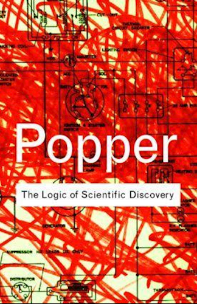
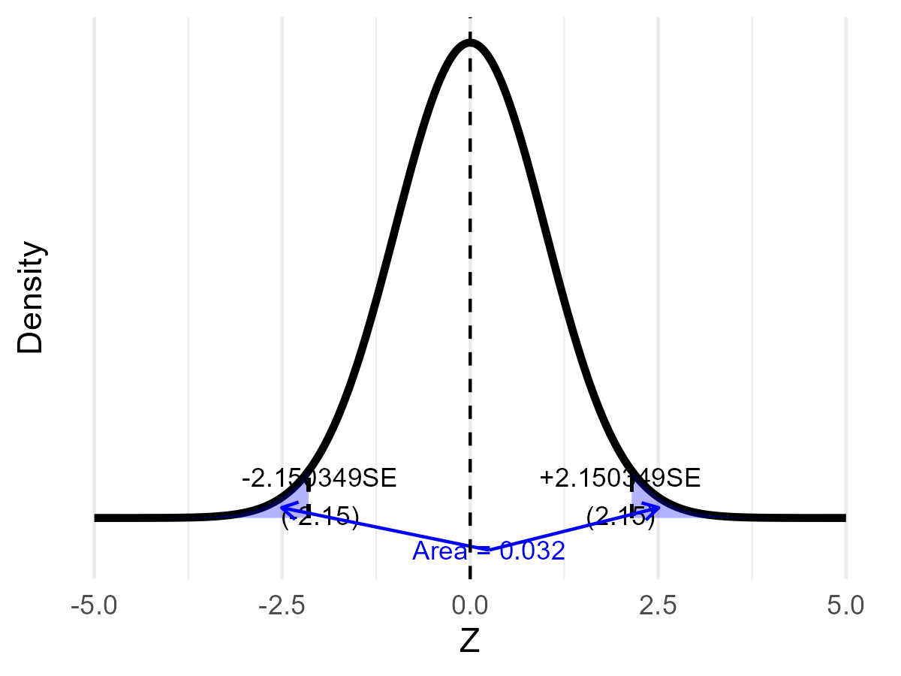

---
output:
  xaringan::moon_reader:
    seal: false
    includes:
      after_body: insert-logo.html
    self_contained: false
    lib_dir: libs
    nature:
      highlightStyle: github
      highlightLines: true
      countIncrementalSlides: false
      ratio: '16:9'
editor_options:
  chunk_output_type: console
---
class: center, inverse, middle

```{r xaringan-panelset, echo=FALSE}
xaringanExtra::use_panelset()
```

```{r xaringan-tile-view, echo=FALSE}
xaringanExtra::use_tile_view()
```

```{r xaringanExtra, echo = FALSE}
xaringanExtra::use_progress_bar(color = "#808080", location = "top")
```

```{css echo=FALSE}
.pull-left {
  float: left;
  width: 44%;
}
.pull-right {
  float: right;
  width: 44%;
}
.pull-right ~ p {
  clear: both;
}


.pull-left-wide {
  float: left;
  width: 66%;
}
.pull-right-wide {
  float: right;
  width: 66%;
}
.pull-right-wide ~ p {
  clear: both;
}

.pull-left-narrow {
  float: left;
  width: 30%;
}
.pull-right-narrow {
  float: right;
  width: 30%;
}

.tiny123 {
  font-size: 0.40em;
}

.small123 {
  font-size: 0.80em;
}

.large123 {
  font-size: 2em;
}

.red {
  color: red
}

.orange {
  color: orange
}

.green {
  color: green
}
```


# Statistics
## Testing hypotheses
### (Chapter 14)

### Christian Vedel,<br>Department of Economics<br>University of Southern Denmark

### Email: [christian-vs@sam.sdu.dk](mailto:christian-vs@sam.sdu.dk)

### Updated `r Sys.Date()`


---
class: middle
# Today's lecture
.pull-left-wide[
**Building a rigorous framework for deciding whether sample evidence is strong enough to reject a theory**

- **Section 1:** Hypotheses and types of error
- **Section 2:** Construction of a hypothesis test
- **Section 3:** Test of the mean value
- **Section 4:** Simple and composite hypotheses
- **Section 5:** The p-value
- **Section 6:** Choice of sample size
- **Section 7:** Test of variance
- **Section 8:** Other topics
]

.pull-right-narrow[

]

---
# Philosophy of Science: An Overview

.pull-left-wide[
- **Purpose of science:** to build reliable knowledge about the world
- **Central idea:** we can never *prove* a theory absolutely — we only gather evidence that supports or contradicts it
- **Core principle:** all scientific knowledge is provisional and subject to revision
]

.pull-right-narrow[

*(AI-generated): Enlightenment in the 21st century*
]

---
# Falsifiability: The Cornerstone of Science

.pull-left-wide[
- **Key concept (Popper):** a theory is scientific only if it is *falsifiable* — only if evidence could, in principle, refute it
- **Implication:** rather than seeking proof, scientists look for evidence that can refute a hypothesis
- **In practice:** hypothesis testing is a statistical tool to assess whether data contradicts our assumptions
]

.pull-right-narrow[
.pull-right-wide[  

.small123[*Front page of Popper's* The Logic of Scientific Discovery]
]
]

---
# From Philosophy to Hypothesis Testing

.pull-left-wide[
We cannot *prove* theories — we can only challenge them. Hypothesis testing formalises this:

1. Assume a **null hypothesis** $H_0$ (the status quo)
2. Collect data and ask: how likely is the observed result *if $H_0$ were true*?
3. If that probability is very small, we have evidence against $H_0$

> This is exactly why we say we *reject* $H_0$ — never that we *prove* $H_1$
]

.pull-right-narrow[

]

---
class: inverse, middle, center
# Hypotheses and types of error

---
# Hypothesis testing

.pull-left-wide[
We want to test specific theories using data — e.g. is the propensity to consume between 0 and 1, or do people exercise the recommended 2 hours per week?

The recipe for **hypothesis testing**:

1. Formulate two hypotheses: one conforming with the theory and one rejecting it
2. Construct a **test statistic** that embodies all relevant sample information
3. Choose a **decision rule** that tells us when to reject based on the test statistic

> A theory is valid until we find evidence against it — we can **never** accept a theory, only fail to reject it
]

---
# Constructing hypotheses

.pull-left-wide[
Two hypotheses:
- the **null hypothesis** $H_0$, which does not support the theory
- the **alternative hypothesis** $H_1$, which supports the theory

We need sufficient evidence against $H_0$ to reject it — this evidence comes from a sample and is therefore uncertain.
]

--

.pull-left-wide[
**Examples:**

**Criminal trial:** $H_0$: innocent; $H_1$: guilty

**Wage discrimination:** $H_0$: $\mu_{\text{men}} = \mu_{\text{women}}$; $H_1$: $\mu_{\text{men}} \not= \mu_{\text{women}}$
]

---
# Errors

.pull-left-wide[
Faced with uncertainty, we may make two types of errors:

- **Type-I error**: reject $H_0$ when, in fact, it is true

- **Type-II error**: do not reject $H_0$ when, in fact, it is false
]

--

.pull-left-wide[
| | $H_0$ true | $H_0$ false |
|---|:---:|:---:|
| **$H_0$ rejected** | type-I error | OK |
| **$H_0$ not rejected** | OK | type-II error |
]

---
# Power and significance

.pull-left-wide[
> **Significance level** $\alpha$: probability of a type-I error
$$\alpha = P(\text{type-I error}) = P(\text{reject } H_0 \mid H_0 \text{ true})$$

> **Type-II error** probability $\beta$:
$$\beta = P(\text{type-II error}) = P(\text{do not reject } H_0 \mid H_0 \text{ false})$$

> **Power** of a test: $(1 - \beta)$ — a more powerful test has a lower probability of a type-II error
]

.pull-right-narrow[
Note: $H_0$ is either true or not, but this is unknown. Randomness comes from the sample.
]

---
# .red[Raise your hand 1: Errors and hypotheses]

```{r ryh1-timer, echo=FALSE}
library(countdown)
countdown(0, 20, top=TRUE)
```

.pull-left-wide[
**Q1.** A clinical trial tests whether a new drug reduces blood pressure ($H_0$: drug has no effect). A **type-I error** here means:

- **A)** Approving a drug that genuinely has no effect
- **B)** Failing to approve a drug that genuinely works
- **C)** Setting $\alpha$ too small, making rejection harder
]

--

.pull-left-wide[
**Q2.** A researcher lowers the significance level from $\alpha = 0.05$ to $\alpha = 0.01$, keeping the sample size fixed. The effect on $\beta$ is:

- **A)** $\beta$ increases — a stricter rejection threshold makes it harder to detect a true effect
- **B)** $\beta$ decreases — fewer false rejections also means fewer missed detections
- **C)** Power increases — only strong evidence now leads to rejection, making the test more reliable
]

```{r ryh1-answers, eval=FALSE, include=FALSE}
# ANSWERS
#
# Q1: Answer A
#   A: Correct — type-I error is rejecting a true H₀; approving a drug that has no effect
#      is exactly that: we rejected H₀ (no effect) when H₀ was actually true
#   B: Tempting — this is a type-II error (failing to reject a false H₀, i.e. missing
#      a drug that genuinely works)
#   C: Tempting — small α does make rejection harder, but α itself is the probability
#      of making a type-I error, not the error event itself
#
# Q2: Answer A
#   A: Correct — lowering α raises the rejection bar, so a real effect is harder to
#      detect; the probability of missing it (β) therefore increases
#   B: Tempting — confuses the direction; fewer false positives (lower α) does not
#      reduce missed detections; it increases them
#   C: Wrong — confuses "conservative" with "powerful"; a stricter threshold means
#      less power (1−β falls), not more
```

---
class: inverse, middle, center
# Construction of a hypothesis test

---
# Setup

.pull-left-wide[
Simple example: test whether $\mu$ equals one of two known constants $\mu_0 < \mu_1$:
$$\begin{align*} H_0 & : \mu = \mu_0 \\ H_1 & : \mu = \mu_1 \end{align*}$$

Sample: $(X_1, \ldots, X_n)$ with $X_i \sim \mathcal{N}(\mu, \sigma^2)$, $\sigma^2$ known.
]

---
# Hypothesis measure and test statistic

.pull-left-wide[
A **hypothesis measure** indicates whether $H_0$ is rejected:
$$h(\mu) = \mu - \mu_0$$

- If $H_0$ true: $h(\mu) = 0$; if $H_0$ false: $h(\mu) = \mu_1 - \mu_0$

Replacing $\mu$ with $\bar{X}$ gives the estimated hypothesis measure $h(\bar{X})$.
]

--

.pull-left-wide[
The **test statistic** is the normalised estimated hypothesis measure:
$$Z = \frac{\bar{X} - \mu_0}{\sqrt{\sigma^2/n}}$$

Under $H_0$: $Z \sim \mathcal{N}(0,1)$; under $H_1$: $Z \sim \mathcal{N}\!\left(\dfrac{\mu_1-\mu_0}{\sqrt{\sigma^2/n}},1\right)$
]

---
# Decision rule and significance level

.pull-left-wide[
Since $\mu_0 < \mu_1$, large values of $Z$ support $H_1$:

- do not reject $H_0$ if $Z \leq c$
- reject $H_0$ if $Z > c$

The significance level fixes the critical value:
$$\alpha = P(Z > c \mid \mu = \mu_0) = 1 - \Phi(c) \quad \Rightarrow \quad c = z_{1-\alpha}$$
]

--

.pull-left-wide[
> **Tradeoff:** As $\alpha \downarrow$, $z_{1-\alpha} \uparrow$, and $\beta = \Phi\!\left(z_{1-\alpha} - \dfrac{\mu_1-\mu_0}{\sqrt{\sigma^2/n}}\right) \uparrow$

For a given $\alpha$ we must accept a corresponding $\beta$.
]

---
# Types of hypotheses

.pull-left-wide[
- **Simple**: only one value satisfies the hypothesis (e.g., $\mu = \mu_0$)
- **Composite**: several values satisfy it (e.g., $\mu > \mu_0$ or $\mu \not= \mu_0$)

**Two-sided test** — the alternative is composite:
$$\begin{align*} H_0 & : \mu = \mu_0 \\ H_1 & : \mu \not= \mu_0 \end{align*}$$

Decision rule (symmetric around $\mu_0$):
- do not reject $H_0$ if $z_{\alpha/2} \leq Z \leq z_{1-\alpha/2}$
- reject $H_0$ if $Z < z_{\alpha/2}$ or $Z > z_{1-\alpha/2}$
]

---
# One-sided and composite null

.pull-left-wide[
**One-sided test** (theory implies direction):
$$\begin{align*} H_0 & : \mu = \mu_0 \\ H_1 & : \mu > \mu_0 \end{align*}$$

Decision rule: reject $H_0$ if $Z > z_{1-\alpha}$.

**Composite null** (more realistic):
$$\begin{align*} H_0 & : \mu \leq \mu_0 \\ H_1 & : \mu > \mu_0 \end{align*}$$

Conducted in exactly the same way as the one-sided test — same decision rule.
]


---
# Example: Testing savings rate

.pull-left-wide[
**Setting:** A simple calibrated OLG model predicts savings rate at $\mu_0 = 0.10$. We survey $n = 1000$ households (CLT applies). Prior data suggest that the standard deviation $\sigma = 0.06$.

$$H_0: \mu = 0.10 \qquad H_1: \mu \neq 0.10$$

At $\alpha = 0.05$: $\quad c = z_{0.975} = 1.96$

The survey yields $\bar{X} = 0.104$:

$$
Z = \frac{0.104 - 0.10}{0.06/\sqrt{1000}}
= \frac{0.004}{0.0019}
\approx 2.11
$$

$$
|Z| = 2.11 > c = 1.96
\quad \Rightarrow \quad \textbf{reject } H_0
$$

The sample mean is statistically different from $0.10$ at the 5 percent level. 

The observations are inconsistent with the hypothesis. 

]

--

.pull-right-narrow[
.small123[
**Where could 0.10 come from?**

Simple life-cycle logic: households save during working life to finance retirement.

Suppose people work for $T_w = 40$ years and are retired for $T_r = 20$ years. If public pensions and healthcare cover about $b = 0.80$ of retirement needs, households need to privately finance the remaining 20 percent.

A rough implied saving rate is:

$$
s = (1-b)\cdot \frac{T_r}{T_w}
\approx 0.20 \times \frac{20}{40}
= 0.10
$$

**Economic significance:** A 0.004 difference might be negligible in practice. We have to consider whether the difference matters in practice. (More on this later.)

]
]

---
class: inverse, middle, center
# Test of mean value under different distributional assumptions

---
# Four cases

.pull-left-wide[
We test $H_0: \mu = \mu_0$ using $Z = (\bar{X} - \mu_0)/\sqrt{\hat\sigma^2/n}$

| Distribution | Variance | Distribution of $Z$ under $H_0$ |
|---|---|---|
| Unknown | Known $\sigma^2$ | $Z \overset{a}{\sim} \mathcal{N}(0,1)$ |
| Unknown | Unknown (use $S^2$) | $Z \overset{a}{\sim} \mathcal{N}(0,1)$ |
| Normal | Known $\sigma^2$ | $Z \sim \mathcal{N}(0,1)$ exactly |
| Normal | Unknown (use $S^2$) | $Z \sim t(n-1)$ exactly |

In all cases: reject $H_0$ if $Z > z_{1-\alpha}$ (or $t_{1-\alpha}(n-1)$ for the last case).
]

.pull-right-narrow[
.small123[
**Note:** The unknown-distribution cases rely on the CLT; the normal cases give exact distributions.
]
]

---
# The t-Distribution: Origin Story

.pull-left-wide[
- Developed by **William Sealy Gosset** (1876–1937), publishing under the pseudonym **"Student"** to protect Guinness trade secrets
- Working at the Guinness Brewery, he needed to draw reliable statistical conclusions from *small* samples — e.g. barley quality for brewing
- His 1908 paper introduced what became **Student's t-distribution**
- Key insight: when $\sigma^2$ is unknown and must be estimated from the same sample, the extra uncertainty fattens the tails — and the degree of fattening depends on sample size $n$
]

.pull-right-narrow[

*Guinness (Wikimedia Commons)*
]

---
# Bernoulli distributed observations

.pull-left-wide[
If $X \sim \text{Bernoulli}(p)$, the mean represents $p$ and the variance is $p(1-p)$.

Test $H_0: p = p_0$ vs $H_1: p = p_1$ ($p_0 < p_1$):
$$Z = \frac{\bar{X} - p_0}{\sqrt{p_0(1-p_0)/n}} \overset{a}{\sim} \mathcal{N}(0,1) \text{ under } H_0$$

Decision rule: reject $H_0$ if $Z > z_{1-\alpha}$.
]

---
# .red[Raise your hand 2: Which test statistic?]

```{r ryh2-timer, echo=FALSE}
library(countdown)
countdown(0, 20, top=TRUE)
```

.pull-left-wide[
**Q1.** You have $n=50$ observations from an **unknown** distribution with **known** variance $\sigma^2=4$. Under $H_0: \mu=10$, the test statistic $Z = (\bar{X}-10)/(2/\sqrt{50})$ follows:

- **A)** $\mathcal{N}(0,1)$ approximately, by the CLT
- **B)** $\mathcal{N}(0,1)$ exactly, because $\sigma^2$ is known
- **C)** $t(49)$, because we are estimating from a sample
]

--

.pull-left-wide[
**Q2.** If $X \sim \mathcal{N}(\mu,\sigma^2)$ and $\sigma^2$ is **unknown**, the statistic $T = (\bar{X}-\mu_0)/(S/\sqrt{n})$ follows under $H_0$:

- **A)** $t(n-1)$ exactly
- **B)** $\mathcal{N}(0,1)$ approximately
- **C)** $t(n)$
]

```{r ryh2-answers, eval=FALSE, include=FALSE}
# ANSWERS
#
# Q1: Answer A
#   A: Correct — unknown distribution + large n → CLT gives approximate N(0,1);
#      σ² known means we plug it in directly (no extra estimation uncertainty)
#   B: Tempting — "exactly" requires the underlying distribution to be normal;
#      with an unknown distribution only the CLT approximation applies
#   C: Tempting — the t arises when σ² must be estimated by S²; knowing σ² means
#      we use the normal, not the t
#
# Q2: Answer A
#   A: Correct — when X is normal and σ² is replaced by S², the standardised mean
#      (X̄ − μ₀)/(S/√n) exactly follows t(n−1)
#   B: Tempting — the normal approximation is for unknown-distribution cases (CLT);
#      normal X + unknown σ² gives an exact t, not an approximate normal
#   C: Tempting — off by one; one df is consumed estimating the mean from the same
#      sample, leaving n−1 free degrees of freedom
```

---
# .red[Practice 2: Full hypothesis test]

.pull-left-wide[
A bank claims the average waiting time is 5 minutes. A sample of $n=25$ waiting times gives $\bar{X}=6.2$ minutes and $S^2=4$ min². Assume waiting times are normally distributed.

1. Formulate $H_0$ and $H_1$ to test if the true mean **exceeds** 5 minutes.
2. Compute the test statistic.
3. State the decision at $\alpha=0.05$.
]

```{r practice2-answers, eval=FALSE, include=FALSE}
# 1. H₀: μ = 5, H₁: μ > 5 (one-sided); use t(24) since normal + unknown σ²
# 2. T = (6.2 - 5) / (2/√25) = 1.2 / 0.4 = 3.0
# 3. Critical value: t_{0.95}(24) ≈ 1.711; 3.0 > 1.711 → reject H₀
```


---
class: inverse, middle, center
# The $p$-value

---
# The $p$-value

.pull-left-wide[
> The **p-value** is the probability of observing a test statistic at least as extreme as the one observed, assuming $H_0$ is true

It answers: what is the lowest $\alpha$ at which we would still reject $H_0$?

Decision rule:
- do not reject $H_0$ if $p \geq \alpha$
- reject $H_0$ if $p < \alpha$
]

--

.pull-left-wide[
**One-sided** ($H_1: \mu > \mu_0$, observed value $z$):
$$p = P(Z > z \mid H_0) = 1 - \Phi(z)$$

**Two-sided** ($H_1: \mu \not= \mu_0$, observed value $z$):
$$p = P(|Z| > |z| \mid H_0) = 2\Phi(-|z|)$$
]

---
# The $p$-value: three examples

--

> We test whether the household savings rate equals 0.10. A survey of $n=1{,}000$ households gives $\bar{X} = 0.104$, a difference of +0.004, corresponding to $Z = 2.11$. Two-sided: $p = 2\Phi(-2.11) = 0.035$. .green[**Reject** at the 0.05-level.]

--

> We test whether average monthly income in a region equals 30,000 DKK. A survey of $n=100$ workers gives $\bar{X} = 31{,}680$ DKK, a difference of +1,680 DKK, corresponding to $Z = 2.8$. One-sided: $p = 1 - \Phi(2.8) = 0.003$. .green[**Reject** at the 0.05-level.]

--

> We test whether average weekly hours equal 37 in a firm. A sample of $n=20$ workers (normal, $\sigma$ unknown) gives $\bar{X} = 37.5$, a difference of +0.5 h, corresponding to $T = 1.3$ on $t(19)$. Two-sided: $p = 2\cdot P(T_{19} > 1.3) = 0.21$. .orange[**Do not reject** at the 0.05-level.]

---
# .red[Raise your hand 3: The p-value]

```{r ryh3-timer, echo=FALSE}
library(countdown)
countdown(0, 20, top=TRUE)
```

.pull-left-wide[
**Q1.** For a **two-sided** test, the observed test statistic is $Z = 1.8$. The $p$-value equals:

- **A)** $2\Phi(-1.8) = 2(1-\Phi(1.8)) \approx 0.072$
- **B)** $1 - \Phi(1.8) \approx 0.036$
- **C)** $\Phi(1.8) \approx 0.964$
]

--

.pull-left-wide[
**Q2.** A researcher obtains $p = 0.03$ and tests at $\alpha = 0.05$. Which statement is correct?

- **A)** Reject $H_0$; $p < \alpha$ means the data are unlikely under $H_0$
- **B)** Do not reject $H_0$; a $p$-value of 3% means there is a 3% chance $H_0$ is true
- **C)** Reject $H_0$; the result is practically important because $p$ is small
]

```{r ryh3-answers, eval=FALSE, include=FALSE}
# ANSWERS
#
# Q1: Answer A
#   A: Correct — two-sided p-value = 2 × P(Z > |z|) = 2(1 − Φ(1.8)) = 2Φ(−1.8) ≈ 0.072
#   B: Tempting — this is the one-sided p-value P(Z > 1.8) ≈ 0.036; two-sided tests
#      require doubling to account for both tails
#   C: Tempting — Φ(1.8) is the cumulative area to the left (≈ 0.964), i.e. the
#      non-rejection region; not a tail probability
#
# Q2: Answer A
#   A: Correct — p = 0.03 < α = 0.05 → reject H₀; the p-value measures
#      P(data this extreme or more | H₀ true), which is small here
#   B: Tempting — classic misreading; the p-value is not the probability that H₀
#      is true; it is P(data | H₀), not P(H₀ | data)
#   C: Tempting — the reject decision is right but the reason is wrong; a small
#      p-value says nothing about practical or economic importance
```

---
# .red[Practice 3: p-value calculation]

.pull-left-wide[
Heights of adult men in a city are claimed to average 178 cm. A sample of $n=64$ men gives $\bar{X}=180.5$ cm and $S^2=100$ cm².

1. Test $H_0: \mu=178$ vs $H_1: \mu \not= 178$ (state which test statistic you use and why).
2. Compute the test statistic and the $p$-value.
3. State the decision at $\alpha=0.05$.
]

```{r practice3-answers, eval=FALSE, include=FALSE}
# 1. Unknown distribution, unknown σ² → approximate N(0,1) by CLT (large n = 64)
# 2. Z = (180.5 - 178) / (10/√64) = 2.5 / 1.25 = 2.0
#    p-value = 2·Φ(-2) ≈ 2·0.0228 = 0.046
# 3. p = 0.046 < 0.05 → reject H₀ at α = 0.05
```

---
class: inverse, middle, center
# Choice of sample size based on type-I and type-II errors

---
# Required sample size

.pull-left-wide[
For $H_0: \mu=\mu_0$ vs $H_1: \mu=\mu_1$ ($\mu_0 < \mu_1$), the type-II error is:
$$\beta = \Phi\!\left(z_{1-\alpha} - \frac{\mu_1-\mu_0}{\sqrt{\sigma^2/n}}\right)$$

Solving for $n$:
$$n = \left(\frac{z_{1-\alpha} - z_\beta}{\mu_1 - \mu_0} \cdot \sigma\right)^2$$
]

.pull-right-narrow[
.small123[
**Key insight:** Required $n$ grows as $(\mu_1-\mu_0)$ shrinks — detecting small effects requires large samples.
]
]

---
class: inverse, middle, center
# Test of variance

---
# Tests of the variance

.pull-left-wide[
The variance matters in applications:
- variance of stock prices → measure of financial risk
- variance of wages → measure of income inequality

Test $H_0: \sigma^2=\sigma_0^2$ vs $H_1: \sigma^2 \not= \sigma_0^2$:
$$Y = (n-1) \cdot \frac{S^2}{\sigma_0^2} \overset{a}{\sim} \chi^2(n-1) \text{ under } H_0$$

Decision rule:
- do not reject $H_0$ if $\chi^2_{\alpha/2}(n-1) \leq Y \leq \chi^2_{1-\alpha/2}(n-1)$
- reject $H_0$ otherwise
]

---
# .red[Raise your hand 4: Test of variance]

```{r ryh4-timer, echo=FALSE}
library(countdown)
countdown(0, 20, top=TRUE)
```

.pull-left-wide[
**Q1.** You test $H_0: \sigma^2=16$ vs $H_1: \sigma^2 \not= 16$ with $n=20$ and $S^2=22$. The test statistic is:

- **A)** $Y = (n-1) \cdot S^2/\sigma_0^2 = 19 \cdot 22/16 = 26.125$
- **B)** $Y = n \cdot S^2/\sigma_0^2 = 20 \cdot 22/16 = 27.5$
- **C)** $Y = \sqrt{(n-1) \cdot S^2/\sigma_0^2} \approx 5.11$
]

--

.pull-left-wide[
**Q2.** The test statistic $Y$ follows $\chi^2(n-1)$ under $H_0$. The degrees of freedom are $n-1$ (not $n$) because:

- **A)** One degree of freedom is lost to estimating $\bar{X}$ when computing $S^2$
- **B)** The $\chi^2$ distribution is defined to have one fewer degree than the sample size
- **C)** Dividing by $(n-1)$ in the $S^2$ formula cancels one observation
]

```{r ryh4-answers, eval=FALSE, include=FALSE}
# ANSWERS
#
# Q1: Answer A
#   A: Correct — chi-squared statistic: (n−1)S²/σ₀² = 19 × 22/16 = 26.125;
#      the n−1 comes from the degrees of freedom of S²
#   B: Tempting — uses n instead of n−1; the correct formula has n−1 in the numerator
#      because S² has n−1 degrees of freedom
#   C: Tempting — taking the square root would give a chi (not chi-squared) statistic;
#      the variance test uses Y directly, not √Y
#
# Q2: Answer A
#   A: Correct — S² is computed using deviations from the sample mean X̄; since those
#      deviations must sum to zero, only n−1 are free (one constraint is imposed by X̄)
#   B: Tempting — circular; it is not a definition of χ² but a consequence of the
#      linear constraint imposed by estimating the mean from the same data
#   C: Tempting — dividing by n−1 in the S² formula is itself a consequence of the
#      degrees-of-freedom constraint, not its cause
```

---
# .red[Practice 4: Test of variance]

.pull-left-wide[
A manufacturer claims the variance of product weights is at most $\sigma_0^2 = 0.01$ kg². A sample of $n=16$ products gives $S^2 = 0.016$ kg².

1. Test $H_0: \sigma^2 \leq 0.01$ vs $H_1: \sigma^2 > 0.01$ at $\alpha = 0.05$.
2. Compute the $p$-value.
]

```{r practice4-answers, eval=FALSE, include=FALSE}
# 1. Y = (16-1)·0.016/0.01 = 15·1.6 = 24
#    Critical value: χ²_{0.95}(15) ≈ 24.996
#    24 < 24.996 → do not reject H₀ (very close call)
# 2. p-value = P(χ²(15) > 24) ≈ 0.065 > 0.05
```

---
# Statistical significance

.pull-left-wide[
A result is **statistically significant** if we reject the null hypothesis.

Caveats:
- Sample size matters: a result insignificant in a small sample may be significant in a larger one
- There is always the chance of a type-I error (rejecting a true $H_0$)
]

---
# Statistical versus economic significance

.pull-left-wide[
Statistically significant results may not be **economically significant** (magnitudes may be negligible).

Example: Average family income in Denmark is DKK 300,000/year. We test $H_0: \mu_{Fyn} \geq 300{,}000$ vs $H_1: \mu_{Fyn} < 300{,}000$.
]

--

.pull-left-wide[
With a large sample and $\bar{X} = 299{,}900$, we can reject $H_0$ — but is DKK 100 a meaningful difference?

> **Statistical significance** relates to uncertainty in the sample. **Economic significance** relates to the social or economic consequences of the finding.
]

---
# Confidence intervals and hypothesis testing

.pull-left-wide[
Hypothesis testing is equivalent to constructing a confidence interval and rejecting $H_0$ if the tested value lies outside it.

For $H_0: \mu = \mu_0$ vs $H_1: \mu \not= \mu_0$, construct $\hat{I}$ at $(1-\alpha)$ confidence:
- do not reject $H_0$ if $\mu_0 \in \hat{I}$
- reject $H_0$ if $\mu_0 \not\in \hat{I}$
]

---
# Before next time
.pull-left[
- Read the assigned reading
- Next time: Testing relationships using quantitative data $\rightarrow$ Chapter 15
]

.pull-right[

]
