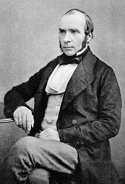
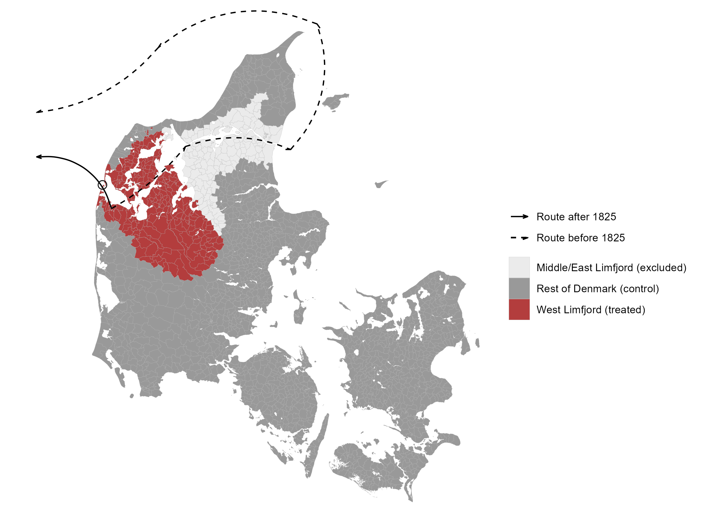
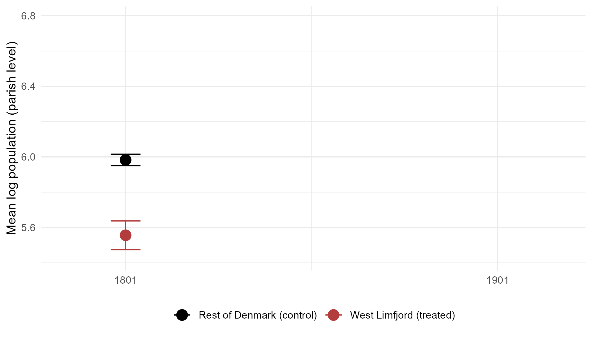
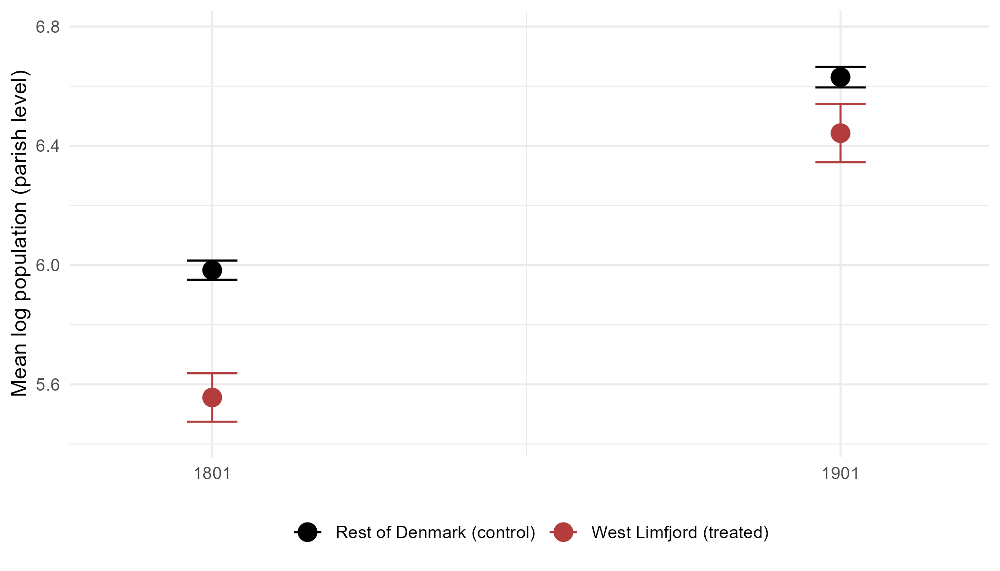
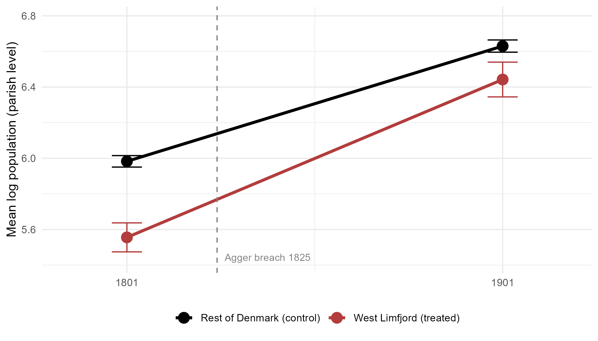
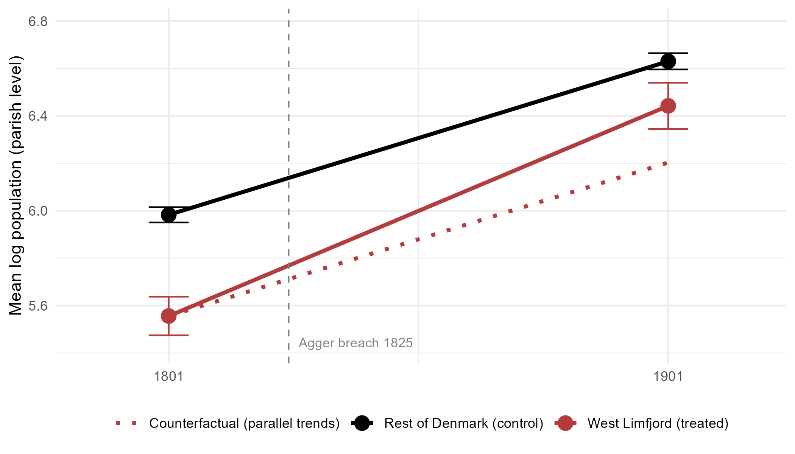
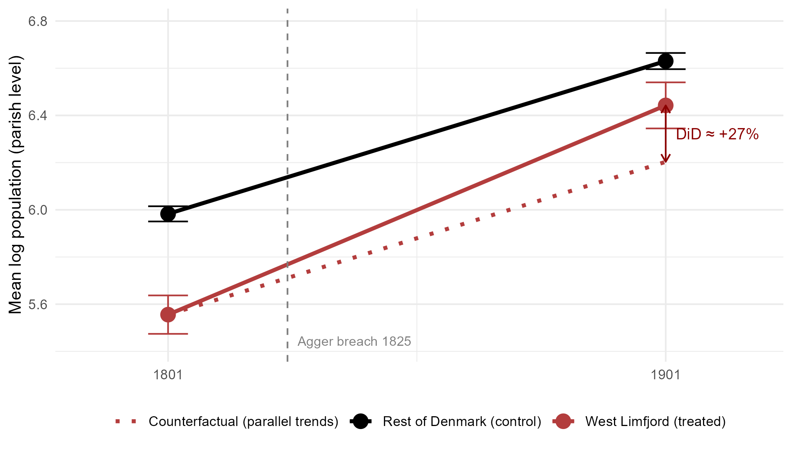

---
output:
  xaringan::moon_reader:
    seal: false
    includes:
      after_body: insert-logo.html
    self_contained: false
    lib_dir: libs
    nature:
      highlightStyle: github
      highlightLines: true
      countIncrementalSlides: false
      ratio: '16:9'
editor_options:
  chunk_output_type: console
---
class: center, inverse, middle

```{r xaringan-panelset, echo=FALSE}
xaringanExtra::use_panelset()
```

```{r xaringan-tile-view, echo=FALSE}
xaringanExtra::use_tile_view()
```

```{r xaringanExtra, echo=FALSE}
xaringanExtra::use_progress_bar(color = "#808080", location = "top")
```

```{css echo=FALSE}
.pull-left {
  float: left;
  width: 44%;
}
.pull-right {
  float: right;
  width: 44%;
}
.pull-right ~ p {
  clear: both;
}


.pull-left-wide {
  float: left;
  width: 66%;
}
.pull-right-wide {
  float: right;
  width: 66%;
}
.pull-right-wide ~ p {
  clear: both;
}

.pull-left-narrow {
  float: left;
  width: 30%;
}
.pull-right-narrow {
  float: right;
  width: 30%;
}

.tiny123 {
  font-size: 0.40em;
}

.small123 {
  font-size: 0.80em;
}

.large123 {
  font-size: 2em;
}

.red {
  color: red
}

.orange {
  color: orange
}

.green {
  color: green
}
```


# Statistics
## Testing relationships using quantitative data
### (Chapter 15)

### Christian Vedel,<br>Department of Economics<br>University of Southern Denmark

### Email: [christian-vs@sam.sdu.dk](mailto:christian-vs@sam.sdu.dk)

### Updated `r Sys.Date()`


---
class: middle
# Today's lecture
.pull-left-wide[
**Extending hypothesis testing to comparisons between groups and across time**

- **Section 1:** Testing the difference between two mean values
- **Section 2:** Testing the effect of a treatment
- **Section 3:** Testing the difference between multiple mean values (ANOVA)
- **Section 4:** Testing the ratio between two variances
]

.pull-right-narrow[

]

---
class: inverse, middle, center
# Testing the difference between two mean values

---
# Motivation

.pull-left-wide[
We want to test whether the means (or variances) of two or more distributions differ:
- do women earn the same wage, on average, as men?
- is the health of people treated with a drug better than those untreated?
]

---
# Setup

.pull-left-wide[
Let $Y$ indicate group membership: $Y=1$ for group 1, $Y=2$ for group 2. Let $X$ be the characteristic of interest (e.g. wages).

We want to compare:
- $\mu_1$ from $f(x \mid y=1)$
- $\mu_2$ from $f(x \mid y=2)$

Suppose we have two **independent** simple random samples:
- $n_1$ elements from group 1: $(X_{1,1},\ldots,X_{n_1,1})$
- $n_2$ elements from group 2: $(X_{1,2},\ldots,X_{n_2,2})$
]

---
# The general case

.pull-left-wide[
Two-sided hypothesis test:
$$\begin{align*} H_0 & : \mu_1 = \mu_2 \\ H_1 & : \mu_1 \not= \mu_2 \end{align*}$$

Hypothesis measure $h(\mu_1,\mu_2) = \mu_1 - \mu_2 = 0$ under $H_0$. Replace the unknown means with sample averages:
$$\begin{align*} \bar{X}_1 & = \frac{1}{n_1}\sum_{i=1}^{n_1} X_{i,1} \\ \bar{X}_2 & = \frac{1}{n_2}\sum_{i=1}^{n_2} X_{i,2} \end{align*}$$
]

---
# The test statistic

.pull-left-wide[
Since the two samples are independent, $Var\!\left(\bar{X}_1 - \bar{X}_2\right) = \sigma_1^2/n_1 + \sigma_2^2/n_2$. If variances are unknown, use $S_1^2$ and $S_2^2$:
$$Z = \frac{\bar{X}_1 - \bar{X}_2}{\sqrt{S_1^2/n_1 + S_2^2/n_2}} \overset{a}{\sim} \mathcal{N}(0,1) \text{ under } H_0$$

Reject $H_0$ if $Z < z_{\alpha/2}$ or $Z > z_{1-\alpha/2}$; $p$-value: $p = 2\Phi(-|z|)$.
]

---
# Equal variances

.pull-left-wide[
If $\sigma_1^2 = \sigma_2^2 = \sigma^2$, use the **pooled variance estimator** for a more efficient estimate:
$$S_p^2 = \frac{(n_1-1)S_1^2 + (n_2-1)S_2^2}{n_1+n_2-2}, \qquad Z = \frac{\bar{X}_1 - \bar{X}_2}{\sqrt{S_p^2\!\left(\dfrac{1}{n_1}+\dfrac{1}{n_2}\right)}}$$

If $X$ is also normally distributed, $Z \sim t(n_1+n_2-2)$ exactly under $H_0$.
]

.pull-right-narrow[
.small123[
**Why pooled?** Combining both samples to estimate $\sigma^2$ is more efficient than using $S_1^2$ or $S_2^2$ alone.
]
]

---
# Normal distribution cases

.pull-left-wide[
**Known variances $\sigma_1^2$, $\sigma_2^2$** (both groups normal):
$$Z = \frac{\bar{X}_1-\bar{X}_2}{\sqrt{\sigma_1^2/n_1+\sigma_2^2/n_2}} \sim \mathcal{N}(0,1) \text{ exactly under } H_0$$

**Unknown and unequal variances** (both groups normal):
$$Z = \frac{\bar{X}_1-\bar{X}_2}{\sqrt{S_1^2/n_1+S_2^2/n_2}} \overset{a}{\sim} t(n_1+n_2-1) \text{ under } H_0$$
]

---
# Bernoulli distribution

.pull-left-wide[
If $X$ follows a Bernoulli distribution, variance is a function of the mean. Under $H_0$ ($p_1=p_2$), use the **pooled proportion**:
$$\bar{p}_p = \frac{n_1\bar{p}_1 + n_2\bar{p}_2}{n_1+n_2}, \qquad S_p^2 = \bar{p}_p(1-\bar{p}_p)$$

Test statistic:
$$Z = \frac{\bar{p}_1-\bar{p}_2}{\sqrt{\bar{p}_p(1-\bar{p}_p)\left(\dfrac{1}{n_1}+\dfrac{1}{n_2}\right)}} \overset{a}{\sim} \mathcal{N}(0,1) \text{ under } H_0$$
]

---
# One-sided tests

.pull-left-wide[
The same test statistic is used; only the decision rule changes:

#### $H_1: \mu_1 > \mu_2$
*reject if $Z$ is too far right:*
- do not reject $H_0$ if $Z < z_{1-\alpha}$
- reject $H_0$ if $Z \geq z_{1-\alpha}$

#### $H_1: \mu_1 < \mu_2$
*reject if $Z$ is too far left:*
- do not reject $H_0$ if $Z > z_\alpha$
- reject $H_0$ if $Z \leq z_\alpha$
]

---
# .red[Raise your hand 1: Two-sample tests]

```{r ryh1-timer, echo=FALSE}
library(countdown)
countdown(0, 20, top=TRUE)
```

.pull-left-wide[
**Q1.** Two independent samples: $n_1=36$, $n_2=49$, unknown variances assumed equal. The correct test statistic uses:

- **A)** Separate sample variances $S_1^2/n_1 + S_2^2/n_2$ — unequal-variance formula
- **B)** The pooled variance estimator $S_p^2$ — equal-variance formula
- **C)** The simple average $(S_1^2+S_2^2)/2$ — unweighted pooling
]

--

.pull-left-wide[
**Q2.** For a one-sided test $H_1: \mu_1 < \mu_2$, the decision rule is:

- **A)** Reject $H_0$ if $Z \geq z_{1-\alpha}$ — right-tail rule
- **B)** Reject $H_0$ if $|Z| \geq z_{1-\alpha/2}$ — two-sided rule
- **C)** Reject $H_0$ if $Z \leq z_\alpha$ — left-tail rule
]

```{r ryh1-answers, eval=FALSE, include=FALSE}
# ANSWERS
#
# Q1: B — pooled variance is correct when equal variances are assumed
#   A: correct formula for the Welch/unequal-variance case; wrong when equal variances assumed
#   B: CORRECT — equal-variance assumption lets you pool both samples' variance for efficiency
#   C: simple average ignores sample sizes; Sp² weights by n_k-1, not equally
#
# Q2: C — left tail is correct for H1: μ1 < μ2
#   A: right-tail rule; applies to H1: μ1 > μ2 — wrong direction
#   B: two-sided rule; rejects on both sides — ignores the directional hypothesis
#   C: CORRECT — H1 says μ1 is smaller, so evidence is a large negative Z; reject if Z ≤ zα
```

---
# .red[Practice 1: Two-sample mean test]

.pull-left-wide[
Two independent samples of weekly earnings (€):
- Group 1 (men): $n_1=36$, $\bar{X}_1=850$, $S_1^2=3{,}600$
- Group 2 (women): $n_2=49$, $\bar{X}_2=800$, $S_2^2=2{,}500$

1. Test $H_0: \mu_1=\mu_2$ vs $H_1: \mu_1 \not= \mu_2$ at $\alpha=0.05$.
2. Compute the $p$-value.
]

```{r practice1-answers, eval=FALSE, include=FALSE}
# Z = (850-800) / sqrt(3600/36 + 2500/49)
#   = 50 / sqrt(100 + 51.02) = 50 / 12.29 ≈ 4.07
# |Z| = 4.07 > 1.96 → reject H₀
# p-value = 2·Φ(-4.07) ≈ 0.000046
```

---
class: inverse, middle, center
# Testing the effect of a treatment

---
# Setup

.pull-left-wide[
A **treatment** is any intervention that can potentially change the distribution of $X$:
- health: medical treatments
- wages: training programmes
- school grades: additional resources or smaller class size

Two groups:
- **treated group** = receives the treatment
- **control group** = does not receive the treatment
]

---
# .orange[Notation you will encounter later: Potential outcomes]

.orange[*Don't worry about this now - just flagging this here because you will meet it in future courses.*]

.pull-left-wide[
For each unit $i$, define two **potential outcomes**:
- $Y_i(1)$: outcome *if* treated
- $Y_i(0)$: outcome *if not* treated

The causal effect for unit $i$ is $Y_i(1) - Y_i(0)$ — but we can never observe both. This is the **fundamental problem of causal inference**.

The **average treatment effect** (ATE):
$$E[Y_i(1) - Y_i(0)] = E[Y_i(1)] - E[Y_i(0)]$$

With random assignment, $E[Y_i(1)] = \mu_T$ and $E[Y_i(0)] = \mu_C$, so $\bar{X}_T - \bar{X}_C$ is an unbiased estimator of the ATE.
]

---
# Case 1: Treatment and control observed once

.pull-left-wide[
With two independent simple random samples (one per group), the treatment effect is:
$$D = \mu_T - \mu_C$$

Test:
$$\begin{align*} H_0 & : \mu_T - \mu_C = 0 \\ H_1 & : \mu_T - \mu_C \not= 0 \end{align*}$$

Test statistic:
$$Z = \frac{\bar{X}_T - \bar{X}_C}{\sqrt{S_T^2/n_T + S_C^2/n_C}} \overset{a}{\sim} \mathcal{N}(0,1)$$
]

.pull-right-narrow[
.small123[
*Potential issue:* Differences may be caused by confounding factors, not the treatment.

It might be that be that: 
- $E(X_i) = \delta + \tau_T$ for treated and 
- $E(X_i) = \delta + \tau_C$ for control.
When we measure the difference our results are confounded by $\tau_T - \tau_C$.
]
]

---
# Case 2: Treatment group observed twice (before/after)

.pull-left-wide[
Only the treated group is observed, at time 1 (before) and time 2 (after).

The per-element change: $D_i = X_{T,i,2} - X_{T,i,1}$

Test:
$$\begin{align*} H_0 & : \mu_{T,2} - \mu_{T,1} = 0 \\ H_1 & : \mu_{T,2} - \mu_{T,1} \not= 0 \end{align*}$$

Note: the two observations for the same element are **not** independent — this is **panel data**.
]

.pull-right-narrow[
.small123[
*Potential issue:* Differences may be caused by confounding factors, not the treatment.

It might be that:
- $E(X_{T,i,1}) = \delta_1 + \tau_T$
- $E(X_{T,i,2}) = \delta_2 + \tau_T$

When we measure the before/after difference, results are confounded by the time trend $\delta_2 - \delta_1$.
]
]

--

.pull-left-wide[
Variance estimator (accounts for dependence within elements):
$$\widehat{Var}\!\left(\bar{X}_{T,2}-\bar{X}_{T,1}\right) = \frac{1}{n_T}\cdot\frac{1}{n_T-1}\sum_{i=1}^{n_T}\left[(X_{T,i,2}-X_{T,i,1})-(\bar{X}_{T,2}-\bar{X}_{T,1})\right]^2$$

Test statistic: $Z = (\bar{X}_{T,2}-\bar{X}_{T,1})/\sqrt{\widehat{Var}(\bar{X}_{T,2}-\bar{X}_{T,1})} \overset{a}{\sim} \mathcal{N}(0,1)$
]


---
# A simple model of confounding

.pull-left-wide[
Suppose the four group-time population means are:

| | Before ($t=1$) | After ($t=2$) |
|---|:---:|:---:|
| **Treated** ($g=T$) | $\delta_1 + \tau_T$ | $\delta_2 + \tau_T + D$ |
| **Control** ($g=C$) | $\delta_1 + \tau_C$ | $\delta_2 + \tau_C$ |

where $\delta_t$ is a **common time trend**, $\tau_g$ is a **constant group-level confounder**, and $D$ is the treatment effect.

**Case 1** (cross-section, $t=2$ only):
$$\bar{X}_{T,2} - \bar{X}_{C,2} = \underbrace{(\tau_T - \tau_C)}_{\text{group bias}} + D$$

**Case 2** (before/after, treated only):
$$\bar{X}_{T,2} - \bar{X}_{T,1} = \underbrace{(\delta_2 - \delta_1)}_{\text{time trend bias}} + D$$
]

.pull-right-narrow[
  > Neither estimator recovers $D$ — we need a way to remove both sources of bias simultaneously.
]

---
# Motivating example: John Snow's water study

.pull-left-wide[
**RQ:** Does polluted water increase cholera mortality?

- **1849:** Several areas drew from the same polluted water source
- **1852:** Some areas switched to a cleaner upstream source ($g = T$); others did not ($g = C$)
- **Problem:** Areas differed in poverty and density ($\tau_T \neq \tau_C$) and epidemic severity shifted over time ($\delta_t$)
]

.pull-right-narrow[
.panelset[
.panel[.panel-name[Jon Snow]
.center[


.small123[*Jon Snow (GoT)*, [Wikipedia](https://en.wikipedia.org/wiki/Jon_Snow_(character)) / © HBO, fair use]
]
]
.panel[.panel-name[John Snow]
.center[


.small123[*John Snow (1813–1858)*, [Wikipedia](https://en.wikipedia.org/wiki/John_Snow) / Public domain]
]
]
]
]

--

.pull-left-wide[
**Snow's insight:**
- Compared cholera outbreaks by water source: Southwark & Vauxhall (polluted) vs. Lambeth (clean)
- Compare the change of cholera outbreaks before and after the switch
- $D \approx (\bar{X}_{T,2}-\bar{X}_{T,1}) - (\bar{X}_{C,2}-\bar{X}_{C,1})$
]

---
# Case 3: The DiD estimator

.pull-left-wide[
From the model above, expand the DiD estimator $d$:

$$D = (\mu_{T,2} - \mu_{T,1}) - (\mu_{C,2} - \mu_{C,1})$$
$$D = (\delta_2 + \tau_T + D - \delta_1 - \tau_T) - (\delta_2 + \tau_C - \delta_1 - \tau_C)$$
]

--

.pull-left-wide[
$\tau_g$ cancels within each group, $\delta_t$ cancels across groups:

$$\require{cancel}(\cancel{\delta_2} + \cancel{\tau_T} + D - \cancel{\delta_1} - \cancel{\tau_T}) - (\cancel{\delta_2} + \cancel{\tau_C} - \cancel{\delta_1} - \cancel{\tau_C}) = D$$
$$D = D$$
]

--

.pull-left-wide[
By analogy, replace population means $\mu$ with sample means $\bar{X}$ — the **DiD estimator** $\hat D$:

$$\hat D = \underbrace{(\bar{X}_{T,2}-\bar{X}_{T,1})}_{\approx\,\delta_2-\delta_1+D} - \underbrace{(\bar{X}_{C,2}-\bar{X}_{C,1})}_{\approx\,\delta_2-\delta_1}$$
]

.pull-right-narrow[
.small123[
Test:
$$\begin{align*} H_0 & : D = 0 \\ H_1 & : D \not= 0 \end{align*}$$

Interpretation: $D \neq 0$ means water supply had an effect on cholera mortality.
]
]

---
# Case 3: Test statistic

.pull-left-wide[
Variance estimator:

$$\begin{split}\widehat{Var} &= \frac{1}{n_T}\cdot\frac{1}{n_T-1}\sum_{i=1}^{n_T}\left[(X_{T,i,2}-X_{T,i,1})-(\bar{X}_{T,2}-\bar{X}_{T,1})\right]^2 \\ &+ \frac{1}{n_C}\cdot\frac{1}{n_C-1}\sum_{i=1}^{n_C}\left[(X_{C,i,2}-X_{C,i,1})-(\bar{X}_{C,2}-\bar{X}_{C,1})\right]^2\end{split}$$

Test statistic:

$$Z =\frac{(\bar{X}_{T,2}-\bar{X}_{T,1})-(\bar{X}_{C,2}-\bar{X}_{C,1})}{\sqrt{\widehat{\operatorname{Var}}}}\overset{a}{\sim} \mathcal{N}(0,1)$$

]

---
class: center, middle, inverse

.pull-left-wide[
### Distribution of Economic Activity across the world
```{r echo=FALSE, out.width="75%", fig.align='center'}
knitr::include_graphics("Figures/The_earth_at_night_greyscale.png")
```

.small123[
*[Wikimedia Commons, retrieved from NASA Earth Observatory, 27 November 2012](www.commons.wikimedia.org/wiki/File:The_earth_at_night.jpg)*
]

]

.pull-right-narrow[
### Henderson et al (2018)
- 24 physical geographical attributes explain 47 pct of the variation here
- We can use DiD to gain insights into whether this is coincidence or causality
]

.footnote[
  .tiny123[
    J Vernon Henderson, Tim Squires, Adam Storeygard, David Weil, The Global Distribution of Economic Activity: Nature, History, and the Role of Trade, The Quarterly Journal of Economics, Volume 133, Issue 1, February 2018, Pages 357–406, https://doi.org/10.1093/qje/qjx030 
  ]
]

???
- If you are born in certain places, you have worse opportunity 
- Simply loosing the geographical lottery gives you worse opportunities
- Why?

---
# DiD example: First nature and economic development

.pull-left[
- What is the effect of first-nature geography on economic development? Hard to measure becuase of confounding factors (e.g. institutions, culture, etc.)
- Example: the **Agger channel breach of 1825** opened a direct North Sea passage for west Limfjord
- Here we have a very natural, natural experiment: the breach is an exogenous shock of first-nature geography, and we can compare the treated area (west Limfjord) to the rest of Denmark before and after the breach.
]

.pull-right[
  
]

.footnote[
  .small123[
    *Read the paper here: https://arxiv.org/pdf/2408.00885*
  ]
]

```{r did-map, echo=FALSE, message=FALSE, warning=FALSE, eval=FALSE}
library(tidyverse)
library(sf)
library(ggspatial)

data_path = "d:/Dropbox/PhD/A Salty Situation/A_perfect_storm_replication/Data"

shape = sf::st_read(file.path(data_path, "sogne_shape"), quiet = TRUE) %>%
  filter(!AMT %in% c("Bornholm", "Haderslev", "Toender", "Aabenraa", "Soenderborg"))

geo_data = read_csv2(file.path(data_path, "Geo.csv"), guess_max = 2000, show_col_types = FALSE)

shape = shape %>%
  left_join(geo_data %>% select(GIS_ID, limfjord_placement), by = "GIS_ID") %>%
  mutate(region = case_when(
    limfjord_placement == "west"                    ~ "West Limfjord (treated)",
    limfjord_placement %in% c("middle", "east")     ~ "Middle/East Limfjord (excluded)",
    TRUE                                            ~ "Rest of Denmark (control)"
  ))

arrow_spec = arrow(angle = 20, length = unit(0.15, "cm"))

p = ggplot() +
  layer_spatial(data = shape, aes(fill = region), col = "grey70", linewidth = 0.05) +
  scale_fill_manual(
    values = c(
      "West Limfjord (treated)"        = "#b33d3d",
      "Middle/East Limfjord (excluded)" = "grey92",
      "Rest of Denmark (control)"      = "grey60"
    ),
    na.value = "grey92"
  ) +
  # Pre-1825: long route around Jutland (5 segments)
  geom_curve(data = data.frame(x=8.31, y=56.55, xend=9.21, yend=56.97),
             aes(x=x,y=y,xend=xend,yend=yend,lty="Route before 1825"),
             curvature=0.1, arrow=arrow_spec) +
  geom_curve(data = data.frame(x=9.21, y=56.97, xend=10.49, yend=56.95),
             aes(x=x,y=y,xend=xend,yend=yend,lty="Route before 1825"),
             curvature=-0.2, arrow=arrow_spec) +
  geom_curve(data = data.frame(x=10.49, y=56.95, xend=10.81, yend=57.80),
             aes(x=x,y=y,xend=xend,yend=yend,lty="Route before 1825"),
             curvature=0.3, arrow=arrow_spec) +
  geom_curve(data = data.frame(x=10.81, y=57.80, xend=8.88, yend=57.64),
             aes(x=x,y=y,xend=xend,yend=yend,lty="Route before 1825"),
             curvature=0.3, arrow=arrow_spec) +
  geom_curve(data = data.frame(x=8.88, y=57.64, xend=7.4, yend=57.2),
             aes(x=x,y=y,xend=xend,yend=yend,lty="Route before 1825"),
             curvature=-0.2, arrow=arrow_spec) +
  # Post-1825: direct route through Agger channel
  geom_curve(data = data.frame(x=8.31, y=56.55, xend=7.4, yend=56.9),
             aes(x=x,y=y,xend=xend,yend=yend,lty="Route after 1825"),
             curvature=0.4, arrow=arrow_spec) +
  geom_point(aes(x=8.2, y=56.71), shape=1, size=3) +
  scale_linetype_manual(values = c("Route before 1825" = "dashed", "Route after 1825" = "solid")) +
  labs(fill = NULL, lty = NULL) +
  theme_void() +
  theme(
    plot.background = element_rect(fill = "white", linewidth = 0),
    legend.position = "right"
  )

ggsave("Statistics\\13_Testing_relationships_quantitative\\Figures\\DiD_map.png", p, width = 8, height = 6)
```


---
# DiD example: Population growth 1801–1901

.panelset[
.panel[.panel-name[1. Baseline 1801]

]
.panel[.panel-name[2. Add 1901]

]
.panel[.panel-name[3. Connect]

]
.panel[.panel-name[4. Parallel trends]

]
.panel[.panel-name[5. DiD estimate]

]
]


```{r did-setup, echo=FALSE, message=FALSE, warning=FALSE, eval=FALSE}
library(tidyverse)
data_path = "d:/Dropbox/PhD/A Salty Situation/A_perfect_storm_replication/Data"
pop = read_csv2(file.path(data_path, "Pop_reg.csv"), guess_max = 2000, show_col_types = FALSE)

did_data = pop %>%
  filter(Year %in% c(1801, 1901), Pop > 0) %>%
  filter(limfjord_placement %in% c("west", "not")) %>%
  mutate(
    group = ifelse(limfjord_placement == "west", "West Limfjord (treated)", "Rest of Denmark (control)"),
    lPop  = log(Pop)
  ) %>%
  select(Year, County, Parish, group, Pop, lPop)

write_csv(did_data, "Exercises/Set13/data_did.csv")

did_data = did_data %>%
  group_by(Year, group) %>%
  summarise(
    mean_lPop = mean(lPop, na.rm = TRUE),
    se_lPop   = sd(lPop, na.rm = TRUE) / sqrt(n()),
    lo        = mean_lPop - 1.96 * se_lPop,
    hi        = mean_lPop + 1.96 * se_lPop,
    .groups   = "drop"
  )

west_1801  = did_data$mean_lPop[did_data$Year == 1801 & did_data$group == "West Limfjord (treated)"]
rest_delta = diff(sort(did_data$mean_lPop[did_data$group == "Rest of Denmark (control)"]))
west_1901  = did_data$mean_lPop[did_data$Year == 1901 & did_data$group == "West Limfjord (treated)"]
cf_1901    = west_1801 + rest_delta

cf = data.frame(
  Year      = c(1801, 1901),
  group     = "Counterfactual (parallel trends)",
  mean_lPop = c(west_1801, cf_1901),
  lo        = NA_real_,
  hi        = NA_real_
)

plot_data = bind_rows(did_data, cf)
ylims     = range(c(did_data$lo, did_data$hi), na.rm = TRUE)

ci_bars = geom_errorbar(aes(ymin = lo, ymax = hi), width = 8, linewidth = 0.5, na.rm = TRUE)

common = list(
  scale_color_manual(values = c(
    "West Limfjord (treated)"          = "#b33d3d",
    "Rest of Denmark (control)"        = "black",
    "Counterfactual (parallel trends)" = "#b33d3d"
  )),
  scale_linetype_manual(values = c(
    "West Limfjord (treated)"          = "solid",
    "Rest of Denmark (control)"        = "solid",
    "Counterfactual (parallel trends)" = "dotted"
  )),
  labs(x = NULL, y = "Mean log population (parish level)", color = NULL, linetype = NULL),
  scale_x_continuous(breaks = c(1801, 1901), limits = c(1785, 1918)),
  coord_cartesian(ylim = c(ylims[1] - 0.05, ylims[2] + 0.12)),
  theme_minimal(),
  theme(legend.position = "bottom")
)

breach = list(
  geom_vline(xintercept = 1825, linetype = "dashed", color = "grey50"),
  annotate("text", x = 1827, y = ylims[1] - 0.03,
           label = "Agger breach 1825", hjust = 0, color = "grey50", size = 3)
)

p1 = ggplot(filter(did_data, Year == 1801),
            aes(x = Year, y = mean_lPop, color = group)) +
  geom_point(size = 4) + ci_bars + common

p2 = ggplot(did_data, aes(x = Year, y = mean_lPop, color = group)) +
  geom_point(size = 4) + ci_bars + common

p3 = ggplot(did_data,
            aes(x = Year, y = mean_lPop, color = group, group = group, linetype = group)) +
  geom_line(linewidth = 1.2) + geom_point(size = 4) + ci_bars +
  breach + common

p4 = ggplot(plot_data,
            aes(x = Year, y = mean_lPop, color = group, group = group, linetype = group)) +
  geom_line(linewidth = 1.2) +
  geom_point(data = did_data, aes(x = Year, y = mean_lPop, color = group),
             size = 4, inherit.aes = FALSE) +
  geom_errorbar(data = did_data, aes(x = Year, ymin = lo, ymax = hi, color = group),
                width = 8, linewidth = 0.5, inherit.aes = FALSE) +
  breach + common

p5 = p4 +
  annotate("segment", x = 1901, xend = 1901, y = cf_1901, yend = west_1901,
           arrow = arrow(ends = "both", length = unit(0.2, "cm")), color = "darkred") +
  annotate("text", x = 1903, y = (cf_1901 + west_1901) / 2,
           label = "DiD ≈ +27%", hjust = 0, color = "darkred", size = 3.5)

walk2(list(p1,p2,p3,p4,p5), paste0("Statistics/13_Testing_relationships_quantitative/Figures/DiD_step", 1:5, ".png"),
      ~ ggsave(.y, .x, width = 7, height = 4))
```


---
# DiD example: Standard errors and test statistic

.pull-left-wide[
Applying the DiD variance formula to parish-level log population, west Limfjord vs. rest of Denmark (1801 to 1901):

### Stating the hypotheses:
- $H_0$: First-nature geography has no effect on the location of economic activity / population density ($D=0$)
- $H_1$: First-nature geography has an effect on the location of economic activity / population density ($D \neq 0$)
]

```{r did-inference, echo=FALSE, message=FALSE, warning=FALSE, eval=FALSE}
library(tidyverse)
data_path = "d:/Dropbox/PhD/A Salty Situation/A_perfect_storm_replication/Data"
pop = read_csv2(file.path(data_path, "Pop_reg.csv"), guess_max = 2000, show_col_types = FALSE)
diffs = pop %>%
  filter(Year %in% c(1801, 1901), Pop > 0) %>%
  filter(limfjord_placement %in% c("west", "not")) %>%
  mutate(
    group = ifelse(limfjord_placement == "west", "treated", "control"),
    lPop  = log(Pop)
  ) %>%
  pivot_wider(id_cols = c(GIS_ID, group), names_from = Year,
              values_from = lPop, names_prefix = "y") %>%
  filter(!is.na(y1801), !is.na(y1901)) %>%
  mutate(d = y1901 - y1801)

D_T   = diffs$d[diffs$group == "treated"]
D_C   = diffs$d[diffs$group == "control"]
n_T   = length(D_T)
n_C   = length(D_C)
did   = mean(D_T) - mean(D_C)
se    = sqrt(var(D_T)/n_T + var(D_C)/n_C)
Z     = did / se
p_val = 2 * pnorm(-abs(Z))

tibble(
  Quantity = c("DiD estimate", "Standard error", "Z statistic", "p-value",
               "n_T (treated parishes)", "n_C (control parishes)"),
  Value = c(sprintf("%.3f", did), sprintf("%.3f", se),
            sprintf("%.2f", Z), formatC(p_val, format = "e", digits = 1),
            as.character(n_T), as.character(n_C))
) %>%
  knitr::kable(format = "html", align = c("l", "r"), escape = FALSE)
```


<table>
 <thead>
  <tr>
   <th style="text-align:left;"> Quantity </th>
   <th style="text-align:right;"> Value </th>
  </tr>
 </thead>
<tbody>
  <tr>
   <td style="text-align:left;"> D estimate </td>
   <td style="text-align:right;"> 0.239 </td>
  </tr>
  <tr>
   <td style="text-align:left;"> Standard error </td>
   <td style="text-align:right;"> 0.028 </td>
  </tr>
  <tr>
   <td style="text-align:left;"> Z statistic </td>
   <td style="text-align:right;"> 8.49 </td>
  </tr>
  <tr>
   <td style="text-align:left;"> p-value </td>
   <td style="text-align:right;"> 2.1e-17 </td>
  </tr>
  <tr>
   <td style="text-align:left;"> n_T (treated parishes) </td>
   <td style="text-align:right;"> 178 </td>
  </tr>
  <tr>
   <td style="text-align:left;"> n_C (control parishes) </td>
   <td style="text-align:right;"> 1289 </td>
  </tr>
</tbody>
</table>

--

<br>
<br>

> We strongly reject H0: D = 0. First-nature geography is a determinant of the location of economic activity / population density.

.footnote[
  .small123[
    *Read the paper here: https://arxiv.org/pdf/2408.00885*
  ]
]

---
# .red[Raise your hand 2: Difference-in-differences]

```{r ryh2-timer, echo=FALSE}
library(countdown)
countdown(0, 20, top=TRUE)
```

.pull-left-wide[
**Q1.** The DiD estimator for the causal effect of a treatment is:

- **A)** $\bar{X}_{T,2} - \bar{X}_{C,2}$ — post-treatment comparison only
- **B)** $\bar{X}_{T,2} - \bar{X}_{T,1}$ — before/after, treated group only
- **C)** $(\bar{X}_{T,2}-\bar{X}_{T,1}) - (\bar{X}_{C,2}-\bar{X}_{C,1})$ — before/after, both groups
]

--

.pull-left-wide[
**Q2.** The main advantage of DiD over the before/after comparison (Case 2) is:

- **A)** It eliminates the need for a control group — simpler design
- **B)** It provides a valid causal estimate without any additional assumptions — assumption-free
- **C)** It controls for common time trends affecting both groups — cancels $\delta_t$
]

```{r ryh2-answers, eval=FALSE, include=FALSE}
# ANSWERS
#
# Q1: C — the double-difference removes both group bias and time trend
#   A: post-only comparison; only removes group bias if τ_T = τ_C (Case 1 flaw)
#   B: before/after treated only; removes group bias but leaves the time trend δ₂−δ₁ (Case 2 flaw)
#   C: CORRECT — (ΔT − ΔC) cancels the common time trend δ_t and group bias τ_g simultaneously
#
# Q2: C — DiD controls for time trends by subtracting the control group's change
#   A: DiD requires a control group by design — opposite claim
#   B: DiD still requires the parallel trends assumption: without treatment both groups change identically
#   C: CORRECT — control group's ΔC estimates the common trend δ₂−δ₁, which is then subtracted out
```

---
# .red[Practice 2: DiD calculation]

.pull-left-wide[
A government subsidy is given to firms in region A (treated), not in region B (control). Average monthly profits (DKK 1,000s):

| | Before | After |
|---|:---:|:---:|
| Region A (treated) | 500 | 580 |
| Region B (control) | 480 | 500 |

1. Compute the DiD estimate of the subsidy effect.
2. Under what assumption is this a valid causal estimate?
]

```{r practice2-did-answers, eval=FALSE, include=FALSE}
# 1. DiD = (580-500) - (500-480) = 80 - 20 = 60 (DKK 1,000s)
# 2. Parallel trends assumption: in the absence of the subsidy, region A and B
#    would have had the same change in profits between the two periods.
```

---
class: inverse, middle, center
# Testing the difference between multiple mean values (ANOVA)

---
# Setup

.pull-left-wide[
Generalise to $K$ groups. Test whether all group means are equal:
$$\begin{align*} H_0 & : \mu_1 = \mu_2 = \cdots = \mu_K \\ H_1 & : \text{at least one mean value is different} \end{align*}$$

With weights $w_k = n_k/n$ (relative group size) and $\sigma_1^2=\cdots=\sigma_K^2=\sigma^2$, define:
- Group sample means: $\bar{X}_k = \frac{1}{n_k}\sum_{i=1}^{n_k}X_{i,k}$
- Overall sample mean: $\bar{X} = \sum_{k=1}^K w_k \bar{X}_k$
]

---
# Sums of squares

.pull-left-wide[
**Sum of squared treatments** (between-group variation):
$$SSTR = \sum_{k=1}^K n_k(\bar{X}_k - \bar{X})^2$$

**Sum of squared errors** (within-group variation):
$$SSE = \sum_{k=1}^K\sum_{i=1}^{n_k}(X_{i,k}-\bar{X}_k)^2 = \sum_{k=1}^K(n_k-1)S_k^2$$
]

.pull-right-narrow[
.small123[
$SSTR \approx 0$ when all means are equal. $SSE$ estimates residual variance regardless of $H_0$.
]
]

---
# Test statistic

.pull-left-wide[
$$F = \frac{SSTR/(K-1)}{SSE/(n-K)}$$

Under $H_0$, $F \sim F(K-1, n-K)$.

Decision rule:
- do not reject $H_0$ if $F < F_{1-\alpha}(K-1, n-K)$
- reject $H_0$ if $F \geq F_{1-\alpha}(K-1, n-K)$

> If $H_0$ is true, the numerator should be close to zero. If $H_0$ is false, the numerator grows with $n$. This is **analysis of variance** (ANOVA).
]

---
# .red[Raise your hand 3: ANOVA]

```{r ryh3-timer, echo=FALSE}
library(countdown)
countdown(0, 20, top=TRUE)
```

.pull-left-wide[
**Q1.** An ANOVA F-test compares $K=3$ groups with total $n=60$ observations. Under $H_0$, the test statistic follows:

- **A)** $F(3,57)$ — $K$ groups in numerator df
- **B)** $F(2,60)$ — total $n$ in denominator
- **C)** $F(2,57)$ — $K-1$ and $n-K$ degrees of freedom
]

--

.pull-left-wide[
**Q2.** An F-statistic is very large. This means:

- **A)** Within-group variation is large relative to between-group variation — high residual noise
- **B)** Between-group variation is large relative to within-group variation — groups differ
- **C)** All group means are significantly different from each other — post-hoc result
]

```{r ryh3-answers, eval=FALSE, include=FALSE}
# ANSWERS
#
# Q1: C — numerator df = K−1 = 2; denominator df = n−K = 57
#   A: uses K=3 instead of K−1=2 in the numerator; off by one
#   B: uses total n=60 in denominator instead of n−K=57; fails to subtract the K estimated means
#   C: CORRECT — F = (SSTR/(K−1)) / (SSE/(n−K)) → F(2,57)
#
# Q2: B — large F means SSTR (between) dominates SSE (within)
#   A: reversed — large within relative to between gives F close to zero, not large
#   B: CORRECT — F = SSTR/(K−1) / SSE/(n−K); large F → between-group variation dominates
#   C: F only tells us at least one mean differs; post-hoc tests (e.g. Tukey) identify which pairs
```

---
# .red[Practice 3: ANOVA by hand]

.pull-left-wide[
Three sales regions, each with $n_k=10$ observations:
- Region A: $\bar{X}_1=120$
- Region B: $\bar{X}_2=130$
- Region C: $\bar{X}_3=140$

Overall mean $\bar{X}=130$; $SSE=2{,}700$.

1. Compute $SSTR$ and the $F$ statistic.
2. Test $H_0: \mu_1=\mu_2=\mu_3$ at $\alpha=0.05$. ($F_{0.95}(2,27) \approx 3.35$)
]

```{r practice3-anova-answers, eval=FALSE, include=FALSE}
# SSTR = 10·(120-130)² + 10·(130-130)² + 10·(140-130)²
#       = 1000 + 0 + 1000 = 2000
# F = (2000/2) / (2700/27) = 1000/100 = 10
# 10 > 3.35 → reject H₀
```

---
class: inverse, middle, center
# Testing the ratio between two variances

---
# Setup

.pull-left-wide[
Two independent simple random samples, each normally distributed.

Test:
$$\begin{align*} H_0 & : \sigma_1^2 = \sigma_2^2 \\ H_1 & : \sigma_1^2 \not= \sigma_2^2 \end{align*}$$

Use the hypothesis measure $\sigma_1^2/\sigma_2^2$ and replace with sample variances:
$$F = \frac{S_1^2}{S_2^2}$$

Under $H_0$, $F \sim F(n_1-1, n_2-1)$.

Decision rule: reject $H_0$ if $F \geq F_{1-\alpha/2}(n_1-1, n_2-1)$.
]

.pull-right-narrow[
.small123[
**Convention:** Put the larger sample variance in the numerator so that $F \geq 1$, then use only the upper tail.
]
]

---
# .red[Raise your hand 4: Variance ratio test]

```{r ryh4-timer, echo=FALSE}
library(countdown)
countdown(0, 20, top=TRUE)
```

.pull-left-wide[
**Q1.** A two-sided test of $H_0: \sigma_1^2=\sigma_2^2$ uses $F=S_1^2/S_2^2$. You reject $H_0$ if:

- **A)** $F \geq F_{1-\alpha}(n_1-1, n_2-1)$ — one-sided critical value
- **B)** $F \geq F_{1-\alpha/2}(n_1, n_2)$ — wrong degrees of freedom
- **C)** $F \geq F_{1-\alpha/2}(n_1-1, n_2-1)$ — upper tail, $\alpha/2$ per tail
]

--

.pull-left-wide[
**Q2.** If you accidentally compute $F=S_2^2/S_1^2$ instead of $S_1^2/S_2^2$, the statistic follows:

- **A)** The same $F(n_1-1, n_2-1)$ — ratios are symmetric
- **B)** $F(n_2-1, n_1-1)$ — degrees of freedom are swapped
- **C)** No valid $F$-distribution — $F$ must always be $\geq 1$
]

```{r ryh4-answers, eval=FALSE, include=FALSE}
# ANSWERS
#
# Q1: C — two-sided test splits α across both tails; upper-tail convention uses α/2
#   A: α instead of α/2 — correct for one-sided test; two-sided needs half the rejection region per tail
#   B: correct α/2 but wrong df — should use n_k−1, not n_k (lose one df per estimated mean)
#   C: CORRECT — with larger variance in numerator, reject if F exceeds the upper 1−α/2 quantile
#
# Q2: B — reciprocal of F(k1,k2) follows F(k2,k1)
#   A: F(k1,k2) ≠ F(k2,k1) unless k1=k2; swapping numerator and denominator swaps the df
#   B: CORRECT — if X ~ F(k1,k2) then 1/X ~ F(k2,k1); both df flip
#   C: F can take any value in (0,∞); there is no requirement that F ≥ 1
```

---
# .red[Practice 4: Variance ratio test]

.pull-left-wide[
Two independent samples of test scores (assume normal distributions):
- Group 1: $n_1=21$, $S_1^2=144$
- Group 2: $n_2=16$, $S_2^2=64$

1. Test $H_0: \sigma_1^2=\sigma_2^2$ vs $H_1: \sigma_1^2 \not= \sigma_2^2$ at $\alpha=0.05$.
2. Compute the test statistic and state the decision. ($F_{0.975}(20,15) \approx 2.76$)
]

```{r practice4-answers, eval=FALSE, include=FALSE}
# F = 144/64 = 2.25
# Critical value: F_{0.975}(20,15) ≈ 2.76
# 2.25 < 2.76 → do not reject H₀
```

---
# Before next time
.pull-left[
- Read the assigned reading
- Next time: Testing relationships using qualitative data $\rightarrow$ Chapter 16
]

.pull-right[

]
