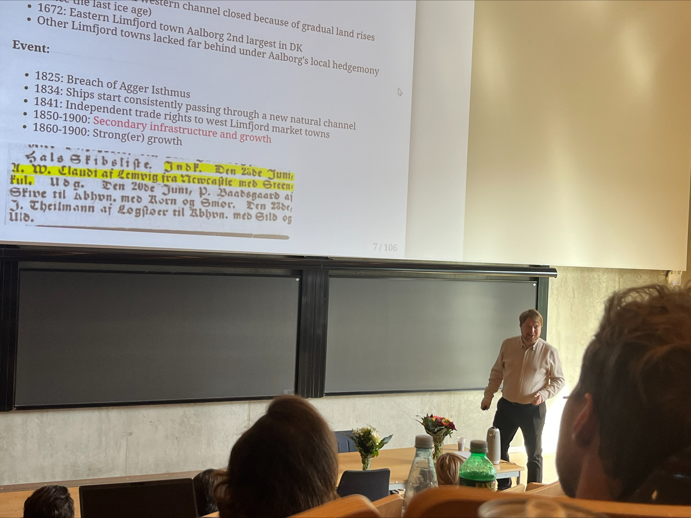

---
output:
  xaringan::moon_reader:
    seal: false
    includes:
      after_body: insert-logo.html
    self_contained: false
    lib_dir: libs
    nature:
      highlightStyle: github
      highlightLines: true
      countIncrementalSlides: false
      ratio: '16:9'
editor_options: 
  chunk_output_type: console
---
class: center, inverse, middle

```{css echo=FALSE}
.pull-left {
  float: left;
  width: 44%;
}
.pull-right {
  float: right;
  width: 44%;
}
.pull-right ~ p {
  clear: both;
}


.pull-left-wide {
  float: left;
  width: 66%;
}
.pull-right-wide {
  float: right;
  width: 66%;
}
.pull-right-wide ~ p {
  clear: both;
}

.pull-left-narrow {
  float: left;
  width: 30%;
}
.pull-right-narrow {
  float: right;
  width: 30%;
}

.tiny123 {
  font-size: 0.40em;
}

.small123 {
  font-size: 0.80em;
}

.large123 {
  font-size: 2em;
}

.red {
  color: red
}

.orange {
  color: orange
}

.green {
  color: green
}
```


# Statistics
## Lecture 1: Introduction

### Christian Vedel,<br>Department of Economics

### Email: [christian-vs@sam.sdu.dk](christian-vs@sam.sdu.dk)

### Updated `r Sys.Date()`


.footnote[
.left[
.small123[
*Please beware. I work on these slides until the last minute before the lecture and push most changes along the way. Until the actual lecture, this is just a draft*  
]
]
]

---
class: middle
# Today's lecture
.pull-left-wide[
*Getting to know each other, and getting to know what statistics is.*

- **Getting aquainted**
- **Motivation:** What is statistics and why do we need it?
  + What is it we do at a university?
  + How do we obtain/create knowledge?
  + Can we trust numbers? Spoiler: No
  + Why do we need statistics?  
  
- **Course overview**
  + What will you learn in this course?
- **Practical matters**
  + Exercises
  + Exam 
]

---
# Who is everyone?
.pull-left[
- Economist - freshly minted PhD (2023)
- Research at the intersection between machine learning and economic history. 
- Research on how and why particular places became well-off, using vast amounts of historical (very uncertain) data. 
- *Statistics is the core methodological concern of all modern quantitative social science*

- Write me emails
  + .orange[christian-vs@sam.sdu.dk]

- We can make office hours if you want it. 
- First time teaching this course. But I have taught similar things before

[Who are you? https://forms.gle/QoGMrHKv6ZmfncVE6](https://forms.gle/QoGMrHKv6ZmfncVE6)

]

.pull-right[

.small123[*PhD defence, 2023-09-25*]
]

---
## Some problems caught in the wild
--

Your boss asks you to analyze survey responses from 1,000 customers to identify which features of your product drive the highest satisfaction scores.
> Can you do this in a way, where you can/should trust your own results? 


--

You manage a portfolio of real estate market assets. If more than 20% of your portfolio defaults, you will be in big trouble
> What is the likelihood that you will be in big trouble? 

--

After COVID, working from home has become much more common. On the one hand, workers might perform better when they are given more freedom. On the other hand, there might be losses from not interacting socially with your colleagues.
> Can you construct a survey that would be informative about this issue? 

--

You work in the ministry of justice. Areas with more police officers tend to have higher crime rates.
> Should you recommend that they remove police officers from areas with higher crime rates? 

---
class: middle
# A definition
> Statistics is about quantifying what we **know** and what we **don't know** based on some analysis of some data.


.footnote[
.small123[
**Note:** In practice this is as much philosophy as it is maths. And increasingly computer science is also involved. In practice innovations come as much from every field that uses it: Social Science, Biology, Economics, Psychology, Business Studies, etc. 
]
]


---
class: inverse, middle, center
# What is statistics and why do we need it?

---
class: middle
# TL;DR
.small123[*Purpose: Levelling expectations: This course deals with some advanced stuff, but please don't be discouraged by that.*]

**Q:** What is it we do at a university?  
**A:** Part of the purpose of your education is to teach you tools to enable you to obtain new knowledge, scientifically and independently

**Q:** How do we obtain/create knowledge?  
**A:** One answer (out of many): Inherently we don't know anything. But we can limit our uncertainty by finding *empirical support that something is the case* $^1$

**Q:** Can we trust numbers?  
**A:** No. In general we can not trust numbers without knowing how they were estimated/calculated

**Q:** Why do we need statistics?  
**A:** In an uncertain world, statistics helps us make sense of complex information, quantify uncertainty, and draw evidence-based conclusions.


.footnote[
.small123[
$^1$: Your headache goes away when you take a paracetomol *and* it does not go away when don't take it $\rightarrow$ paracetomol cures headaches 
]
]

---
class: middle
.pull-left-wide[
# What is it we do at uni? (1/3)
- Why did you choose your line of study? 
- **Interest:** Why do you think it is interesting?
- **Function:** How are you planning on using what you learn? E.g. what kind of job (loosely speaking) do you hope to have in ~10 years time?

*Please provide answers [here forms.gle/PaePMXi8rz7f4fVB9](https://forms.gle/PaePMXi8rz7f4fVB9)*
]


---
class: middle
# What is it we do at uni? (2/3)
### The legal answer

**Executive Order on Bachelor's and Master's Programs at Universities (Education Executive Order):**

> "Section 2: The purpose of bachelor's degree programs is to:
> [...] Provide the student with the academic knowledge and theoretical and **methodological qualifications and competencies**, enabling them to independently identify, formulate, and solve complex problems within the relevant components of the field(s) of study [...]"

.small123[[*BEK nr 1328 af 15/11/2016* - chatGPT translation](https://www.retsinformation.dk/eli/lta/2016/1328)]

---
class: middle
.pull-left-wide[
# What is it we do at uni? (3/3)
### A pragmatic answer
- We don't teach you a lot of practical knowledge. Sometimes we do anyway as a happy accident. 
- We teach you methods and frameworks
- We try to equip you with tools to have some expertise in navigating a complex world (in your particular sub-field)

- Importantly: You need tools to generate new knowledge. Statistics provides some of the most important such tools. 
- Also: Makes you capable of reading and engaging with a lot of scientific literature. 
]

---
class: middle
# How do we obtain/create knowledge? (1/5)
.pull-left-wide[
> A. *"If you torture the data long enough, it will confess to anything"* (Attributed to Ronald Coase, 1961)  

> B. *"It is better to be vaguely right than exactly wrong."* (Carveth Read, 1920) 

> C. *"We do not know; we can only guess."* (K. Popper, 1934)  

> D. *"For every complex problem there is an answer that is clear, simple, and wrong."* (Mencken, 1916)  

**Exercise:** Please explain, for the above quotes, the opportunities and limitations that they impose on knowledge creation in social science. 

]

---
# How do we obtain/create knowledge? (2/5)
### An analogy of doing social science with statistics 

> *"Studying societies and people is like standing in a dark room, throwing darts into empty space. If one hits something, we then argue endlessly over what was hit, what the dart really is, and whether we ever threw it in the first place."*

- Social science is *hard*

- Two paths forward:
  1. Drop the idea of learning anything specific: Everything is endlessly complex, and the only task is to appreciate this
  2. Cautious positivism: Pose certain ideas and then test them in data. Eventually we learn something. At least something which is (locally) useful.
  
--

*Statistics is often firmly in the second camp*

---
class: middle
# How do we obtain/create knowledge? (3/5)
.pull-left-wide[
### Some hard questions to answer
1. Does higher education cause higher income? 
2. Does social media cause mental health problems?
3. Does joining the EU cause more prosperity for a society?
4. Does more internal EU migration benefit the EU on aggregate? Who wins and who loses out?
5. Was brexit a good idea?
6. Is it a good idea for a company to focus on CSR?
7. Can you boost employee retention with training programmes?
8. Does increased advertising cause more sales?
9. Is it beneficial for a company to have more diverse management?
10. What places will be prosperous after climate change?
]


---
class: middle
# How do we obtain/create knowledge? (4/5)
.pull-left-wide[
### Ice cream sales and drowning
- [Ice_cream_kills.xlsx]()
- Every 1.43 mio. ice creams sold is associated with someone drowning. Someone should do something!  
]

---
class: middle
# How do we obtain/create knowledge? (5/5)
.pull-left[
### How it is ought to be
*How we often assume it is in intro stats*
- You have some idea about how to measure something
- You collect data
- You test whether the data lends support to your idea
- You conclude or start over by collecting more data
]

.pull-right[
### How it often is
*The lived experience*
- You have some data
- You are asked to provide 'insights' 
- You start wondering about the type of questions you can answer
- You test these ideas 
- Your results are inconclusive
- Your boss demands that you make a conclusion anyway and move on to the next project. 
]

***Note:*** *In this course we will start in a nice and simplified world and then the complexity follows in further courses.*

---
class: middle
# Can we trust numbers?
.pull-left-wide[
- Generally: No
- But there are degrees. 
- A strict statistical analysis can provide valuable insights.
- E.g. we can know whether painkillers work against headaches. 

- **Point of this course:** To introduce you to the basic theoretical framework to evaluate whether you can trust a number or not. 
]

---
class: middle
# Why do we need statistics?  

.pull-left-wide[
- We need to study statistics, because it provides tools for generating new knowledge and evaluating the validity of existing claims. 
- In turn this is part of providing you with one of the main takeaways from a university education: Tools to enable you to obtain new knowledge, scientifically and independently
- Statistics is hard. But knowledge creation is generally hard. But also valuable. 
]

---
class: center, middle
### XKCD Comic

  
*Source: https://xkcd.com/552/*

---
# What to expect
.small123[
- **Structure of the lectures**
  + 45 min. of theory
  + 45 min. of practical examples
  + 45 min. of coding challenge - presentations?
- **Book:**
  + We will use 'PA2021' - Patel, A. A., & Arasanipalai, A. U. (2021). _Applied natural language processing in the enterprise_. O'Reilly Media. https://www.oreilly.com/library/view/applied-natural-language/9781492062561/
- **Exam:**
  + One week project in December (?) 
- **Course content:**
  + Low level NLP tools + applications 
  + Transformers $\rightarrow$ Basics $\rightarrow$ Transformers
- **Course plan:**
  + Continuously updated
- **Slides:**
  + The night before the lecture 
  + Slides do not cover everything I say. Please bring a notepad and a pen.
- **Course description:**
  + https://odin.sdu.dk/sitecore/index.php?a=fagbesk&id=156413&lang=en  
  + Course plan
  + [GitHub](https://github.com/christianvedels/News_and_Market_Sentiment_Analytics)
]

  
---
# Preperation
.pull-left[
- Read other literature assigned. 
- Read assigned PA2021 chapter. 
- Make sure you understand what is happening. 
- Please go off tangents. Tangents are the best - if not for this specific course.

**Coding challenge:**
- Will be challenging 
- Mistakes are great
- Make sure that you understand and can run the solution
]

.pull-right[

]


---
# Efficient Market Hypothesis (EMH)

.pull-left[
*If you can buy cheaply something which is more valuable than its price, you can profit (arbitrage). But ...*
1. We all have access to the same information 
2. Everyone is interested in maximum profits
3. Everyone buys the undervalued assets 
4. Prices increases until the advantages is gone 

]
.pull-right[


### Implications:
- If any 'whole' in the market occurs it is closed within milliseconds 
- We cannot invest better than anyone else 
- Investing in what a chicken poops on is better than listening to an 'expert'
]

---

# Information Extraction in Financial Markets

.pull-left[
- The NLP promise is to be able to extract information 
- News about firms changes the expected returns on assets 
- [NVIDIA News](https://youtu.be/U0dHDr0WFmQ?si=EKAQgBiTekQhxl0u)
- If the expected returns on an asset increases or decreases there is an opportunity for arbitrage if prices have not changed
- NLP tools potentially allow us to be ahead 
- EMH dissallows open source implementations: You need to improve on the methods you get here
- **Timing is key**
]

.pull-right[

]
  
---
class: inverse, middle, center

# How did we get to ChatGPT?

---
# The promise of AI
.pull-left[
- The idea of the mechanic 'nightingale' ([HC] Andersen, 1844)
  + **Idea:** The mechanic version can never be as good because it is mechanic 
  + Reaches far back e.g. Descartes (1637) writes about automata in 'Discourse and Methods' 
- Can machines think? The idea of the Turing test (1950/60s)
  + If machines can think, they will respond convincingly in conversation 

]

.pull-right[

*Generated in beta.dreamstudio.ai*
]

---
# Early rule-based systems
.pull-left[
- We can model behaviour by *if then* statements 
- ELIZA (Weizenbaum, 1966):
  + The earliest convincing chatbot
  + Looks for keywords and otherwise writes something generic or repeats something from earlier
- 1980's was the peak of rule based systems 
  + Based on linguistic theory
  + Grammar 
  + Morphology
  + Semantics
]

.pull-right[

*ELIZA Conversation (Wikimedia Commons)* 

*Semantic net*
]

---
# The philosophical/linguistic problem
.pull-left[
- Can we distinguish reasoning from immitation? 
  + Chinese room problem (Seale, 1980) 
- What is the nature of language? 
  + Innateness vs. Empiricism (Chomsky vs. Vienna circle*)
  + Innateness $\rightarrow$ rule-based NLP 
  + Empiricism $\rightarrow$ 'empirical' (learning) methods 
- ChatGPT is a big score for the Empiricist hypothesis
]

.footnote[
\* E.g. (of names you might know) Gödel, Popper, 
Reichenbach, Wittgenstein [(Wikipedia)](https://en.wikipedia.org/wiki/Vienna_Circle#Overview_of_the_members_of_the_Vienna_Circle)
]

.pull-right[

]

---
# 90s computer power - 60s maths
.pull-left[
- **Empiricist problem**: Statistics alone can only predict - not understand structure. Mathematical limitation (Pearl, 2019)
- But we can phrase language problems as predictions problems 
- Black box circumvents innateness 
- We just need to estimate: $$P(word|\{text\},\theta)$$
- E.g. "He is a [word]"
- Choose $\theta$ to minimize predicition errors
- Could be based on e.g. a [universal function approximator](https://en.wikipedia.org/wiki/Universal_approximation_theorem) like a neural network

]

.pull-right[
   
.small123[*Crazy realistic 90s dancing baby*]


]


---
# History of Neural Networks for NLP 
.pull-left-wide[
- **'Perceptron'** neural network (Rosenblatt, .orange[1958])
- **Long-Short-term memory** remembers and forgets previous words and letters (Hochreiter, Schmidhuber, .orange[1997]) 
- A rule-based trick: **Word embeddings:** Queens, Kings, men, women (Firth, .orange[1957] - But applied from .orange[2000/2010s]; Roweis & Saul, .orange[2000])
- **Tranformers**: 'Attention Is All You Need' (Vaswani, .orange[2017])
- **Masked models**: E.g. BERT (Devlin et al, .orange[2019])
  + "He is a [MASK] dog." $\rightarrow$  "He is a [smelly] dog."
- **GPT**: Radford & Narasimhan (.orange[2018]): What if we make models really large? E.g. 175 billion parameters and train it on 499 Billion tokens (GPT-3)
- **What is a good answer?**: ChatGPT etc. (.orange[2022]) trains a sepperate neural network to tell good from bad answers - reinforcement learning.
- **Huggingface**: Sharing of various transformer models.
]

.pull-right-narrow[

]

---
class: middle
# Three types of NLP

1. **Structural, rules-based:** *ELIZA*
  + Still has supprisingly many uses. E.g. regex but also generally in financial applications where time is important
2. **Statistical, structural-inspired:** *Latent Dirichlet Allocation* 
  + What any NLP/ML class was about ~5 years ago. What I have learned
  + Worth knowing because there is *so* much of it out there
3. **Statistical, black box:** *Transformer models* 
  + What we will focus on for the most part

---
# Open questions
.pull-left[
- Do language models think? 
- What is consciousness? 
- Should LLMs be allowed for exams?
  + (Please use it for this one!) 
  + [Link to SDU's policy](https://sdunet.dk/en/undervisning-og-eksamen/nyheder/2024/0628_gai)

**What do you think?**
]

.pull-right[
**Evidence of structural learning**

.small123[
*Figure 1 from [Gurnee & Tegmark (2023)](https://arxiv.org/abs/2310.02207)*
]
]

---
# Course plan
.small123[*What do you think?*]

.small123[
| Date       | Slides (links will appear)                                                                                                                                         | Topic                                                             | Assigned Reading                                                                                                                                                                                             |
| ---------- | ------------------------------------------------------------------------------------------------------------------------------------------------------------------ | ----------------------------------------------------------------- | ------------------------------------------------------------------------------------------------------------------------------------------------------------------------------------------------------------ |
| 2024-10-30 | [Lecture 1 - Introduction](https://raw.githack.com/christianvedels/News_and_Market_Sentiment_Analytics/refs/heads/main/Lecture%201%20-%20Introduction/Slides.html) | A broad overview of NLP + Setting up the course and expectations  | See below                                                                                                                                                                                                    |
| 2024-11-06 | TBA                                                                                                                                                                | Classical data wrangling with text                                | [Text Wrangling with Python](https://blog.devgenius.io/text-wrangling-with-python-a-comprehensive-guide-to-nlp-and-nltk-f7553e713291) ['The Zipf Mystery'](https://youtu.be/fCn8zs912OE?si=xVMA63kt9M99Qvjx) |
| 2024-11-13 | TBA                                                                                                                                                                | Classifcation - recipes for training a text classifier            | Ch 2                                                                                                                                                                                                         |
| 2024-11-20 | TBA                                                                                                                                                                | Classification - off-the shelf models                             | Ch 3                                                                                                                                                                                                         |
| 2024-11-27 | TBA                                                                                                                                                                | Tokenization and Embeddings                                       | Ch 4, Ch 5                                                                                                                                                                                                   |
| 2024-12-04 | TBA                                                                                                                                                                | State of the art - recent research papers                         | Ch. 8 + assigned papers                                                                                                                                                                                      |
| 2024-12-11 | TBA                                                                                                                                                                | Other relevant topics - e.g. topic modelling, LLMs, RAGs or other | TBA                                                                                                                                                                                                          |
| TBA | TBA                                                                                                                                                                | Wrapping up                                                       |                                                                                                                                                                                                              |
]

---
class: inverse, middle, center

# Miscellaneous 

---
# Setup
.pull-left[
- `spaCy` and `transformers` 
- I use Spyder - but feel free to use something else

#### Conda environment

```{r eval=FALSE, include=TRUE}
conda create --name sentimentF24
conda activate sentimentF24
conda install numpy matplotlib pandas seaborn requests
conda install spyder
```

]

.pull-right[

#### spaCy
Download everything with the following python code    
```{r eval=FALSE, include=TRUE}
conda install -c conda-forge spacy
conda install -c conda-forge cupy
python -m spacy download en_core_web_sm
```

#### Install pytorch to run on cuda 11.8*
```{r eval=FALSE, include=TRUE}
conda install pytorch torchvision torchaudio pytorch-cuda=11.8 -c pytorch -c nvidia
pip install transformers
```
 
]

.footnote[
.small123[
  *Without a GPU? See https://pytorch.org/get-started/locally/ 
]
]

---
# How to deal with paths

.pull-left-narrow[
- We want to write code which runs out of the box on any system
- We don't want to edit long paths. We want it to work.  

]

--

.pull-right-wide[
.small123[
.red[**Bad:**] 
```{python eval=FALSE}
pd.read_csv('C:/Users/Christian/Dropbox/Teaching/News_and_Market_Sentiment_Analytics/2024/News_and_Market_Sentiment_Analytics/Lecture_2_-_Lexical_resources/Data/Novo_Nordisk_News.csv')
``` 

.green[**Good:**]
```{python eval=FALSE}
pd.read_csv('Data/Novo_Nordisk_News.csv')
``` 

]
]

---

### Solution?

--

1. Save scripts to relevant folder
2. Run things from main 

```{python eval=FALSE}
import pandas as pd

def some_function(x):
  x + 1
  
def some_other_function(x):
  x + 2

if __name__ == "__main__":
  df = pd.read_csv('Data/Novo_Nordisk_News.csv')
  df = some_function(df)
  df = some_other_function(df)
``` 


---
# Before next time
.pull-left[
- Read [Text Wrangling with Python](https://blog.devgenius.io/text-wrangling-with-python-a-comprehensive-guide-to-nlp-and-nltk-f7553e713291)
  
  
- Watch ['The Zipf Mystery'](https://youtu.be/fCn8zs912OE?si=xVMA63kt9M99Qvjx)
]


.pull-right[

]

---
# Resources
- [Natural Language Processing with spaCy & Python - Course for Beginners](https://www.youtube.com/watch?v=dIUTsFT2MeQ)

- [Natural Language Processing With Python and **NLTK**](https://youtu.be/FLZvOKSCkxY?si=6ZgFsh3P551EWVRC)

- [Complete Natural Language Processing (NLP) Tutorial in Python! (with examples)](https://youtu.be/M7SWr5xObkA?si=b40Uw97oX5Epy6vf)

- **Do you want a quick and dirty GitHub intro?**

### Project directory
- Think about how you structure your directory for this course (and in general)
- Examples: [OccCANINE](https://github.com/christianvedels/OccCANINE), [This course](https://github.com/christianvedels/News_and_Market_Sentiment_Analytics/)

- *More advanced approaches*  
  + [Microsoft Team Data Science Project](https://learn.microsoft.com/en-us/azure/architecture/data-science-process/overview),  [Cookiecutter](https://drivendata.github.io/cookiecutter-data-science/), [Cookiecutter youtube video](https://youtu.be/5VjuG5lliYU?si=oci0h0gNiTWciQ_I)

---
class: inverse, middle
# Coding challenge: 
## ['Skipping ahead to the end'](https://github.com/christianvedels/News_and_Market_Sentiment_Analytics/blob/main/Lecture%201%20-%20Introduction/Coding_challenge1.md)


---
## References (1/2)

.small123[
Andersen, H. C. (1844). The Nightingale. https://www.hcandersen-homepage.dk/?page_id=2257

Devlin, J., Chang, M.-W., Lee, K., & Toutanova, K. (2019). BERT: Pre-training of Deep Bidirectional Transformers for Language Understanding. In Proceedings of the 2019 Conference of the North American Chapter of the Association for Computational Linguistics: Human Language Technologies, Volume 1 (Long and Short Papers), pages 4171–4186, Minneapolis, Minnesota. Association for Computational Linguistics.

Descartes, R. (1637). Discourse on the Method of Rightly Conducting One's Reason and of Seeking Truth in the Sciences (J. Veitch, Trans.). EBook-No. 59. https://www.gutenberg.org/ebooks/59

Firth, J.R. (1957). "A synopsis of linguistic theory 1930–1955". Studies in Linguistic Analysis: 1–32. Reprinted in F.R. Palmer, ed. (1968). Selected Papers of J.R. Firth 1952–1959. London: Longman.

Gurnee, W., & Tegmark, M. (2023). Language Models Represent Space and Time. https://arxiv.org/abs/2310.02207

Pearl, J. (2019). The seven tools of causal inference, with reflections on machine learning. Communications of the ACM, 62(3), 54–60. https://doi.org/10.1145/3241036

Radford, A., & Narasimhan, K. (2018). Improving Language Understanding by Generative Pre-Training. https://api.semanticscholar.org/CorpusID:49313245

Rosenblatt, F. (1958). The perceptron: A probabilistic model for information storage and organization in the brain. Psychological Review, 65(6), 386–408. https://doi.org/10.1037/h0042519
]


---
## References (2/2)
.small123[
Roweis, S. T., Saul, L. K. (2000). "Nonlinear Dimensionality Reduction by Locally Linear Embedding". Science, 290(5500), 2323–6. https://doi.org/10.1126/science.290.5500.2323

Searle, J. (1980), "Minds, Brains and Programs", Behavioral and Brain Sciences, 3(3), 417–457. https://doi.org/10.1017/S0140525X00005756

Vaswani, A., Shazeer, N., Parmar, N., Uszkoreit, J., Jones, L., Gomez, A. N., Kaiser, L., & Polosukhin, I. (2017). Attention Is All You Need. https://arxiv.org/abs/1706.03762

Weizenbaum, J. (1966). ELIZA—a Computer Program for the Study of Natural Language Communication between Man and Machine. Commun. ACM, 9(1), 36–45. https://doi.org/10.1145/365153.365168
]
