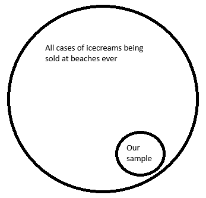
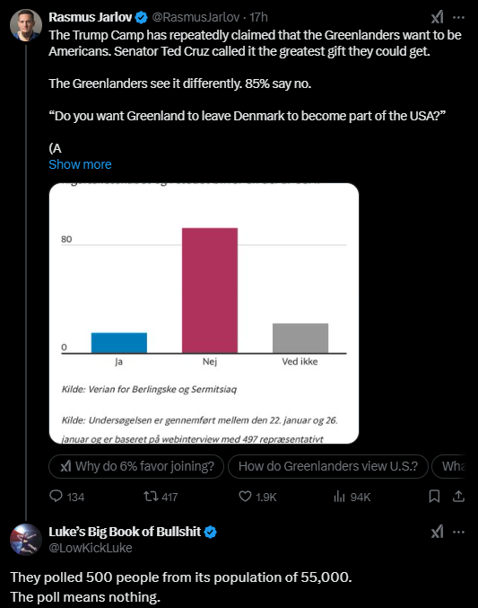

---
output:
  xaringan::moon_reader:
    seal: false
    includes:
      after_body: insert-logo.html
    self_contained: false
    lib_dir: libs
    nature:
      highlightStyle: github
      highlightLines: true
      countIncrementalSlides: false
      ratio: '16:9'
editor_options: 
  chunk_output_type: console
---
class: center, inverse, middle

```{css echo=FALSE}
.pull-left {
  float: left;
  width: 44%;
}
.pull-right {
  float: right;
  width: 44%;
}
.pull-right ~ p {
  clear: both;
}


.pull-left-wide {
  float: left;
  width: 66%;
}
.pull-right-wide {
  float: right;
  width: 66%;
}
.pull-right-wide ~ p {
  clear: both;
}

.pull-left-narrow {
  float: left;
  width: 30%;
}
.pull-right-narrow {
  float: right;
  width: 30%;
}

.tiny123 {
  font-size: 0.40em;
}

.small123 {
  font-size: 0.80em;
}

.large123 {
  font-size: 2em;
}

.red {
  color: red
}

.orange {
  color: orange
}

.green {
  color: green
}
```


# Statistics
## Lecture 1: Introduction

### Christian Vedel,<br>Department of Economics

### Email: [christian-vs@sam.sdu.dk](christian-vs@sam.sdu.dk)

### Updated `r Sys.Date()`


.footnote[
.left[
.small123[
*Please beware. I work on these slides until the last minute before the lecture and push most changes along the way. Until the actual lecture, this is just a draft*  
]
]
]

---
class: middle
# Today's lecture
.pull-left-wide[
*Getting to know each other, and getting to know what statistics is.*

- **Getting aquainted**
- **Motivation:** What is statistics and why do we need it?
  + What is it we do at a university?
  + How do we obtain/create knowledge?
  + Can we trust numbers? Spoiler: No
  + Why do we need statistics?  
  
- **Course overview**
  + What will you learn in this course?
- **Practical matters**
  + Exercises
  + Exam 
]

---
# Who is everyone?
.pull-left[
- Economist - freshly minted PhD (2023)
- Research at the intersection between machine learning and economic history. 
- Research on how and why particular places became well-off, using vast amounts of historical (very uncertain) data. 
- *Statistics is the core methodological concern of all modern quantitative social science*

- Write me emails
  + .orange[christian-vs@sam.sdu.dk]

- We can make office hours if you want it. 
- First time teaching this course. But I have taught similar things before

[Who are you? https://forms.gle/QoGMrHKv6ZmfncVE6](https://forms.gle/QoGMrHKv6ZmfncVE6)

]

.pull-right[

.small123[*PhD defence, 2023-09-25*]
]

---
## Some problems caught in the wild
--

Your boss asks you to analyze survey responses from 1,000 customers to identify which features of your product drive the highest satisfaction scores.
> Can you do this in a way, where you can/should trust your own results? 


--

You manage a portfolio of real estate market assets. If more than 20% of your portfolio defaults, you will be in big trouble
> What is the likelihood that you will be in big trouble? 

--

After COVID, working from home has become much more common. On the one hand, workers might perform better when they are given more freedom. On the other hand, there might be losses from not interacting socially with your colleagues.
> Can you construct a survey that would be informative about this issue? 

--

You work in the ministry of justice. Areas with more police officers tend to have higher crime rates.
> Should you recommend that they remove police officers from areas with higher crime rates? 

---
class: middle
# A definition
> Statistics is about quantifying what we **know** and what we **don't know** based on some analysis of some data.


.footnote[
.small123[
**Note:** In practice this is as much philosophy as it is maths. And increasingly computer science is also involved. In practice innovations come as much from every field that uses it: Social Science, Biology, Economics, Psychology, Business Studies, etc. 
]
]


---
class: inverse, middle, center
# What is statistics and why do we need it?

---
class: middle
# TL;DR
.small123[*Purpose: Levelling expectations: This course deals with some advanced stuff, but please don't be discouraged by that.*]

**Q:** What is it we do at a university?  
**A:** Part of the purpose of your education is to teach you tools to enable you to obtain new knowledge, scientifically and independently

**Q:** How do we obtain/create knowledge?  
**A:** One answer (out of many): Inherently we don't know anything. But we can limit our uncertainty by finding *empirical support that something is the case* $^1$

**Q:** Can we trust numbers?  
**A:** No. In general we can not trust numbers without knowing how they were estimated/calculated

**Q:** Why do we need statistics?  
**A:** In an uncertain world, statistics helps us make sense of complex information, quantify uncertainty, and draw evidence-based conclusions.


.footnote[
.small123[
$^1$: Your headache goes away when you take a paracetomol *and* it does not go away when don't take it $\rightarrow$ paracetomol cures headaches 
]
]

---
class: middle
.pull-left-wide[
# What is it we do at uni? (1/3)
- Why did you choose your line of study? 
- **Interest:** Why do you think it is interesting?
- **Function:** How are you planning on using what you learn? E.g. what kind of job (loosely speaking) do you hope to have in ~10 years time?

*Please provide answers [here forms.gle/PaePMXi8rz7f4fVB9](https://forms.gle/PaePMXi8rz7f4fVB9)*
]


---
class: middle
# What is it we do at uni? (2/3)
### The legal answer

**Executive Order on Bachelor's and Master's Programs at Universities (Education Executive Order):**

> "Section 2: The purpose of bachelor's degree programs is to:
> [...] Provide the student with the academic knowledge and theoretical and **methodological qualifications and competencies**, enabling them to independently identify, formulate, and solve complex problems within the relevant components of the field(s) of study [...]"

.small123[[*BEK nr 1328 af 15/11/2016* - chatGPT translation](https://www.retsinformation.dk/eli/lta/2016/1328)]

---
class: middle
.pull-left-wide[
# What is it we do at uni? (3/3)
### A pragmatic answer
- We don't teach you a lot of practical knowledge. Sometimes we do anyway as a happy accident. 
- We teach you methods and frameworks
- We try to equip you with tools to have some expertise in navigating a complex world (in your particular sub-field)

- Importantly: You need tools to generate new knowledge. Statistics provides some of the most important such tools. 
- Also: Makes you capable of reading and engaging with a lot of scientific literature. 
]

---
class: middle
# How do we obtain/create knowledge? (1/5)
.pull-left-wide[
> A. *"If you torture the data long enough, it will confess to anything"* (Attributed to Ronald Coase, 1961)  

> B. *"It is better to be vaguely right than exactly wrong."* (Carveth Read, 1920) 

> C. *"We do not know; we can only guess."* (K. Popper, 1934)  

> D. *"For every complex problem there is an answer that is clear, simple, and wrong."* (Mencken, 1916)  

**Exercise:** Please explain, for the above quotes, the opportunities and limitations that they impose on knowledge creation in social science. 

]

---
# How do we obtain/create knowledge? (2/5)
### An analogy of doing social science with statistics 

> *"Studying societies and people is like standing in a dark room, throwing darts into empty space. If one hits something, we then argue endlessly over what was hit, what the dart really is, and whether we ever threw it in the first place."*

- Social science is *hard*

- Two paths forward:
  1. Drop the idea of learning anything specific: Everything is endlessly complex, and the only task is to appreciate this
  2. Cautious positivism: Pose certain ideas and then test them in data. Eventually we learn something. At least something which is (locally) useful.
  
--

*Statistics is often firmly in the second camp*

---
class: middle
# How do we obtain/create knowledge? (3/5)
.pull-left-wide[
### Some hard questions to answer
1. Does higher education cause higher income? 
2. Does social media cause mental health problems?
3. Does joining the EU cause more prosperity for a society?
4. Does more internal EU migration benefit the EU on aggregate? Who wins and who loses out?
5. Was brexit a good idea?
6. Is it a good idea for a company to focus on CSR?
7. Can you boost employee retention with training programmes?
8. Does increased advertising cause more sales?
9. Is it beneficial for a company to have more diverse management?
10. What places will be prosperous after climate change?
]


---
class: middle
# How do we obtain/create knowledge? (4/5)
.pull-left-wide[
### Ice cream sales and drowning
- [Ice_cream_kills.xlsx]()
- Every 1.43 mio. ice creams sold is associated with someone drowning. Someone should do something!  
]

---
class: middle
# How do we obtain/create knowledge? (5/5)
.pull-left[
### How it is ought to be
*How we often assume it is in intro stats*
- You have some idea about how to measure something
- You collect data
- You test whether the data lends support to your idea
- You conclude or start over by collecting more data
]

.pull-right[
### How it often is
*The lived experience*
- You have some data
- You are asked to provide 'insights' 
- You start wondering about the type of questions you can answer
- You test these ideas 
- Your results are inconclusive
- Your boss demands that you make a conclusion anyway and move on to the next project. 
]

***Note:*** *In this course we will start in a nice and simplified world and then the complexity follows in further courses.*

---
class: middle
# Can we trust numbers?
.pull-left-wide[
- Generally: No
- But there are degrees. 
- A strict statistical analysis can provide valuable insights.
- E.g. we can know whether painkillers work against headaches. 

- **Point of this course:** To introduce you to the basic theoretical framework to evaluate whether you can trust a number or not. 
]

---
class: middle
# Why do we need statistics?  

.pull-left-wide[
- We need to study statistics, because it provides tools for generating new knowledge and evaluating the validity of existing claims. 
- In turn this is part of providing you with one of the main takeaways from a university education: Tools to enable you to obtain new knowledge, scientifically and independently
- Statistics is hard. But knowledge creation is generally hard. But also valuable. 
]

---
class: center, middle
### XKCD Comic

  
*Source: https://xkcd.com/552/*

---
# What to expect
.small123[
- **Lectures is a cocktail of**
  + 50 pct theory
  + 50 pct practical examples
- **Book:**
  + Bowerman, O'Connell, Orries & Porter "Essentials of Business Statistics", McGraw-Hill, latest edition. 
  + Bøye "Statistics Companion" is supplementary
- **Exam:**
  + Written exam, 4 hours, all exam aids allowed, mo internet
- **Course content:**
  + Basic 'survival tools' for statistics
- **Slides:**
  + Might be available earlier. But only ready the night before the lecture. 
  + Slides do not cover everything I say. Please bring a notepad and a pen.
- **Course description:** Did I miss anything? 
  + HA: https://odin.sdu.dk/sitecore/index.php?a=searchfagbesk&bbcourseid=B105125401-1-E24&lang=en 
  + European Studies: https://odin.sdu.dk/sitecore/index.php?a=searchfagbesk&bbcourseid=B300214401-1-F25&lang=en
]


---
# Preperation
.pull-left[
- Read what is assigned 
- Try to understand what is happening. Forgive yourself and move on if you don't
- I will add notes from Niels Karl Sørensen (previous lecturer). They are good!
- Please go off tangents. Tangents are the best - if not for this specific course.

**Exercises:**
- Almost the same exercises that have been used for years.
- **The most important thing to attend**

]

.pull-right[

]

---
# Course plan illustrated

---
class: center, middle
# Course plan
*Let's have a look at 'Course plan.xlsx'*


---
# Excel
.pull-left-wide[
- When I do statistics it typically looks like this:
```{r echo=TRUE, eval=FALSE}
mod = lm(income ~ age + gender, data = df)
mod %>% summary()
```

]
--
.pull-left-wide[
#### But we will do something simpler
- We use excel and the *Analysis Tool Pack*
- Your TAs have some experience with this
- Your lecturer (me) does not have much experience with this (but extensive excel experience). 
- I will get up to speed. But listen to your TAs. They are smart :-)
- Listen to me when it comes to theory
]

---
class: middle
# Today's 'content'
- Purpose and definition of statistics (already covered)
- Data and data sources 
- Population and samples 
- Classification of scales


---
# Data 
.small123[*You probably know this. But it is still important to define terms. I will refer to these and expect you to know them.*]

.pull-left[
- Data is a collection of structured information
- Typically (and often good practice): 
  + **Observations** (each row is an **entity**) and 
  + **information** (each column is a **variable** containing information)
]

--
.pull-left[
- **Observation**: Person, company, municipality, parish, country, etc. (these are refered to as 'entities') 
- **Variable**: Information about that person
]

--
.pull-left[
- **Information**: 120k (annual income), "female", 5 stars
]

---
# Example

| Observation     | Price | Location     | Size   | Building Rating |
|-----------------|-------|--------------|--------|-----------------|
| House 1         | 250k  | Suburb       | 120 sqm| A               |
| House 2         | 350k  | City Center  | 80 sqm | C               |
| House 3         | 450k  | Suburb       | 150 sqm| B               |

--
.center[
**What type of information can variables be?**
]


---
# Types of variables
.pull-left[
### Quantiative variables 
- Nominal scale:
  + House price, income, years of education
- Ordinal scale:
  + Reviews (1, 2, ..., 5 stars),
  + Bulding rating (A, B, C),
  + etc.
]
--
.pull-right[
### Qualitative variables
- House color: "Red"
- Location: "Suburban"
- Tone of language: "Positive"

**Note:** We can turn this into into something quantitative anyway. 
 + Dummy: Mark all "red" building with 1 and the rest with 0
 + Grouped statistics: Calculate the mean house price for each type of location

]

---
# Samples
.pull-left[
- We want to know something about the world
- But we don't have data on all of it
- We want to **infer** something about the **population** from a **sample** of it.

- **Note 1:** Depending on what we measure, the idea of a 'population' might be abstract:
  + Example 1: Average weight of newborn babies in 2024 $\rightarrow$ Population: All babies
  + Example 2: Company responses to a survey $\rightarrow$ Population: Similar(?) companies
  
- **Note 2:** We can only know something about the average for the population. Not the individuals (unless everyone is the same)
]

.pull-right[

]


---
# Sampling in practice 
.pull-left[
- **Q**: Can you know something without asking everyone? 
  + **A**: Sometimes. You will learn when/why (*Central Limit Theorem, Law of Large Numbers*)
  + Note: Do you need to measure all apples to know what an apple weighs on average?
- **Q**: What do we need to assume?
  + Generally: The sample needs to be IID (independently identically distributed)
  + But we can work with exceptions
]

.pull-right[
.small123[https://x.com/LowKickLuke/status/1884450622868504890]
.center[

]
]

---
# Different types of sources

.pull-left[
## 1. Primary
### 1.a. Experimental
- When you run an experiment and can control all the conditions
- E.g. lab experiment

### 1.b. Observational
- When you observe the data and can control that 
- E.g. survey data
]

.pull-right[
## 2. Secondary (what we often work with)
- Data just happens to exist for some reason
- We use it to explore (social) scientific questions
- E.g. Register data, public databases, *archival data*
]


---
# Before next time
.pull-left[
- Have a look at the exercises (in class you will do the actual exercise)
- Read the assigned reading

- Next time: Descriptive statistics
]


.pull-right[

]

