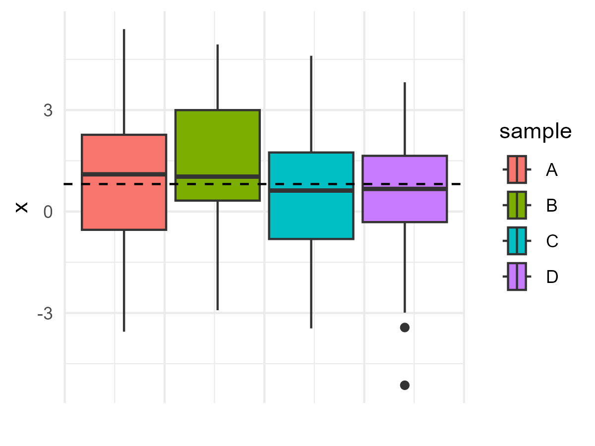
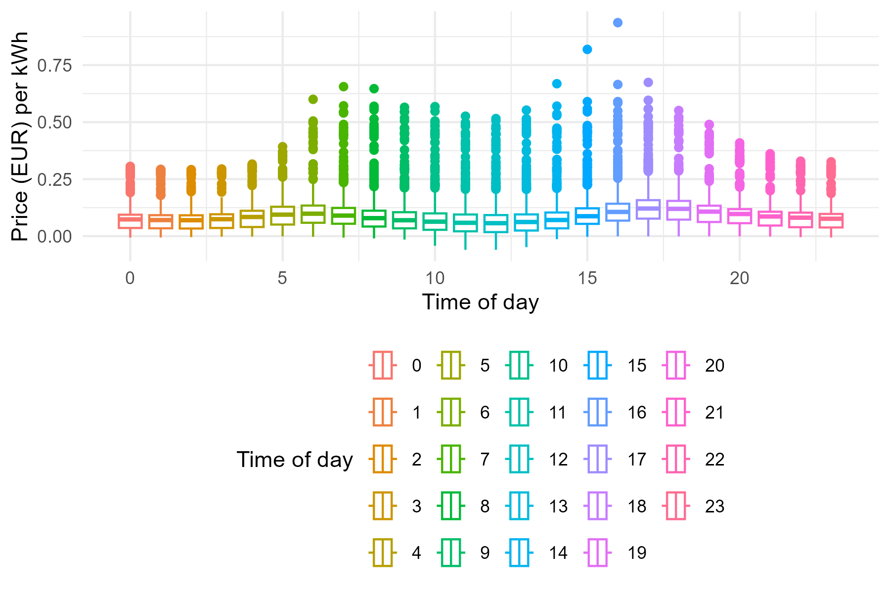
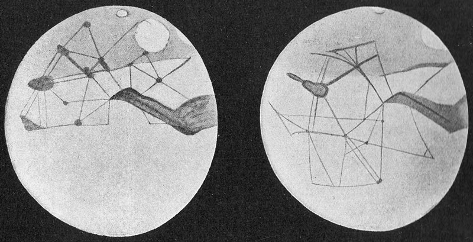
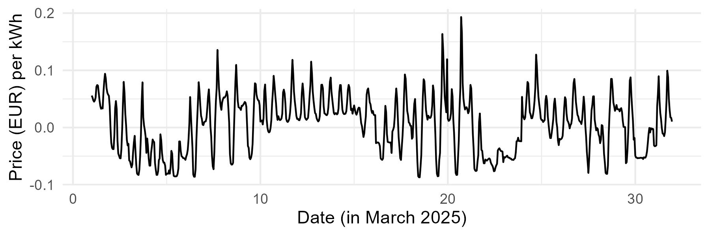
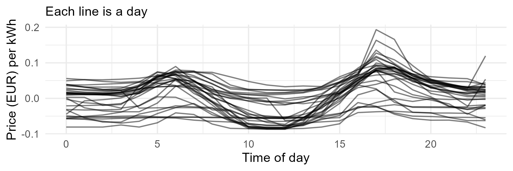
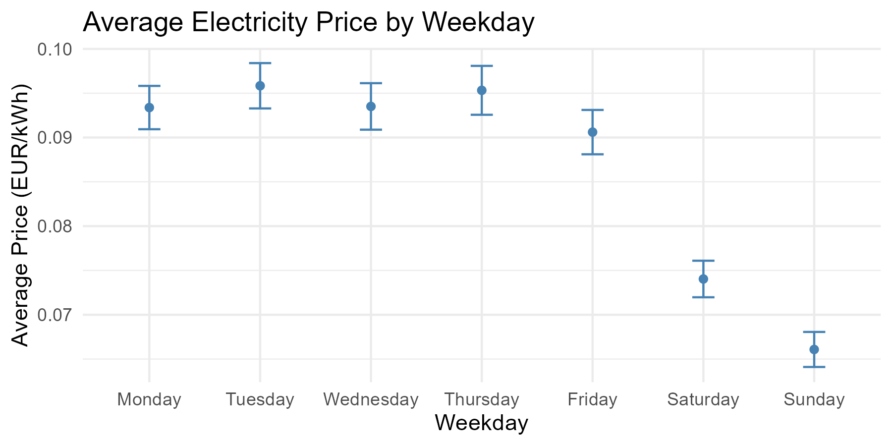
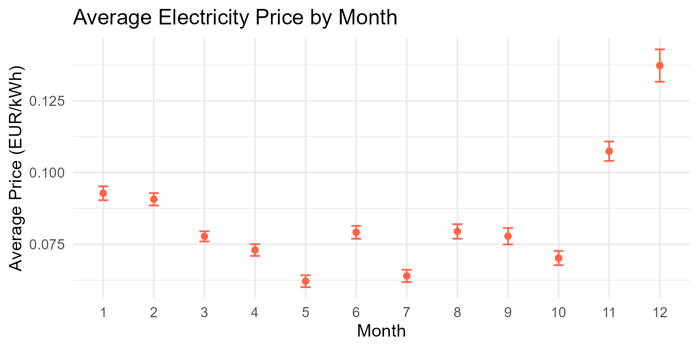
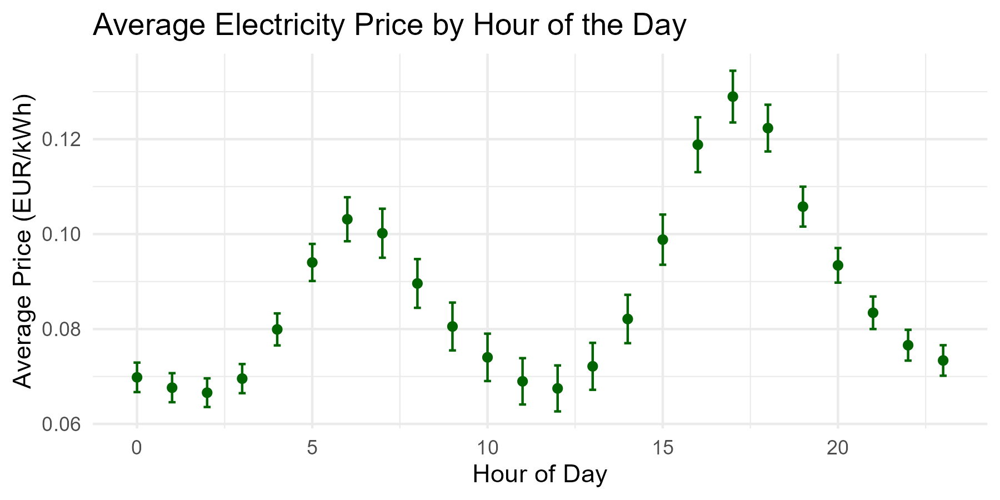

---
output:
  xaringan::moon_reader:
    seal: false
    includes:
      after_body: insert-logo.html
    self_contained: false
    lib_dir: libs
    nature:
      highlightStyle: github
      highlightLines: true
      countIncrementalSlides: false
      ratio: '16:9'
editor_options: 
  chunk_output_type: console
---
class: center, inverse, middle

```{r xaringan-panelset, echo=FALSE}
xaringanExtra::use_panelset()
```

```{r xaringan-tile-view, echo=FALSE}
xaringanExtra::use_tile_view()
```

```{r xaringanExtra, echo = FALSE}
xaringanExtra::use_progress_bar(color = "#808080", location = "top")
```

```{css echo=FALSE}
.pull-left {
  float: left;
  width: 44%;
}
.pull-right {
  float: right;
  width: 44%;
}
.pull-right ~ p {
  clear: both;
}


.pull-left-wide {
  float: left;
  width: 66%;
}
.pull-right-wide {
  float: right;
  width: 66%;
}
.pull-right-wide ~ p {
  clear: both;
}

.pull-left-narrow {
  float: left;
  width: 30%;
}
.pull-right-narrow {
  float: right;
  width: 30%;
}

.pull-right-extra-narrow {
  float: right;
  width: 20%;
}

.tiny123 {
  font-size: 0.40em;
}

.small123 {
  font-size: 0.80em;
}

.large123 {
  font-size: 2em;
}

.red {
  color: red
}

.orange {
  color: orange
}

.green {
  color: green
}
```


# Statistics
## Lecture 10: ANOVA (Analysis of Variance)

### Christian Vedel,<br>Department of Economics

### Email: [christian-vs@sam.sdu.dk](christian-vs@sam.sdu.dk)

### Updated `r Sys.Date()`


.footnote[
.small123[
*Please beware. I work on these slides until the last minute before the lecture and push most changes along the way. Until the actual lecture, this is just a draft*  
]
]

---
class: middle

# Today's Lecture
.pull-left-wide[
**Outline:**
- What is ANOVA? Setting Up Assumptions
- One-Way Analysis of Variance
- Tukey Test and Confidence Intervals
- Extensive example of use
]

.pull-right-narrow[

]


---
# Definition: *'Statistic'*

We now have the knowledge for an important modication of our definition from lecture 2:

> A statistic is a number which sumarises some data. 

#### Modification:
> In *statistics* (the discipline) want *statistics* (numbers) for which we know a theoretical distribution. This allows us to estimate the limits of our knowledge (uncertainty).

Examples: Mean, median, variance, quantiles, etc. (t-value, Z-value, F-statistic)

---
class: middle

# 1. What is ANOVA? Setting Up Assumptions
- **Purpose:** Compare $p$ groups for equal means.
- **Examples:**
  + Sales performance in different regions.
  + Comparing yearly unemployment figures.
- **Why "Analysis of Variance"?**
  + Although testing for equal means, the variance plays a central role.
- **Assumptions:**
  1. **Homogeneity of Variance**  
     $$\sigma_1^2 = \sigma_2^2 = \cdots = \sigma_p^2$$
  2. **Normality:** Each group is normally distributed.
  3. **Independence:** Observations are independent.

---
class: middle

# The Statistical Insight of ANOVA

.pull-left-wide[
### What is the Key Idea?

> ANOVA decomposes the overall variation in the data into components due to differences between groups and random variation within groups.

$$\text{Total Variation (SST)} = \text{Between Groups Variation (SSTR)} + \text{Within Groups Variation (SSE)}$$
]

---
# In a nutshell
.pull-left[
- **Between Groups:**  
  Measures how much the group means differ from the overall (grand) mean.  
  (Signal: Effects of treatments or conditions)

- **Within Groups:**  
  Captures the variability inside each group due to random chance or inherent noise.  
  (Noise: Natural, uncontrolled variability)

- When the **signal** exceeds the **noise**, we conclude that at least one group mean is significantly different.
]

.pull-right[

*How do we know whether any of the samples here comes from a different population?*  
*One answer is to run an ANOVA*
]

```{r eval=FALSE, include=FALSE}
set.seed(21)
library(tidyverse)

across_group_variance = data.frame(
  x = rnorm(30, 1, 2),
  sample = "A"
) %>%
  bind_rows(
    data.frame(
      x = rnorm(30, 0.75, 2),
      sample = "B"
    )
  ) %>%
  bind_rows(
    data.frame(
      x = rnorm(30, 0.75, 2),
      sample = "C"
    )
  ) %>%
  bind_rows(
    data.frame(
      x = rnorm(30, 0.75, 2),
      sample = "D"
    )
  ) %>%
  ggplot(aes(x, fill = sample)) + 
  geom_boxplot() + 
  geom_vline(xintercept = (30+0.75*90)/120, lty = 2) + 
  coord_flip() + 
  theme_minimal() +
  theme(
    axis.text.x = element_blank()
  ) + 
  labs(y = "")

ggsave("Figures/boxplot.png", width = 4, height = 3, plot = across_group_variance)
```

---
class: middle

# 2. One-Way Analysis of Variance (ANOVA) – Theory
- **Objective:** Test the hypothesis  
  $$H_0: \mu_1=\mu_2=\dots=\mu_p \quad \text{vs.} \quad H_1: \text{at least one } \mu_i \text{ is different}$$
- **Data Structure:**
  + Each group $i$ has $n_i$ observations.
  + Total observations: $$n = n_1 + n_2 + \dots + n_p$$
- **Two Sources of Variation:**
  - **Between Groups (Treatment):** Variation due to differences among group means.
  - **Within Groups (Error):** Variation within each group.


---
class: middle

# Decomposing Variation & ANOVA Table (1/2)
- **Total Variation:**
  $$\text{SST} = \sum_{i=1}^{p}\sum_{j=1}^{n_i}(x_{ij} - \bar{x})^2$$
- **Between Groups (Treatment) Sum of Squares:**
  $$\text{SSTR} = \sum_{i=1}^{p} n_i (\bar{x}_i - \bar{x})^2$$
- **Within Groups (Error) Sum of Squares:**
  $$\text{SSE} = \sum_{i=1}^{p}\sum_{j=1}^{n_i}(x_{ij} - \bar{x}_i)^2$$
---
class: middle

# Decomposing Variation & ANOVA Table (2/2)
- **ANOVA Table:**

| Source           | SS      | df         | MS                                  | F-value                      |
|------------------|---------|------------|-------------------------------------|------------------------------|
| Between Groups   | SSTR    | $p-1$     | $$\text{MSR} = \frac{\text{SSTR}}{p-1}$$ | $$F = \frac{\text{MSR}}{\text{MSE}}$$ |
| Within Groups    | SSE     | $n-p$     | $$\text{MSE} = \frac{\text{SSE}}{n-p}$$   |                              |
| **Total**        | SST     | $n-1$     |                                     |                              |

*Note: The F‑statistic follows an F‑distribution with $(p-1,\,n-p)$ degrees of freedom.*


---
class: middle

# Example: Impact of Trade War Tariffs on Import Prices (1/2)

.pull-left[
Imagine that due to the ongoing trade war, import prices for different product categories have increased. We don't know if three goods have been affected equally or it is just random fluctuations:

- **Consumer Electronics (Group A):**  
  $n_1 = 10$, average price increase $\bar{x}_1 = 5\%$
  
- **Industrial Equipment (Group B):**  
  $n_2 = 10$, average price increase $\bar{x}_2 = 10\%$
  
- **Agricultural Products (Group C):**  
  $n_3 = 10$, average price increase $\bar{x}_3 = 15\%$
  
**Overall Mean Price Increase:**

$$
\bar{x} = \frac{10\cdot 5 + 10\cdot 10 + 10\cdot 15}{30} =  10\%
$$
]

.pull-right[


**Between Groups (Treatment) Sum of Squares:**

$$
\text{SSTR} = 10(5-10)^2 + 10(10-10)^2 + 10(15-10)^2 
$$
$$
\text{SSTR} =  500
$$

**Within Groups (Error) Sum of Squares:**

Assume that within each product category, due to random factors (like market fluctuations or measurement error), the average squared deviation is $4$. Then for each group:

$$
\text{SSE}_{\text{group}} = (10-1)\cdot 4 = 9 \times 4 = 36
$$

Thus, the total within-group sum of squares is:

$$
\text{SSE} = 36 + 36 + 36 = 108
$$

]

---
class: middle

# Example: Impact of Trade War Tariffs on Import Prices (2/2)

.pull-left[
**Degrees of Freedom:**

- **Total:** $n - 1 = 30 - 1 = 29$
- **Between Groups:** $p - 1 = 3 - 1 = 2$
- **Within Groups:** $n - p = 30 - 3 = 27$

**Mean Squares:**

$$
\text{MSR} = \frac{\text{SSTR}}{p-1} = \frac{500}{2} = 250
$$

$$
\text{MSE} = \frac{\text{SSE}}{n-p} = \frac{108}{27} = 4
$$


]

.pull-right[
**F‑Statistic:**

$$
F = \frac{\text{MSR}}{\text{MSE}} = \frac{250}{4} = 62.5
$$

A high $F$-value of $62.5$ (p-value close to zero) indicates that the differences in import price increases among the three product categories are statistically significant. This suggests that the trade war tariffs are affecting these product categories differently.
]


---
class: middle

# 3. Supplementary Analysis: Tukey Test & Confidence Intervals
- **Tukey Test:**
  + Performs pairwise comparisons between group means.
  + **Equal Sample Sizes:**
    $$T = q_\alpha \sqrt{\frac{\text{MSE}}{n}}$$
  + **Unequal Sample Sizes:**  
    Use a modified formula based on the harmonic mean or the smallest sample size.
- **Confidence Intervals:**
  + For the difference between groups $i$ and $h$:
    $$(\bar{x}_i - \bar{x}_h) \pm t_{\alpha/2,\,n-p} \sqrt{\text{MSE}\left(\frac{1}{n_i} + \frac{1}{n_h}\right)}$$
  + No overlap between intervals indicates a significant difference.


---
class: middle

# 4. Violating the Assumptions of ANOVA
- **Issue:** Assumptions may not always be met.
- **What to do:**
  + **Homogeneity of Variance:**
    - Test with **Bartlett’s Test**:
      $$\chi^2 = \left(1 - c\right) \sum_{i=1}^{p}(n_i-1)\ln(s_i^2) - \ln\left( \frac{\text{SSE}}{n-p}\right)$$
      where $c$ is a correction factor.
  + **Non-Normal Data:**  
    Consider the non‑parametric **Kruskal‑Wallis test**.
  + **Other Diagnostics:**  
    Use the Bowman-Shenton test for normality.


---
class: middle

# Example: Seasonality in Energy prices

.pull-left[
- Energy prices determine:
  + Cost of production
  + Poverty rates 
  + Politics
  + Endless other things ...

### Two empirical questions:
- Q1. Can we predict energy prices? 
  + Hard question: But yes, somewhat.
  
- Q2. Is there theoretical room for predicting energy prices? Are they systematic?
  + Easier question. Necesary if we hope to be able to address the first question
  + In other words: Is it reasonable to reject: $H_0: \; \text{Energy are random}$
  
- Goal: We will answer **Q2** with ANOVA
]

.pull-right[
#### Box plot of all DK energy prices since 2022

**Data**:  
*We will be using a dataset of all energy prices in DK since 2022 from www.elprisenligenu.dk*

]

---
# Life on Mars?

.pull-left-wide[
- It is still unsettled whether there is life on Mars
- But in the early 20th century, some scientists, believed, they had evidence for **a civilisation of intelligent life on mars**
- It did appear so through unclear images in telescopes
- Humans are really good at finding patterns, even when there are none

.pull-left[


#### Sources (pictures): 
.small123[
https://commons.wikimedia.org/w/index.php?curid=120388655 + https://commons.wikimedia.org/w/index.php?curid=1226256
]


]

.pull-right-narrow[

]
]

--

.pull-right-narrow[
### Lesson for us?
- Essentially we try to avoid this
- We try to ask, whether there are real patterns behind what we think we are seeing.
- Let's get back to electricity ...

]


---
# Electricity data
.pull-left-narrow[
### Questions:
- Is it reasonable to assume that prices come from the same random distribution regarding:
  + Time of day?
  + Month of year?
  + Day of week?
  
- If we can reject this, there might be scope for some predictability

- [Data on hourly prices since 2022 is available here](https://github.com/christianvedels/Introductory_statistics/raw/refs/heads/main/Lecture%2010%20-%20ANOVA/Examples/Electricity_prices.xlsx)
]

.pull-right-wide[


]


```{r eval=FALSE, include=FALSE}
library(tidyverse)

df0 = read_csv2("Examples/Solved/Electricity_pricesAPI.csv")

p1 = df0 %>% 
  filter(month == 3, year == 2025) %>%
  ggplot(aes(time_of_day, EUR_per_kWh_demeaned)) + 
  geom_line(aes(group = date), alpha = 0.5) +
  theme_minimal() + 
  labs(
    subtitle = "Each line is a day",
    y = "Price (EUR) per kWh",
    x = "Time of day"
  )

ggsave("Figures/Energy_prices_march_by_time_of_day.png", plot = p1, width = 6, height = 2)

p1 = df0 %>% 
  filter(month == 3, year == 2025) %>% 
  ggplot(aes(day_of_month+time_of_day/24, EUR_per_kWh_demeaned)) + 
  geom_line() +
  theme_minimal() + 
  labs(
    y = "Price (EUR) per kWh",
    x = "Date (in March 2025)"
  )

ggsave("Figures/Energy_prices_march.png", plot = p1, width = 6, height = 2)

p1 = df0 %>% 
  ggplot(aes(EUR_per_kWh, y = time_of_day, col = factor(time_of_day))) + 
  geom_boxplot() + 
  theme_minimal() + 
  coord_flip() + 
  labs(
    col = "Time of day",
    x = "Price (EUR) per kWh",
    y = "Time of day"
  ) + 
  theme(
    legend.position = "bottom"
  )

ggsave("Figures/Boxplot_energy_prices.png", plot = p1, width = 6, height = 4)
```

```{r eval=FALSE, include=FALSE}

# Convert 'weekday' into an ordered factor (adjust levels as necessary)
df0 = df0 %>%
  mutate(weekday = factor(weekday, levels = c("Monday", "Tuesday", "Wednesday", 
                                                "Thursday", "Friday", "Saturday", "Sunday")))

# Define a helper function to calculate summary statistics with confidence intervals
calc_summary = function(data, group_var, value_var) {
  data %>%
    group_by({{ group_var }}) %>%
    summarise(
      mean_price = mean({{ value_var }}, na.rm = TRUE),
      sd_price = sd({{ value_var }}, na.rm = TRUE),
      n = n(),
      se = sd_price / sqrt(n),
      ci_lower = mean_price - 1.96 * se,
      ci_upper = mean_price + 1.96 * se
    )
}

# Calculate summary statistics for each grouping

# By weekday
prices_by_weekday = calc_summary(df0, weekday, EUR_per_kWh)

# By month
prices_by_month = calc_summary(df0, month, EUR_per_kWh)

# By hour of the day
prices_by_hour = calc_summary(df0, time_of_day, EUR_per_kWh)

# Create ggplot graphs with confidence intervals

# Plot for Weekday patterns: bar chart with error bars
p_weekday = ggplot(prices_by_weekday, aes(x = weekday, y = mean_price)) +
  geom_point(col = "steelblue") +
  geom_errorbar(aes(ymin = ci_lower, ymax = ci_upper), width = 0.2, col = "steelblue") +
  labs(title = "Average Electricity Price by Weekday",
       x = "Weekday", y = "Average Price (EUR/kWh)") +
  theme_minimal()

# Plot for Month patterns: bar chart with error bars; month is coerced to factor for discrete axis
p_month = ggplot(prices_by_month, aes(x = factor(month), y = mean_price)) +
  geom_point(col = "tomato") +
  geom_errorbar(aes(ymin = ci_lower, ymax = ci_upper), width = 0.2, col = "tomato") +
  labs(title = "Average Electricity Price by Month",
       x = "Month", y = "Average Price (EUR/kWh)") +
  theme_minimal()

# Plot for Hour of Day patterns: line plot with points and error bars
p_hour = ggplot(prices_by_hour, aes(x = time_of_day, y = mean_price)) +
  geom_point(color = "darkgreen") +
  geom_errorbar(aes(ymin = ci_lower, ymax = ci_upper), width = 0.2, color = "darkgreen") +
  labs(title = "Average Electricity Price by Hour of the Day",
       x = "Hour of Day", y = "Average Price (EUR/kWh)") +
  theme_minimal()

# Display the plots
print(p_weekday)
print(p_month)
print(p_hour)

# Save the plots using ggsave
ggsave("Figures/Seasonality_by_weekday.png", plot = p_weekday, width = 6, height = 3)
ggsave("Figures/Seasonality_by_month.png", plot = p_month, width = 6, height = 3)
ggsave("Figures/Seasonality_by_hour.png", plot = p_hour, width = 6, height = 3)

```


---
# Let us write up our null-hypotheses

.pull-left[
### Day of week
  $$H_0: \mu_{Monday}=...=\mu_{Sunday} \quad \text{(no 'seasonality')}$$  
### Month of year
  $$H_0: \mu_{Jan}=\mu_{Feb}=\mu_{March}=... = \mu_{Dec} \quad \text{(no 'seasonality')}$$  
### Hour of day
  $$H_0: \mu_{00:00}=\mu_{01:00}=\mu_{02:00}=... = \mu_{23:00} \quad \text{(no 'seasonality')}$$  

]

--
.pull-right[
#### Altnernative hypothesis (for each)
$$H_1: \text{at least one } \mu_{j} \text{ is different (seasonal pattern)}$$
]

---
class: middle

# A. Seasonaility by day of week


---

class: middle

# B. Seasonality by month

---

class: middle

# C. Seasonality by hour of day



---
class: middle

# Next Time
.pull-left[
- Testing for independence (Chi-squared test)
  + A very general test for whether two samples are from the same distribution
]

.pull-right-narrow[

]


