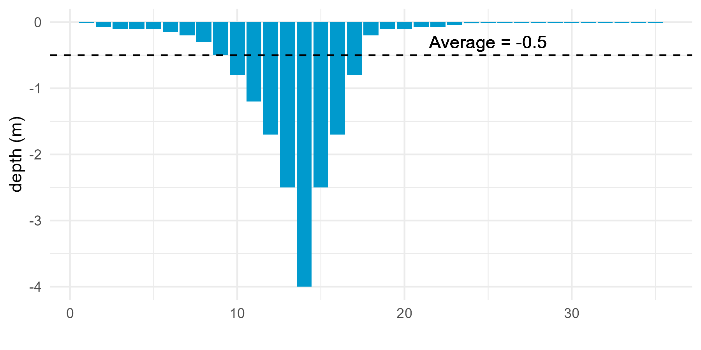
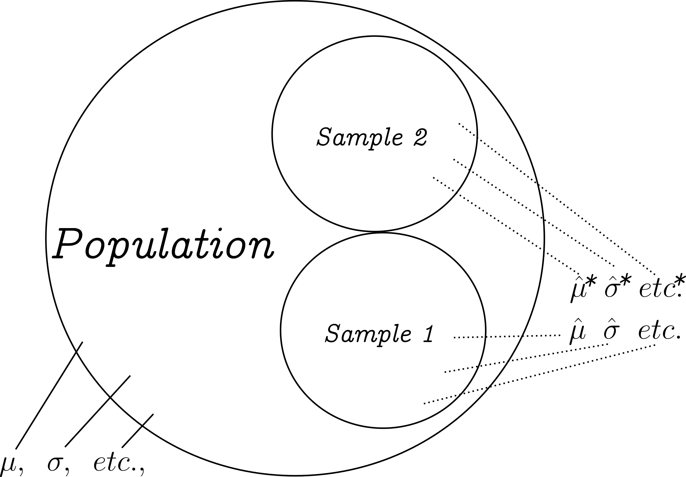
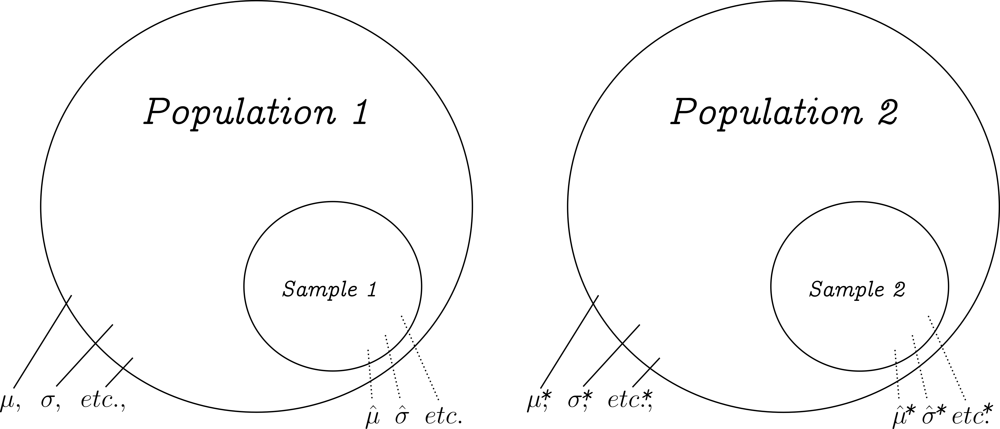
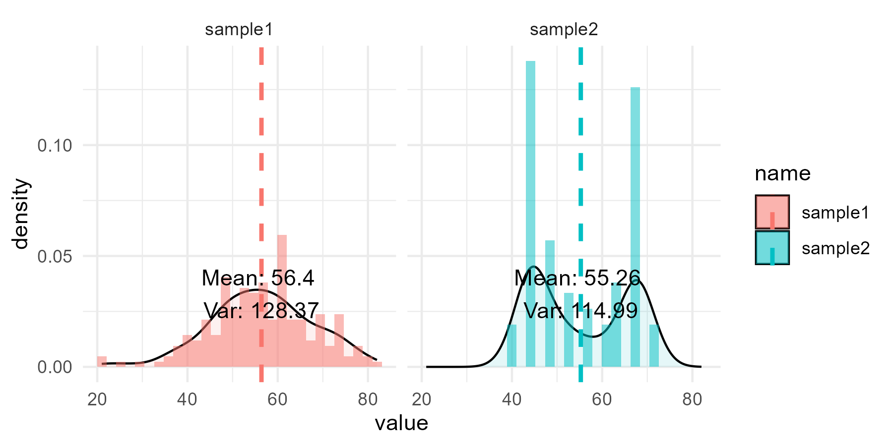

---
output:
  xaringan::moon_reader:
    seal: false
    includes:
      after_body: insert-logo.html
    self_contained: false
    lib_dir: libs
    nature:
      highlightStyle: github
      highlightLines: true
      countIncrementalSlides: false
      ratio: '16:9'
editor_options: 
  chunk_output_type: console
---
class: center, inverse, middle

```{r xaringan-panelset, echo=FALSE}
xaringanExtra::use_panelset()
```

```{r xaringan-tile-view, echo=FALSE}
xaringanExtra::use_tile_view()
```

```{r xaringanExtra, echo = FALSE}
xaringanExtra::use_progress_bar(color = "#808080", location = "top")
```

```{css echo=FALSE}
.pull-left {
  float: left;
  width: 44%;
}
.pull-right {
  float: right;
  width: 44%;
}
.pull-right ~ p {
  clear: both;
}


.pull-left-wide {
  float: left;
  width: 66%;
}
.pull-right-wide {
  float: right;
  width: 66%;
}
.pull-right-wide ~ p {
  clear: both;
}

.pull-left-narrow {
  float: left;
  width: 30%;
}
.pull-right-narrow {
  float: right;
  width: 30%;
}

.pull-right-extra-narrow {
  float: right;
  width: 20%;
}

.tiny123 {
  font-size: 0.40em;
}

.small123 {
  font-size: 0.80em;
}

.large123 {
  font-size: 2em;
}

.red {
  color: red
}

.orange {
  color: orange
}

.green {
  color: green
}
```


# Statistics
## Lecture 11: Testing for independence - Chi-squarred test

### Christian Vedel,<br>Department of Economics

### Email: [christian-vs@sam.sdu.dk](christian-vs@sam.sdu.dk)

### Updated `r Sys.Date()`


.footnote[
.small123[
*Please beware. I work on these slides until the last minute before the lecture and push most changes along the way. Until the actual lecture, this is just a draft*  
]
]

---
class: middle

# Today's Lecture
.pull-left-wide[
**The past few lecture:**  
- Big question: Are these two samples from the same population?
  + Do they have same mean? 
  + Do they have the same variance?
  + (Between versus within varince - ANOVA)

**This lecture:** 
- Same question and related questions but generalized
  + Are two samples from the same *probability distribution*?
  + Are two samples independent?
  + Is a sample from a specific *probability distribution*?
  + Generalized test at the distributional level
]

.pull-right-narrow[

]

---
# Don’t Drown in Averages

.pull-left[
> A statistician (and poor swimmer), noting the river’s average depth was 0.5 m and thereby safe, deicded to cross it. He was never seen again. 

- How could it be that it is unsafe if it is only 0.5 m. deep?

]

--
.pull-right[
### Good statisticians care about the entire distribution


]

```{r eval=FALSE, include=FALSE}
library(tidyverse)

df0 = data.frame(
  # x = 1:16,
  depth = -c(
    0.01,
    0.08,
    0.1,
    0.1,
    0.1,
    0.15,
    0.2,
    0.3,
    0.5,
    0.8,
    1.2,
    1.7,
    2.5,
    4.0,
    2.5,
    1.7,
    0.8,
    0.2,
    0.1,
    0.1, 
    0.08,
    0.07,
    0.05,
    0.02,
    0.015,
    0.01,
    0.01,
    0.01,
    0.01,
    0.01,
    0.01,
    0.01,
    0.01,
    0.01,
    0.01
  )
)

df0$depth %>% mean()
df0$x = 1:NROW(df0)

p1 = df0 %>% 
  ggplot(aes(x = x, y = depth)) + 
  geom_bar(stat = "identity", fill = "deepskyblue3") +
  theme_minimal() +
  labs(x = "", y = "depth (m)") + 
  geom_hline(yintercept = -0.5, lty = 2) +
  geom_text(x = 25, y = -0.3, label = "Average = -0.5", inherit.aes = FALSE, data = NULL)

p1

ggsave("Figures/Rivercrossing.png", plot = p1, width = 6, height = 3)
```


--
.pull-left[
.red[
### Todays lecture: *How to avoid drowning*
]
]

---
class: middle

# One task we are trying to solve
#### What is the better description of our data?

.pull-left[
#### Two samples from the same pop.


]

.pull-right[
#### Two samples from two different pops.

]

---
class: middle

# Related tasks to solve

- Can we reject a specific distribution?
- Can we reject independence?


---
class: middle

# Example: Comparing distributions (1/3)

.pull-left[
#### Case: Political views in two counties
- We collect data in two countries and ask for political views
  + Taxes
  + Education
  + Rights
  + Etc.
- We compute a combined index of political views index from 0 to 100 (0: Progressive; 100: Conservative)
- Are voters in the two countries alike? (Are they from the same population?)

]

.pull-right[
#### Facts
- Sample 1:
  + Mean: 56.4
  + Standard deviation: 11.3
  + Observations: 200

- Sample 2:
  + Mean: 55.3
  + Standard deviation: 10.7
  + Observations: 200
  
- **Are the populations different?**
- [Data is available here](https://github.com/christianvedels/Introductory_statistics/raw/refs/heads/main/Lecture%2011%20-%20Chi-squared%20test/Examples/Two_samples.xlsx)
- Please provide answer here: https://forms.gle/GesxjfnuPDTKsdoH6 
]


---
# Example: Comparing distributions (2/3)

.pull-left-wide[
| Sample   | Mean | Var.   |Standard deviation | Observations |
|----------|------|-------|--------------------|--------------|
| Sample 1 | 56.4 | 128   | 11.3               | 200          |
| Sample 2 | 55.3 | 115   | 10.7               | 200          |
| Both     | 55.8 | 122   | 11.0               | 400          |

#### Our standard toolbox (t-test and F-test):
.small123[
- t-test:
  $$t=\textit{...using formla...}=1.0335; \;\;df = 200-2$$
  $$Pr(|t|>1.0335)=0.302 \;\;\;\; \text{(p-value)}$$
- F-test:
  $$F=\frac{var(Sample1)}{var(Sample2)}=\frac{128.3719}{114.9873}=1.1164$$
  $$df1 = 199,\;\;\; df2 = 199$$
  $$Pr(F>1.1164) = 0.4381 \;\;\;\; \text{(p-value)}$$

]
]

.pull-right-narrow[
### Interpretation:
- Our standard toolbox suggests that these two distributions cannot be rejected to be the same
]

---
# Example: Comparing distributions (3/3)

> Rule #1: Always do descriptive statistics

--
.pull-left-wide[

]

.pull-right-narrow[
- It turns out, that our two samples are very different

- It would be odd if they came from the same population

- Sample 2 seems much more polarized

]

--

.pull-right-narrow[
> Can we derive a test that compares *distributions*?

]

--

.pull-right-narrow[
#### Answer:
> Yes: $\chi^2$ - Chi-squarred

]


```{r eval=FALSE, message=FALSE, warning=FALSE, include=FALSE}
library(tidyverse)

# Simulate data
set.seed(20)
n = 200

sample_space = (c(1, 1, 1, 1, 1, 2, 0, 3, 2, 4, 5, 6, 6, 7, 7, 7, 7, 7, 7, 8)+10)*4
sample2 = sample(sample_space, size = n, replace = TRUE)

sample2_big = sample(sample_space, size = 20000, replace = TRUE)

df0 = data.frame(
  sample1 = round(rnorm(n, mean = mean(sample2_big), sd = sd(sample2_big))),
  sample2 = sample2
)

write_csv2(df0, "Examples/Solved/Two_samples.csv")

stats_df = df0 %>%
  pivot_longer(cols = sample1:sample2) %>%
  group_by(name) %>%
  summarise(mean_val = mean(value, na.rm = TRUE), 
            var_val = var(value, na.rm = TRUE))

p1 = df0 %>%
  pivot_longer(cols = sample1:sample2) %>%
  ggplot(aes(value, fill = name)) + 
  geom_density(alpha = 0.1) +
  geom_histogram(aes(y = ..density.., fill = name), position = "dodge", alpha = 0.5) + 
  theme_minimal() + 
  facet_wrap(~name) +
  geom_vline(data = stats_df, aes(xintercept = mean_val, color = name), 
             linetype = "dashed", size = 1) +
  geom_text(data = stats_df, aes(x = mean_val, y = 0, label = paste("Mean:", round(mean_val, 2), "\nVar:", round(var_val, 2))),
            color = "black", vjust = -1, hjust = 0.5)

ggsave("Figures/two_samples_with_same_var_and_mean.png", width = 6, height = 3, plot = p1)

df0 %>%
  pivot_longer(cols = sample1:sample2) %>%
  group_by(name) %>% 
  summarise(
    mean = mean(value),
    var = var(value),
    sd = sd(value),
    n = n()
  )

df0 %>%
  pivot_longer(cols = sample1:sample2) %>%
  summarise(
    mean = mean(value),
    var = var(value),
    sd = sd(value),
    n = n()
  )
  
# Two‐sample t‐test (Welch’s by default)
tt = t.test(df0$sample1, df0$sample2, var.equal = TRUE)
print(tt)

# F‐test for equal variances
stats = c(var(df0$sample1), var(df0$sample2), var(df0$sample1)/var(df0$sample2))
ft = var.test(df0$sample1, df0$sample2)
print(ft)
print(stats)

#----------------------------------------------------------------------#
# 3) Chi‑squared on binned counts
#----------------------------------------------------------------------#


# 3b) Define breaks so that each integer 1–7 is its own bin
breaks = seq(min(c(df0$sample1, df0$sample2)), max(c(df0$sample1, df0$sample2)), by = 5)

# 3c) Tabulate counts in each of the 7 bins
bin1 = table(cut(df0$sample1, breaks = breaks, right = TRUE))
bin2 = table(cut(df0$sample2, breaks = breaks, right = TRUE))

counts = rbind(Unimodal = bin1, Polarized = bin2)
print(counts)

# 3d) Chi‑squared test (are the two frequency distributions the same?)
counts = counts[,-c(1,2, 10)]
chi2 = chisq.test(counts)
print(chi2)

```


---
class: middle

# The $\chi^2$ Test: Overview

- Compares observed vs. expected counts  
- Three main uses:
  1. **Goodness-of-fit**: single categorical variable  
  2. **Test of independence**: two categorical variables
  3. **Comparing distributions**: two categorical variables

- Key idea: quantify how far observed data deviate from what we'd expect under $H_0$

- $H_0:$ The sample comes from some distribution
- *or* $H_0:$ The two samples are from the same distribution

---
class: middle

# Setting up the χ² Test

- **Tester**:
  $$\chi^2 \;=\; \sum_{i=1}^C \frac{(O_i - E_i)^2}{E_i}$$
- **Expected counts**:  
  $E_i = n\,p_i$  
- **Degrees of freedom**:  
  $\mathrm{df} = C - 1$  
- **Assumption**: All $E_i \ge 5$  
  - If violated, **pool** categories before testing (or use fisher exact)
  
---
class: middle

# Goodness-of-Fit: Dice Example

.pull-left-wide[
- **Experiment**: Roll a (presumed fair) die $n = 120$ times  
- **$H_0$**: Samples are drawn from a uniform distribution
  + *It's a dice*: $p(1) = p(2) = \cdots = p(6) = \tfrac{1}{6}$  
- **$H_1$**: At least one face deviates from $1/6$  

| Outcome $i$ | 1  | 2  | 3  | 4  | 5  | 6  | Total |
|--------------:|:--:|:--:|:--:|:--:|:--:|:--:|:-----:|
| Observed $O_i$ | 16 | 18 | 22 | 17 | 25 | 22 | 120   |
| Expected $E_i=120/6$ | 20 | 20 | 20 | 20 | 20 | 20 | 120   |

]


---
class: middle

# Dice Example: Test Statistic

.pull-left-wide[
#### Calculate test stat

| Outcome | $O_i$ | $E_i$ | $O_i - E_i$ | $(O_i - E_i)^2 / E_i$ |
|:-------:|:-----:|:-----:|:-----------:|:---------------------:|
| 1       | 16    | 20    | $-4$        | $0.80$               |
| 2       | 18    | 20    | $-2$        | $0.20$               |
| 3       | 22    | 20    | $+2$        | $0.20$               |
| 4       | 17    | 20    | $-3$        | $0.45$               |
| 5       | 25    | 20    | $+5$        | $1.25$               |
| 6       | 22    | 20    | $+2$        | $0.20$               |
| **Total** |       |       |             | **3.10**           |
]

.pull-right-narrow[
- $χ^2 = 3.10, df = 5$  
- Critical $χ^2_{0.05,5} = 11.07$  
- $P-value$: $\approx 0.68$
- **Decision**: $\Rightarrow$ do not reject $H_0$  
  - *We cannot reject that the dice is fair*

]

---
class: middle

# $\chi^2$ Test of Independence

> **Contingency table**: A cross-tabulation displaying joint counts of two categorical variables, with rows for A and columns for B.


|       | B = 1     | B = 2     | … | B = c     | Row Totals $R_i$ |
|:-----:|:---------:|:---------:|:-:|:---------:|:----------------:|
| A = 1 | $O_{11}$  | $O_{12}$  | … | $O_{1c}$  | $R_1$            |
| …     | …         | …         | … | …         | …                |
| A = r | $O_{r1}$  | $O_{r2}$  | … | $O_{rc}$  | $R_r$            |
| **Col Totals** | $C_1$     | $C_2$     | … | $C_c$     | $N$              |

- **Expected**: $E_{ij} = \frac{R_i C_j}{N}$  
- $df = (r-1)(c-1)$, assume all $E_{ij}\ge5$ 

---
class: middle

## Note: We can get expected values in contingency tables

.pull-left-wide[
- In a contingency table, we see **observed counts** $O_{ij}$ in each cell.
- But if two variables are independent, we can predict how many observations *should* fall in each cell.
- These are the **expected counts** $E_{ij}$, based on the totals alone.
]

---
# A Simple 2×2 Example (1/4)

Suppose we survey 100 people on:
- **A**: Smoker (Yes / No)  
- **B**: Exercise regularly (Yes / No)

|            | B = Yes | B = No | Row Total $R_i$ |
|:----------:|:-------:|:------:|:---------------:|
| **A = Yes**|   30    |   20   |       50        |
| **A = No** |   10    |   40   |       50        |
| **Col Totals**|  40   |   60   |      100        |

---
class: middle
# A Simple 2×2 Example (2/4)

.pull-left-wide[
Under independence,  
$$P(A=\text{Yes},\,B=\text{Yes})$$
$$= P(A=\text{Yes}) \times P(B=\text{Yes})$$
$$= \frac{R_{\text{Yes}}}{N}\times\frac{C_{\text{Yes}}}{N}$$

Multiply by the grand total $N=100$ to get the expected count:
$$E_{\text{Yes,Yes}}$$
$$= 100\times\frac{50}{100}\times\frac{40}{100}$$
$$= \frac{50\times40}{100}$$
$$= 20$$
]

.pull-right-narrow[
#### Observed:


|            | B = Yes | B = No | Row Total $R_i$ |
|:----------:|:-------:|:------:|:---------------:|
| **A = Yes**|   30    |   20   |       50        |
| **A = No** |   10    |   40   |       50        |
| **Col Totals**|  40   |   60   |      100        |
]

---
class: middle

# A Simple 2×2 Example (3/4)

.pull-left[
### Expected counts:
*Under $H_0$ (using formula from prev. slide)*

|            | B = Yes | B = No | Row Total $R_i$ |
|:----------:|:-------:|:------:|:---------------:|
| **A = Yes**|   20    |   30   |       50        |
| **A = No** |   20    |   30   |       50        |
| **Col Totals**|  40   |   60   |      100        |


]

.pull-right[
### Observed coutns (from data)

|            | B = Yes | B = No | Row Total $R_i$ |
|:----------:|:-------:|:------:|:---------------:|
| **A = Yes**|   30    |   20   |       50        |
| **A = No** |   10    |   40   |       50        |
| **Col Totals**|  40   |   60   |      100        |

]

--
.pull-left-wide[
#### The test:
- $\chi^2$ for independence then consists of comparing the two
]

---
class: middle

# A Simple 2×2 Example (4/4)

.pull-left-wide[
Using  
$$\chi^2 \;=\; \sum_{i,j} \frac{(O_{ij} - E_{ij})^2}{E_{ij}}$$  
for our 2×2 table:

| Cell            | $O_{ij}$ | $E_{ij}$ | $(O-E)^2/E$      |
|:---------------:|:--------:|:--------:|:----------------:|
| Yes / Yes       | 30       | 20       | $(30-20)^2/20 = 5$      |
| Yes / No        | 20       | 30       | $(20-30)^2/30 ≈ 3.33$   |
| No / Yes        | 10       | 20       | $(10-20)^2/20 = 5$      |
| No / No         | 40       | 30       | $(40-30)^2/30 ≈ 3.33$   |
| **Total**       |          |          | $\chi^2 \approx 16.67$        |

]


.pull-right-narrow[
- Thus, $\chi^2 = 16.67$ with $df = (2-1)(2-1)=1$.  
- p-value: $0.000045$. 
- We reject independence between smoking and exercise
- (Not a statement of causality)

]

---
# Mathematical note

.pull-left-wide[
- Instead of all the steps in computing $E_{ij}$ for each cell is. We can use:
  $$E_{ij} = \frac{R_i C_j}{n}$$
  
- This turns out to be useful

]


---
# Mathematical note

.pull-left-wide[

### In general

$$\chi^2 = \sum_{i=1}^r \sum_{j=1}^c \frac{(O_{ij}-E_{ij})^2}{E_{ij}}$$

We can test:
1. Independence (observing two outcomes for each observaition - like smoking/exercise)
2. We can test whether data comes from a specific distribution
3. We can test whether two samples are from the same population

]

.pull-right-narrow[
#### Three cases:
1. When testing independence: Take $E_{ij}$ from the formula above
2. When testing whether observations are from specific distrbution: Take $E_{ij}$ from the expectation of the distribution
3. When testing whether the data comes from the same population: $E_{ij}$ comes from the total

]

---
# The original motivating example (1/4)

.pull-left-wide[
#### Case:
- We asked for political views
- The mean and variance are the same.
- But:


]

.pull-right-narrow[
### Solution:
- We cut data into 5-wide bins for each sample and count the number of responses
- Then we compare the two distributions using $\chi^2$
]

```{r eval=FALSE, include=FALSE}
library(tidyverse)

df0 = read_csv2("Examples/Solved/Two_samples.csv")

df0_long = df0 %>% 
  pivot_longer(sample1:sample2)

# Define breaks
breaks = seq(min(df0_long$value)-1, max(df0_long$value)+1, by = 10)

# Tabulate counts in each bin
bin1 = table(cut(df0$sample1, breaks = breaks, right = TRUE))
bin2 = table(cut(df0$sample2, breaks = breaks, right = TRUE))

counts = data.frame(sample1 = as.numeric(bin1), sample2 = as.numeric(bin2))
print(counts)

# Combine rule of thumb
counts = counts[-1,]
counts[1,1] = 16

stats = counts %>% 
  mutate(expected = (sample1 + sample2)/2) %>%
  mutate(
    dif1sq = (sample1-expected)^2/expected,
    dif2sq = (sample2-expected)^2/expected
  )

stats %>% pivot_longer(dif1sq:dif2sq) %>% summarise(sum(value))

# 3d) Chi‑squared test (are the two frequency distributions the same?)
chi2 = chisq.test(counts)
print(chi2)

```


---
class: middle

# The original motivating example (2/4)

.pull-left[
| sample1 | sample2 |   range     |
|---------|---------|-------------|
|    4    |    0    |  20-30  |
|   12    |    8    |  30-40  |
|   44    |   82    |  40-50  |
|   73    |   33    |  50-60  |
|   44    |   69    |  60-70  |
|   22    |    8    |  70-80  |

]


#### Binning
- Very small counts is statistically problematic
- As a rule of thumb we combine to avoid count < 5
- I.e. we have to combine $20-30$ with $30-40$

---
class: middle
# The original motivating example (3/4)

.pull-left-narrow[
.small123[
**After combinations:**

| sample1 | sample2 |   range     |
|---------|---------|-------------|
|   16    |    8    |  20-40  |
|   44    |   82    |  40-50  |
|   73    |   33    |  50-60  |
|   44    |   69    |  60-70  |
|   22    |    8    |  70-80  |


**Expected values:**

| sample1 | sample2 |   range     |
|---------|---------|-------------|
|   12    |   12    |  20-40  |
|   63    |   63    |  40-50  |
|   53    |   53    |  50-60  |
|   56.5    |   56.5    |  60-70  |
|   15    |    15    |  70-80  |


]


]

.pull-right-wide[

#### Expected values 

- What would we expect the values to be in each bin?
  + *if there are from the same population*

$$\mathbb{E}_{ij} = \frac{n_j m_i}{n}$$

- Where: 
  + $n_j$ is number of observations for sample $j$
  + $m_i$ is the frequency for bin $i$ 
  + $n$ is the total number of observations across the two samples

- Example for the range 20-40 ($i=1$):
  + $n_j$: $n_1=200$, $n_2=200$
  + $m_i$: $m_1 = \frac{16\times200 + 8\times200}{200 + 200}=24$
  + $n = 400$
  + $\mathbb{E}_1 = 12$, $\mathbb{E}_2 = 12$

]

---
class: middle
# The original motivating example (4/4)

.pull-left-narrow[
.small123[
**Differences (O-E):**

| sample1 | sample2 |   range     |
|---------|---------|-------------|
|   16-12    |    8-12    |  20-40  |
|   44-63    |   82-63    |  40-50  |
|   73-53    |   33-53    |  50-60  |
|   44-56.5    |   69-56.5    |  60-70  |
|   22-15    |    8-15    |  70-80  |

- *These differences are squarred, and dividived by the expected value $E$*
- The sum of all of these are the $\chi^2$ statistic
- Higher: More unlikely to be from same pop


]

]

.pull-right-wide[
### Result
$$\chi^2 = \sum_j \sum_i \frac{(O_{ij}-E_{ij})^2}{E_{ij}}$$
$$\chi^2 = 41.28, \;\;  df=4$$
$$\text{p-value} = 0.000000002348$$

- $H_0$: The two samples are from the same distribution
- We reject this hypothesis


]


---
class: middle

# Some other things to mention:

.pull-left-wide[
### Yates correction

- In cases with $2\times 2$ comparison there is a bias towards rejecting $H_0$. 

### Disadvantages of $\chi^2$

- $\chi^2$ does not tell us how *strong* a relationship is. Just that there is a relationship
- Sometimes we only care about the mean and variance anyway
- In pracitce $\chi^2$ is less used 
- Instead regression analysis is used

]


---
class: middle
# Some things to make sure to learn

.pull-left-wide[
- To be able to tell which of the three $\chi^2$ tests to use
- To be able to set up the test
- Finding a relevant distribution to compare to (for goodness of fit)
- Setting up the test for independence and tabulating the contingency table
- Understanding the hypothesis we are testing in different cases

- **The content of this lecture was difficult, but you are expected to know and use it for the exam**
]


---
class: middle

# Next Time
.pull-left[
- Regression analysis
]

.pull-right-narrow[

]


