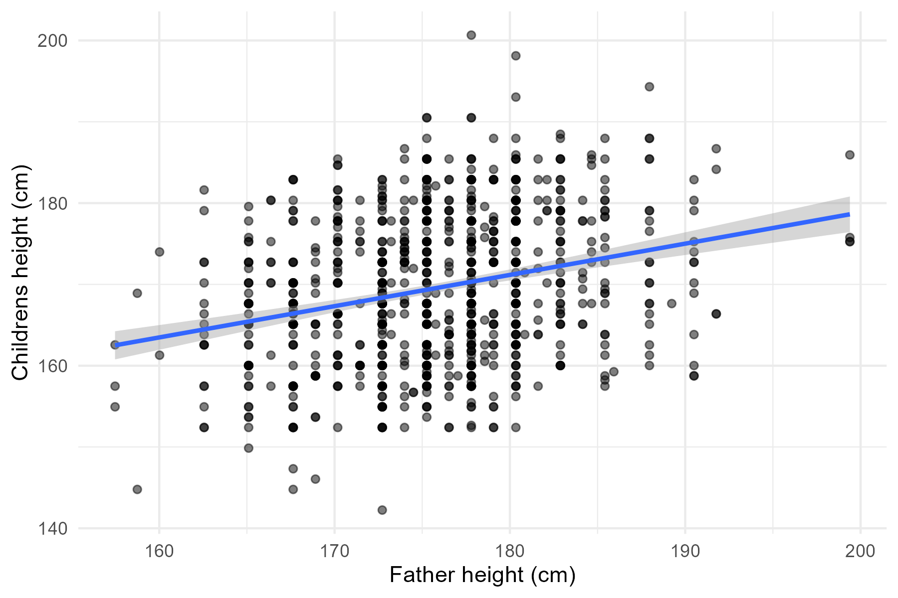
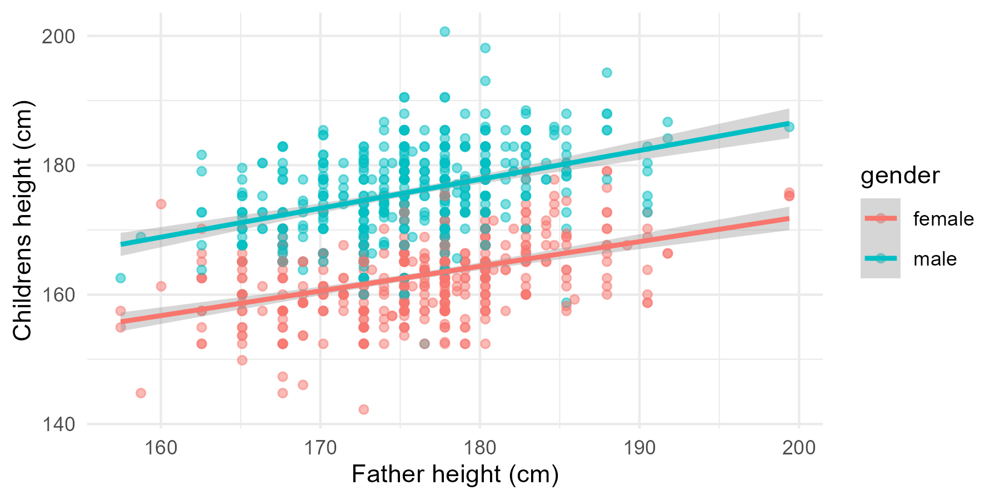
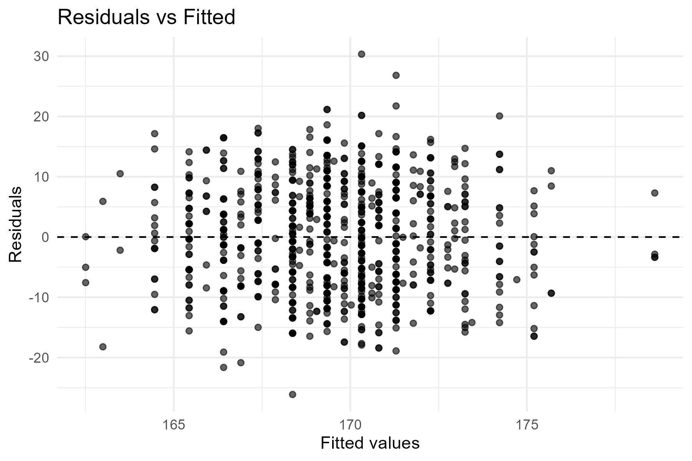
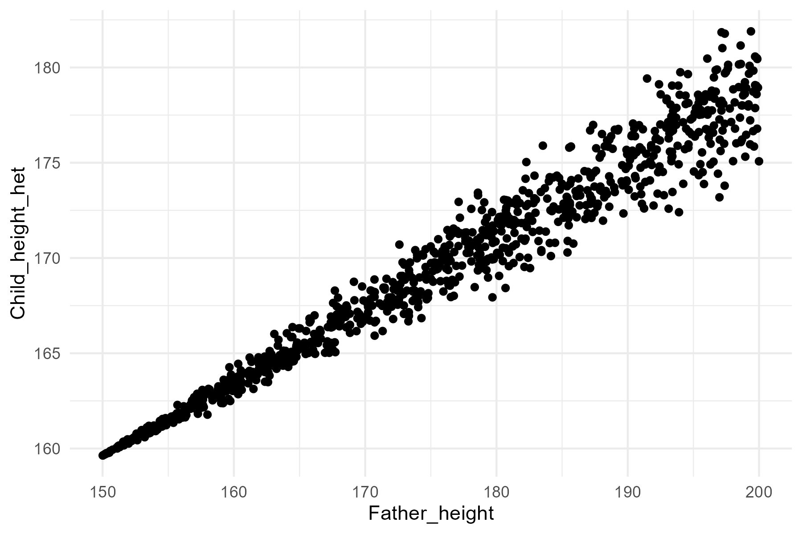
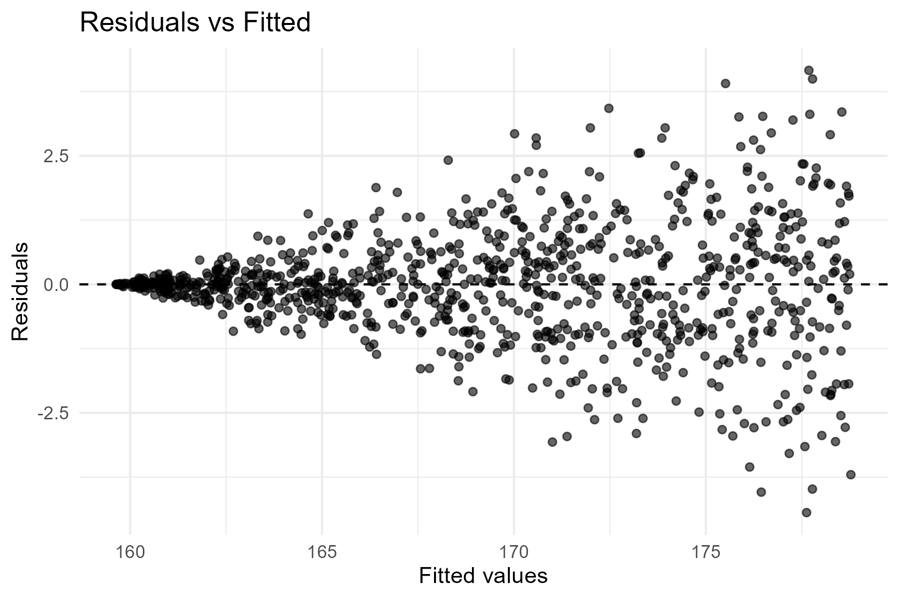

---
output:
  xaringan::moon_reader:
    seal: false
    includes:
      after_body: insert-logo.html
    self_contained: false
    lib_dir: libs
    nature:
      highlightStyle: github
      highlightLines: true
      countIncrementalSlides: false
      ratio: '16:9'
editor_options: 
  chunk_output_type: console
---
class: center, inverse, middle

```{r xaringan-panelset, echo=FALSE}
xaringanExtra::use_panelset()
```

```{r xaringan-tile-view, echo=FALSE}
xaringanExtra::use_tile_view()
```

```{r xaringanExtra, echo = FALSE}
xaringanExtra::use_progress_bar(color = "#808080", location = "top")
```

```{css echo=FALSE}
.pull-left {
  float: left;
  width: 44%;
}
.pull-right {
  float: right;
  width: 44%;
}
.pull-right ~ p {
  clear: both;
}


.pull-left-wide {
  float: left;
  width: 66%;
}
.pull-right-wide {
  float: right;
  width: 66%;
}
.pull-right-wide ~ p {
  clear: both;
}

.pull-left-narrow {
  float: left;
  width: 30%;
}
.pull-right-narrow {
  float: right;
  width: 30%;
}

.pull-right-extra-narrow {
  float: right;
  width: 20%;
}

.pull-center {
  margin-left: 28%;
  width: 44%;
}

.pull-center-wide {
  margin-left: 17%;
  width: 66%;
}

.tiny123 {
  font-size: 0.40em;
}

.small123 {
  font-size: 0.80em;
}

.large123 {
  font-size: 2em;
}

.red {
  color: red
}

.orange {
  color: orange
}

.green {
  color: green
}
```


# Statistics  
## Lecture 12: Simple Regression Analysis  

### Christian Vedel,<br>Department of Economics  

### Email: [christian-vs@sam.sdu.dk](christian-vs@sam.sdu.dk)  

### Updated `r Sys.Date()`

.footnote[
.small123[
*Please beware. I work on these slides until the last minute before the lecture and push most changes along the way. Until the actual lecture, this is just a draft*  
]
]

---
class: middle

# Today's Lecture
.pull-left-wide[
**Outline:**
- Simple Regression: Model and Assumptions  
- Statistics of fit ($R^2$ and $adj.\;R^2$)
- Hypothesis testing in regression models
- Prediction versus inference
- Hypothesis testing
]

.pull-right-narrow[

]

---
class: inverse, middle


.pull-left-narrow[
> ## The final part of our journey

- *This brings together everything*
- This is the *swiss army knife* of statistics

]

.pull-right-wide[

.small123[
*AI generated picture*
]
]


---
class: middle

# Motivating Example: Galton’s Heights

.pull-left-wide[
.small123[
### Background
- Francis Galton (1889): “regression to the mean”  
- Study of father heights \(x\) and son heights \(y\)  
- Observation: Tall fathers tend to have tall sons, but closer to population average  
- This inspired the term “regression analysis”

### Examples
- Galton found that:
  + For every cm of the height of the father, the full grown height of the child increased by 0.38 cm
  + (Dark history of early statisticians not to forget)
- Today regression analysis used to study:
  + Gender wage gap
  + Optimal ways to pick stocks
  + Weather forecast
  + Measuring effects of new medicin

]

]

.pull-right-narrow[

.small123[
*Source: Galton (1889), data on father vs. son heights*  
]
]

```{r eval=FALSE, include=FALSE}
library(tidyverse)
library(plotly)

df0 = read_csv("Examples/Galton_data/Galton_Family_Heights.csv")

df0 = df0 %>% 
  mutate_all(function(x){x*2.54}) %>% 
  mutate(gender = ifelse(gender > 0, "male", "female"))

p1 = df0 %>% 
  ggplot(aes(Father_height, Child_height)) + 
  geom_point(alpha = 0.5) + 
  theme_minimal() + 
  labs(
    x = "Father height (cm)",
    y = "Childrens height (cm)"
  ) + 
  geom_smooth(method = "lm")


p2 = df0 %>% 
  ggplot(aes(Father_height, Child_height, col = gender)) + 
  geom_point(alpha = 0.5) + 
  theme_minimal() + 
  labs(
    x = "Father height (cm)",
    y = "Childrens height (cm)"
  ) + 
  geom_smooth(method = "lm")

ggsave("Figures/Galton.png", width = 6, height = 4, plot = p1)
ggsave("Figures/Galton_wide.png", width = 6, height = 3, plot = p1)
ggsave("Figures/Galton_gender.png", width = 6, height = 3, plot = p2)

# Regression models
lm(Child_height ~ Father_height, data = df0) %>% summary()
lm(Child_height ~ Father_height + Mother_height + gender, data = df0) %>% summary()

```

---
class: middle

# The simple idea of regression analysis: Line fitting
.pull-center[

]

$$\textit{Child height}_i = \beta_0 + \beta_1\textit{Father height}_i + \varepsilon_i$$
$$\textit{Child height}_i = 101.95 + 0.385 \times \textit{Father height}_i + \varepsilon_i$$
[Excel example](https://github.com/christianvedels/Introductory_statistics/raw/refs/heads/main/Lecture%2012%20-%20Simple%20regression%20analysis/Examples/Galton_data.xlsx)


---
class: middle
# Next time: Multiple regression




---
class: middle, center

# Next time again: Even more multiple regression
```{r echo=FALSE, message=FALSE, warning=FALSE}
library(tidyverse)
library(plotly)

df0 = read_csv("Examples/Galton_data/Galton_Family_Heights.csv")

df0 = df0 %>% 
  mutate_all(function(x){x*2.54}) %>% 
  mutate(gender = ifelse(gender > 0, "male", "female"))

# Fit linear models for each gender
lm_model_male <- lm(Child_height ~ Father_height + Mother_height, data = df0 %>% filter(gender == "male"))
lm_model_female <- lm(Child_height ~ Father_height + Mother_height, data = df0 %>% filter(gender == "female"))

# Create a grid of father and mother heights
father_range <- seq(min(df0$Father_height), max(df0$Father_height), length.out = 30)
mother_range <- seq(min(df0$Mother_height), max(df0$Mother_height), length.out = 30)

# Create a data frame for the grid
grid_df <- expand.grid(Father_height = father_range, Mother_height = mother_range)

# Predict child height for each combination of father and mother heights for both genders
grid_df_male <- grid_df %>% mutate(Child_height = predict(lm_model_male, newdata = grid_df))
grid_df_female <- grid_df %>% mutate(Child_height = predict(lm_model_female, newdata = grid_df))

# Reshape the predicted child heights into matrices
z_matrix_male <- matrix(grid_df_male$Child_height, nrow = length(father_range), ncol = length(mother_range))
z_matrix_female <- matrix(grid_df_female$Child_height, nrow = length(father_range), ncol = length(mother_range))

# Create the 3D scatter plot with separate regression surfaces for each gender
p_3d <- df0 %>% 
  plot_ly(x = ~Father_height, y = ~Mother_height, z = ~Child_height, 
          color = ~gender, colors = c("blue", "pink"), 
          type = "scatter3d", mode = "markers") %>%
  add_surface(x = father_range, y = mother_range, z = z_matrix_male, 
              showscale = FALSE, opacity = 0.5, name = "Male Surface") %>%  # Male regression surface
  add_surface(x = father_range, y = mother_range, z = z_matrix_female, 
              showscale = FALSE, opacity = 0.5, name = "Female Surface") %>%  # Female regression surface
  layout(scene = list(
    xaxis = list(title = 'Father Height (cm)'),
    yaxis = list(title = 'Mother Height (cm)'),
    zaxis = list(title = 'Child Height (cm)')
  ))

# Show the interactive plot
p_3d

```

---
class: middle

# 1. Simple Regression: In Plain English

.pull-left-wide[
- We assume the relationship between $x$ and $y$ can be summarized by a straight line.  
- The **intercept** ($\beta_0$) is the predicted value of $y$ when $x=0$.  
- The **slope** ($\beta_1$) tells us how much $y$ increases (or decreases) for each one-unit increase in $x$.  
- No real data point falls exactly on the line – the **error term** ($\varepsilon_i$) captures random deviations.  
- OLS finds the line that makes those deviations as small as possible, on average.
]


---
class: middle

# 1. Simple Regression: Model & Assumptions

.pull-left-wide[
**Model:**  
$$y_i = \beta_0 + \beta_1 x_i + \varepsilon_i$$  
- $\beta_0$: intercept (value of $y$ when $x=0$)  
- $\beta_1$: slope (change in $y$ per unit change in $x$)  
- $\varepsilon_i$: error term (residual)  

.red[
#### Our aim:
- To find the best representation of the data $x_i$ and $y_i$ using this model
]
]

.pull-right-narrow[
**OLS Assumptions (for BLUE):**  
- $\varepsilon_i \sim \mathcal{N}(0,\sigma^2)$  (Not always needed in practice)
- $\mathbb{E}[\varepsilon_i] = 0$  
- $\mathrm{Var}(\varepsilon_i) = \sigma^2$ (homoscedasticity)  
- $\mathrm{Cov}(\varepsilon_i,\varepsilon_j) = 0$ (no autocorrelation)  
]


---

# 2. Estimating the Model

.pull-left[
We choose $\beta_0$ and $\beta_1$ to minimize the sum of squared residuals:  
$$\min_{\beta_0,\beta_1} \sum_{i=1}^n (y_i - \beta_0 - \beta_1 x_i)^2$$
]

--

.pull-right[
The Ordinary Least Squares (OLS) solution is:  
$$\hat\beta_1 = \frac{\sum_{i=1}^n (x_i - \bar x)\,(y_i - \bar y)}{\sum_{i=1}^n (x_i - \bar x)^2},\quad\hat\beta_0 =\bar y - \hat\beta_1\,\bar x$$
*This turns out to be based on variance and covariance*

$$\hat\beta_1 = \frac{\widehat{cov}(x_,y)}{\widehat{var}(x)}$$

]

---
# 3. A Numeric Example

.pull-left[
Consider the following paired data for $n=7$:  

| $x_i$ | 100 | 200 | 300 | 400 | 500 | 600 | 700 |
|-------|-----|-----|-----|-----|-----|-----|-----|
| $y_i$ |  40 |  50 |  50 |  70 |  65 |  65 |  80 |

Compute key summaries:  
- $\bar x = \frac{\sum_{i=1}^n x_i}{n} = \frac{2800}{7} = 400$
- $\bar y = \frac{\sum_{i=1}^n y_i}{n} = \frac{420}{7} = 60$
- $\widehat{var}(x)=\sum_{i=1}^n (x_i - \bar x)^2 = 280\,000$
- $\widehat{cov}(x,y)=\sum_{i=1}^n (x_i - \bar x)(y_i - \bar y) = 16\,500$

]

--

.pull-right[
#### Regression line given by

$$\hat{\beta_1} = \frac{16500}{280000}\approx 0.0589$$
$$\hat{\beta_0} = 60 - 0.0589\times 400 \approx 36.43$$

Therefore:

$$y_i = 36.43 + 0.0589\times x_i + \varepsilon_i$$

This is the **B**est **L**inear **U**nbiased **E**stimate (BLUE) of the data. 

]

---
class: middle

# 4. Correlation, Determination & Standard Error

.pull-left[
**Standard error of the estimate ($s$):**  
- Total sum of squares:  
  $$\mathrm{SST} = \sum_{i=1}^n (y_i-\bar y)^2 = 1\,150$$  
- Regression sum of squares:  
  $$\mathrm{SSR} = \hat\beta_1\,\sum_{i=1}^n (x_i-\bar x)(y_i-\bar y) \approx 971.85$$  
- Error sum of squares:  
  $$\mathrm{SSE} = \mathrm{SST} - \mathrm{SSR} \approx 178.15$$  
- Standard error:  
  $$s = \sqrt{\frac{\mathrm{SSE}}{n-2}}\approx 5.97$$
]

--

.pull-right[
**Correlation coefficient ($r$):**  
$$r = \frac{\sum_{i=1}^n (x_i-\bar x)(y_i-\bar y)}
         {\sqrt{\sum_{i=1}^n (x_i-\bar x)^2 \;\;\sum_{i=1}^n (y_i-\bar y)^2}}$$
         
$$r = = \frac{16\,500}{\sqrt{280\,000 \times 1\,150}}
\approx 0.9195$$

**Coefficient of determination ($R^2$):**  
$$R^2 = r^2 \approx 0.8455$$
]

---
class: middle

# 5. Testing for Significance

.pull-left[
#### Overall model (F-test)

- Null hypothesis: $$H_0: \beta_1 = 0$$  
- Test statistic:  
  $F = \frac{MSR}{MSE}$  
  $MSR = \frac{SSR}{1} = \frac{971.85}{1} = 971.85$  
  $MSE = \frac{SSE}{n-2} = \frac{178.15}{5} = 35.63$  
  $F = \frac{971.85}{35.63} \approx 27.27$  
]

.pull-right[
- Degrees of freedom: $$(1,5)$$  
- Critical value: $$F_{0.05;1,5}\approx 6.61$$  
- Decision: $$27.27 > 6.61 \;\Rightarrow\; \text{reject }H_0$$
]

---
class: middle

# 5. Testing for Significance
.pull-left[
#### Slope (t-test)

- Null hypothesis: $$H_0: \beta_1 = 0$$  
- Standard error:  
  $$SE(\hat\beta_1) = \frac{s}{\sqrt{\sum (x_i-\bar x)^2}}$$  
  $$SE(\hat\beta_1) = \frac{5.97}{\sqrt{280000}} \approx 0.0113$$  
- Test statistic:  
  $$t = \frac{\hat\beta_1}{SE(\hat\beta_1)}$$  
  $$t = \frac{0.0589}{0.0113} \approx 5.21$$  
]

.pull-right[
- Degrees of freedom: $$n-2 = 5$$  
- Critical value: $$t_{0.025,5}\approx 2.57$$  
- Decision: $$5.21 > 2.57 \;\Rightarrow\; \text{reject }H_0$$
]

---
class: middle

# 6. Confidence & Prediction Intervals

.pull-left[
**Confidence Interval (mean response at $x_0$):**  
- Captures uncertainty in estimating $\mathbb{E}[y\mid x_0]$.  
- Narrower band, only reflects estimation error.

**Prediction Interval (new observation at $x_0$):**  
- Captures uncertainty in estimating a single future $y$.  
- Wider band, includes both estimation error and residual variability.
]

.pull-right[
$$\hat y_0 = \hat\beta_0 + \hat\beta_1\,x_0$$

$$CI: \hat y_0 \pm t_{\alpha/2,\,n-2}\;s\;\sqrt{\frac{1}{n} + \frac{(x_0 - \bar x)^2}{\sum (x_i - \bar x)^2}}$$

$$PI: \hat y_0 \pm t_{\alpha/2,\,n-2}\;s\;\sqrt{1 + \frac{1}{n} + \frac{(x_0 - \bar x)^2}{\sum (x_i - \bar x)^2}}$$
]


---
class: middle

# 7. Model Control & Heteroscedasticity

.pull-left-wide[
**Check residuals** $\hat\varepsilon_i = y_i - \hat y_i$:
- **Normality:** Histogram of residuals (you can also test or QQ plot - or ignore)
- **Independence:** no obvious pattern over observation order/time  
- **Homoscedasticity:** $\mathrm{Var}(\hat\varepsilon_i)$ roughly constant for all $\hat y_i$

### If not?
- 90 pct of statistics is about this
- Many solutions to many problems 
]

.pull-right-narrow[
  
*Residuals vs Fitted values – look for “funnel” shape indicating heteroscedasticity*  
]

```{r eval=FALSE, include=FALSE}
library(tidyverse)

df0 = read_csv("Examples/Galton_data/Galton_Family_Heights.csv")

df0 = df0 %>% 
  mutate_all(function(x){x*2.54}) %>% 
  mutate(gender = ifelse(gender > 0, "male", "female"))


# Assuming you have already fitted your model, e.g.
model = lm(Child_height ~ Father_height, data = df0)

# Simulating het.sc. data
set.seed(20)
df_het = data.frame(Father_height = runif(NROW(df0), 150, 200))
predictions = predict(model, newdata = df_het)
errors = rnorm(NROW(df0), rep(0, length(predictions)), (predictions-min(predictions)+0.01)/10)

df_het$Child_height_het = predictions + errors

model_het = lm(Child_height_het ~ Father_height, data = df_het)

# Create residuals vs. fitted values plot
resid_plot = ggplot(model, aes(.fitted, .resid)) +
  geom_point(alpha = 0.6) +
  geom_hline(yintercept = 0, linetype = "dashed") +
  theme_minimal() +
  labs(
    x = "Fitted values",
    y = "Residuals",
    title = "Residuals vs Fitted"
  )

resid_plot_het = ggplot(model_het, aes(.fitted, .resid)) +
  geom_point(alpha = 0.6) +
  geom_hline(yintercept = 0, linetype = "dashed") +
  theme_minimal() +
  labs(
    x = "Fitted values",
    y = "Residuals",
    title = "Residuals vs Fitted"
  )

# Save to file
ggsave("Figures/Residuals_vs_Fitted.png",
       plot = resid_plot,
       width = 6, height = 4)

ggsave("Figures/Residuals_vs_Fitted_het.png",
       plot = resid_plot_het,
       width = 6, height = 4)

# Scatterplot heteroscedasticity
p1 = df_het %>% ggplot(aes(Father_height, Child_height_het)) + 
  geom_point() + 
  theme_minimal()

ggsave("Figures/Scatteplot_heteroscedastic.png", plot = p1, width = 6, height = 4)

```

---
class: middle 
# Model violation: Heteroscedasticity

.pull-left[
- One of the model assumptions is tricky (also tricky to pronounce): Heteroscedasticity

- When we run statistical tests on our regression, we rely on an assumption:

> Homoscedasticity: Constant variance in the errors

- This does not always hold

- There are ways to address it. But for now: It invalidates statistical tests

]

.pull-right-narrow[




]

---
class: middle

# Example

- [We will try out the Galton data in excel](https://github.com/christianvedels/Introductory_statistics/raw/refs/heads/main/Lecture%2012%20-%20Simple%20regression%20analysis/Examples/Galton_data.xlsx).

---
class: middle

# Next Time
.pull-left[
- More regression analysis
]

.pull-right-narrow[

]


