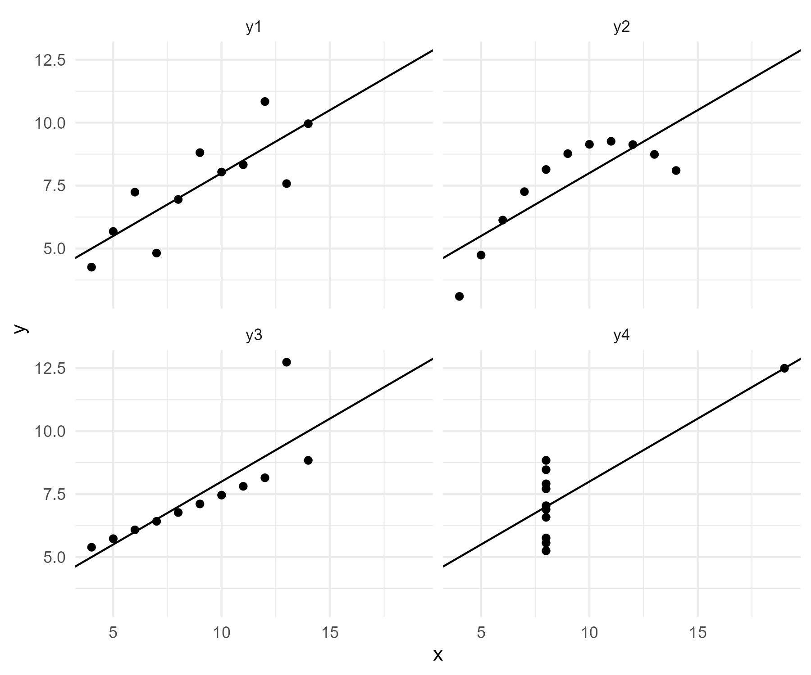

---
output:
  xaringan::moon_reader:
    seal: false
    includes:
      after_body: insert-logo.html
    self_contained: false
    lib_dir: libs
    nature:
      highlightStyle: github
      highlightLines: true
      countIncrementalSlides: false
      ratio: '16:9'
editor_options: 
  chunk_output_type: console
---
class: center, inverse, middle

```{r xaringan-panelset, echo=FALSE}
xaringanExtra::use_panelset()
```

```{r xaringan-tile-view, echo=FALSE}
xaringanExtra::use_tile_view()
```

```{r xaringanExtra, echo = FALSE}
xaringanExtra::use_progress_bar(color = "#808080", location = "top")
```

```{css echo=FALSE}
.pull-left {
  float: left;
  width: 44%;
}
.pull-right {
  float: right;
  width: 44%;
}
.pull-right ~ p {
  clear: both;
}


.pull-left-wide {
  float: left;
  width: 66%;
}
.pull-right-wide {
  float: right;
  width: 66%;
}
.pull-right-wide ~ p {
  clear: both;
}

.pull-left-narrow {
  float: left;
  width: 30%;
}
.pull-right-narrow {
  float: right;
  width: 30%;
}

.pull-right-extra-narrow {
  float: right;
  width: 20%;
}

.pull-center {
  margin-left: 28%;
  width: 44%;
}

.pull-center-wide {
  margin-left: 17%;
  width: 66%;
}

.tiny123 {
  font-size: 0.40em;
}

.small123 {
  font-size: 0.80em;
}

.large123 {
  font-size: 2em;
}

.red {
  color: red
}

.orange {
  color: orange
}

.green {
  color: green
}
```


# Statistics  
## Lecture 13: Multiple regression  

### Christian Vedel,<br>Department of Economics  

### Email: [christian-vs@sam.sdu.dk](christian-vs@sam.sdu.dk)  

### Updated `r Sys.Date()`

.footnote[
.small123[
*Please beware. I work on these slides until the last minute before the lecture and push most changes along the way. Until the actual lecture, this is just a draft*  
]
]

---
class: middle

# Today's Lecture
.pull-left-wide[
**Outline:**
- Multiple regression
- Example 1: Heights of both parents and children heights
- Example 2: Education and income
- Example 3: Ice creams and drowning
]

.pull-right-narrow[

]

---
class: inverse, middle


.pull-left-narrow[
> ## The final part of our journey

- *This brings together everything*
- This is the *swiss army knife* of statistics

]

.pull-right-wide[

.small123[
*AI generated picture*
]
]


---
class: middle

# Example from last time: Galton and height

.pull-left[
- How tall you are is determined by the height of you farther
- But what about the height of your mother? It turns out to also play a role! 

]


.pull-right[

.small123[
*Source: Galton (1889), data on father vs. son heights*  
]
]

```{r eval=FALSE, include=FALSE}
library(tidyverse)
library(plotly)
library(fixest)

df0 = read_csv("Examples/Galton_data/Galton_Family_Heights.csv")

df0 = df0 %>% 
  mutate_all(function(x){x*2.54}) %>% 
  mutate(gender = ifelse(gender > 0, "male", "female"))

p1 = df0 %>% 
  ggplot(aes(Father_height, Child_height)) + 
  geom_point(alpha = 0.5) + 
  theme_minimal() + 
  labs(
    x = "Father height (cm)",
    y = "Childrens height (cm)"
  ) + 
  geom_smooth(method = "lm")


p2 = df0 %>% 
  ggplot(aes(Father_height, Child_height, col = gender)) + 
  geom_point(alpha = 0.5) + 
  theme_minimal() + 
  labs(
    x = "Father height (cm)",
    y = "Childrens height (cm)"
  ) + 
  geom_smooth(method = "lm")

ggsave("Figures/Galton.png", width = 6, height = 4, plot = p1)
ggsave("Figures/Galton_wide.png", width = 6, height = 3, plot = p1)
ggsave("Figures/Galton_gender.png", width = 6, height = 3, plot = p2)

# Regression models
lm(Child_height ~ Father_height, data = df0) %>% summary()
mod = lm(Child_height ~ Father_height + Mother_height + gender, data = df0)
mod %>% summary()

df0$Mother_height %>% hist()
df0$Mother_height %>% quantile(probs = seq(0, 1, 0.05))

predict(
  mod,
  newdata = data.frame(
    Mother_height = c(160, 160, 158, 158),
    Father_height = c(182, 182, 183, 183),
    gender = c("female", "male", "female", "male")
  ),
  interval = "prediction", level = 0.90
)

# Regression table
etable(
  feols(Child_height ~ Father_height, data = df0),
  feols(Child_height ~ Father_height + Mother_height + gender, data = df0),
  tex = TRUE
)

```

---
# The simple idea of regression analysis: Line fitting
.pull-center[

]

$$\textit{Child height}_i = \beta_0 + \beta_1\textit{Father height}_i + \varepsilon_i$$
$$\textit{Child height}_i = 101.95 + 0.385  \textit{Father height}_i + \varepsilon_i$$

--
**Today we add more variables:**
$$\textit{Child height}_i = 41.96 + 0.393 \textit{Father height}_i + 0.318 \textit{Mother height}_i + 13.25 \textit{Male}_i + \varepsilon_i$$

---
class: middle
# Adding gender to previous plot


---
class: middle, center

# Adding gender and mothers' height
```{r echo=FALSE, message=FALSE, warning=FALSE}
library(tidyverse)
library(plotly)

df0 = read_csv("Examples/Galton_data/Galton_Family_Heights.csv")

df0 = df0 %>% 
  mutate_all(function(x){x*2.54}) %>% 
  mutate(gender = ifelse(gender > 0, "male", "female"))

# Fit linear models for each gender
lm_model_male <- lm(Child_height ~ Father_height + Mother_height, data = df0 %>% filter(gender == "male"))
lm_model_female <- lm(Child_height ~ Father_height + Mother_height, data = df0 %>% filter(gender == "female"))

# Create a grid of father and mother heights
father_range <- seq(min(df0$Father_height), max(df0$Father_height), length.out = 30)
mother_range <- seq(min(df0$Mother_height), max(df0$Mother_height), length.out = 30)

# Create a data frame for the grid
grid_df <- expand.grid(Father_height = father_range, Mother_height = mother_range)

# Predict child height for each combination of father and mother heights for both genders
grid_df_male <- grid_df %>% mutate(Child_height = predict(lm_model_male, newdata = grid_df))
grid_df_female <- grid_df %>% mutate(Child_height = predict(lm_model_female, newdata = grid_df))

# Reshape the predicted child heights into matrices
z_matrix_male <- matrix(grid_df_male$Child_height, nrow = length(father_range), ncol = length(mother_range))
z_matrix_female <- matrix(grid_df_female$Child_height, nrow = length(father_range), ncol = length(mother_range))

# Create the 3D scatter plot with separate regression surfaces for each gender
p_3d <- df0 %>% 
  plot_ly(x = ~Father_height, y = ~Mother_height, z = ~Child_height, 
          color = ~gender, colors = c("blue", "pink"), 
          type = "scatter3d", mode = "markers") %>%
  add_surface(x = father_range, y = mother_range, z = z_matrix_male, 
              showscale = FALSE, opacity = 0.5, name = "Male Surface") %>%  # Male regression surface
  add_surface(x = father_range, y = mother_range, z = z_matrix_female, 
              showscale = FALSE, opacity = 0.5, name = "Female Surface") %>%  # Female regression surface
  layout(scene = list(
    xaxis = list(title = 'Father Height (cm)'),
    yaxis = list(title = 'Mother Height (cm)'),
    zaxis = list(title = 'Child Height (cm)')
  ))

# Show the interactive plot
p_3d

```


---
# Regression tables

.pull-left-narrow[
- In regression analysis we try to explain one variable with other variables
- It is hard to draw things with many variables
- We often use a table
- *Lets have a look at one*
]

--

.pull-right-wide[
#### An example of a regression table
  .pull-left[
    
    
  ]
  
  .pull-right[
    *It summaries these equation from before (and more)*:
    
*Model 1:*  
$\textit{Child height}_i = 101.95$
$+ 0.385 \textit{Father height}_i$  
$+ \varepsilon_i$  
    
*Model 2:*  
$\textit{Child height}_i = 41.96$
$+ 0.393 \textit{Father height}_i$
$+ 0.318 \textit{Mother height}_i$
$+ 13.25 \textit{gender male}_i$  
$+ \varepsilon_i$
    
    
  ]
  
.small123[.red[*This is how it is presented in research papers*]]
]


---
class: middle
# Let us do multiple regression with the [Galton data](https://github.com/christianvedels/Introductory_statistics/raw/refs/heads/main/Lecture%2012%20-%20Simple%20regression%20analysis/Examples/Galton_data.xlsx)

1. Simple and multiple prediction
2. Predicting using the model

---
class: middle

# Two tasks:

1. Prediction: Best possible prediction of future data
2. Inference: Best possible prediction of a statistical relationship

.small123[*The two tasks are closely linked*]


---
# Theoeretical background: Two tasks

The basic idea is that we want to obtain:

$$y=\hat{y}+\varepsilon$$
(preferably with small $\varepsilon$)

--

##### We do this based on data, $\mathbf{X}$:

$$y=\hat f(\mathbf{X})+\varepsilon$$

--

$$\hat y = \hat f(\mathbf{X}) = \hat\beta_0+\hat\beta_1x_1+\hat\beta_2x_2+\hat\beta_3x_3+...$$

*We approximate it with a linear function*  

--

- .red[*It turns out that this also serves well for inference*]. 
- Estimates of $\beta$'s reflect the relationship between $x$'s and $y$

---
# Two tasks
*Differences in implementation*

.pull-left[
### Prediction

*If we want the best prediction:*
- Then we should include as many variables as possible
- $R^2$ is important - it is a measure of predicitive performance
- Consider splitting the data in 'training' and 'test' data to see performance in data that was not used in producing the model
- Consider using more advanced machine learning methods


]

.pull-right[
### Inference

*If we want the best 'inference':*
- Include the minimal number of variables
- Only include variables, where we can clearly interpret the model
- $R^2$ is not important. Don't look at it.


]

---
# (Note) *What if it is not linear?*
*We risk drawing the wrong conclusions*

.pull-left[
- Four separate datasets
- *But the regression look like this:*

- So basically:
$$y=3+0.5x+\varepsilon$$

- .red[Is this *correct*?]

]

--

.pull-right[

.red[*We are in trouble when our assumptions break*]
]


```{r eval=FALSE, include=FALSE}
library(tidyverse)
library(fixest)

anacombes_quartet = read_csv("Examples/Anacombes_quartet/Anscombe_quartet_data.csv")

fourth = anacombes_quartet %>% 
  select(x4, y4) %>% 
  rename(
    x = x4,
    y = y4
  ) %>% 
  mutate(
    name = "y4"
  )

long_data = anacombes_quartet %>% select(x123, y1, y2, y3) %>% 
  pivot_longer(c(y1, y2, y3), values_to = "y") %>% 
  rename(x = x123) %>% 
  bind_rows(fourth)

mod1 = feols(y~x, data = long_data %>% filter(name=="y1"))
mod2 = feols(y~x, data = long_data %>% filter(name=="y1"))
mod3 = feols(y~x, data = long_data %>% filter(name=="y1"))
mod4 = feols(y~x, data = long_data %>% filter(name=="y1"))

etable(mod1, mod2, mod3, mod4, tex = TRUE)

p1 = long_data %>% 
  ggplot(aes(x, y)) + 
  facet_wrap(~name) + 
  geom_point() + 
  # geom_smooth(se = FALSE, method = "lm") + 
  geom_abline(slope = 0.5, intercept = 3) +
  theme_minimal()

ggsave("Figures/Anscombes_quartet.png", plot = p1, width = 6, height = 5)

```


---
class: middle

# More on  inference

.pull-left[
- Sometimes we are interested in just two variables $x$ and $y$
- But multiple regression is still useful
- If there is a third variable $z$ which also influence both $x$ and $y$, then including it, removes the *confounding effect*

]


.pull-right[
If the true relationship is

$$y = \beta_0 + \beta_1 x + \beta_2 z + \varepsilon$$


But we assume it to be 

$$y = \beta_0 + \beta_1 x + \varepsilon$$

then we will get a *biased* estimate of $\beta_1$

> We say *our estimate is confounded by omitted variable z*

*(If there is a relationship $x \sim z$ and $y \sim z$)*

]


.small123[
**Takeaway**: *We should include all relevant other variables if we are interested in $y\sim x$*
]

.small123[
*Spurious correlations: https://www.tylervigen.com/spurious-correlations*
]


```{r eval=FALSE, include=FALSE}
library(tidyverse)
library(fixest)

set.seed(20)
capN = 400
IQ = rnorm(capN, 100, 15) %>% round(2)
years_of_educ = (IQ*0.1 + rnorm(capN, 0, 1)) %>% round(0)
# years_of_educ = (IQ*0.1) %>% round(0)
income_monthly = 5 + (0.1*years_of_educ + 0.3*IQ + rnorm(capN, 0, 1)) %>% round(2)

df0 = data.frame(IQ, years_of_educ, income_monthly)

mod1 = feols(income_monthly ~ years_of_educ, data = df0)
mod2 = feols(income_monthly ~ years_of_educ + IQ, data = df0)

etable(mod1, mod2)

df0 %>% write_csv2("Examples/Educ_and_income.csv")


```


---
# Omitted variables

.pull-left[
- We are concerned about spurious correlations
- To counter that we include *controls* (and more advanced methods down the line
- Does higher education lead to higher income?


*What happens if we estimate?* $Income = \beta_0 + \beta_1 Educ+\varepsilon$

]

--

.pull-right[

### [Lets try](https://github.com/christianvedels/Introductory_statistics/raw/refs/heads/main/Lecture%2013%20-%20Multiple%20regression/Examples/Educ_and_income.xlsx)

- Notes: Which is the correct 'effect' of education on income? Why?

]


---
class: middle
# Ice creams kills!

- We started the semester with this example
- Now we have the tools to return to it
- And also introduce: *Categorical variables* 
- [Data can be found here](https://github.com/christianvedels/Introductory_statistics/raw/refs/heads/main/Lecture%2013%20-%20Multiple%20regression/Examples/Ice_cream_kills.xlsx)


```{r eval=FALSE, include=FALSE}
library(tidyverse)
library(fixest)

# Create a random month variable, from 1 to 12
month = floor(runif(2000, 1, 13))

set.seed(20)

# Define a function to generate 'funky' drowning data
funky_drown = function(x){
  out = exp(sin(pi/6*x-2) + rnorm(length(x), 0, 0.5))  # Adds noise and applies an exponential function
  return(out)
}

# Generate fake data with month, drowning accidents, and ice cream sales
fake_data = tibble(
  month = month,
  Drownings = funky_drown(month),  # Drowning accidents
  IceCreamSales = funky_drown(month)  # Ice cream sales
)

# Create scatter plots
fake_data %>% ggplot(aes(month, Drownings)) + geom_point()   # Drownings vs. Month
fake_data %>% ggplot(aes(IceCreamSales, Drownings)) + geom_point()   # Ice cream sales vs. Drownings
fake_data %>% ggplot(aes(month, IceCreamSales)) + geom_point()   # Ice cream sales vs. Month

# Run simple linear regression without controlling for month
lm(Drownings ~ IceCreamSales, data = fake_data) %>% summary()

# Run linear regression with month as a factor (categorical variable)
lm(Drownings ~ IceCreamSales + factor(month), data = fake_data) %>% summary()

# Run fixed effects regression with month as the fixed effect, and heteroskedasticity-robust standard errors
feols(Drownings ~ IceCreamSales | factor(month), data = fake_data, vcov = "hetero")

fake_data %>% mutate_all(round, 2) %>% write_csv2("Examples/Ice_cream_kills.csv")

```

---
class: middle

# If time: [Real estate regressions](https://www.kaggle.com/datasets/quantbruce/real-estate-price-prediction/data)

From: https://www.kaggle.com/datasets/quantbruce/real-estate-price-prediction/data

```{r eval=FALSE, include=FALSE}
library(tidyverse)
library(fixest)

df0 = read_csv("C:/Users/christian-vs/Downloads/realtor-data.zip.csv/realtor-data.zip.csv") # https://www.kaggle.com/datasets/ahmedshahriarsakib/usa-real-estate-dataset

df0 = df0 %>% 
  drop_na()

ma = df0 %>% 
  filter(state == "Massachusetts") %>% 
  mutate( # Acording to https://en.wikipedia.org/wiki/List_of_cities_in_New_England_by_population
    above100k_population = ifelse(
      city %in% c(
        "Boston", 
        "Worcester", 
        "Springfield", 
        "Cambridge", 
        "Lowell", 
        "Brockton",
        "Quincy",
        "Lynn",
        "New Bedford"
      ),
      1,0
    )
  ) %>% 
  mutate(
    years_since_sold_last = 2024 - as.numeric(substr(prev_sold_date, 1, 4))
  )

ma %>% write_csv2("Examples/House_prices_MA/House_prices_MA.csv")

```

---
class: middle

# Transformations

.pull-left-wide[
- If our model is not linear.
  + Example 1: $y = \beta_0 + \beta_1 x_1 + beta_2 x_1^2 + \varepsilon$
  + Example 2: $log(y) = \beta_0 + \beta_1 x_1 + \beta_1 x_2 + \varepsilon$

- Then you can still estimate it with multiple regression. You just have to construct the variables accordingly:
  + Example 1: You regress $y$ on $x_1$ and the square of $x_1$
  + Example 2: You take the $log()$ of $y$ and regrss it on $x_1$ and $x_2$
]
  

---
class: middle

# A reflection on science: A bit of practical advice

.pull-left-wide[
- If you play around with many variables then you will eventually find something
- In this case it is very likely that what you have found is spurious

#### Instead:
1. Formulate a clear expectation (from e.g. theory) of your regression
2. Then run the regression
3. The more you tinker with it, the less you should trust your results

.small123[.red[*The simpler model is often preferred*]]
]


---
class: middle

# Advanced notes

.pull-left-wide[
- In small samples normality is required - in large samples it does not matter
  + This is a widespread misunderstanding - even in your book
- Your model might not be linear
- Heterescedasticity matters but you can adjust you standard errors to capture it
  + Look up "Robust standard errors" or "White's standard errors"

]


---
class: middle

# Next Time
.pull-left[
- Final lecture
- [What do you want covered? https://forms.gle/ZqfRPTmX8uvWANEB8](https://forms.gle/ZqfRPTmX8uvWANEB8)

]

.pull-right-narrow[

]


