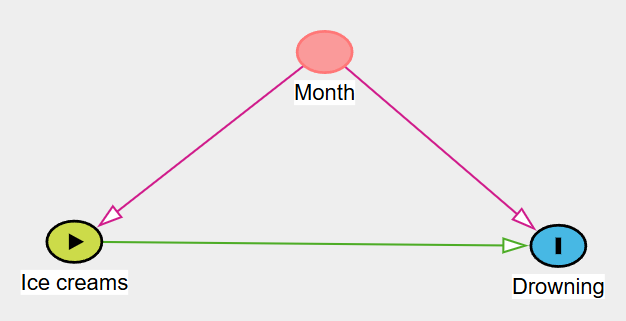

---
output:
  xaringan::moon_reader:
    seal: false
    includes:
      after_body: insert-logo.html
    self_contained: false
    lib_dir: libs
    nature:
      highlightStyle: github
      highlightLines: true
      countIncrementalSlides: false
      ratio: '16:9'
editor_options: 
  chunk_output_type: console
---
class: center, inverse, middle

```{css echo=FALSE}
.pull-left {
  float: left;
  width: 44%;
}
.pull-right {
  float: right;
  width: 44%;
}
.pull-right ~ p {
  clear: both;
}


.pull-left-wide {
  float: left;
  width: 66%;
}
.pull-right-wide {
  float: right;
  width: 66%;
}
.pull-right-wide ~ p {
  clear: both;
}

.pull-left-narrow {
  float: left;
  width: 30%;
}
.pull-right-narrow {
  float: right;
  width: 30%;
}

.tiny123 {
  font-size: 0.40em;
}

.small123 {
  font-size: 0.80em;
}

.large123 {
  font-size: 2em;
}

.red {
  color: red
}

.orange {
  color: orange
}

.green {
  color: green
}
```


# Statistics
## Lecture 15: Final lecture

### Christian Vedel,<br>Department of Economics

### Email: [christian-vs@sam.sdu.dk](christian-vs@sam.sdu.dk)

### Updated `r Sys.Date()`


.footnote[
.left[
.small123[
*Please beware. I work on these slides until the last minute before the lecture and push most changes along the way. Until the actual lecture, this is just a draft*  
]
]
]

---
class: middle
# Today's lecture
.pull-left-wide[
- Tying the 'knot' on what we have been doing here
- Exam info
- An example or two from previous lectures based on your preference
]


---
class: middle
# A definition
> Statistics is about quantifying what we **know** and what we **don't know** based on some analysis of some data.


.footnote[
.small123[
**Note:** In practice this is as much philosophy as it is maths. And increasingly computer science is also involved. In practice innovations come as much from every field that uses it: Social Science, Biology, Economics, Psychology, Business Studies, etc. 
]
]


---
class: inverse, middle, center
# What is statistics and why do we need it?

---
class: middle
# TL;DR (From first lecture)

**Q:** What is it we do at a university?  
**A:** Part of the purpose of your education is to teach you tools to enable you to obtain new knowledge, scientifically and independently

**Q:** How do we obtain/create knowledge?  
**A:** One answer (out of many): Inherently we don't know anything. But we can limit our uncertainty by finding *empirical support that something is the case* $^1$

**Q:** Can we trust numbers?  
**A:** No. In general we can not trust numbers without knowing how they were estimated/calculated

**Q:** Why do we need statistics?  
**A:** In an uncertain world, statistics helps us make sense of complex information, quantify uncertainty, and draw evidence-based conclusions.


.footnote[
.small123[
$^1$: Your headache goes away when you take a paracetomol *and* it does not go away when don't take it $\rightarrow$ paracetomol cures headaches 
]
]

---
# How do we obtain/create knowledge?
### An analogy of doing social science with statistics 

> *"Studying societies and people is like standing in a dark room, throwing darts into empty space. If one hits something, we then argue endlessly over what was hit, what the dart really is, and whether we ever threw it in the first place."*

- Social science is *hard*

- Two paths forward:
  1. Drop the idea of learning anything specific: Everything is endlessly complex, and the only task is to appreciate this
  2. Cautious positivism: Pose certain ideas and then test them in data. Eventually we learn something. At least something which is (locally) useful.
  
--

*Statistics is often firmly in the second camp*

---
# What we have done

.pull-left[
[Lecture 1 - Introduction](https://raw.githack.com/christianvedels/Introductory_statistics/refs/heads/main/Lecture%201%20-%20Introduction/Slides.html)  

[Lecture 2 - Descriptive statistics I](https://raw.githack.com/christianvedels/Introductory_statistics/refs/heads/main/Lecture%202%20-%20Descriptive%20statistics/Slides.html)

[Lecture 3 - Descriptive statistics II](https://raw.githack.com/christianvedels/Introductory_statistics/refs/heads/main/Lecture%203%20-%20Descriptive%20statistics/Slides.html)

[Lecture 5 - Discrete Random Variables](https://raw.githack.com/christianvedels/Introductory_statistics/refs/heads/main/Lecture%205%20-%20Discrete%20Random%20Variables/Slides.html)

[Lecture 6 - Continuous Random Variables](https://raw.githack.com/christianvedels/Introductory_statistics/refs/heads/main/Lecture%206%20-%20Continous%20Random%20Variables/Slides.html)

[Lecture 7 - Confidence Intervals](https://raw.githack.com/christianvedels/Introductory_statistics/refs/heads/main/Lecture%207%20-%20Confidence%20Intervals/Slides.html)

]

.pull-right[
[Lecture 8 - Hypothesis Testing](https://raw.githack.com/christianvedels/Introductory_statistics/refs/heads/main/Lecture%208%20-%20Hypothesis%20testing/Slides.html)

[Lecture 9 - Hypothesis Testing in Practice](https://raw.githack.com/christianvedels/Introductory_statistics/refs/heads/main/Lecture%209%20-%20Hypothesis%20testing%20in%20practice/Slides.html)

[Lecture 10 - ANOVA](https://raw.githack.com/christianvedels/Introductory_statistics/refs/heads/main/Lecture%2010%20-%20ANOVA/Slides.html#1)

[Lecture 11 - chi squarred test](https://raw.githack.com/christianvedels/Introductory_statistics/refs/heads/main/Lecture%2011%20-%20Chi-squared%20test/Slides.html)

[Lecture 12 - Simple regression analysis](https://raw.githack.com/christianvedels/Introductory_statistics/refs/heads/main/Lecture%2012%20-%20Simple%20regression%20analysis/Slides.html)

[Lecture 13 - Multiple regression](https://raw.githack.com/christianvedels/Introductory_statistics/refs/heads/main/Lecture%2013%20-%20Multiple%20regression/Slides.html#1)

*+ Video lecture to follow next week*

]

---
class: middle
# How do we obtain/create knowledge?
.pull-left-wide[
### Ice cream sales and drowning
- [Ice_cream_kills.xlsx](https://github.com/christianvedels/Introductory_statistics/raw/refs/heads/main/Lecture%2013%20-%20Multiple%20regression/Examples/Solutions/Ice_cream_kills_solution.xlsx)
- Eating before swimming is dangerous! (Or is it?)
- It turns out that statistics is hard!
]

---
class: middle
# How do we obtain/create knowledge?
.pull-left[
### How it is ought to be
*How we often assume it is in intro stats*
- You have some idea about how to measure something
- You collect data
- You test whether the data lends support to your idea
- You conclude or start over by collecting more data
]

.pull-right[
### How it often is
*The lived experience*
- You have some data
- You are asked to provide 'insights' 
- You start wondering about the type of questions you can answer
- You test these ideas 
- Your results are inconclusive
- Your boss demands that you make a conclusion anyway and move on to the next project. 
]

***Note:*** *In this course we will start in a nice and simplified world and then the complexity follows in further courses.*

---
class: middle
# Can we trust numbers?
.pull-left-wide[
- Generally: No
- But there are degrees. 
- A strict statistical analysis can provide valuable insights.
- E.g. we can know whether painkillers work against headaches. 

- **Point of this course:** To introduce you to the basic theoretical framework to evaluate whether you can trust a number or not. 
]


---
class: middle

# A nice tool
.pull-left-wide[
- Draw arrows between things
- The arrows are the assumptions
- It would have prevented the ice cream problem - and many others
- Check: https://www.dagitty.net/dags.html#
- It tells you what to be aware of based on your assumptions
]

.pull-right-narrow[

]

.footnote[
.small123[
*Recommended further reading: Pearl, J., Glymour, M., Jewell, N. P. (2016) "Causal Inference in Statistics: A Primer" ISBN: 978-1-119-18684-7 (160 pages)
]
]

---
class: middle

# Exam 
.pull-left-wide[
- An exam is a communications exercise.
  + If it is unclear to me, what you have done you might loose points
  + **Implication:** Highlight results, structure your response
- Strategy:
  + Start by solving the problems you can solve
- Formalities:
  + 4 hours
  + Open book - aids allowed - no communication
  + Paper to be handed in a pdf
]

.footnote[
*Let's look at an [old exam](https://github.com/christianvedels/Introductory_statistics/blob/main/Lecture%2015%20-%20Final%20lecture/2024%2008%20BA%20Exam%20Statistics.pdf)
]

---
class: center, middle
# Course plan
*Let's have a look at 'Course plan.xlsx'*


---
# What we have done

What should we spent more time on after the break? https://forms.gle/qBnnkt4VUL9oAv6k7

.pull-left[
[Lecture 1 - Introduction](https://raw.githack.com/christianvedels/Introductory_statistics/refs/heads/main/Lecture%201%20-%20Introduction/Slides.html)  

[Lecture 2 - Descriptive statistics I](https://raw.githack.com/christianvedels/Introductory_statistics/refs/heads/main/Lecture%202%20-%20Descriptive%20statistics/Slides.html)

[Lecture 3 - Descriptive statistics II](https://raw.githack.com/christianvedels/Introductory_statistics/refs/heads/main/Lecture%203%20-%20Descriptive%20statistics/Slides.html)

[Lecture 5 - Discrete Random Variables](https://raw.githack.com/christianvedels/Introductory_statistics/refs/heads/main/Lecture%205%20-%20Discrete%20Random%20Variables/Slides.html)

[Lecture 6 - Continuous Random Variables](https://raw.githack.com/christianvedels/Introductory_statistics/refs/heads/main/Lecture%206%20-%20Continous%20Random%20Variables/Slides.html)

[Lecture 7 - Confidence Intervals](https://raw.githack.com/christianvedels/Introductory_statistics/refs/heads/main/Lecture%207%20-%20Confidence%20Intervals/Slides.html)

]

.pull-right[
[Lecture 8 - Hypothesis Testing](https://raw.githack.com/christianvedels/Introductory_statistics/refs/heads/main/Lecture%208%20-%20Hypothesis%20testing/Slides.html)

[Lecture 9 - Hypothesis Testing in Practice](https://raw.githack.com/christianvedels/Introductory_statistics/refs/heads/main/Lecture%209%20-%20Hypothesis%20testing%20in%20practice/Slides.html)

[Lecture 10 - ANOVA](https://raw.githack.com/christianvedels/Introductory_statistics/refs/heads/main/Lecture%2010%20-%20ANOVA/Slides.html#1)

[Lecture 11 - chi squarred test](https://raw.githack.com/christianvedels/Introductory_statistics/refs/heads/main/Lecture%2011%20-%20Chi-squared%20test/Slides.html)

[Lecture 12 - Simple regression analysis](https://raw.githack.com/christianvedels/Introductory_statistics/refs/heads/main/Lecture%2012%20-%20Simple%20regression%20analysis/Slides.html)

[Lecture 13 - Multiple regression](https://raw.githack.com/christianvedels/Introductory_statistics/refs/heads/main/Lecture%2013%20-%20Multiple%20regression/Slides.html#1)

*+ Video lecture to follow next week*

]


---
# Conclusion
.pull-left[
- Here is some theory. The real world is different. I still hope it is useful
- It's been a pleasure
- Good luck out there

*Feel free to write me an email: christian-vs@sam.sdu.dk*
]


.pull-right[

]

