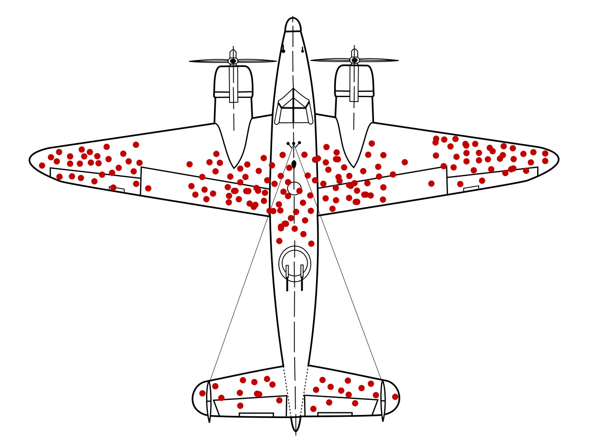

---
output:
  xaringan::moon_reader:
    seal: false
    includes:
      after_body: insert-logo.html
    self_contained: false
    lib_dir: libs
    nature:
      highlightStyle: github
      highlightLines: true
      countIncrementalSlides: false
      ratio: '16:9'
editor_options: 
  chunk_output_type: console
---
class: center, inverse, middle

```{r xaringan-panelset, echo=FALSE}
xaringanExtra::use_panelset()
```

```{r xaringan-tile-view, echo=FALSE}
xaringanExtra::use_tile_view()
```

```{r xaringanExtra, echo = FALSE}
xaringanExtra::use_progress_bar(color = "#808080", location = "top")
```

```{css echo=FALSE}
.pull-left {
  float: left;
  width: 44%;
}
.pull-right {
  float: right;
  width: 44%;
}
.pull-right ~ p {
  clear: both;
}


.pull-left-wide {
  float: left;
  width: 66%;
}
.pull-right-wide {
  float: right;
  width: 66%;
}
.pull-right-wide ~ p {
  clear: both;
}

.pull-left-narrow {
  float: left;
  width: 30%;
}
.pull-right-narrow {
  float: right;
  width: 30%;
}

.tiny123 {
  font-size: 0.40em;
}

.small123 {
  font-size: 0.80em;
}

.large123 {
  font-size: 2em;
}

.red {
  color: red
}

.orange {
  color: orange
}

.green {
  color: green
}
```


# Statistics
## Lecture 2: Descriptive statistics I

### Christian Vedel,<br>Department of Economics

### Email: [christian-vs@sam.sdu.dk](christian-vs@sam.sdu.dk)

### Updated `r Sys.Date()`


.footnote[
.left[
.small123[
*Please beware. I work on these slides until the last minute before the lecture and push most changes along the way. Until the actual lecture, this is just a draft*  
]
]
]


---
class: middle
# Today's lecture
.pull-left-wide[


### This time and next time: Basic tools

- Measures of position: What is typical? (Mean, median, etc.)
- Measures of variation: How 'uncertain' are we? (Variance, standard deviation, etc.)
- Histograms & Box Plots
- Correlation


]


---
class: middle
# Practicalities
.pull-left-wide[
- Course plan
- Lecture on Feb 26: What would be most helpful for you?
  + A video covering a topic according to the plan?
  + A video covering the entire curriculum at the end of the semester?
]

---
class: middle
# Why descriptive statistics?
.pull-left-wide[
- When you get some new data, you have no idea:
  + How it was collected
  + Whether it is correct
  + Whether coding errors were made
  + Whether you can interpret it as intended
  
- 90 pct of statistics in practice is **data cleaning** and **descriptive statistics**
- You do this *before* you calculated anything
]

---
class: middle
# Descriptive statistics caught in the wild
#### Four NBER working papers this week:

.pull-right-wide[
.panelset[
.panel[.panel-name[33406]
  
Source: [NBER 33406](https://www.nber.org/papers/w33406)
]

.panel[.panel-name[33411]
  
Source: [NBER 33411](https://www.nber.org/papers/w33411)
]

.panel[.panel-name[33451]
  
Source: [NBER 33411](https://www.nber.org/papers/w33451)
]

.panel[.panel-name[33452]
  
Source: [NBER 33411](https://www.nber.org/papers/33452)
]

]


]

.pull-left-narrow[
*All of them contain descriptive statistics as the first illustration*
]

---

# The importance of descriptive statistics

.pull-left-wide[
.center[
  
]
*Source: https://commons.wikimedia.org/wiki/File:Survivorship-bias.svg*
]

.pull-right-narrow[
- This is where returning airplanes were shot during WWII
- Which part of the airplane should be reinforced?
]


---
class: middle

# Practicalities of excel and learning (1/3)
.pull-left-wide[
### When I go over examples in class
- Please try to follow along
- Don't worry if you get it at first
- Do ask me questions. But sometimes I will still move one.
]

---
class: middle

# Practicalities of excel and learning (2/3)
.pull-left[
### The fluency heurestic: How you risk fooling youself ...  
*... if you try to guess, whether you are learning*

- Students in *active* (rather than *passive*) learning environments report:
  1. That they feel like they learn less, **but**
  2. When we measure outcomes *they learn more*

- Fluency is the typical heurestic a learner adopts in self evaluation 
- It might fool you 
]

---
class: middle

# Practicalities of excel and learning (2/3)
.pull-left[
## A tradeoff
1. I can show you everything superficially
2. Or I can show you selected things in detail

- You learn more from the second. So that is what we will be doing.
- Don't be surprised if I have not given you a *detailed* explanation of everything in class
]

--
.pull-right[
### Our shared tasks:
- Your task as learners is to find areas you are *academically* uncomfortable with
- My task as a lecturer is to help you locate this.
- I aim to achieve this - in a pleasant way :-)

(*This would also suggest that typos are beneficial for your learning*)
.footnote[
.small123[Read more here: https://doi.org/10.1073/pnas.1821936116]
]
]


---
class: middle
# Measures of Position
.pull-left-wide[
- **Mean**: The average of all data points, commonly used for central tendency.
- **Median**: The middle value when data is ordered; useful when data is skewed.
- **Mode**: The most frequent value, helpful for categorical data.
]

---
class: middle
# Measures of Variation
.pull-left-wide[
- **Range**: The difference between the highest and lowest values.
- **Variance**: A measure of how spread out the values are from the mean.
- **Standard Deviation**: The square root of the variance, giving a measure in the same units as the data.
- **Quantiles**: The observation excatly at position 25% and 75%
- **IQR**: Interquantile Range - difference between quantiles
]


---
class: middle
# Histograms and Box Plots
.pull-left-wide[
- **Histograms**: Show the distribution of numerical data. Can indicate whether data follows a normal distribution.
- **Box Plots**: Visualize the spread and skewness of data, showing quartiles, medians, and outliers.
]

---
class: middle
# Correlation (more details next time)
.pull-left-wide[
- **Correlation Coefficient**: Measures the strength of a linear relationship between two variables, ranging from -1 (perfect negative) to +1 (perfect positive).
- **Scatter Plots**: Visual representation of correlation.
]

---
class: middle

# Practice Problem 1: Calculating Mean, Median, Mode
.pull-left-wide[
- Data: [5, 7, 8, 5, 9, 7, 7, 9, 6, 6]
- **Mean**: Sum all numbers and divide by the count.
- **Median**: The middle value when the data is ordered.
- **Mode**: The most frequently occurring number.

Let us try in excel (in a blank sheet)
]

---
# Practice Problem 2: Continuous data
```{r echo=FALSE, include=FALSE, message=FALSE, warning=FALSE}
library(tidyverse)
library(openxlsx)
set.seed(20)

weekly = data.frame(weekly_income = exp(rnorm(200, 7, 2))) %>% 
  mutate(
    weekly_income = round(weekly_income, 0)
  )

p1 = weekly %>% 
  ggplot(aes(weekly_income)) + 
  geom_histogram(bins = 10) + 
  theme_bw()

weekly %>%
  write.xlsx("Examples/Example1_income.xlsx")
```

.pull-left-wide[
- In the real world we often have data like
- Data: [11219.67, 340.21, 76.22, 449.12, ...]
- How can we get an overview of frequencies?
]

.pull-right-narrow[
**Solution:** Count how many between 0 and 100, 100 and 200, etc.
- *You will see that we apply a similar solution when it comes to probability distributions*$^1$

- [Lets try it in excel (click to download)](https://github.com/christianvedels/Introductory_statistics/raw/refs/heads/main/Lecture%202%20-%20Descriptive%20statistics/Examples/Example1_income.xlsx)
]

.footnote[
$^1$: In fact, what we are building towards here is a so-called non-parametric estimator of the probability distribution
]


---
# In general
.pull-left[
### Sometimes there are natural categories
*If there is a qualitative variable*

#### Examples:
- Months (Ice cream sales in january, february, etc)
- Regions (e.g. county tax incomes)

#### Ad hoc:
- Count incomes below 100, between 100 and 200, etc.
]
--
.pull-right[
### Often we prefer creating categories

- Lets say we want 10 'bins' of equal size
- *'bins' is the 'buckets' we divide the data into*

- We can calculate bin-sizes with this formula:  
$\textit{binsize} = \frac{x_{max} - x_{min}}{k},$ if we want $k=10$ *bins*


- [Lets try it in excel (click to download)](https://github.com/christianvedels/Introductory_statistics/raw/refs/heads/main/Lecture%202%20-%20Descriptive%20statistics/Examples/Example1_income.xlsx)


]

---
class: middle
# Definition: *Statistic*
> A *statistic* is a number which sumarises some data

Examples: Mean, median, variance, quantiles, etc. (t-value, Z-value, etc.)


---
# Summary statistics (measures of central tendency)
.pull-left[
- If you know statistics, you are good friends with
- The 'mean', 'median', 'mode' 

### The mean (The one whos always around)
- The *expected* value
- Add up all the numbers and divide by how many there are  
$mean(\mathbf{x}) = \frac{1}{N} \sum_i x$

### The median (The stable friend)
- The *middle* value of the distribution
- Line up all numbers and find the middle
$median(\mathbf{x}) = x_{(n+1)/2)}$ (and the average of two if there is no middle)
]

.pull-right[
### The mode (Weird but always makes sense)
- Of all the numbers, which is the most common?
- Does not make sense for continuous variables


*If we have time, I will illustrate how they work in relation to a histogram on the blackboard*

]


---
# Summary statistics (measures of spread)

.pull-left[
- The *variance*, *standard deviation*, *IQR*, *range*, and others are like the friends who keep things unpredictable and uncertain. 

### The variance (The unpredictable one)
- How far the numbers are from the center
- Take the average squared difference from the mean
$variance(\mathbf{x}) = \frac{1}{N} \sum_i (x_i - \bar{x})^2$

### The standard deviation (The chill one)
- The *normalized* version of the variance, for when you want it in the same units as the original data
- Just take the square root of variance
$std(\mathbf{x}) = \sqrt{variance(\mathbf{x})}$

]

.pull-right[
### The IQR (The middle-ground friend)
- The range between the 25th and 75th percentiles 
- Shows the spread of the middle half of the data
$IQR = Q3 - Q1$

### The range (The overly enthusiastic one)
- The *wide-spanning* one – the difference between the largest and smallest values
$range(\mathbf{x}) = x_{\text{max}} - x_{\text{min}}$

]

---
class: middle
# Current research 
.pull-left-wide[
- If you think it is helpful, I would like to say something related to the topic in my own research every time.
- Let's see how it works and let me know if you think it is a waste.
- The idea is to show you how it has importance to knowledge creation.
- (...and the research pipeline is long before you otherwise see it)
]


---
class: middle
# Railways
.pull-left[
- I am working on railways
- We are trying to understand how important *market access* is for (softer) economic development
- E.g. the spread of 'modern ideas'.
- We could not understand our results before we produced summary statistics
]

.pull-right[

]


---
# Before next time
.pull-left[
- You will have exercises on this
- Please see what you can solve - and challenge your *fluency heurestic* (find your weak spots)
- Remember: Everything is not covered in detail
- Next time: More summary statistics

- Exercises for the next week covers two lectures.
]


.pull-right[

]

