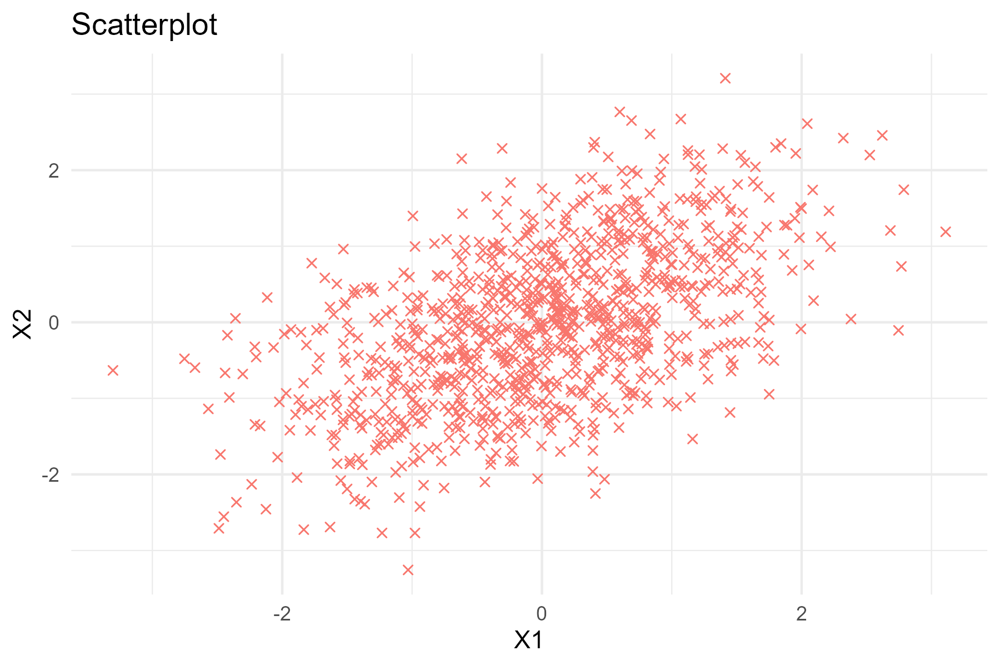
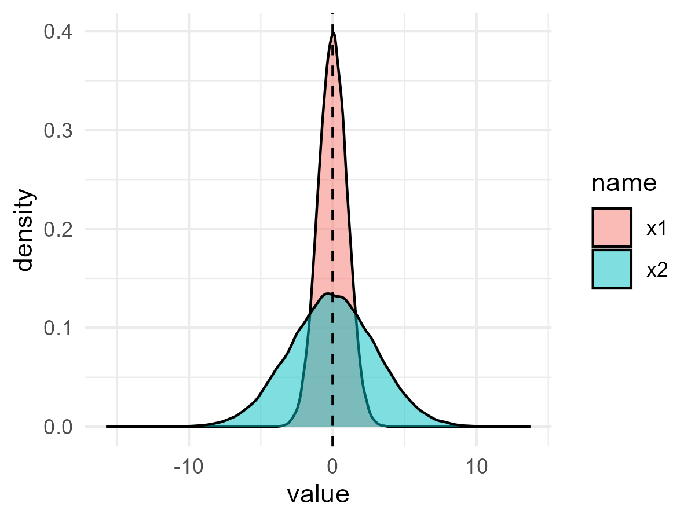

---
output:
  xaringan::moon_reader:
    seal: false
    includes:
      after_body: insert-logo.html
    self_contained: false
    lib_dir: libs
    nature:
      highlightStyle: github
      highlightLines: true
      countIncrementalSlides: false
      ratio: '16:9'
editor_options: 
  chunk_output_type: console
---
class: center, inverse, middle

```{r xaringan-panelset, echo=FALSE}
xaringanExtra::use_panelset()
```

```{r xaringan-tile-view, echo=FALSE}
xaringanExtra::use_tile_view()
```

```{r xaringanExtra, echo = FALSE}
xaringanExtra::use_progress_bar(color = "#808080", location = "top")
```

```{css echo=FALSE}
.pull-left {
  float: left;
  width: 44%;
}
.pull-right {
  float: right;
  width: 44%;
}
.pull-right ~ p {
  clear: both;
}


.pull-left-wide {
  float: left;
  width: 66%;
}
.pull-right-wide {
  float: right;
  width: 66%;
}
.pull-right-wide ~ p {
  clear: both;
}

.pull-left-narrow {
  float: left;
  width: 30%;
}
.pull-right-narrow {
  float: right;
  width: 30%;
}

.tiny123 {
  font-size: 0.40em;
}

.small123 {
  font-size: 0.80em;
}

.large123 {
  font-size: 2em;
}

.red {
  color: red
}

.orange {
  color: orange
}

.green {
  color: green
}
```


# Statistics
## Lecture 3: Descriptive statistics II

### Christian Vedel,<br>Department of Economics

### Email: [christian-vs@sam.sdu.dk](christian-vs@sam.sdu.dk)

### Updated `r Sys.Date()`


.footnote[
.left[
.small123[
*Please beware. I work on these slides until the last minute before the lecture and push most changes along the way. Until the actual lecture, this is just a draft*  
]
]
]


---
class: middle
# Today's lecture
.pull-left-wide[


### This time and last time: Basic tools

- Measures of position: What is typical? (Mean, median, etc.)
- Measures of variation: How 'uncertain' are we? (Variance, standard deviation, etc.)
- **Histograms & Box Plots**
- **Correlation**


]


---
class: middle
# Definition: *Statistic*
> A *statistic* is a number which sumarises some data

Examples: Mean, median, variance, quantiles, etc. (t-value, Z-value, etc.)


---
# Summary statistics (measures of central tendency)
.pull-left[
- If you know statistics, you are good friends with
- The 'mean', 'median', 'mode' 

### The mean (The one whos always around)
- The *expected* value
- Add up all the numbers and divide by how many there are  
$mean(\mathbf{x}) = \frac{1}{N} \sum_i x$

### The median (The stable friend)
- The *middle* value of the distribution
- Line up all numbers and find the middle
$median(\mathbf{x}) = x_{(n+1)/2)}$ (and the average of two if there is no middle)
]

.pull-right[
### The mode (Weird but always makes sense)
- Of all the numbers, which is the most common?
- Does not make sense for continuous variables


*If we have time, I will illustrate how they work in relation to a histogram on the blackboard*

]


---
# Summary statistics (measures of spread)

.pull-left[
- The *variance*, *standard deviation*, *IQR*, *range*, and others are like the friends who keep things unpredictable and uncertain. 

### The variance (The unpredictable one)
- How far the numbers are from the center
- Take the average squared difference from the mean
$variance(\mathbf{x}) = \frac{1}{N} \sum_i (x_i - \bar{x})^2$

### The standard deviation (The chill one)
- The *normalized* version of the variance, for when you want it in the same units as the original data
- Just take the square root of variance
$std(\mathbf{x}) = \sqrt{variance(\mathbf{x})}$

]

.pull-right[
### The IQR (The middle-ground friend)
- The range between the 25th and 75th percentiles 
- Shows the spread of the middle half of the data
$IQR = Q3 - Q1$

### The range (The overly enthusiastic one)
- The *wide-spanning* one – the difference between the largest and smallest values
$range(\mathbf{x}) = x_{\text{max}} - x_{\text{min}}$

]

---
# Plots overview

```{r eval=FALSE, include=FALSE, echo=FALSE}
library(tidyverse)
library(MASS)
set.seed(20)

R1 = matrix(c(1, 0.5, 0.5, 1), ncol = 2)
df = mvrnorm(1000, c(0, 0), R1) %>% data.frame() %>% mutate(type = "Cov = 0.5")

p1 = df %>% 
  ggplot(aes(X1)) + 
  geom_histogram(aes(fill = "histogram")) +
  theme_minimal() + 
  theme(legend.position = "none") + 
  labs(title = "Histogram")

ggsave("Figures/Example_Histogram.png", plot = p1, width = 2*3, height = 2*1.25)

p1 = df %>%
  ggplot(aes(X1)) + 
  geom_boxplot(aes(fill = "boxplot")) +
  theme_minimal() + 
  theme(legend.position = "none") +
  labs(title = "Boxplot")

ggsave("Figures/Example_Boxplot.png", plot = p1, width = 2*3, height = 2*1.25)

p1 = df %>%
  ggplot(aes(X1, X2)) + 
  geom_point(aes(col = "scatterplot"), shape = 4) +
  theme_minimal() + 
  theme(legend.position = "none") +
  labs(title = "Scatterplot") 
ggsave("Figures/Example_Scatterplot.png", plot = p1, width = 2*3, height = 2*2)
```


.pull-left[
#### Univariate


]

.pull-right[
#### Multivariate (several variables)

- Value of one variable on one axis
- Value of another variable on the other axis

]

---
class: middle
## Goal of the following:
We will build toawards a *statistic* to summarize a scatterplot

---
class: middle
.pull-left-wide[
## Some terminology: What is an expectation?
- The expectation is a *statistics term* for the *mean* or *average*
- We might be able to compute the *mean* in a sample. 
- For the entire population, there will be an *Expecation* instead

- $\mathbb{E}(X)$ (or $E(x)$: The expectation of $X$
- Sometimes we use $\mu$, 'mu'
- If we have 723 observations of $x$: 221, 23, 63, 21, ... then we can *estimate* $\mathbb{E}(X)$ with the simple average:
  + $\mathbb{E}(X) \approx \frac{1}{N}(221 + 23 + 63 + 21, ...)$ *or simply*
  + $\mathbb{E}(X) \approx \frac{1}{N}\sum_{i=1}^N(x)$
  
- (.small123[We can also compute expectations in other ways, but that is not important yet.])
]

.pull-right-narrow[

]

---
class: middle

.pull-left-wide[
## Variance
- The *expectation* $\mathbb{E}(X)$ answers what the central tendency is. But what is the spread? (Will be important!)
- One answer: *Variance*, $\sigma^2_X$ or $Var(X)$ 
- Answers:
  + What is the *expected* squared deviation from the *expecation*
  
- Formula: $Var(X) = \mathbb{E}[(X-\mathbb{E}(X))^2]$
- Or: $Var(X) = \frac{1}{N} \sum_{i} (x_i-\mu)^2$
  + Where $\mu$ is the expectation of X
  
- The units of *variance* are weird (and squared). We can standarddize them to get something more interpretable:

$$
\text{Standard deviation:      } std(X) = \sigma_X = \sqrt{Var(X)}
$$
  
  
- [Let's try it with the icecream data](https://github.com/christianvedels/Introductory_statistics/raw/refs/heads/main/Lecture%203%20-%20Descriptive%20statistics/Examples/Ice_cream_kills.xlsx)
]

.pull-right-narrow[

*x1* and *x2* has the same *expectation* but one is more *spread*
]

```{r echo=TRUE, include=FALSE, eval=FALSE, message=FALSE, warning=FALSE}
library(tidyverse)
set.seed(20)

p1 = data.frame(
  x1 = rnorm(100000, 0, 1),
  x2 = rnorm(100000, 0, 3)
) %>%
  pivot_longer(x1:x2) %>%
  ggplot(aes(value, fill = name)) + 
  geom_density(alpha = 0.5) + 
  theme_minimal() + 
  labs(col = "distr.") + 
  geom_vline(xintercept = 0, lty = 2)

p1
ggsave("Figures/Distributions.png", plot = p1, width = 4, height = 3)
```

---
class: middle
### Standard deviation versus standard error
- Standard deviation answers:
  + How wrong are we about the *data* if we guess that all data points were the *mean*

- Standard error answers:
  + How wrong are we about the *expectation* (population) if we guess that the it is simply the *mean*
  + More about this later


---
class: middle
## Definition: *Correlation* 
> Correlation is the degree to which two (or more things) are connected. *Typically* measured by the *correlation coefficient*


---
class: middle

## Covariance

.pull-left-wide[
> *Covariance* is a measure of how two variable co-varies. I.e. is there a tendency that Y increases when X increases? Or is it the other way around? Is there no relationship. *Measured in arbitrary units*.

### Formula: 
$$\sigma_{XY} = cov(X,Y) = \mathbb{E}[(X-\mathbb{E}(X))(Y-\mathbb{E}(Y))]$$
*like Variance - but with two different variables*


- [Let's try it with the icecream data](https://github.com/christianvedels/Introductory_statistics/raw/refs/heads/main/Lecture%203%20-%20Descriptive%20statistics/Examples/Ice_cream_kills.xlsx)

]

.pull-right-narrow[
```{r echo=TRUE, include=FALSE, eval=FALSE, message=FALSE, warning=FALSE}
library(tidyverse)
library(MASS)
set.seed(20)

R1 = matrix(c(1, 0.5, 0.5, 1), ncol = 2)
R2 = matrix(c(1, 0, 00, 1), ncol = 2)
R3 = matrix(c(1, -0.5, -0.5, 1), ncol = 2)

df1 = mvrnorm(1000, c(0, 0), R1) %>% data.frame() %>% mutate(type = "Cov = 0.5")
df2 = mvrnorm(1000, c(0, 0), R2) %>% data.frame() %>% mutate(type = "Cov = 0")
df3 = mvrnorm(1000, c(0, 0), R3) %>% data.frame() %>% mutate(type = "Cov = -0.5")

p1 = df1 %>% bind_rows(df2) %>% bind_rows(df3) %>%
  ggplot(aes(X1, X2, col = type)) + 
  geom_point(alpha = 0.5) + 
  theme_minimal() + 
  facet_wrap(~type, ncol = 1) + 
  theme(legend.position = "none") + 
  labs(x = "X", y = "Y")

p1
ggsave("Figures/Covariance.png", plot = p1, width = 3, height = 5)

p1 = df3 %>%
  ggplot(aes(X1, X2, col = type)) + 
  geom_point(alpha = 0.5) + 
  theme_minimal() + 
  facet_wrap(~type, ncol = 1) + 
  theme(legend.position = "none") + 
  labs(x = "X", y = "Y")

p1
ggsave("Figures/Covariance_for_course_page.png", plot = p1, width = 3, height = 5)
```


]


---
## Definition: *Correlation coefficient* 
> The *correlation coefficient* measures a simple linear relationship between the data, 

### Formula: 

$$\rho_{X,Y} = corr(X, Y) = \frac{Cov(X, Y)}{\sigma_X \sigma_Y}$$

It is the *normalized* covariance. Tells us how much we *learn* about *X* from knowing *Y* and vice versa.

Interpretation:
- $\rho = 1$: Perfectly correlated
- $\rho>0$: Correlated
- $\rho=0$: Uncorrelated
- $\rho<0$: Inversely correaled
- $\rho=-1$: Perfectly inversly correlated

- [Let's try it with the icecream data](https://github.com/christianvedels/Introductory_statistics/raw/refs/heads/main/Lecture%203%20-%20Descriptive%20statistics/Examples/Ice_cream_kills.xlsx)
]

---
class: middle
# Current research 
.pull-left-wide[
- If you think it is helpful, I would like to say something related to the topic in my own research every time.
- Let's see how it works and let me know if you think it is a waste.
- The idea is to show you how it has importance to knowledge creation.
- (...and the research pipeline is long before you otherwise see it)
]


---
class: middle
# Railways
.pull-left[
- I am working on railways
- We are trying to understand how important *market access* is for (softer) economic development
- E.g. the spread of 'modern ideas'.
- We could not understand our results before we produced summary statistics
]

.pull-right[

]


---
# Before next time
.pull-left[
- Lecture next week moved to the end of the semester
- You will have exercises on this 
- Remember: Everything is not covered in detail
- Next time: Discrete random variables

]


.pull-right[

]

