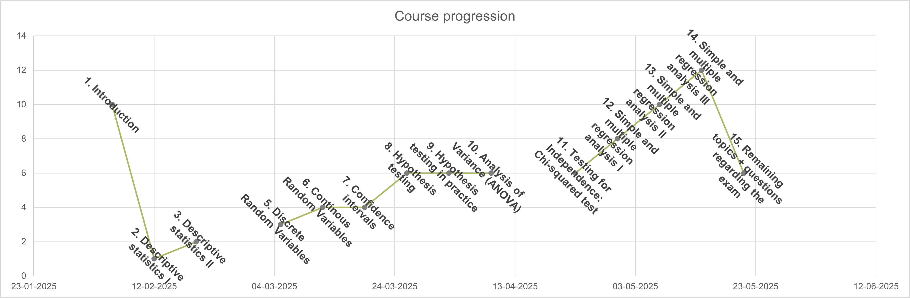

---
output:
  xaringan::moon_reader:
    seal: false
    includes:
      after_body: insert-logo.html
    self_contained: false
    lib_dir: libs
    nature:
      highlightStyle: github
      highlightLines: true
      countIncrementalSlides: false
      ratio: '16:9'
editor_options: 
  chunk_output_type: console
---
class: center, inverse, middle

```{css echo=FALSE}
.pull-left {
  float: left;
  width: 44%;
}
.pull-right {
  float: right;
  width: 44%;
}
.pull-right ~ p {
  clear: both;
}


.pull-left-wide {
  float: left;
  width: 66%;
}
.pull-right-wide {
  float: right;
  width: 66%;
}
.pull-right-wide ~ p {
  clear: both;
}

.pull-left-narrow {
  float: left;
  width: 30%;
}
.pull-right-narrow {
  float: right;
  width: 30%;
}

.tiny123 {
  font-size: 0.40em;
}

.small123 {
  font-size: 0.80em;
}

.large123 {
  font-size: 2em;
}

.red {
  color: red
}

.orange {
  color: orange
}

.green {
  color: green
}
```


# Statistics
## Video lecture: Recap of the entire semester

### Christian Vedel,<br>Department of Economics

### Email: [christian-vs@sam.sdu.dk](christian-vs@sam.sdu.dk)

### Updated `r Sys.Date()`


.footnote[
.left[
.small123[
*Please beware. I work on these slides until the last minute before the lecture and push most changes along the way. Until the actual lecture, this is just a draft*  
]
]
]

---
class: middle

# What this is and isn't

> **Not** a full comprehensive lecture on the entire curiculum (that would take an entire semester)

> **Is** a helpful study guide - you need to know the details behind these lectures

---
class: center, middle
# Course plan



---
# What we have done

.pull-left[
[Lecture 1 - Introduction](https://raw.githack.com/christianvedels/Introductory_statistics/refs/heads/main/Lecture%201%20-%20Introduction/Slides.html)  

[Lecture 2 - Descriptive statistics I](https://raw.githack.com/christianvedels/Introductory_statistics/refs/heads/main/Lecture%202%20-%20Descriptive%20statistics/Slides.html)

[Lecture 3 - Descriptive statistics II](https://raw.githack.com/christianvedels/Introductory_statistics/refs/heads/main/Lecture%203%20-%20Descriptive%20statistics/Slides.html)

Lecture 4 - **this lecture**

[Lecture 5 - Discrete Random Variables](https://raw.githack.com/christianvedels/Introductory_statistics/refs/heads/main/Lecture%205%20-%20Discrete%20Random%20Variables/Slides.html)

[Lecture 6 - Continuous Random Variables](https://raw.githack.com/christianvedels/Introductory_statistics/refs/heads/main/Lecture%206%20-%20Continous%20Random%20Variables/Slides.html)

[Lecture 7 - Confidence Intervals](https://raw.githack.com/christianvedels/Introductory_statistics/refs/heads/main/Lecture%207%20-%20Confidence%20Intervals/Slides.html)

]

.pull-right[
[Lecture 8 - Hypothesis Testing](https://raw.githack.com/christianvedels/Introductory_statistics/refs/heads/main/Lecture%208%20-%20Hypothesis%20testing/Slides.html)

[Lecture 9 - Hypothesis Testing in Practice](https://raw.githack.com/christianvedels/Introductory_statistics/refs/heads/main/Lecture%209%20-%20Hypothesis%20testing%20in%20practice/Slides.html)

[Lecture 10 - ANOVA](https://raw.githack.com/christianvedels/Introductory_statistics/refs/heads/main/Lecture%2010%20-%20ANOVA/Slides.html#1)

[Lecture 11 - chi squarred test](https://raw.githack.com/christianvedels/Introductory_statistics/refs/heads/main/Lecture%2011%20-%20Chi-squared%20test/Slides.html)

[Lecture 12 - Simple regression analysis](https://raw.githack.com/christianvedels/Introductory_statistics/refs/heads/main/Lecture%2012%20-%20Simple%20regression%20analysis/Slides.html)

[Lecture 13/14 - Multiple regression](https://raw.githack.com/christianvedels/Introductory_statistics/refs/heads/main/Lecture%2013%20-%20Multiple%20regression/Slides.html#1)

[Lecture 15](https://raw.githack.com/christianvedels/Introductory_statistics/refs/heads/main/Lecture%2015%20-%20Final%20lecture/Slides.html#1)

]


---
# Conclusion
.pull-left[
- Here is some theory. The real world is different. I still hope it is useful
- It's been a pleasure
- Good luck out there

*Feel free to write me an email: christian-vs@sam.sdu.dk*
]


.pull-right[

]

