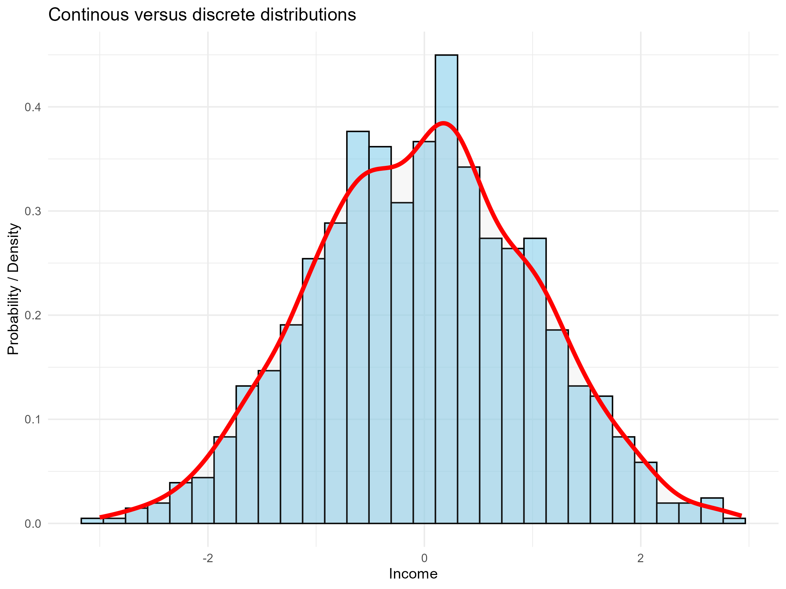

---
output:
  xaringan::moon_reader:
    seal: false
    includes:
      after_body: insert-logo.html
    self_contained: false
    lib_dir: libs
    nature:
      highlightStyle: github
      highlightLines: true
      countIncrementalSlides: false
      ratio: '16:9'
editor_options: 
  chunk_output_type: console
---
class: center, inverse, middle

```{r xaringan-panelset, echo=FALSE}
xaringanExtra::use_panelset()
```

```{r xaringan-tile-view, echo=FALSE}
xaringanExtra::use_tile_view()
```

```{r xaringanExtra, echo = FALSE}
xaringanExtra::use_progress_bar(color = "#808080", location = "top")
```

```{css echo=FALSE}
.pull-left {
  float: left;
  width: 44%;
}
.pull-right {
  float: right;
  width: 44%;
}
.pull-right ~ p {
  clear: both;
}


.pull-left-wide {
  float: left;
  width: 66%;
}
.pull-right-wide {
  float: right;
  width: 66%;
}
.pull-right-wide ~ p {
  clear: both;
}

.pull-left-narrow {
  float: left;
  width: 30%;
}
.pull-right-narrow {
  float: right;
  width: 30%;
}

.tiny123 {
  font-size: 0.40em;
}

.small123 {
  font-size: 0.80em;
}

.large123 {
  font-size: 2em;
}

.red {
  color: red
}

.orange {
  color: orange
}

.green {
  color: green
}
```


# Statistics
## Lecture 5: Discrete Random Variables

### Christian Vedel,<br>Department of Economics

### Email: [christian-vs@sam.sdu.dk](christian-vs@sam.sdu.dk)

### Updated `r Sys.Date()`


.footnote[
.left[
.small123[
*Please beware. I work on these slides until the last minute before the lecture and push most changes along the way. Until the actual lecture, this is just a draft*  
]
]
]


---
class: middle
# Today's lecture
.pull-left-wide[


### This time: Probability and probability distributions

- Defining probability and probability distributions
- Discrete versus continous
- Two 'work horses' among *discrete* distributions: Binomial and Poisson distribution


]

---
class: middle
# Probability

.pull-left-wide[
- Paraphrased exam answer: "Since Jenny can either buy 1 or 10 apples, there is 50/50 probability of each"
- What is the problem with this statement?

]

---
class: middle
# A simple coin toss
.pull-left[
- How likely is heads?
- How likely is tails?
- And what does that mean?

- We will do a few coin tosses in class
- What is the probability of *heads* or *tails* if we flipped the coin but still haven't revealed the answer?
]

.pull-right[

]

---

# Two interpretations of probability

*You can use either interpretation. Which one do you think is more intuitive?*

.pull-left[
### Frequentist probability
- The hidden coin, that has been tossed is either *heads* or *tails* with probability = 1
- *probability* is equal to the *frequency*
- I.e. if we toss the coin 1000 or 100000 times, then the probability of *heads* and *tails* will reveal themselves
]

.pull-right[
### Subjective probability
- The hidden coin is *heads* with probability 0.5 (and vice versa for *tails*)
- Probability expresses *information*.
- I.e. how much do we know about the coin? If prob = 1 (or prob = 0), then we are **certain** otherwise, we are unsure. 

]


*We will look at coin tosses in excel for the frequentist definition*


---
class: middle
# Probability distribution
> A probability distribution is a function, which for each possible outcome defines returns the probability of that outcome

### Example with Coin flips:
$$Pr(Coin = "Heads") = 0.5$$
$$Pr(Coin = "Tails") = 0.5$$

---
# More examples
.pull-left-wide[
- Dice:
  + $Pr(1) = 1/6$, $Pr(2) = 1/6$, ... $Pr(6) = 1/6$
- Exam passing:
  + $Pr(pass) = 0.95$, $Pr(fail) = 0.05$
- Language models (like chat GPT):
  + Answers: *what is the probability of each possible next word?*
  + "Statistics is a course which is [missing]"
  + $Pr("nice") = 0.21$, $Pr("useful") = 0.12$, etc.
  
]


---
# Continous versus discrete distributions

.pull-left[
- Sometimes we want to consider *discrete outcomes* such as 'heads', 'passed', etc
- Other times we want to consider *continous numbers* such as $Pr(Income > 543.12)$


]

.pull-right[

]


```{r eval=FALSE, message=FALSE, warning=FALSE, include=FALSE, paged.print=FALSE}
library(tidyverse)
# Simulating normal data
set.seed(20)
df = data.frame(x = rnorm(1000, mean = 0, sd = 1)) 

# Create the plot
p1 = ggplot(df, aes(x = x)) +
  geom_histogram(aes(y = ..density..), bins = 30, color = "black", fill = "skyblue", alpha = 0.6) +
  geom_density(color = "red", size = 1.5, fill = "grey", alpha = 0.1) +
  ggtitle('Continous versus discrete distributions') +
  theme_minimal() +
  labs(x = "Income", y = "Probability / Density")

ggsave("Figures/continous_versus_discrete.png", plot = p1, width = 8, height = 6)
```


---
# Two things for something to qualify as a probability distribution:
1. Range between 0 and 1: $0 \leq Pr(X = x_i)\leq1$. 
  + What would it mean if something had negative probability? Or more than 100 pct probability?

2. The probabilities of all events sum to one: $\sum_i Pr(X = x_i) = 1$
  + I.e. the probability of anyone of the possible outcomes to occur is by definition 1
  
### Notation
- $Pr(X = x_i)$ is the probability of the event "x_i" happening in the population of $X$
- Often we write $Pr(x_i)$ or just $Pr(x)$ when the detail is not necessary to understand what is happening
- Some prefer writing $P()$ others prefer writing $Pr()$. It means the same. 


---
# Conditional probabilities
- What is the probability of "A" if "B" has already happened
- $Pr(A|B)$

- Example:
  - $Pr(Passing) = 0.95$
  - $Pr(Passing | Studying) = 0.99$
  - $Pr(Passing | \textit{Not studying}) = 0.081$
  
- *Further explanation given in the book using tree diagrams*

---
## Some formulas
$$Pr(\textit{Not A}) = 1 - Pr(A)$$

$$Pr(A|B) = \frac{Pr(A \cap B)}{Pr(B)}$$
$$Pr(B|A) = \frac{Pr(A|B)Pr(A)}{Pr(B)}$$

---
# Binomial Distribution: Examples
- Flipping a fair coin 10 times and counting the number of heads is modeled by a binomial distribution.
- The number of defective items in a batch of 100 products, given a constant defect rate, follows a binomial distribution.
- The count of patients responding positively to a treatment in a clinical trial with a fixed number of patients is binomially distributed.


---
# The Binomial Experiment

An experiment qualifies as binomial if:
- There is a fixed number of trials, $n$.
- Each trial has exactly two outcomes (success or failure).
- The probability of success, $p$, is constant across trials.
- The trials are independent.


- **Important:** The Binomial distribution tells us how likely $x$ success are, if you repeat $n$ times and each *trials* success rate is $p$

---
# Probability distribution
For a binomial random variable $X$ with $n$ trials and success probability $p$, the probability of exactly $k$ successes is given by:
$$
P(X=x) = \binom{n}{x} p^x (1-p)^{n-x}.
$$
Here, $\binom{n}{k} = \frac{n!}{k!(n-k)!}$ is the binomial coefficient.

---
# Mean and Variance
For $X \sim \operatorname{Bin}(n, p)$:
- The mean is $\mathbb{E}[X] = np$.
- The variance is $\operatorname{Var}(X) = np(1-p)$.

---
# Expectation and Variance
For a binomial random variable $X \sim \operatorname{Bin}(n, p)$, the formulas are:
$$
\mathbb{E}(X) = np,
$$
$$
\operatorname{Var}(X) = np(1-p).
$$


---
# Example Calculation
Consider flipping a fair coin 5 times ($n = 5$, $p = 0.5$). The probability of getting exactly 3 heads is:
$$
P(X=3) = \binom{5}{3}(0.5)^3(0.5)^2 = 10 \times 0.125 \times 0.25 = 0.3125.
$$
--

### Expectation
$$
\mathbb{E}(X) = np = 5 \times 0.5 = 2.5
$$
--
### Variance
$$
Var(X) = np(1-p) = 5 \times 0.5 (1 - 0.5) = 1.25
$$

---
# Poisson Distribution: Examples
- The number of cars passing a toll booth in one hour follows a Poisson distribution.
- The number of phone calls received by a call center in a given minute is modeled by a Poisson process.
- The number of decay events detected by a Geiger counter in a fixed time period is Poisson distributed.

---
# The Poisson Experiment
A Poisson process is used when:
- Events occur independently over time or space.
- The average rate of occurrence, $\lambda$, is constant.
- The probability of more than one event in an infinitesimally small interval is negligible.
- The numbers of events in non-overlapping intervals are independent.

- **Important:** The Poisson distribution tells us how likely $k$ events are to occur in a fixed interval given the average rate $\lambda$.

---
# Probability Distribution
For a Poisson random variable $X$ with rate $\lambda$, the probability of observing $k$ events is given by:
$$
P(X=k) = \frac{\lambda^k e^{-\lambda}}{k!}, \quad k = 0, 1, 2, \dots
$$

---
# Mean and Variance
For $X \sim \operatorname{Pois}(\lambda)$:
- The mean is $\mathbb{E}[X] = \lambda$.
- The variance is $\operatorname{Var}(X) = \lambda$.

---
# Expectation and Variance
For a Poisson random variable $X \sim \operatorname{Pois}(\lambda)$, the formulas are:
$$
\mathbb{E}(X) = \lambda,
$$
$$
\operatorname{Var}(X) = \lambda.
$$

---
# Example Calculation
Suppose that the average number of emails you receive per hour is $\lambda = 4$. The probability of receiving exactly 6 emails in an hour is:
$$
P(X=6) = \frac{4^6 e^{-4}}{6!} \approx \frac{4096 \cdot e^{-4}}{720}.
$$
Using $e^{-4} \approx 0.0183$, the calculation gives:
$$
P(X=6) \approx \frac{4096 \times 0.0183}{720} \approx 0.104.
$$

---
# Expectation and Variance Example
Given $\lambda = 4$:
$$
\mathbb{E}(X) = 4,
$$
$$
\operatorname{Var}(X) = 4.
$$


---
# Real Life Example: Poisson Distribution in Business Studies

.pull-left-wide[
- **Context:** A retail company monitors customer service issues.
- **Scenario:** On average, the company receives 3 customer complaints per day.
- **Model:** Since complaints occur randomly and independently over time, the number of complaints per day is modeled by a Poisson distribution with $\lambda = 3$.
- **Application:** Management uses this model to estimate the probability of receiving an unusually high number of complaints on a given day, helping them adjust staffing or investigate quality issues.
- **5 or more complaints would overwhelm them**

]

---
# Step by Step Calculation: 5 or More Complaints
Suppose we want to calculate the probability of receiving 5 or more complaints in one day when $\lambda = 3$.

.pull-left[

Step 1: Strategy: **Apply the complement rule:**
   $$
   P(X \ge 5) = 1 - P(X \le 4)
   $$
Step 2: **Calculate $P(X \le 4)$ by summing $P(X=k)$ for $k = 0, 1, 2, 3,$ and $4$:**

.small123[
  - Probability of 0 complaints:
    $$P(X=0) = \frac{3^0 e^{-3}}{0!} = e^{-3} \approx 0.04979$$

    ... (1, 2, 3)
    
  - Probability of 4 complaints
    $$P(X=4) = \frac{3^4 e^{-3}}{4!} = \frac{81e^{-3}}{24} \approx 0.16803$$

]


]

.pull-right[

Step 3: **Sum the probabilities for $k = 0$ to $4$:**
.small123[
   $$
   P(X \le 4) \approx 0.04979 + 0.14936 + 0.22404 + 0.22404 + 0.16803
   $$
   
   $$
   P(X \le 4) \approx 0.81526
   $$
   

]

Step 4: **Calculate result**
   $$
   P(X \ge 5) = 1 - 0.81526 \approx 0.18474
   $$

Step 5: **Interpretation:**  
   There is approximately an 18.5% chance of receiving 5 or more complaints in a day.
   
.small123[
*Note: Recall the formula:*
$$
P(X=k) = \frac{\lambda^k e^{-\lambda}}{k!}
$$
]   
]


---
# Real Life Example: Binomial Distribution in Social Science Research
- **Context:** A political campaign surveys voter support for Greenland leaving Denmark and joining the EU.
- **Scenario:** In a survey of 500 voters, each voter independently has a 60% chance of supporting the candidate.
- **Model:** The number of supporters is modeled by a binomial distribution with $n = 500$ and $p = 0.6$.
- **Application:** The campaign uses the binomial model to estimate the likelihood of various support levels, aiding in strategy and resource allocation for future outreach.


---
# Next time
.pull-left[
- Continuous random variables
  + Uniform distribution
  + Normal distribution
  + Exponential distribution
  
- Execise set available. Covers two separate classes. 

]


.pull-right[

]

