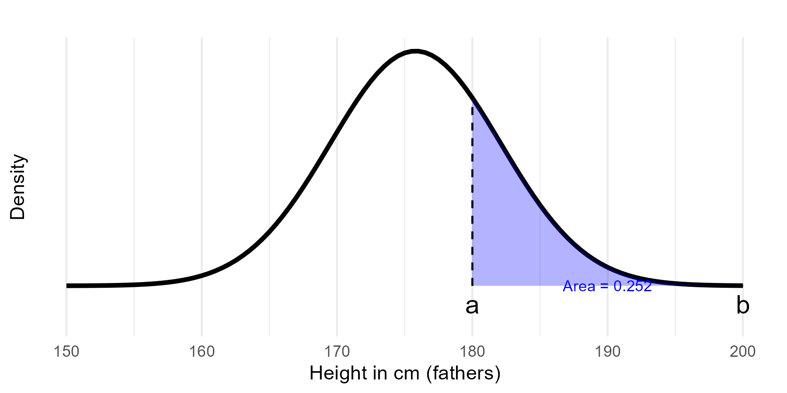

---
output:
  xaringan::moon_reader:
    seal: false
    includes:
      after_body: insert-logo.html
    self_contained: false
    lib_dir: libs
    nature:
      highlightStyle: github
      highlightLines: true
      countIncrementalSlides: false
      ratio: '16:9'
editor_options: 
  chunk_output_type: console
---
class: center, inverse, middle

```{r xaringan-panelset, echo=FALSE}
xaringanExtra::use_panelset()
```

```{r xaringan-tile-view, echo=FALSE}
xaringanExtra::use_tile_view()
```

```{r xaringanExtra, echo = FALSE}
xaringanExtra::use_progress_bar(color = "#808080", location = "top")
```

```{css echo=FALSE}
.pull-left {
  float: left;
  width: 44%;
}
.pull-right {
  float: right;
  width: 44%;
}
.pull-right ~ p {
  clear: both;
}


.pull-left-wide {
  float: left;
  width: 66%;
}
.pull-right-wide {
  float: right;
  width: 66%;
}
.pull-right-wide ~ p {
  clear: both;
}

.pull-left-narrow {
  float: left;
  width: 30%;
}
.pull-right-narrow {
  float: right;
  width: 30%;
}

.tiny123 {
  font-size: 0.40em;
}

.small123 {
  font-size: 0.80em;
}

.large123 {
  font-size: 2em;
}

.red {
  color: red
}

.orange {
  color: orange
}

.green {
  color: green
}
```


# Statistics
## Lecture 6: Continuous Random Variables

### Christian Vedel,<br>Department of Economics

### Email: [christian-vs@sam.sdu.dk](christian-vs@sam.sdu.dk)

### Updated `r Sys.Date()`


.footnote[
.left[
.small123[
*Please beware. I work on these slides until the last minute before the lecture and push most changes along the way. Until the actual lecture, this is just a draft*  
]
]
]


---
class: middle
# Today's lecture
.pull-left-wide[

### Last time:
- Defining probability and probability distributions
- Discrete versus continous
- Two 'work horses' among *discrete* distributions: Binomial and Poisson distribution

### This time: Continous distributions
- The uniform distribution
- The normal distribution
- Examples 
- The normal distributions occurs very often in 'real life':
  + Averaging *most* distributions approximates the normal distribution


]


---
class: middle
# Continuous Random Variables

.pull-left-wide[
- **Definition:** Unlike discrete distributions, continuous random variables can take any value within an interval.
- **Probability Density Function (pdf):**
  + The probability that a continuous variable falls within an interval is the area under the pdf.
- **Key idea:** $\Pr(a \le X \le b) = \int_a^b f(x) \, dx$
  + (Don't worry about the $\int$ for now)
]


---
class: middle
# Understanding a Probability Density Function

- A probability density function (pdf) describes how probability is distributed over the values of a continuous variable.
- **Key ideas:**
  - The **total area** under the pdf curve is **1** (as any probability function).
  - The height of the curve represents the **relative likelihood** of different values. 
  - To get probabilities, we sum over an interval


---
class: middle
# Continuous Distributions: Modeling Stock Market Changes

- **Continuous vs. Discrete:**
  - **Discrete outcomes:** Countable results (e.g., number of sales).
  - **Continuous outcomes:** Any value within a range (e.g., percentage change in stock market).

- **Example:**
  - We want to estimate the probability of various stock market changes tomorrow.
  - Stock market returns can take on an infinite range of values, not just a few distinct numbers.

- **Our Goal (in the example):**
  - Develop a model that assigns a probability to every possible percentage change. E.g. how likely is a drop of more than 10 pct in TSLA stock?
  - $Pr(Change < -2)$

---
class: middle
# Visualizing a PDF

.pull-left-narrow[
- The illustration is an example of a probability density function. 
- The shaded area represents the probability of the variable falling between two points \(a\) and \(b\).

- We will look at more examples in class
]

.pull-right-wide[

]


```{r eval=FALSE, include=FALSE}
source("R-code/01_Make_plot_function.R")
p1 = make_plot(a = -10, b = -2, label_offset1 = -0.05) + labs(x = "Change in price of asset (pct)", subtitle =  "") 
p1
ggsave("Figures/pdf.png", width = 5, height = 3, plot = p1)
```


---
class: middle
# The Uniform Distribution

.pull-left[
- **Definition:** A continuous variable $X$ is uniformly distributed on $[a,b]$ if every outcome within the interval is equally likely.
- **Key Idea:** All sub-intervals of equal length within $[a,b]$ have the same probability.
- **Probability:** The probability for any small interval of length $\Delta x$ is proportional to $\Delta x$.
- **Total Probability:** Adding up the probabilities over the entire range gives 1.
- **Properties:**
  + Mean: $\mathbb{E}[X] = \frac{a+b}{2}$
  + Variance: $\operatorname{Var}(X) = \frac{(b-a)^2}{12}$
]

```{r eval=FALSE, include=FALSE}
source("R-code/01_Make_plot_function.R")
p1 = make_plot(d = d2, label_offset1 = -0.05) + labs(x = "Change in price of asset")
ggsave("Figures/pdf_unif.png", width = 5, height = 4, plot = p1)
```

.pull-right[

]

---
class: middle
# The Normal Distribution

.pull-left[
- **Definition:** The normal distribution is characterized by its bell-shaped curve.
- **Key Properties:**
  + **Symmetry:** It is symmetric about its mean, $\mu$.
  + **Concentration:** Most probability mass is concentrated around $\mu$; the probability decreases as we move further away.
- **Probability Density Function (pdf):**
  $$
  f(x) = \frac{1}{\sigma\sqrt{2\pi}} \exp\!\left(-\frac{(x-\mu)^2}{2\sigma^2}\right)
  $$
- **Properties:**
  + Mean: $\mathbb{E}[X] = \mu$
  + Variance: $\operatorname{Var}(X) = \sigma^2$
]

```{r eval=FALSE, include=FALSE}
source("R-code/01_Make_plot_function.R")
p1 = make_plot(d = d3, a = -1.96, b = 1.96, label_offset1 = -0.05) + labs(x = "Change in price of asset")
ggsave("Figures/pdf_norm.png", width = 5, height = 4, plot = p1)
```

.pull-right[

]

---
class: middle
# Standard vs. Arbitrary Normal Distributions

.pull-left[
**Arbitrary Normal Distribution**  
- An arbitrary normal distribution can have any mean ($\mu$) and standard deviation ($\sigma$), which shifts and scales the bell curve.  
- For instance, consider a normal distribution with $\mu = 3$ and $\sigma = 2$.  
- Its density is given by:  
  $$
  f(x) = \frac{1}{2\sqrt{2\pi}} \exp\!\left(-\frac{(x-3)^2}{8}\right)
  $$
]

.pull-right[
**Standard Normal Distribution**  
- The standard normal distribution is a special case with $\mu = 0$ and $\sigma = 1$.  
- Its density function is:  
  $$
  \phi(z) = \frac{1}{\sqrt{2\pi}} \exp\!\left(-\frac{z^2}{2}\right)
  $$
]

---
class: middle
# Galton's Data on Heights

.pull-left-wide[
- **Background:**  
  Francis Galton (1822-1911) collected data to predict how likely any height is.
- **Focus for Today:**  
  We will describe the distribution of fathers' heights.
- **Note:**  
  Later, we'll explore how this distribution relates to children's heights.
]


---
class: middle
# Estimating the Normal Distribution

.pull-left-wide[
- We assume that heights follow a normal distribution.
- **Goal:**  
  Estimate the parameters (mean $\mu$) and standard deviation ($\sigma$) for fathers' heights.
- These estimates will allow us to calculate the probability of observing a given height.
]

```{r eval=FALSE, include=FALSE}
# Converting Galton data 
library(tidyverse)
library(readxl)
library(baizer)
df = read_csv("Examples/Galton_data/Galton_Family_Heights.csv")
df %>%
  mutate_all(function(x){x*2.54}) %>%
  mutate(
    gender = gender / 2.54
  ) %>%
  write_excel("Examples/Galton_data/Converted_to_excel.xlsx")
```


---
class: middle
# Step by Step: Likelihood of Being 180cm or Taller in 1885

.pull-left-wide[
- **Given Estimates:**  
  $\mu = 175.8$ and $\sigma = 6.3$
  
- **Objective:**  
  Calculate the probability that a father's height is **180 cm or taller**.

- **Approach:**  
  Use the normal distribution with the above parameters to estimate the likelihood.

]

---
# Graphical solution
```{r eval=FALSE, include=FALSE}
source("R-code/01_Make_plot_function.R")
p1 = make_plot(a = 180, b = 200, d = galton_d, domain = c(150, 200))
p1 = p1 + labs(x = "Height in cm (fathers)", subtitle = "")
ggsave("Figures/pdf_height.png", width = 6, height = 3, plot = p1)
```



---
class: middle
# The Cumulative Normal Distribution

.pull-left[
- **What is it?**  
  The cumulative normal distribution, $\Phi(z)$, tells us the probability that a standard normally distributed variable is less than or equal to a given value $z$.  
  In simple terms, it shows the proportion of data below a certain point in a bell-shaped curve.

- **Key Points:**  
  + At $z = 0$, $\Phi(0) = 0.5$, meaning 50% of the values lie below 0.  
  + At $z = 1$, $\Phi(1) \approx 0.84$: about 84% of values are below 1.  
  + At $z = -1$, $\Phi(-1) \approx 0.16$: only about 16% are below -1.
]

.pull-right[

]

```{r cumulative-normal-plot, eval=FALSE, fig.height=3, fig.width=5, include=FALSE}
# Plot the cumulative normal distribution using d3 as the density function
p1 = make_plot(a = -4, b = 1, d = d3, cumulative = TRUE, domain = c(-4, 4), label_offset1 = -0.05) +
  labs(x = "z", subtitle = "Cumulative Normal Distribution") + 
  scale_y_continuous()
ggsave("Figures/pdf_cumulative.png", width = 5, height = 4, plot = p1)
```


---
class: middle
# Step by Step: Calculating the Likelihood of Being 180cm or Taller

.pull-left[
Step 1. **Standardize the value:**  
   Compute the z-score for 180 cm:  
   $$
   z = \frac{180 - 175.8}{6.3} \approx \frac{4.2}{6.3} \approx 0.667
   $$

Step 2. **Determine the probability:**  
   The probability of a height of 180 cm or taller is:  
   $$
   P(X \ge 180) = 1 - \Phi(z)
   $$
   where $\Phi(z)$ is the cumulative distribution function (CDF) of the standard normal distribution.

]

.pull-right[
Step 3. **Lookup/Calculate $\Phi(0.667)$:**  
   Using standard normal tables or a calculator (NORM.DIST() in excel),  
   $$
   \Phi(0.667) \approx 0.747
   $$
   So,
   $$
   P(X \ge 180) \approx 1 - 0.747 = 0.253
   $$

Step 4. **Conclusion:**  
   There is approximately a **25.3%** chance that a father's height is 180 cm or taller.
]


---
class: middle
# Why the Normal Distribution Occurs So Often

.pull-left-wide[
- **Central Limit Theorem (CLT):**
  + States that the sum or average of many independent random variables tends toward a normal distribution, regardless of their original distributions.
- **Real-Life Examples:**
  + Heights, test scores, measurement errors, and many natural phenomena follow a normal pattern.
- **Takeaway:** Even if individual variables aren’t normal, their aggregate often is—explaining the prevalence of the normal distribution in nature.
]

.pull-right-narrow[
### Example in class:
- We will look at the process of taking the mean of dices
- One dice is uniformly distributed
- Adding more dice gets closer and closer to a normal distribution
- We will start from an empty spreadsheet
]


---
# Next time
.pull-left[
- We will build a useful tool from probability distributions: Confidence intervals
]


.pull-right[

]

