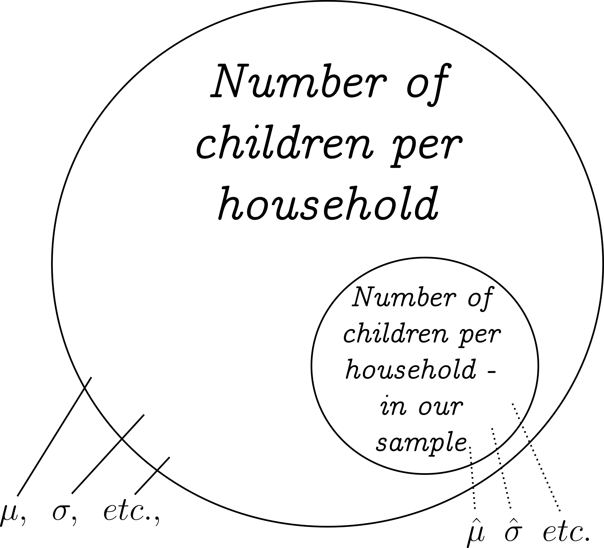

---
output:
  xaringan::moon_reader:
    seal: false
    includes:
      after_body: insert-logo.html
    self_contained: false
    lib_dir: libs
    nature:
      highlightStyle: github
      highlightLines: true
      countIncrementalSlides: false
      ratio: '16:9'
editor_options: 
  chunk_output_type: console
---
class: center, inverse, middle

```{r xaringan-panelset, echo=FALSE}
xaringanExtra::use_panelset()
```

```{r xaringan-tile-view, echo=FALSE}
xaringanExtra::use_tile_view()
```

```{r xaringanExtra, echo = FALSE}
xaringanExtra::use_progress_bar(color = "#808080", location = "top")
```

```{css echo=FALSE}
.pull-left {
  float: left;
  width: 44%;
}
.pull-right {
  float: right;
  width: 44%;
}
.pull-right ~ p {
  clear: both;
}


.pull-left-wide {
  float: left;
  width: 66%;
}
.pull-right-wide {
  float: right;
  width: 66%;
}
.pull-right-wide ~ p {
  clear: both;
}

.pull-left-narrow {
  float: left;
  width: 30%;
}
.pull-right-narrow {
  float: right;
  width: 30%;
}

.tiny123 {
  font-size: 0.40em;
}

.small123 {
  font-size: 0.80em;
}

.large123 {
  font-size: 2em;
}

.red {
  color: red
}

.orange {
  color: orange
}

.green {
  color: green
}
```


# Statistics
## Lecture 7: Confidence Intervals

### Christian Vedel,<br>Department of Economics

### Email: [christian-vs@sam.sdu.dk](christian-vs@sam.sdu.dk)

### Updated `r Sys.Date()`


.footnote[
.left[
*These slides are adapted from Sørensen (2024)*
.small123[
*Please beware. I work on these slides until the last minute before the lecture and push most changes along the way. Until the actual lecture, this is just a draft*  
]
]
]

---
class: middle
# Today's lecture
.pull-left-wide[

### Last time:
- Theoretical
- Conceptual
- The central limit theorem: Why we are so hung up on the normal distribution

### This time: Confidence Intervales
- Sampling and point estimates
- We will use the normal distribution
  + Z-based confidence interval for the mean
- Working with proportions

]

---
# Sampling and point estimates

.pull-left-wide[
- In statistics, we are interested in *statistics* for the **population**
- Recall the definition:
> A *statistic* is a number which sumarises some data

- Example: How many children are born on average in a household?

#### The big questions:
- Do we know that a **statistic** for our sample **approximate** the *statistic* of the *population*?
  + $\mu \approx \hat{\mu}$?
- How **certain** are we, that this is the case?
  + E.g. we are 95 pct sure that  $\mu$ is in in an interval $[1.6; 2.1]$
]

.pull-right-narrow[

]

---
class: middle
.pull-left[
# Questions
- Will our sample be normally distributed if the population is?
- Will our sample 'improve' with more data?
- What are the requirements of sampling?
]

.pull-right[

*Is this a reliable sample? Is it a reliable statistic?*

]

```{r eval=FALSE, include=FALSE}
library(tidyverse)

set.seed(20)
p1 = data.frame(
  answer = sample(c(rep("Yes",99),"No"), 1000, replace = TRUE)
) %>%
  ggplot(aes(answer)) + 
  geom_bar(aes(fill = answer)) + 
  labs(
    title = "Do you like answering surveys?",
    x = "Answer",
    y = "Statistic:\nYes/No per 1000 asked"
  ) + 
  theme_minimal() + 
  theme(legend.position = "none")

ggsave("Figures/People_like_surverys.png", plot = p1, width = 4, height = 3)
```

---
class: middle

# Strategies to improve samples

.pull-left-wide[
1. Random sampling (often preferable)
  + E.g. draw random CPR numbers
  + Often hard in practice
2. Stratified sampling:
  + Pick proportionally men/women, young/old, job/no job, low/high educ, etc.
3. Post correction (weights)
  + Count everyone according to their share of the overall population (instead of counting each as *one*)

]

.pull-righ-narrow[
### Note:
Random sampling ensures that you approximate the real population's distribution

]


---
# Estimators and properties
.pull-left-wide[
### Population versus estimators
- Mean: $\overline{X} = \frac{1}{n} \sum_i x_i \;\;\;\;\; \rightarrow$ approximates: $\mu$
- Variance $S^2 = \frac{1}{n-1} \sum_i (x_i-\overline{X})^2 \;\;\;\;\; \rightarrow$ approximates: $\sigma^2$
]

--
.pull-left-wide[
### Properties
- **Unbiased:** It is equally likely to over or under-estimate
- **Efficient:** It is on average a close estimate
- **Consistent:** When you add more observations it gets closer to the population value
]

---
# Central limit theorem (CLT) - recap
- Last time we threw dice
- It turns out: If you throw many ...
  + Then the average ends up being normally distributed 
  
> **Central limit theorem:** When you sample any (well-behaved) distribution and take the average, then the *average* is normally distributed (given enough samples)

--
### Rules of thumb:
- 30 samples is enough
- 100 samples then you are safe

--
### Implication:
- Even if we don't know the distribution in the population **we still know the distribution of the average**
- We can use the normal distribution to calculate probabilities related to the average

---
# CLT with math

If we draw a sample from some distribution
$$
x_i \sim \mathscr{D(\theta)}
$$

Then given enough samples $n$ we know that:
$$
\overline{X} \sim \mathscr{N}\left(\mu, \frac{\sigma^2}{n}\right)
$$
And we can approximate these:
$$
\mu \approx \overline{X} = \frac{1}{n}\sum_i x_i
$$

$$
\sigma^2 \approx S^2 = \frac{1}{n-1} \sum_i (x_i-\overline{X})^2
$$
Note: We have a special name for $\frac{\sigma^2}{n}$, when we take the square root of it: $\text{"standard error"}=\sqrt\frac{\sigma^2}{n}$

---
class: middle

# Why do we need all of this math!?
.pull-left-wide[
- Now we have to building blocks to answer the questions:
]

.pull-right-wide[
#### The big questions:
- Do we know that a **statistic** for our sample **approximate** the *statistic* of the *population*?
  + $\mu \approx \hat{\mu}$? .red[Yes!]
- How **certain** are we, that this is the case?
  + E.g. we are 95 pct sure that  $\mu$ is in in an interval $[1.6; 2.1]$ 
  + $\rightarrow$ .red[Let's turn to this]

]

---
# Some definitions:

.pull-left-wide[
> A **confidence interval** is a range of numbers believed to include an unknown population parameter (e.g. the true mean $\mu$)

- Associated with this measure, there is typically a measure of confidence. 
  + 95 pct is by far the most common
  + Other common values used: 90, 99, 99.9, etc. 
  
> If we are using a **95% confidence interval**, then we are 95% confident, that we have captured to true value

**Analogy**: It is a fishing net: Higher confidence $\approx$ more fine masked net. But finer masks also captures things we don't need.

]

---
# Lets have a look at an example 
```{r eval=FALSE, include=FALSE}
source("R-code/03_CI.R")

p1 = plot_distribution_with_sd(
    175.7606574, sqrt(6.290257479/933), 
    1.96, 
    domain = c(175.5, 176), 
    label_offset1 = -0.02
) + 
  labs(
    x = "farther's mean height"
  )
p1
ggsave("Figures/CI_example.png", plot = p1, width = 6, height = 3.5)
```

.pull-left-narrow[
#### Step by step
- In 934 observations we calculated:
  + $\overline{X} = 175.8$
  + $S^2 = 6.3$ 
  + and it follows: $SE = \sqrt{\frac{6.3}{934-1}}\approx0.0822$
  
- It follows that the mean height has the distribution:
  + $\overline{X} \sim \mathscr{N}(175.8, \;0.0822)$

]


.pull-right-wide[

]


**Conclusion: We are 95 pct sure that the true mean can be found between `r round(175.7606574-1.96*sqrt(6.290257479/933), 2)` and `r round(175.7606574+1.96*sqrt(6.290257479/933), 2)`**

---
class: middle
# Setting up a confidence interval
.pull-left[
#### Assume:
.small[
- Central limit theorem holds (the mean is normally distributed)
- We know (or can estimate accurately) the standard deviation $\sigma$
]

#### Formula
$$
CI = \overline{X}\pm Z_{\alpha/2} \frac{\sigma}{\sqrt n}
$$
.small123[
- $\overline{X}$: Mean of the data
- $Z_{\alpha/2}$: Critical value (number of standard errors) 
- $\alpha$: represents the level of significance or the probability of making a (Type I) error
- $\sigma$: Standard deviation $\rightarrow$ turned into standard errors by dividing by $\sqrt n$

Note: $Z_{\alpha/2}$ is something you have to look up (or compute with e.g. excel)
]

]

.pull-right[
.middle[
#### Typical values:
- 99% confidence interval ($\alpha = 0.01$) then: $\longrightarrow$ $Z = 2.575$

- 95% confidence interval ($\alpha = 0.05$) then: $\longrightarrow$ $Z = 1.960$

- 95% confidence interval ($\alpha = 0.10$) then: $\longrightarrow$ $Z = 1.645$

(After a while, you learn these values by heart. Especially 1.96)
]
] 

---
# Next time
.pull-left[
- Hypothesis testing
]


.pull-right[

]

