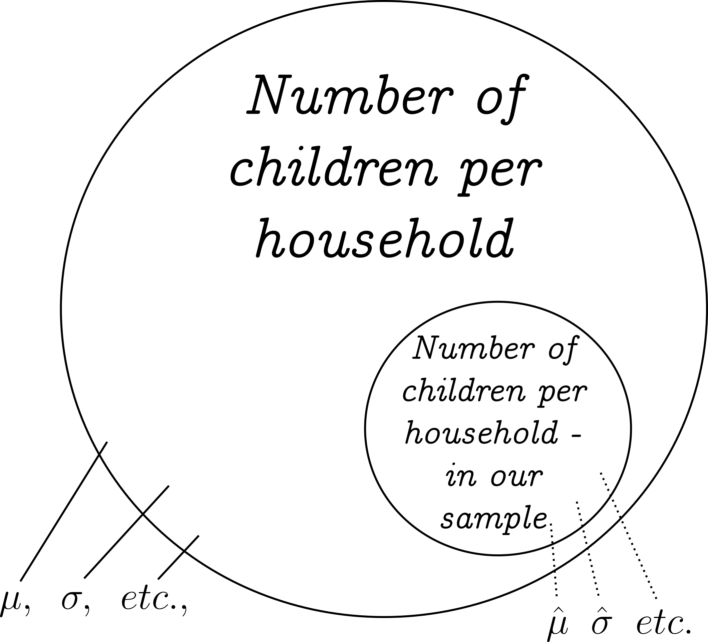
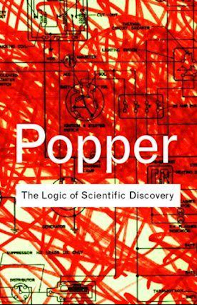
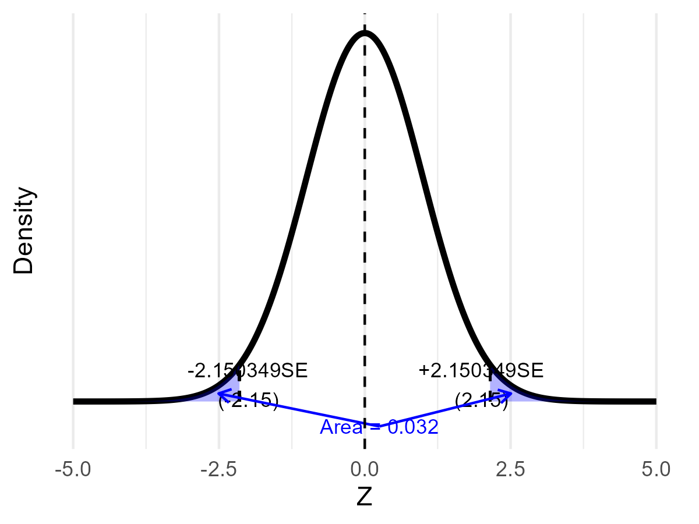

---
output:
  xaringan::moon_reader:
    seal: false
    includes:
      after_body: insert-logo.html
    self_contained: false
    lib_dir: libs
    nature:
      highlightStyle: github
      highlightLines: true
      countIncrementalSlides: false
      ratio: '16:9'
editor_options: 
  chunk_output_type: console
---
class: center, inverse, middle

```{r xaringan-panelset, echo=FALSE}
xaringanExtra::use_panelset()
```

```{r xaringan-tile-view, echo=FALSE}
xaringanExtra::use_tile_view()
```

```{r xaringanExtra, echo = FALSE}
xaringanExtra::use_progress_bar(color = "#808080", location = "top")
```

```{css echo=FALSE}
.pull-left {
  float: left;
  width: 44%;
}
.pull-right {
  float: right;
  width: 44%;
}
.pull-right ~ p {
  clear: both;
}


.pull-left-wide {
  float: left;
  width: 66%;
}
.pull-right-wide {
  float: right;
  width: 66%;
}
.pull-right-wide ~ p {
  clear: both;
}

.pull-left-narrow {
  float: left;
  width: 30%;
}
.pull-right-narrow {
  float: right;
  width: 30%;
}

.pull-right-extra-narrow {
  float: right;
  width: 20%;
}

.tiny123 {
  font-size: 0.40em;
}

.small123 {
  font-size: 0.80em;
}

.large123 {
  font-size: 2em;
}

.red {
  color: red
}

.orange {
  color: orange
}

.green {
  color: green
}
```


# Statistics
## Lecture 7: Hypothesis Testing

### Christian Vedel,<br>Department of Economics

### Email: [christian-vs@sam.sdu.dk](christian-vs@sam.sdu.dk)

### Updated `r Sys.Date()`


.footnote[
.small123[
*Please beware. I work on these slides until the last minute before the lecture and push most changes along the way. Until the actual lecture, this is just a draft*  
]
]

---
class: middle
# Today's lecture
.pull-left-wide[

### Last time:
- Sampling and point estimates
- Z-based confidence intervals

### This time: Hypothesis testing
- How do we know anything?
  + **Answer**: We calculate the probability of it being false

#### Content:
- Some basic motivating philosophy of science
- Setting up null and alternative hypothesis
- Hypothesis testing with z- and t-distributions
]

---
# Note on notation:
.pull-left-wide[
- $\overline{X}$ or $\hat{mu}$ is the sample version of $\mu$
- $S^2$ or $\hat{\sigma^2}$ is the sample version of $\sigma^2$
- $S$ or $\hat{\sigma}$ is the sample version of $\sigma$


- The notation in statistics is a bit confusing since there are multiple conventions for how to distingish between sample and population statistics.
- General rule: $\hat{z}$ is the sample version of $z$, where $z$ is some statistic
  + And the definitions above also applies.
]


---
# Sampling and point estimates

.pull-left-wide[
#### Recap from last time
- In statistics, we are interested in *statistics* for the **population**
- Recall the definition:
> A *statistic* is a number which sumarises some data

- Example: How many children are born on average in a household?

#### The big questions (last time):
- Do we know that a **statistic** for our sample **approximate** the *statistic* of the *population*?
  + $\mu \approx \hat{\mu}$?
- How **certain** are we, that this is the case?
  + E.g. we are 95 pct sure that  $\mu$ is in in an interval $[1.6; 2.1]$
]

.pull-right-narrow[

]

---
class: middle
# The big question this time

.pull-left-wide[
> Can we, from a sample only, know whether the *true* value of some parameter, e.g. the mean, is some specific value?

### Example:
*If we toss a coin 10000 times (our sample), and it comes up heads at a rate 0.50017 (in the sample), can we then conclude that it is a fair coin? (True rate = 0.5 in the population?)*
]

.pull-right-narrow[

*We can also extend this idea to more abstract concepts. E.g. the population mean number of children per household*
]

---
# Philosophy of Science: An Overview

.pull-left-wide[
- **Purpose of Science:** To build reliable knowledge about the world.
- **Central Idea:** We can never *prove* a theory absolutely; we only gather evidence that supports or contradicts it.
- **Core Principle:** All scientific knowledge is provisional and subject to revision.
]

.pull-right-narrow[

*(AI-generated): Enlightenment in the 21st century*
]

---
# Falsifiability: The Cornerstone of Science

.pull-left-wide[
- **Key Concept (Popper):** A theory is scientific if it is falsifiable — if it can be proven false by evidence.
- **Implication:** Rather than seeking proof, scientists look for evidence that can refute a hypothesis.
- **In Practice:** Hypothesis testing is a statistical tool to assess whether data contradicts our assumptions.
]

.pull-right-extra-narrow[

*Front page of Popper's famous book*
]

---
# From Philosophy to Hypothesis Testing

.pull-left[
- **Connecting the Dots:**  
  + Our philosophical stance is that we cannot *prove* theories — only challenge them.
  + Hypothesis testing formalizes this idea by setting up a **null hypothesis** (status quo) to be rigorously tested.
- **Key Question:**  
  > What is the probability, that we measure, what we measured in our sample, if our hypothesis is right?
]

.pull-right[
```{r eval=FALSE, include=FALSE}
source("R-code/01_Normal_with_observation.R")
p1 = plot_distribution_with_obs(2.150349, 0, 1) + labs(x = "Z")

ggsave("Figures/Hypothesis_test_example.png", width = 4, height = 3, plot = p1)
```



*From theory to actual testing.*
]


---
# Steps (conceptually - example follows)

.pull-left[
### Setup:
**Step 1. Assume (with reason) the something you measure comes from a distribution.**  
E.g. you measure the average in a sample. You know it follows a normal distribution if the sample size is large enough. 

**Step 2. Formulate your null hypothesis and significance level**  
E.g. $H_0$: the average income for SDU graduates is 35.000 kr. a month and I will tolerate a false rejection rate (sign. level) of $\alpha = 0.05$

**Step 3. Go out and measure this in your sample**  
E.g. collect data and calculate the mean of graduates incomes

]

.pull-right[
### Running the test
**Step 4: Calculate the how likely the measured statistic is given** $\mathbf{H_0}$  
E.g. how likely is a value of 37145 kr. a month on average, given our null-hypothesis?

**Step 5: Interpret and conclude**
E.g. *"since the observed value for the statistic (or something more extreme) only has a 0.023 chance of occuring under our null-hypothesis, and since our chosen threshold is 0.05 (the significance level) we reject the null-hypothesis."*
]

---
class: middle
# Rejecting/accepting the null-hypothesis?

.pull-left-wide[
Easy exam points (not to mess up):

- We can never confirm the null-hypothesis.
- We can only reject it.

#### Implication:
- If we cannot reject the null-hypothesis, you **never** say, that you "accept the null-hypothesis".
- You say "we do not have sufficient evidence to reject the null-hypothesis" or something similar.

]

.pull-right-narrow[
.small123[
#### Note:
- This seems like academic nonsense.
- But it is important because it has real consequences for our ability to even use these tools to discover new things about the world. 
- I can recommend (to the bold among you) to read Popper
]


]

---
class: middle
# Example with coins

.pull-left-wide[
- We want to know whether a coin is fair
  + i.e. does it have a 50% chance of 'heads'
  
- With a large enough sample we know, that the mean is normally distributed (in this case the mean rate of 'heads') 
- We flip a coin 1000 times to run the test:
  $H_0: \mu = 0.5$ 
  
- Data from this experiment can be found [on this link](https://github.com/christianvedels/Introductory_statistics/raw/refs/heads/main/Lecture%208%20-%20Hypothesis%20testing/Examples/Coin_flips.xlsx)


]

.pull-right-narrow[

]

---
class: middle
# The t-distribution

.pull-left-wide[
- **Purpose:**  
  + Until know we have assumed that we know $\sigma$
  + What about cases where we don't?
  + Estimating $\sigma$ introduces uncertainty
  
  
- **Modificaiton to Z-distribution**
  + Add 'fatter' tails based on number of observations 
  + t-distribution gets closer to normal with many observations
]


---
# The t-Distribution's Origin: The Guinness Story

.pull-left-wide[
- **Historical Note:**  
  + Developed by William Sealy Gosset under the pseudonym **"Student"**.
  + He did not want other's to know the companies industrial secret
- **Why Guinness?**  
  + Gosset worked for the Guinness Brewery and needed a method to reliably estimate quality (e.g., consistency in beer production) from small samples.
- **Impact:**  
  + His work led to the formulation of the t-distribution, which remains a cornerstone in statistical inference.
]

.pull-right-narrow[

*Guiness (wikimedia)*
]

---
# Technical note:

.pull-left[
### Z-distribution

The average, $\overline{X}$, in a sample follows

$Z = \frac{\overline{X} - \mu}{\sigma / \sqrt{(n)}}$

where

$Z \sim \mathscr{N}\left(\mu, \frac{\sigma^2}{n}\right)$

(This this is what we used to construct the hypothesis test).

- We need to know $\sigma$
- And then we can test different values of $\mu$

]

.pull-right[
### t-distribution

The average, $\overline{X}$, in a sample, if we also have to estimate the standard deviation, $S$, follows

$t = \frac{\overline{X} - \mu}{S / \sqrt{(n)}}$

where

$t \sim \mathscr{T}\left(\mu, \frac{S^2}{n-1}, n-1\right)$

Where we also specify the degrees of freedom ($n-1$)

From this we can derive a (more accurate) test in cases with few observations. 

]

---
class: middle
# t-test

.pull-left-wide[
- Used when the variance is unknown
- The test adjusts the normal distribution to account for the fact, that we have to estimate the variance in the same sample 
- We will try it with the coin sample

### What we will show:
  + It does not really matter for larger samples
  + It matters for small samples
]


