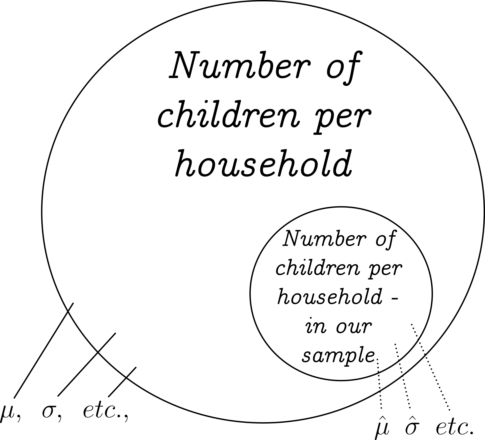

---
output:
  xaringan::moon_reader:
    seal: false
    includes:
      after_body: insert-logo.html
    self_contained: false
    lib_dir: libs
    nature:
      highlightStyle: github
      highlightLines: true
      countIncrementalSlides: false
      ratio: '16:9'
editor_options: 
  chunk_output_type: console
---
class: center, inverse, middle

```{r xaringan-panelset, echo=FALSE}
xaringanExtra::use_panelset()
```

```{r xaringan-tile-view, echo=FALSE}
xaringanExtra::use_tile_view()
```

```{r xaringanExtra, echo = FALSE}
xaringanExtra::use_progress_bar(color = "#808080", location = "top")
```

```{css echo=FALSE}
.pull-left {
  float: left;
  width: 44%;
}
.pull-right {
  float: right;
  width: 44%;
}
.pull-right ~ p {
  clear: both;
}


.pull-left-wide {
  float: left;
  width: 66%;
}
.pull-right-wide {
  float: right;
  width: 66%;
}
.pull-right-wide ~ p {
  clear: both;
}

.pull-left-narrow {
  float: left;
  width: 30%;
}
.pull-right-narrow {
  float: right;
  width: 30%;
}

.pull-right-extra-narrow {
  float: right;
  width: 20%;
}

.tiny123 {
  font-size: 0.40em;
}

.small123 {
  font-size: 0.80em;
}

.large123 {
  font-size: 2em;
}

.red {
  color: red
}

.orange {
  color: orange
}

.green {
  color: green
}
```


# Statistics
## Lecture 9: Hypothesis Testing in Practice

### Christian Vedel,<br>Department of Economics

### Email: [christian-vs@sam.sdu.dk](christian-vs@sam.sdu.dk)

### Updated `r Sys.Date()`


.footnote[
.small123[
*Please beware. I work on these slides until the last minute before the lecture and push most changes along the way. Until the actual lecture, this is just a draft*  
]
]

---
class: middle

# Today's lecture
.pull-left-wide[
### From last time:
- Introduction to hypothesis testing
- Null vs. alternative hypotheses

### This time: Hypothesis testing in practice
- Two-sample hypothesis tests
- Testing equal means (t-test)
- Confidence intervals for variance (chi-distribution)
- Testing equal variance (F-test)
- Testing equal proportion (z-test)
]

---
class: middle

# Two-Sample Hypothesis Tests: The Big Picture

.pull-left-wide[
- **Why Two-Sample Tests?**  
  + Often we compare two groups (e.g., treatment vs. control)  
  + We want to see if they differ in mean, variance, or proportion

- **General Idea:**  
  + Formulate null-hypothesis: *no difference* between the groups  
  + Compute a test statistic (t, F, or z)  
  + Decide if the difference is statistically significant
  
- **General advice:**
  + There is a Forrest of tests. Make good notes for when to use which. 
  + Still an active field of research.
]

.pull-right-narrow[

]

---
class: middle

# Two-Sample Hypothesis Tests: The Big Picture

.pull-left-wide[
### What are we trying to achieve?

> Given two different samples, we want to know if they are from the same population

$$H_0: \; \textit{Sample}_1, \textit{Sample}_2 \subset \textit{Population}$$
$$H_1: \; \textit{Sample}_1, \textit{Sample}_2 \not\subset \textit{Population}$$

### Today
- We will test a difference of two main properties of distributions:
  + Mean: $H_0:\; \mu_1=\mu_2$
  + Variance: $H_0:\; \sigma_1^2=\sigma_2^2$
]

.pull-right-narrow[

]

---
class: middle

# Philosophical Recap

.pull-left-wide[
- **Core Philosophy of Science:**  
  + Science progresses by challenging and testing hypotheses rather than proving them absolutely.
- **Reminder:**  
  + Rejecting $H_0$ is a statement about evidence, not proof.
- **Reflection:**  
  + The statistical tests are tools to continuously refine our understanding of the world.
]


---
class: middle

.pull-left-wide[
### Testing Equal Means (Z-test) – Theory
- **Hypotheses Options:**  
  + Option I:  
    $$H_0: \mu_1 = \mu_2 \quad \text{vs.} \quad H_1: \mu_1 \neq \mu_2$$  
  + Option II (using a hypothesized difference $D_0$):  
    $$H_0: \mu_1 - \mu_2 = D_0 \quad \text{vs.} \quad H_1: \mu_1 - \mu_2 \neq D_0$$  
    (Normally, $D_0=0$, but alternative values can be used when a non-zero difference is expected.)
- **Assumption:** Observations are independent.
- **Test Statistic:**  
  $$ Z = \frac{(\overline{X}_1 - \overline{X}_2) - D_0}{\sqrt{\frac{\sigma_1^2}{n_1}+\frac{\sigma_2^2}{n_2}}} $$
]
.pull-right-narrow[
]

---
class: middle

.pull-left-wide[
### Testing Equal Means (Z-test) – Numerical Example

**Example Setup:**  
- **Sample 1:**  
  $n_1 = 40$, $\overline{X}_1 = 75$, known $\sigma_1 = 8$  
- **Sample 2:**  
  $n_2 = 50$, $\overline{X}_2 = 70$, known $\sigma_2 = 10$  
- **Hypothesized Difference:**  
  $D_0 = 0$ (testing for no difference)

**Calculation:**  
1. **Standard Error:**  
   $$ SE = \sqrt{\frac{8^2}{40}+\frac{10^2}{50}} = \sqrt{\frac{64}{40}+\frac{100}{50}} = \sqrt{1.6+2} = \sqrt{3.6} \approx 1.90 $$

2. **Z-Statistic:**  
   $$ Z = \frac{75 - 70 - 0}{1.90} \approx \frac{5}{1.90} \approx 2.63 $$

]
.pull-right-narrow[
**Interpretation:**  
- A $|Z|$ value of 2.63 is compared to critical values from the standard normal distribution to decide whether to reject $H_0$.
- We can also convert it to a p-value: $0.008538487 \rightarrow$ *Reject at 1% level*
]


---
class: middle

.pull-left-wide[
### Testing Equal Means (t-test) – Theory
- **Hypotheses Options:**  
  + **Option I:**  
    $$H_0: \mu_1 = \mu_2 \quad \text{vs.} \quad H_1: \mu_1 \neq \mu_2$$  
  + **Option II (using a hypothesized difference $D_0$):**  
    $$H_0: \mu_1 - \mu_2 = D_0 \quad \text{vs.} \quad H_1: \mu_1 - \mu_2 \neq D_0$$  
    (Normally, $D_0=0$, but alternative values can be used when a non-zero difference is expected.)
- **Assumption:**  
  Observations are independent; the population variances are unknown but assumed equal.
- **Test Statistic:**  
  $$ t = \frac{(\overline{X}_1 - \overline{X}_2) - D_0}{\sqrt{s_p^2\left(\frac{1}{n_1}+\frac{1}{n_2}\right)}} $$
]
.pull-right-narrow[
$s_p^2$ is the pooled sample variance. Explained in the example on the next slide.

*Or if it is reasonable: Assume it to be the same across both samples - which we can also test*

]


---
class: middle

.pull-left-wide[
### Testing Equal Means (t-test) – Numerical Example

**Example Setup:**  
- **Sample 1:** $n_1 = 25$, $\overline{X}_1 = 100$, sample std. dev. $s_1 = 10$  
- **Sample 2:** $n_2 = 25$, $\overline{X}_2 = 108$, sample std. dev. $s_2 = 12$  
- **Hypothesized Difference:**  
  $H_0: \;D_0 = 0$ (testing for no difference)

**Calculation:**  
1. **Pooled Variance:**  
   $$ s_p^2 = \frac{(n_1-1)s_1^2 + (n_2-1)s_2^2}{n_1+n_2-2} 
   = \frac{24\cdot100 + 24\cdot144}{48} 
   = \frac{2400 + 3456}{48} 
   = 122 $$
   
   $$ s_p = \sqrt{122} \approx 11.05 $$

2. **Standard Error:**  
   $$ SE = \sqrt{s_p^2\left(\frac{1}{n_1}+\frac{1}{n_2}\right)}
   = \sqrt{122\left(\frac{1}{25}+\frac{1}{25}\right)}
   = \sqrt{122\cdot0.08}
   = \sqrt{9.76} \approx 3.12 $$

]
.pull-right-narrow[

3. **t-Statistic:**  
   $$ t = \frac{100 - 108}{3.12} \approx -2.56 $$

**Interpretation:**  
- A $|t|$ value of approximately 2.56 is compared to the critical t-value (with 48 degrees of freedom) to decide whether to reject $H_0$.  
- We can also convert it to a p-value: $0.02790758 \rightarrow$ *Reject at 5% level*
]

---
class: middle

.pull-left-wide[
###  Variance of the Binomial Distribution (quick recap)
- If we repeat a process $n$ times and the success rate is described by $p$, then we get an the probality of $k$ succeses from a *Binomial* distribution $P(k) = {n\choose k} p^k(1-p)^{n-k}$)
- Then the variance is **known**:
  $$\sigma^2 = np(1-p)$$
- By extension, if we are interested in population proportions (dividing through by $n$) we can derive that:
  $$\sigma^2 = p(1-p)$$
  
- As such the standard error for a proportion is
  $$\textit{Std. error} =  \sqrt\frac{p(1-p)}{n}$$
  
- And $p$ can be replaced by estimates. E.g. proportion in sample

]

---
class: middle

.pull-left-wide[
### Comparing Two Population Proportions – Theory & Test Statistic
- **Hypotheses:**  
    $$H_0: p_1 = p_2 \quad \text{vs.} \quad H_1: p_1 \neq p_2$$ 
- **Data Structure:**  
  Two samples with successes $x_1$, $x_2$ and sizes $n_1$, $n_2$.
- **Pooled Proportion:**  
  $$ \hat{p} = \frac{x_1+x_2}{n_1+n_2} $$
- **Standard Error (using binomial variance):**  
  $$ SE = \sqrt{\hat{p}(1-\hat{p})\left(\frac{1}{n_1}+\frac{1}{n_2}\right)} $$
]

.pull-right-narrow[
- **Test Statistic:**  
  $$ Z = \frac{(\hat{p}_1 - \hat{p}_2) - D_0}{SE} $$
]

---
class: middle

.pull-left-wide[
### Comparing Two Proportions – Numerical Example

**Example Setup:**  
- **Sample 1:**  
  $n_1 = 150$, successes $x_1 = 90$, so $\hat{p}_1 = \frac{90}{150} = 0.60$  
- **Sample 2:**  
  $n_2 = 200$, successes $x_2 = 100$, so $\hat{p}_2 = \frac{100}{200} = 0.50$  
- **Hypothesized Difference:**  
  $H_0: \; D_0 = 0$ (testing for no difference)

**Calculation:**  
1. **Pooled Proportion:**  
   $$ \hat{p} = \frac{x_1+x_2}{n_1+n_2} = \frac{90+100}{150+200} = \frac{190}{350} \approx 0.543 $$

2. **Standard Error:**  
   $$ SE = \sqrt{\hat{p}(1-\hat{p})\left(\frac{1}{n_1}+\frac{1}{n_2}\right)}
   = \sqrt{0.543 \times 0.457 \times \left(\frac{1}{150}+\frac{1}{200}\right)}  \approx 0.0537 $$
]
.pull-right-narrow[
3. **Z-Statistic:**  
   $$ Z = \frac{(\hat{p}_1 - \hat{p}_2) - D_0}{SE} $$
   $$ Z = \frac{0.60 - 0.50}{0.0537} \approx 1.86 $$

**Interpretation:**  
- A $|Z|$ value of approximately 1.86 is compared to the standard normal critical values.  
- For a two-tailed test at the 5% level (critical value ≈ 1.96), we do not reject $H_0$, indicating no significant difference.
]

---
class: middle

.pull-left-wide[
### Chi-Squared Confidence Interval for the Variance – Theory
- **Observation:**  
  The variance is a squared quantity, so we need a squared distribution to build its confidence interval.
- **Chi-Squared Distribution:**  
  - Mean: equal to the degrees of freedom, df  
  - Variance: equal to 2·df  
- **Confidence Interval for the Variance:**  
  $$\left[\frac{(n-1)s^2}{\chi^2_{1-\alpha/2,\,n-1}},\;\frac{(n-1)s^2}{\chi^2_{\alpha/2,\,n-1}}\right]$$  
- **Note:** To obtain a CI for the standard deviation, take the square root of the interval endpoints.
]

---
class: middle

.pull-left-wide[
### Chi-Squared Confidence Interval for the Variance – Numerical Example

**Example Setup:**  
- **Context:** Estimating the variability in gasoline prices.  
- **Sample:** $n = 25$, sample standard deviation $s = 0.30$  
- **Degrees of Freedom:** $df = 25 - 1 = 24$

**Using Critical Values (from tables or excel):**  
- Lower: $\chi^2_{0.975,24} \approx 39.3641$  
- Upper: $\chi^2_{0.025,24} \approx 12.4012$

**Confidence Interval for Variance:**  
$$\text{CI}_\sigma^2 = \left[\frac{24 \times 0.30^2}{39.3641}, \frac{24 \times 0.30^2}{12.4012}\right]
= \left[\frac{2.16}{39.3641}, \frac{2.16}{12.4012}\right]
\approx [0.0549,\; 0.1744]$$

**Confidence Interval for Standard Deviation:**  
$$\text{CI}_\sigma = \left[\sqrt{0.0549},\;\sqrt{0.1744}\right] \approx [0.234,\, 0.417]$$
]


---
class: middle

.pull-left-wide[
### The F Distribution – Overview
- **Definition:**  
  The F distribution is the ratio of two independent chi-squared variates (each divided by its degrees of freedom).
- **Characteristics:**  
  - Non-negative and typically right-skewed  
  - Defined by two degrees of freedom: $df_1$ (numerator) and $df_2$ (denominator)  
  - As df increases, the F distribution becomes more symmetric and approaches the normal shape.
- **Usage:**  
  It is used for testing the equality of two variances.
  $$H_0: \;\; \sigma^2_A =\sigma^2_B$$
]


---
class: middle

.pull-left-wide[
### Comparing Two Population Variances (F-test) – Numerical Example

**Example Setup:**  
- **Sample 1:** $n_1 = 11$, sample variance $s_1^2 = 3.1$  
- **Sample 2:** $n_2 = 16$, sample variance $s_2^2 = 1.7$  
- **Hypothesis:**  
  $$H_0: \sigma_1^2 = \sigma_2^2$$

**Calculation:**  
Step 1. **Arrange the Ratio:**  
   Place the larger variance in the numerator:  
   $$ F = \frac{s_1^2}{s_2^2} = \frac{3.1}{1.7} \approx 1.82 $$
Step 2. **Degrees of Freedom:**  
   $$ df_1 = n_1 - 1 = 10, \quad df_2 = n_2 - 1 = 15 $$
]
.pull-right-narrow[
Step 3. **Interpretation:**  
   We can use critical values or calculate p-values. For $F=1.82$ translates to a p-value of 0.857 for 10 and 15 degrees of freedom. I.e. we do not reject equal variance. 
]

---
# Cheese from USA or Europe?

.pull-left-wide[
### Comparing Cheese Quality Ratings: Italy vs. Wisconsin
- **Context:**  
  Evaluate quality ratings for Parmigiano from Italy against Parmesan produced in Wisconsin.
- **Objective:**  
  Determine whether the cheeses are the same quality (from the same population).
- **Data Overview:**  
  Each observation represents a cheese batch with a continuous quality rating (on a 0–100 scale).
  
> **We will do a full statistical analysis with the tools we have so far**

]
.pull-right-narrow[

.small123[
Parmigiano Reggiano, Wikimedia.
By <a href="//commons.wikimedia.org/wiki/User:Naturpuur" title="User:Naturpuur">Naturpuur</a> - <span class="int-own-work" lang="en">Own work</span>, <a href="https://creativecommons.org/licenses/by-sa/4.0" title="Creative Commons Attribution-Share Alike 4.0">CC BY-SA 4.0</a>, <a href="https://commons.wikimedia.org/w/index.php?curid=141616028">Link</a>
]
]


```{r eval=FALSE, include=FALSE}
library(tidyverse)
library(foreach)
set.seed(20)

clip_it = function(x, xmax=100, xmin=0){
  x = ifelse(x>xmax, xmax, x)
  x = ifelse(x<xmin, xmin, x)
}

df0 = foreach(y = 2003:2024, .combine = "bind_rows") %do% {
  data.frame(
    Year = y,
    Cheesemaker = c(
      "Caseificio Del Sole",
      "Latteria di Toscana",
      "Caseificio Reggiano",
      "La Vecchia Formaggeria",
      "Casa del Parmigiano",
      "Caseificio Aurora",
      "Formaggi di Italia",
      "Caseificio Margherita",
      "Latteria Bella Vita",
      "Caseificio San Marco",
      "Wisconsin Cheese Co.",
      "Great Lakes Dairy",
      "Midwest Creamery",
      "American Artisan Cheese",
      "Prairie Gold Dairy",
      "Liberty Cheese Works",
      "Heartland Creamery"
    ),
    Country = c(rep("Italy", 10), rep("USA", 7)),
    Quality_rating = exp(c(rnorm(10, 4.3, 0.25), rnorm(7, 4, 0.15))) %>% clip_it()
    
  )
}

df0 %>%
  ggplot(aes(x = Quality_rating)) + geom_density(aes(fill = Country), alpha = 0.5) + 
  theme_minimal()

# t-test for mean
test_stats = df0 %>%
  group_by(Country) %>%
  summarise(
    mean = mean(Quality_rating),
    var = var(Quality_rating),
    sd = sd(Quality_rating),
    n = n()
  ) %>%
  mutate(
    std_error = sd/sqrt(n)
  )

pooled_var = ((test_stats$n[1]-1)*test_stats$var[1] + (test_stats$n[1]-2)*test_stats$var[2])/(test_stats$n[1] + test_stats$n[2] - 2)
se = sqrt(pooled_var * (1/test_stats$n[1] + 1/test_stats$n[2])) 
tstat = (test_stats$mean[1] - test_stats$mean[2])/se

1 - pt(tstat, df = NROW(df0) - 2)

# With library
italy = df0 %>% filter(Country=="Italy") %>% pull(Quality_rating)
usa = df0 %>% filter(Country=="USA") %>% pull(Quality_rating)
res = t.test(italy, usa)

# Variance
var.test(italy, usa)

# Write example to csv
df0 %>%
  arrange(Country) %>%
  write_csv2("Examples/Solved/Cheesemaking.csv")
```


---
# Next time
.pull-left[
- Analysis of variance
]


.pull-right[

]


